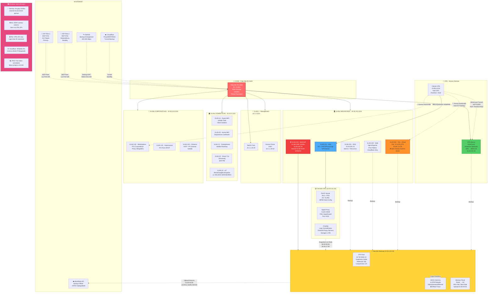
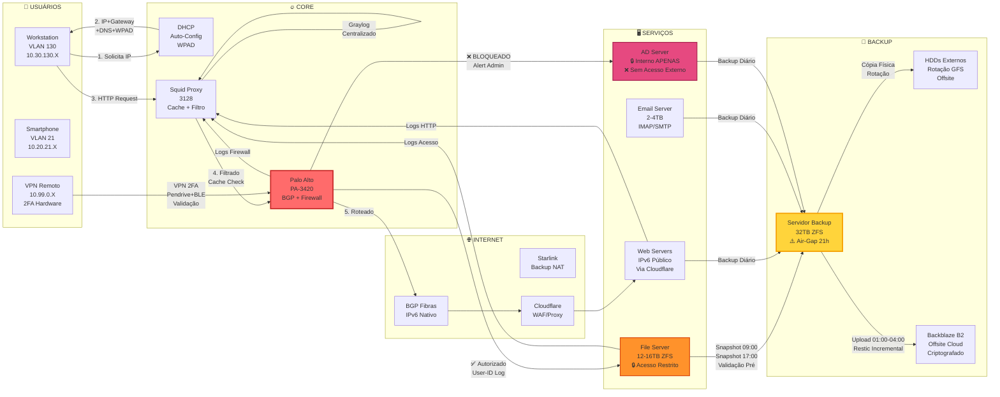
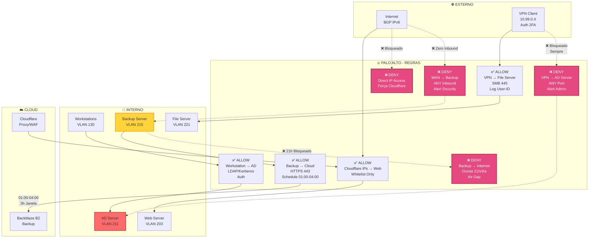
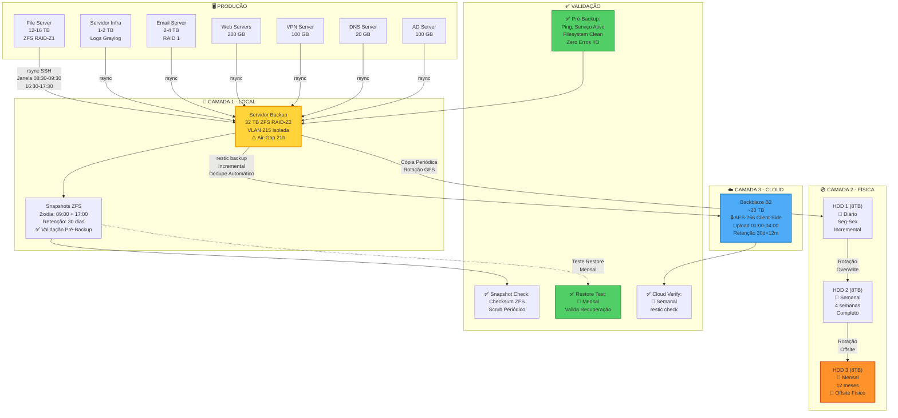
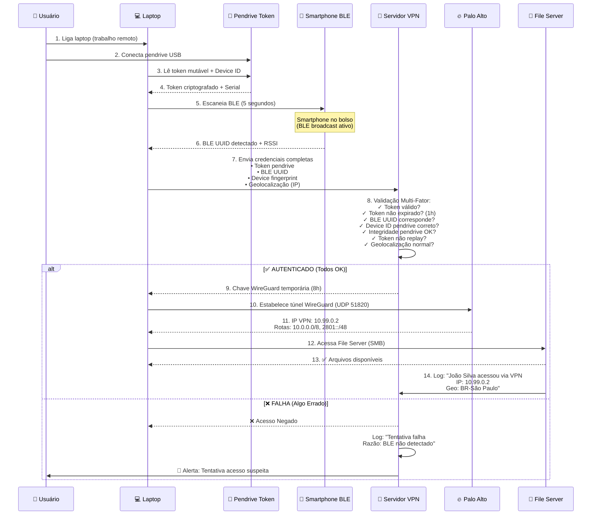

# 📊 Documentação de Infraestrutura de Rede e Servidores

**Versão:** 1.0  
**Data:** 2026-01-03  
**Responsável:** Equipe de TI  
**Status:** Arquitetura Aprovada para Implementação

---

## 📑 Índice

1. [Visão Geral](#visão-geral)
2. [Conectividade e BGP](#conectividade-e-bgp)
3. [Firewall e Roteamento](#firewall-e-roteamento)
4. [Endereçamento IP](#endereçamento-ip)
5. [VLANs e Segmentação](#vlans-e-segmentação)
6. [Servidores](#servidores)
7. [Backup e Disaster Recovery](#backup-e-disaster-recovery)
8. [VPN e Acesso Remoto](#vpn-e-acesso-remoto)
9. [Segurança](#segurança)
10. [Diagramas Topológicos](#diagramas-topológicos)
11. [Custos Estimados](#custos-estimados)
12. [Procedimentos Operacionais](#procedimentos-operacionais)

---

## 🌐 Visão Geral

### Objetivos da Infraestrutura

- **Alta Disponibilidade:** Redundância de links (BGP multihoming 2 ISPs + Starlink backup)
- **Segurança em Camadas:** Isolamento VLANs, firewall granular, autenticação 2FA hardware
- **Escalabilidade Futura:** IPv6 nativo, ASN próprio, bloco /48 LACNIC, hardware modular
- **Resiliência Total:** Backup 3-2-1 (local + físico + cloud), failover automático BGP
- **Rastreabilidade Completa:** Logs centralizados Graylog, auditoria User-ID, compliance

### Princípios de Design

1. **Separação por Função:** Serviços críticos em hardware dedicado (VPN, Backup, File Server)
2. **Zero Trust Architecture:** Nenhum acesso implícito, validação obrigatória em cada camada
3. **Defense in Depth:** Múltiplas camadas de segurança sobrepostas
4. **IPv6 First:** Todos servidores públicos com IPv6 fixo do bloco próprio
5. **Automação Máxima:** Processos automatizados (backup, failover, monitoramento, alertas)
6. **Hardware Isolado por Criticidade:** Backup, VPN e File Server em hardware próprio

### Filosofia de Segurança

**Air-Gap Lógico:**
- Servidor Backup isolado 21 horas/dia (apenas 3h janela upload cloud)
- Firewall Schedule-based controla acesso temporal
- Zero acesso inbound ao servidor backup (exceto admin único)

**Isolamento por Criticidade:**
- AD Server:  ZERO acesso externo (nem via VPN autenticada)
- File Server: Acesso apenas VPN 2FA + workstations internas
- Servidor Backup:  Pull model (servidores conectam nele, não o contrário)

**Rastreabilidade:**
- Logs User-ID identificam QUEM acessou (nome + IP + dispositivo)
- Graylog centraliza todos logs (firewall, proxy, servidores, DHCP)
- Auditoria completa para compliance

---

## 🔌 Conectividade e BGP

### Links de Internet

| Link         | Tipo     | Velocidade   | Latência Típica | Função              | IPv6       | Status Padrão |
| ------------ | -------- | ------------ | --------------- | ------------------- | ---------- | ------------- |
| **Fibra 1**  | Dedicado | 1 Gbps       | 15-30 ms        | Primário            | BGP Nativo | Ativo         |
| **Fibra 2**  | Dedicado | 1 Gbps       | 20-35 ms        | Secundário/Failover | BGP Nativo | Standby       |
| **Starlink** | Satélite | 100-200 Mbps | 40-80 ms        | Emergencial         | NAT        | Desconectado  |

### Sistema Autônomo BGP

**Informações Registro:**
- **ASN:** AS26XXXX (registrado LACNIC - Brasil)
- **Bloco IPv6:** 2801:1234:5678::/48 (público roteável global)
- **Organização:** Registrada como pessoa jurídica
- **Contatos:** NOC, Abuse, Technical (registrados LACNIC)

**Anúncio BGP:**
- **Prefixo Anunciado:** /48 (único bloco, não fragmentado)
- **Peers:** 2 ISPs diferentes (multihoming)
- **Política:** Anunciar apenas 2801:1234:5678::/48 (filtro proteção route leak)

**Peering:**

| Peer   | ISP     | ASN Upstream | IPv6 Peer Address      | Local Preference | Função       |
| ------ | ------- | ------------ | ---------------------- | ---------------- | ------------ |
| Peer 1 | Fibra 1 | AS12345      | 2804:ISP1: TRANSIT:: 1 | 200              | Preferencial |
| Peer 2 | Fibra 2 | AS67890      | 2801:ISP2:TRANSIT:: 1  | 100              | Backup       |

**Local Preference** determina preferência saída:
- 200 (Fibra 1): Tráfego outbound prefere Fibra 1
- 100 (Fibra 2): Usado apenas se Fibra 1 falhar

### Cenários de Failover

#### Modo Normal (Operação Padrão)
**Status:**
- ✅ Fibra 1: Ativa, BGP Established, 100% tráfego
- ✅ Fibra 2: Standby, BGP Established, sem tráfego
- ❌ Starlink: Desconectado

**Características:**
- Latência: 15-30 ms
- NAT:  Desabilitado (IPv6 público direto)
- Roteamento global: 2801:1234:5678::/48 via AS12345

#### Failover Fibra 1 → Fibra 2
**Detecção:**
- BGP Hold Timer expira (~90 segundos)
- Palo Alto detecta peer down
- Remove rotas via Fibra 1 da tabela

**Convergência:**
- Tempo: 30-90 segundos (convergência BGP)
- Ação: BGP converge para Fibra 2 automaticamente
- Upstream: ASN propagam mudança globalmente

**Impacto:**
- Downtime: ~60 segundos (brief interruption)
- Sessões TCP: Algumas podem cair (dependem timeout)
- Usuários:  Reconectam automaticamente

**Status Final:**
- ❌ Fibra 1: Down, BGP Idle
- ✅ Fibra 2: Ativa, 100% tráfego
- ❌ Starlink: Desconectado

#### Modo Desastre (Ambas Fibras Down)
**Detecção:**
- Ambos BGP peers down
- Rotas BGP removidas globalmente
- Palo Alto ativa rota estática backup (Starlink)

**Ações Automáticas:**
1. Palo Alto habilita Source NAT para Starlink
2. Tráfego outbound NATado para IP Starlink
3. IPv6 público inacessível globalmente (BGP apagado)
4. Cloudflare Tunnel assume (já ativo em standby)

**Serviços Afetados:**
- ❌ IPv6 Direto:  Inacessível (BGP removido global)
- ✅ Sites HTTP/HTTPS: Funcionam via Cloudflare Tunnel
- ❌ Email Inbound: Temporariamente indisponível (MX inacessível)
- ✅ VPN: Funciona via Starlink (WireGuard sobre NAT)
- ✅ File Server: Acessível via VPN

**Tempo Recuperação:**
- Sites públicos: ~5 minutos (Cloudflare detecta e assume)
- Email inbound: Depende fibras voltarem (fila ISP sender)
- Acesso VPN:  Imediato (Starlink ativo)

### Cloudflare Integration

**Funções:**
- **Proxy Reverso:** HTTP/HTTPS com DDoS protection e WAF
- **Tunnel Permanente:** Sempre ativo em standby, assume em desastre
- **DNS Autoritativo:** Gerencia zona pública empresa. com. br

**Configuração DNS Cloudflare:**
- Registros A/AAAA: **Proxied** (ícone laranja)
- IPs retornados: IPs Cloudflare (não seu real)
- Tunnel: Conexão outbound servidor → Cloudflare (sempre ativa)
- Failover: Health check detecta IPv6 down, Tunnel assume

**Whitelist Firewall:**
- Apenas IPs Cloudflare acessam Web Servers
- Ranges IPv6 Cloudflare mantidos em address group
- Acesso direto por IP:  BLOQUEADO (força via Cloudflare)

**Vantagens:**
- IP real nunca exposto (não aparece em DNS público)
- DDoS absorvido por Cloudflare (não chega em você)
- WAF protege aplicações web
- Cache acelera loading
- Tunnel funciona sobre NAT (modo desastre Starlink)

---

## 🔥 Firewall e Roteamento

### Palo Alto PA-3420

**Especificações Técnicas:**
- **Throughput Firewall:** 3.8 Gbps
- **Throughput Threat Prevention:** 2.2 Gbps (IDS/IPS + Antivirus)
- **Conexões Simultâneas:** 500. 000
- **Novas Conexões/seg:** 80.000

**Interfaces Físicas:**
- **ethernet1/1:** WAN Fibra 1 (IPv6: 2801:1234:5678:0203:: 10/64)
- **ethernet1/2:** WAN Fibra 2 (IPv6 do ISP)
- **ethernet1/3:** WAN Starlink (backup emergencial)
- **ethernet1/4:** Trunk 802.1Q (25+ VLANs, todas sub-interfaces)

**Licenças Ativas:**
- ✅ Threat Prevention (IDS/IPS, antivirus, anti-spyware, vulnerability protection)
- ✅ URL Filtering (categorização e bloqueio sites)
- ✅ WildFire (sandboxing malware em cloud Palo Alto)
- ❌ GlobalProtect (não utilizado - VPN via WireGuard separado)

### Zonas de Segurança

| Zona           | VLANs Inclusas | Descrição                            | Nível Confiança |
| -------------- | -------------- | ------------------------------------ | --------------- |
| **WAN**        | -              | Internet (3 links)                   | Untrusted       |
| **MANAGEMENT** | 1              | Switches, APs, infra física          | High Trust      |
| **HOME**       | 10-29          | Dispositivos domésticos              | Medium Trust    |
| **CORP**       | 130-139        | Workstations, impressoras, câmeras   | High Trust      |
| **INFRA**      | 211            | AD, DHCP/Proxy/Logs, VPN             | Critical        |
| **SERVIDORES** | 201, 203       | DNS, Web Servers                     | Critical        |
| **BACKUP**     | 215            | Servidor backup (isolado air-gap)    | Critical        |
| **FILE-EMAIL** | 221            | File Server, Email Server            | Critical        |
| **VPN-USERS**  | -              | Clientes VPN remotos (10. 99.0.0/24) | Authenticated   |

### Políticas de Firewall Críticas

#### 1. VPN → File Server (Permitido com Rastreamento)
- **Source Zone:** VPN-USERS
- **Source:** 10.99.0.0/24 (todos usuários VPN)
- **Destination Zone:** FILE-EMAIL
- **Destination:** 10.30.221.10 (File Server)
- **Service:** SMB (TCP 445)
- **Application:** ms-ds-smb, ms-ds-smb2
- **Action:** ALLOW
- **Profiles:** Antivirus, Anti-Spyware (scan tráfego)
- **User-ID:** Enabled (registra NOME usuário, não só IP)
- **Log:** Sim (início e fim sessão)

**Resultado:** Logs identificam "João Silva acessou File Server via VPN às 14:23"

#### 2. VPN → AD Server (BLOQUEADO SEMPRE)
- **Source Zone:** VPN-USERS
- **Destination Zone:** INFRA
- **Destination:** 10.30.211.10 (AD Server)
- **Service:** ANY
- **Action:** DENY
- **Log:** Sim + Alert Administrator (email/SMS)

**Justificativa:** AD = "chave do reino".  Mesmo VPN autenticada 2FA não acessa.  Admin precisa estar fisicamente na rede interna.

#### 3. Servidor Backup → Cloud (Janela Temporal)
- **Source Zone:** BACKUP
- **Source:** 10.30.215.10
- **Destination Zone:** WAN
- **Service:** HTTPS (TCP 443)
- **Application:** web-browsing, ssl
- **Schedule:** BACKUP-CLOUD-WINDOW (01:00-04:00 diário) ⚠️
- **Action:** ALLOW
- **Log:** Sim

**Schedule Object:**
- **Nome:** BACKUP-CLOUD-WINDOW
- **Tipo:** Recurring Daily
- **Horário:** 01:00-04:00 (3 horas)

**Resultado:**
- 01:00-04:00: Internet habilitada (upload Backblaze B2)
- 04:00-01:00: Internet BLOQUEADA (air-gap 21 horas/dia = 87. 5% tempo)

**Proteção:**
- Ransomware não exfiltra dados (sem Internet 21h)
- Atacante não baixa ferramentas adicionais
- Servidor isolado máximo possível

#### 4. Internet → Servidor Backup (BLOQUEADO TOTAL)
- **Source Zone:** WAN
- **Destination Zone:** BACKUP
- **Destination:** 10.30.215.10
- **Service:** ANY
- **Action:** DENY
- **Log:** Sim + Alert Security (tentativa = suspeita)

**Exceção ÚNICA (Admin):**
- **Source:** 10.99.0.2/32 (IP VPN admin específico - apenas 1 pessoa)
- **Service:** SSH (TCP 22), HTTPS (TCP 443)
- **Action:** ALLOW
- **Log:** Sim (auditoria)

#### 5. Servidores Produção → Backup (Janela Backup)
- **Source Zone:** INFRA, SERVIDORES, FILE-EMAIL
- **Source:** 10.30.211.0/24, 10.30.201.0/24, 10.30.203.0/24, 10.30.221.0/24
- **Destination Zone:** BACKUP
- **Destination:** 10.30.215.10
- **Service:** SSH (TCP 22 - rsync over SSH)
- **Schedule:** BACKUP-WINDOWS (08:30-09:30, 16:30-17:30 diário)
- **Action:** ALLOW
- **Log:** Sim

**Modelo Pull:** Servidores conectam NO backup (não o contrário). Mais seguro.

#### 6. Backup → Servidores (BLOQUEADO - Anomalia)
- **Source Zone:** BACKUP
- **Destination Zone:** INFRA, SERVIDORES, FILE-EMAIL
- **Service:** ANY
- **Action:** DENY
- **Log:** Sim + Alert Critical (comportamento anômalo)

**Razão:** Servidor backup NÃO deve iniciar conexões.  Se tentar = possível comprometimento.

#### 7. Cloudflare → Web Servers (Whitelist)
- **Source Zone:** WAN
- **Source:** Cloudflare-IPv6-Ranges (address group atualizado)
- **Destination Zone:** SERVIDORES
- **Destination:** 2801:1234:5678:0203::/64
- **Service:** HTTPS (TCP 443)
- **Action:** ALLOW
- **Profiles:** Threat Prevention, URL Filtering
- **Log:** Sim

**Regra Complementar (Bloqueia Outros):**
- **Source:** ANY (exceto Cloudflare)
- **Destination:** 2801:1234:5678:0203::/64
- **Service:** HTTPS
- **Action:** DENY
- **Log:** Sim (detectar bypass attempts)

**Resultado:** TODO tráfego web forçado via Cloudflare.  Acesso direto IP = bloqueado.

#### 8. Internet → Servidores Críticos (BLOQUEADO)
- **Source Zone:** WAN
- **Destination Zone:** FILE-EMAIL, INFRA
- **Destination:** 10.30.221.10 (File), 10.30.221.20 (Email), 10.30.211.10 (AD)
- **Service:** ANY
- **Action:** DENY
- **Log:** Sim

**Justificativa:** File, Email, AD NUNCA expostos diretamente. Acesso via VPN ou rede interna apenas.

### NAT Policies

#### Modo Normal (BGP Ativo)
**Regra:** NO-NAT-IPV6
- **Aplicação:** Servidores com IPv6 público
- **Source:** 2801:1234:5678::/48
- **Translation:** NONE (usa endereço real)

**Justificativa:** IPv6 público não precisa NAT. Source address preservado end-to-end.

#### Modo Desastre (Starlink)
**Regra:** SNAT-STARLINK-EMERGENCY
- **Source:** 10.0.0.0/8, 2801:1234:5678::/48 (todas redes)
- **Egress Interface:** ethernet1/3 (Starlink)
- **Translation:** Dynamic IP (interface address)
- **Priority:** 3 (baixa - usado apenas se BGP routes ausentes)

**Funcionamento:** Source NATado para IP Starlink. IPv6 traduzido para IPv4/IPv6 Starlink (CGNAT).

### Roteamento

**Virtual Router:** default

**Rotas BGP (Aprendidas Dinamicamente):**

| Destino | Via                   | Protocol | Local Pref | Metric | Status            |
| ------- | --------------------- | -------- | ---------- | ------ | ----------------- |
| : :/0   | 2804:ISP1:TRANSIT:: 1 | BGP      | 200        | 100    | Ativa (Fibra 1)   |
| ::/0    | 2801:ISP2:TRANSIT:: 1 | BGP      | 100        | 100    | Standby (Fibra 2) |

**Rotas Estáticas (Backup):**

| Destino        | Via                    | Admin Distance | Metric | Status                |
| -------------- | ---------------------- | -------------- | ------ | --------------------- |
| : :/0          | ethernet1/3 (Starlink) | 250            | 250    | Inativa (BGP prefere) |
| 10.99.0.0/24   | 10.30.211.50 (VPN)     | 10             | 10     | Ativa                 |
| 10.30.215.0/24 | ethernet1/4. 215       | -              | -      | Connected             |

**Admin Distance 250:** Muito baixa prioridade. Rota Starlink só ativa se BGP routes sumirem.

---

## 🔢 Endereçamento IP

### Esquema IPv4 (RFC1918 - Privado)

**Formato Padronizado:**
```
10.PISO.VLAN.HOST

PISO = Andar físico (20 = piso 2, 30 = piso 3)
VLAN = ID da VLAN
HOST = Dispositivo (. 1 = gateway, .10-99 = fixos, .100+ = DHCP)
```

**Exemplos Práticos:**

| VLAN | Descrição             | Rede IPv4      | Gateway     | IPs Fixos       | Pool DHCP         |
| ---- | --------------------- | -------------- | ----------- | --------------- | ----------------- |
| 20   | Home-WiFi (Piso 2)    | 10.20.20.0/24  | 10.20.20.1  | 10.20.20.10-99  | 10.20.20.100-250  |
| 130  | Workstations (Piso 3) | 10.30.130.0/24 | 10.30.130.1 | 10.30.130.10-99 | 10.30.130.100-200 |
| 211  | Infra (Piso 3)        | 10.30.211.0/24 | 10.30.211.1 | 10.30.211.10-99 | -                 |
| 215  | Backup (Piso 3)       | 10.30.215.0/24 | 10.30.215.1 | 10.30.215.10    | -                 |
| 221  | File/Email (Piso 3)   | 10.30.221.0/24 | 10.30.221.1 | 10.30.221.10-99 | -                 |

### Esquema IPv6 (Bloco Público LACNIC)

**Formato Padronizado:**
```
2801:1234:5678:00VV::/64

2801:1234:5678 = Prefixo /48 (seu bloco LACNIC - fixo)
00VV = VLAN ID em hexadecimal
/64 = Subnet padrão IPv6
```

**Conversão VLAN → Hexadecimal:**

| VLAN Decimal | Hex  | Subnet IPv6               | Gateway |
| ------------ | ---- | ------------------------- | ------- |
| 10           | 0x0A | 2801:1234:5678:000A::/64 | ::1    |
| 20           | 0x14 | 2801:1234:5678:0014::/64  | ::1     |
| 130          | 0x82 | 2801:1234:5678:0082::/64  | ::1     |
| 201          | 0xC9 | 2801:1234:5678:00C9::/64  | ::1    |
| 203          | 0xCB | 2801:1234:5678:00CB::/64  | ::1     |
| 211          | 0xD3 | 2801:1234:5678:00D3::/64  | ::1     |
| 215          | 0xD7 | 2801:1234:5678:00D7::/64  | ::1    |
| 221          | 0xDD | 2801:1234:5678:00DD::/64  | ::1     |

**Exemplo Completo VLAN 203 (Web Servers):**
- Subnet: 2801:1234:5678:00CB::/64
- Gateway: 2801:1234:5678:00CB::1 (Palo Alto)
- Web1: 2801:1234:5678:00CB::10 (fixo manual)
- Web2: 2801:1234:5678:00CB::11 (fixo manual)
- Web3: 2801:1234:5678:00CB::12 (fixo manual)

### Alocação de IPs

**Convenção Geral:**
- **. 1** = Gateway (Palo Alto sempre)
- **.2-.9** = Reservado (expansão futura)
- **.10-.99** = IPs fixos manuais (servidores, dispositivos críticos)
- **.100-.250** = Pool DHCP (dispositivos dinâmicos)
- **.251-.254** = Reservado (broadcast, testes)

---

## 🏢 VLANs e Segmentação

### VLAN 1 - Management

**Identificação:**
- **VLAN ID:** 1
- **Nome:** Management
- **IPv4:** 10.1.1.0/24
- **IPv6:** 2801:1234:5678:0001::/64

**Dispositivos:**
- Switches Core:  10.1.1.10-20 (IPs fixos)
- Access Points UniFi: 10.1.1.30-60 (IPs fixos)
- Pool DHCP: 10.1.1.100-150 (dispositivos temporários)

**Controle de Acesso:**
- ✅ Admin via VPN (IP específico autorizado)
- ✅ Internet (apenas updates fabricantes)
- ❌ Outras VLANs (isolado por firewall)

**Segurança:**
- Acesso SSH apenas com chave pública (senha desabilitada)
- HTTPS para gestão web (certificado válido)
- SNMP v3 com autenticação (se utilizado)

---

### VLANs Domésticas (Piso 2 - 10.20.X.0/24)

#### VLAN 10 - Guest WiFi

**Identificação:**
- **VLAN ID:** 10
- **Nome:** Home-Guest-WiFi
- **IPv4:** 10.20.10.0/24
- **IPv6:** 2801:1234:5678:000A::/64

**Características:**
- **DHCP Pool:** 10.20.10.100-250 (150 IPs)
- **Lease Time:** 2 horas (rotatividade alta guests)
- **Client Isolation:** Enabled (guests não veem uns aos outros)
- **Captive Portal:** Opcional (termo de uso/aceite)
- **QoS:** Banda limitada 50% do total (prioridade baixa)

**Controle de Acesso:**
- ✅ Internet: HTTP, HTTPS, DNS, NTP apenas
- ❌ Rede interna: TODAS VLANs bloqueadas
- ❌ File Server: Bloqueado
- ❌ Impressoras: Bloqueado
- ❌ Guest → Guest: Bloqueado (client isolation)

**Uso Típico:** Visitantes, convidados, dispositivos não confiáveis

#### VLAN 20 - Home WiFi

**Identificação:**
- **VLAN ID:** 20
- **Nome:** Home-WiFi
- **IPv4:** 10.20.20.0/24
- **IPv6:** 2801:1234:5678:0014::/64

**Características:**
- **DHCP Pool:** 10.20.20.100-250
- **Lease Time:** 24 horas
- **IPv6:** SLAAC + DHCPv6 Stateless (DNS)

**Dispositivos Típicos:**
- Laptops familiares
- Tablets
- Dispositivos pessoais confiáveis

**Controle de Acesso:**
- ✅ Internet: Acesso completo
- ✅ File Server: Leitura apenas (compartilhamentos públicos)
- ✅ Impressoras (VLAN 131)
- ❌ Servidores críticos (AD, Backup)

#### VLAN 21 - Smartphones

**Identificação:**
- **VLAN ID:** 21
- **Nome:** Home-Smartphones
- **IPv4:** 10.20.21.0/24
- **IPv6:** 2801:1234:5678:0015::/64

**Características:**
- **DHCP Pool:** 10.20.21.100-250
- **Lease Time:** 12 horas (roaming-friendly)
- **IPv6:** SLAAC + Privacy Extensions (mobile-friendly)

**Uso:** Smartphones pessoais, tablets mobile

#### VLAN 22 - Smart TVs

**Identificação:**
- **VLAN ID:** 22
- **Nome:** Home-TVs
- **IPv4:** 10.20.22.0/24
- **IPv6:** 2801:1234:5678:0016::/64

**Características:**
- **DHCP Pool:** 10.20.22.100-200
- **Lease Time:** 7 dias (dispositivos estáveis)
- **DHCP Reservations:** Sim (IPs fixos via MAC address)

**Reservations Exemplo:**
- Samsung TV Sala:  MAC aa:bb:cc:dd:ee:01 → 10.20.22.10
- LG TV Quarto: MAC aa:bb:cc:dd:ee:02 → 10.20.22.11

**Controle de Acesso:**
- ✅ Internet: Streaming (Netflix, YouTube, Prime Video)
- ✅ File Server: Media sharing (se Plex/Jellyfin)
- ❌ Outras VLANs
- **QoS:** Alta prioridade (streaming sem buffering)

#### VLAN 23 - IoT (Alexa, Google Home, Lâmpadas)

**Identificação:**
- **VLAN ID:** 23
- **Nome:** Home-IoT
- **IPv4:** 10.20.23.0/24
- **IPv6:** 2801:1234:5678:0017::/64 (maioria não suporta)

**Características:**
- **DHCP Pool:** 10.20.23.100-250
- **Lease Time:** 30 dias (dispositivos sempre ligados)
- **DHCP Reservations:** Sim (IoT beneficia IP fixo)

**Reservations Exemplo:**
- Alexa Echo Sala: 10.20.23.10
- Google Home Cozinha: 10.20.23.11
- Lâmpadas Philips Hue: 10.20.23.20-30

**Controle de Acesso (CRÍTICO):**
- ✅ Internet: Permitido (cloud APIs fabricantes)
- ❌ File Server: BLOQUEADO TOTAL
- ❌ Servidores: BLOQUEADO TOTAL
- ❌ Workstations: BLOQUEADO
- ✅ IoT → IoT: Permitido (automações locais)

**Justificativa Isolamento:**
- IoT frequentemente vulnerável (firmware desatualizado)
- Compromisso IoT não propaga para rede crítica
- Defense in depth (mesmo IoT hackeado, isolado)

**Monitoramento:**
- Alertas se IoT tentar acessar VLAN proibida
- Traffic analysis para detectar anomalias

---

### VLANs Corporativas (Piso 3 - 10.30.1XX.0/24)

#### VLAN 130 - Workstations

**Identificação:**
- **VLAN ID:** 130
- **Nome:** Corp-Workstations
- **IPv4:** 10.30.130.0/24
- **IPv6:** 2801:1234:5678:0082::/64

**Características:**
- **DHCP Pool:** 10.30.130.100-200
- **IPs Fixos:** 10.30.130.10-99 (workstations específicas)
- **Lease Time:** 12 horas (renovação durante expediente)

**Opções DHCP:**
- Gateway: 10.30.130.1
- DNS: 10.30.201.10 (DNS interno), 10.30.211.10 (AD integrado)
- WPAD (opção 252): http://10.30.211.30/wpad.dat (proxy auto-config)
- NTP: 200.160.0.8, 201.49.148.135 (NTP. br)
- Domain:  empresa.local
- WINS: 10.30.211.10 (AD Server)

**Controle de Acesso:**
- ✅ AD Server: Autenticação LDAP/Kerberos
- ✅ File Server: SMB (leitura/escrita conforme permissões)
- ✅ Email Server: IMAP/SMTP
- ✅ Impressoras (VLAN 131)
- ✅ Internet via Proxy: Obrigatório (WPAD auto-config)
- ❌ Servidor Backup: Bloqueado (não necessário)

**IPv6:** DHCPv6 Stateful (controle) OU SLAAC (simplicidade) - definir na implementação

#### VLAN 131 - Impressoras

**Identificação:**
- **VLAN ID:** 131
- **Nome:** Corp-Printers
- **IPv4:** 10.30.131.0/24
- **IPv6:** 2801:1234:5678:0083::/64

**Características:**
- **DHCP Pool:** 10.30.131.100-150 (apenas temporário)
- **Lease Time:** 30 dias
- **TODAS impressoras:** DHCP Reservations (IPs fixos via MAC)

**Reservations Exemplo:**
- HP LaserJet Andar 1: MAC aa:bb:cc:dd: ee:20 → 10.30.131.10
- Epson L3150 Andar 2: MAC aa:bb:cc:dd:ee:21 → 10.30.131.11
- Canon MG3610 Andar 3: MAC aa:bb:cc:dd: ee:22 → 10.30.131.12

**Controle de Acesso:**
- ✅ Workstations (VLAN 130): Impressão permitida
- ✅ Internet: Apenas firmware updates (whitelist fabricantes)
- ❌ Servidores: Bloqueado (exceto print server se houver)

**IPv6:** Fixo manual preferível (impressoras = configuração estática mais confiável)

**Segurança:**
- SNMP v3 apenas (gestão - v1/v2 desabilitados)
- Interface web:  HTTPS + senha forte (não padrão)
- Firmware atualizado regularmente (vulnerabilidades conhecidas)

#### VLAN 133 - Câmeras de Segurança

**Identificação:**
- **VLAN ID:** 133
- **Nome:** Security-Cameras
- **IPv4:** 10.30.133.0/24
- **IPv6:** 2801:1234:5678:0085::/64

**Características:**
- **DHCP:** Nenhum (todas IPs fixos manuais)
- **IPs Fixos:**
  - NVR (Gravador): 10.30.133.10
  - Câmeras: 10.30.133.101-150 (range reservado)

**Dispositivos Exemplo:**
- NVR: 10.30.133.10
- Câmera 1 (Entrada): 10.30.133.101
- Câmera 2 (Garagem): 10.30.133.102
- Câmera 3 (Fundos): 10.30.133.103

**Controle de Acesso (RESTRITO):**
- ✅ NVR → Câmeras:  RTSP/ONVIF (streaming vídeo)
- ✅ Workstation Segurança (específica): Acesso NVR web interface
- ❌ Internet:  BLOQUEADO TOTAL (exceto NVR se cloud backup necessário)
- ❌ Outras VLANs: BLOQUEADO

**Justificativa Isolamento:**
- Câmeras IP frequentemente vulneráveis (firmware defasado)
- Câmera hackeada não deve acessar rede interna
- Segmentação total (compromisso contido)

**Segurança:**
- Senhas fortes (NUNCA padrão de fábrica)
- Firmware atualizado (vulnerabilidades corrigidas)
- Logs acesso NVR (auditoria)

**IPv6:** Não configurado (câmeras = IPv4-only geralmente)

---

### VLANs Servidores (Piso 3 - 10.30.2XX.0/24)

#### VLAN 201 - DNS Server

**Identificação:**
- **VLAN ID:** 201
- **Nome:** DNS
- **IPv4:** 10.30.201.0/24
- **IPv6:** 2801:1234:5678:00C9::/64

**Servidores (IPs Fixos Manuais):**

**DNS Primário:**
- Hostname: dns01.empresa.local
- IPv4: 10.30.201.10
- IPv6: 2801:1234:5678:00C9:: 10
- Software:  BIND9 / PowerDNS
- Função: DNS Autoritativo (empresa.local) + Recursivo (forward)

**DNS Secundário (Opcional):**
- Hostname: dns02.empresa.local
- IPv4: 10.30.201.11
- IPv6: 2801:1234:5678:00C9::11

**Funções:**
- **DNS Autoritativo:** Zona empresa.local (interna)
- **DNS Recursivo:** Forward para 1.1.1.1, 8.8.8.8
- **DNS Público:** Cloudflare gerencia (delegação externa)

**Controle de Acesso:**
- ✅ Todas VLANs internas: Consultas DNS (UDP/TCP 53)
- ✅ Internet: Forward queries (se recursivo)
- ❌ Internet → DNS: BLOQUEADO (DNS interno não exposto)

**Backup:** Configs + zonas → Servidor Backup (semanal)

#### VLAN 203 - Web Servers

**Identificação:**
- **VLAN ID:** 203
- **Nome:** Web-Servers
- **IPv4:** 10.30.203.0/24
- **IPv6:** 2801:1234:5678:00CB::/64

**Servidores (IPs Fixos Manuais):**

**Web Server 1:**
- Hostname:  web01.empresa.local
- IPv4: 10.30.203.10
- IPv6: 2801:1234:5678:00CB::10 (público roteável)
- Stack:  Nginx + Node.js
- Sites: app.empresa.com. br, api.empresa.com.br

**Web Server 2:**
- Hostname: web02.empresa.local
- IPv4: 10.30.203.11
- IPv6: 2801:1234:5678:00CB::11
- Stack: Apache + PHP
- Sites: site2.empresa.com.br

**Cloudflare Integration:**
- DNS:  Proxied (A/AAAA apontam para IPs Cloudflare, não reais)
- Tunnel: Sempre ativo (standby)
- Firewall: Whitelist apenas IPs Cloudflare

**Controle de Acesso:**
- ✅ Cloudflare IPs: HTTP/HTTPS permitido
- ✅ Backup Server: Rsync durante janela backup
- ❌ Acesso direto por IP: BLOQUEADO (força via Cloudflare)

**SSL/TLS:**
- Certificados:  Let's Encrypt (wildcard *.empresa.com.br)
- Renovação: Automática (certbot + cron)
- Protocolos: TLS 1.2+ apenas (1.0/1.1 desabilitados)

**Backup:**
- Code: Git repository (versionamento)
- Database:  Dump diário → Servidor Backup
- Assets: Rsync diário → Servidor Backup

#### VLAN 211 - Infra (AD + DHCP/Proxy/Logs + VPN)

**Identificação:**
- **VLAN ID:** 211
- **Nome:** Infra
- **IPv4:** 10.30.211.0/24
- **IPv6:** 2801:1234:5678:00D3::/64

**Servidores Nesta VLAN:**

---

**1. AD Server (Active Directory)**

**Identificação:**
- Hostname: ad01.empresa.local
- IPv4: 10.30.211.10
- IPv6: 2801:1234:5678:00D3::10
- OS: Windows Server 2022
- Roles: AD DS, DNS integrado AD

**Domínio:**
- Nome: empresa.local
- Nível funcional: Windows Server 2016

**Controle de Acesso (CRÍTICO):**
- ✅ Workstations (VLAN 130): Autenticação LDAP/Kerberos
- ✅ Servidores internos: Integração LDAP (se necessário)
- ✅ Internet: APENAS Windows Update (whitelist Microsoft)
- ❌ VPN: BLOQUEADO TOTAL (mesmo autenticada 2FA)
- ❌ Home VLANs: BLOQUEADO

**Justificativa Isolamento AD:**
- AD = "chave do reino" (controle total rede se comprometido)
- Mesmo VPN 2FA não acessa (segurança máxima)
- Admin precisa estar FISICAMENTE na rede interna
- Compromisso AD = game over (atacante controla tudo)

**Backup:** Diário (System State + dados) → Servidor Backup

---

**2. Servidor Infra (Multi-função:  DHCP + Proxy + Logs)**

**Identificação:**
- Hostname: infra01.empresa.local
- IPv4: 10.30.211.30
- IPv6: 2801:1234:5678:00D3::30
- OS: Ubuntu Server 24.04 LTS

**Hardware:**
- CPU: 6 cores / 12 threads
- RAM:  16 GB DDR4
- Disco 1: 256 GB SSD (OS + apps)
- Disco 2: 2 TB SSD (logs Graylog)
- Rede: 1 Gbps

**Serviços Integrados:**

**a) DHCP Server:**
- Software: ISC DHCP (dhcpd + dhcpd6)
- Protocolo: DHCPv4 + DHCPv6
- Scopes: 25+ VLANs (via DHCP relay Palo Alto)
- Opção 252: WPAD (proxy auto-config)

**b) Squid Proxy:**
- Portas: 3128 (HTTP), 3129 (HTTPS)
- Cache: 50 GB disco, 512 MB RAM
- Filtro: SquidGuard (categorias de sites)
- Auto-config:  WPAD via DHCP opção 252

**c) Graylog (Centralização Logs):**
- Porta Web: 9000 (interface gestão)
- Syslog: UDP 514, TCP 514, TLS 6514
- GELF: TCP 12201 (Graylog Extended Log Format)
- Storage: 1-2 TB (/var/lib/elasticsearch)
- Retenção: 30-90 dias (configurável por tipo log)

**Inputs Graylog:**
- Palo Alto Firewall (syslog)
- Squid Proxy (syslog local4)
- Servidores Linux (rsyslog)
- DHCP (syslog local6)

**Streams Graylog:**
- Firewall (facility local0)
- Proxy (facility local4)
- DHCP (facility local6)
- Servidores (facility local7)

**Backup:** 2x/dia → Servidor Backup

---

**3. VPN Server (WireGuard)**

**Identificação:**
- Hostname: vpn01.empresa.local
- IPv4: 10.30.211.50
- IPv6: 2801:1234:5678:00D3::50
- OS: Ubuntu Server 24.04 LTS
- Hardware: VM dedicada em hardware isolado

**VPN Configuration:**
- Software: WireGuard
- Interface: wg0
- Address: 10.99.0.1/24 (gateway túnel VPN)
- ListenPort: 51820 (UDP)

**Autenticação:** 2FA Hardware (Pendrive Token + BLE Beacon)

**Acesso VPN Permite:**
- ✅ File Server (VLAN 221) - SMB
- ✅ Workstations (VLAN 130) - RDP/SSH
- ✅ Web Servers (gestão HTTPS)
- ❌ AD Server - BLOQUEADO SEMPRE
- ❌ Servidor Backup - BLOQUEADO (exceto admin único específico)

#### VLAN 215 - Backup Server (Air-Gap Lógico) ⚠️

**Identificação:**
- **VLAN ID:** 215
- **Nome:** Backup-Server
- **IPv4:** 10.30.215.0/24
- **IPv6:** 2801:1234:5678:00D7::/64

**Servidor (Único Nesta VLAN):**

**Identificação:**
- Hostname: backup01.empresa.local
- IPv4: 10.30.215.10
- IPv6: 2801:1234:5678:00D7::10
- OS: Ubuntu Server 24.04 LTS + ZFS

**Hardware:**
- CPU: 4 cores
- RAM: 16 GB
- Storage Pool ZFS: 
  - 6x HDD 8TB (RAID-Z2 - tolera 2 falhas)
  - Usável: ~32 TB
  - Compressão: LZ4 (economiza ~30% espaço)
  - Deduplicação: OFF (RAM insuficiente)

---

**Segurança AIR-GAP LÓGICO:**

⚠️ **CRÍTICO - Isolamento Temporal:**
- **Rede DESABILITADA:** 21 horas por dia (87. 5% do tempo)
- **Internet APENAS:** 01:00-04:00 (3 horas upload cloud)
- **Zero Acesso Inbound:** Exceto admin único específico via VPN
- **Modelo Pull:** Servidores conectam NELE (não o contrário)

**Firewall Schedules (Palo Alto):**

**Schedule 1:** BACKUP-CLOUD-WINDOW
- Tipo: Recurring Daily
- Horário: 01:00-04:00

**Schedule 2:** BACKUP-WINDOWS
- Tipo: Recurring Daily  
- Horário: 08:30-09:30, 16:30-17:30

**Regras Firewall:**

**1.  DENY-INBOUND-TO-BACKUP:**
- Source: ANY
- Destination: 10.30.215.10
- Action: DENY
- Log: YES + Alert
- Exceção: Admin VPN (10.99.0.2/32) - SSH/HTTPS apenas

**2. ALLOW-SERVERS-TO-BACKUP:**
- Source: VLANs 201, 203, 211, 221 (servidores)
- Destination: 10.30.215.10
- Service: SSH (rsync over SSH)
- Schedule: BACKUP-WINDOWS (08:30-09:30, 16:30-17:30)
- Action: ALLOW

**3. ALLOW-BACKUP-TO-CLOUD:**
- Source: 10.30.215.10
- Destination: WAN
- Service: HTTPS (443)
- Schedule: BACKUP-CLOUD-WINDOW (01:00-04:00)
- Action: ALLOW

**4. DENY-BACKUP-TO-SERVERS:**
- Source: 10.30.215.10
- Destination:  Qualquer servidor produção
- Action: DENY
- Log: YES + Alert Critical (comportamento anômalo - possível comprometimento)

**Resultado Isolamento:**
- **01:00-04:00:** Upload cloud Backblaze B2
- **04:00-08:30:** Isolado (sem rede)
- **08:30-09:30:** Recebe backups servidores
- **09:30-16:30:** Isolado (sem rede)
- **16:30-17:30:** Recebe backups servidores
- **17:30-01:00:** Isolado (sem rede)

**Total:** 21h isolado (air-gap) de 24h = 87.5% tempo offline

---

**Proteção Ransomware:**
- Air-gap lógico impede exfiltração dados
- Servidor não acessível externamente
- Pull model (servidor não inicia conexões)
- Snapshots ZFS imutáveis (read-only)
- Atacante não consegue alcançar backup mesmo comprometendo prod

**Backup Strategy (3 Camadas):**

**Camada 1:** Snapshots ZFS locais
- Frequência: 2x/dia (09:00, 17:00)
- Retenção: 30 dias
- Tecnologia: ZFS snapshots nativos

**Camada 2:** HDDs externos (rotação física)
- Esquema:  Grandfather-Father-Son
- HDD 1: Diário (Segunda-Sexta)
- HDD 2: Semanal (4 semanas)
- HDD 3: Mensal (12 meses, offsite físico)

**Camada 3:** Cloud Backblaze B2
- Frequência:  Diário (02:00 madrugada)
- Tool: restic (criptografia AES-256 client-side)
- Retenção: 30 diários + 12 mensais
- Upload: Durante janela 01:00-04:00

**Validação Pré-Backup (Automática):**
1. Ping servidor origem (conectividade)
2. Serviço ativo (SMB, SSH, etc)
3. Filesystem clean (sem corrupção)
4. Zero erros I/O (dmesg check)
5. Espaço disco suficiente

**SE erro detectado:**
- ❌ ABORTAR backup (não snapshot servidor corrompido)
- 📧 Email + SMS admin
- 📊 Log crítico Graylog

**SE tudo OK:**
- ✅ Prosseguir rsync incremental
- ✅ Criar snapshot ZFS
- ✅ Validar checksum snapshot
- ✅ Log sucesso Graylog

#### VLAN 221 - File Server + Email

**Identificação:**
- **VLAN ID:** 221
- **Nome:** File-Email-Servers
- **IPv4:** 10.30.221.0/24
- **IPv6:** 2801:1234:5678:00DD::/64

**Servidores Nesta VLAN:**

---

**1. File Server (Armazenamento Compartilhado)**

**Identificação:**
- Hostname: fileserver01.empresa.local
- IPv4: 10.30.221.10
- IPv6: 2801:1234:5678:00DD::10
- OS: Ubuntu Server 24.04 LTS + ZFS

**Hardware:**
- CPU: 4 cores
- RAM: 8-16 GB (cache ZFS)
- Storage: 5x HDD 4TB (RAID-Z1 = 16 TB usável)
- Efetivo: ~20 TB (com compressão LZ4)
- Rede: 1 Gbps

**Filesystem:** ZFS
- Pool: fileserver-pool
- RAID:  RAID-Z1 (tolera 1 disco falhar)
- Compressão: LZ4 (economiza ~20-30%)
- Snapshots locais:  Hourly (retenção 24h)
- Deduplicação: OFF (RAM insuficiente)

**Protocolo:** SMB/CIFS (Samba)

**Shares Principais:**
- **/projetos** - Arquivos projetos (rw para grupos específicos)
- **/documentos** - Documentos corporativos
- **/arquivos** - Arquivos gerais
- **/publico** - Leitura pública (guest ok)

**Controle de Acesso:**
- ✅ VPN 2FA: Permitido (logs identificam usuário específico)
- ✅ Workstations (VLAN 130): Permitido (autenticação AD)
- ✅ Home WiFi (VLAN 20): Leitura apenas (shares públicos)
- ❌ Internet direto: BLOQUEADO TOTAL (firewall)
- ❌ Guest WiFi (VLAN 10): BLOQUEADO

**Segurança:**
- Autenticação:  LDAP (integração AD)
- Snapshots locais:  Hourly (restore rápido < 5 min)
- Backup remoto: 2x/dia → Servidor Backup
- Antivírus: ClamAV (scan periódico)
- Logs: Auditoria completa (quem acessou qual arquivo)

**Recovery Objectives:**
- RPO (Recovery Point Objective): 30 minutos
- RTO (Recovery Time Objective): 1 hora

---

**2. Email Server (Correio Eletrônico)**

**Identificação:**
- Hostname: mail01.empresa.local
- IPv4: 10.30.221.20
- IPv6: 2801:1234:5678:00DD::20
- OS: Ubuntu Server 24.04 LTS

**Hardware:**
- CPU: 4 cores
- RAM: 8 GB
- Storage: 2x HDD 4TB (RAID 1 = 4 TB usável)
- Rede: 1 Gbps

**Stack de Software:**
- MTA (envio): Postfix (SMTP)
- MDA (entrega): Dovecot (IMAP/POP3)
- Anti-Spam: SpamAssassin + Rspamd
- Antivirus: ClamAV
- Webmail: Roundcube (opcional)

**Portas de Serviço:**
- SMTP Submission: 587 (STARTTLS obrigatório)
- IMAP SSL: 993
- POP3 SSL: 995
- Webmail HTTPS: 443

**Registros DNS (MX):**
- Primário: empresa.local. IN MX 10 mail01.empresa.local.
- Backup: empresa.local. IN MX 20 backup-mx.cloudflare.com.

**Controle de Acesso:**
- ✅ Workstations (VLAN 130): IMAP/SMTP
- ✅ VPN:  Acesso remoto email permitido
- ✅ Internet:  SMTP outbound (envio emails)
- ❌ Internet Inbound direto: BLOQUEADO (MX via relay ou interno)

**Quotas por Usuário:**
- Padrão: 5 GB/usuário
- Administradores: 10 GB/usuário
- Listas/grupos:  Sem quota

**Backup:**
- Frequência: 2x/dia → Servidor Backup
- Retenção servidor prod:  Ilimitada (gerenciada por usuário)
- Retenção backup: 90 dias

**Alternativa Considerada:**
- Migração Google Workspace / Microsoft 365
- Custo: R$ 25-50/usuário/mês
- Storage:  Ilimitado (praticamente)
- Decisão: Servidor próprio se < 20 usuários, cloud se > 20

---

## 🖥️ Servidores

### Resumo Consolidado

| Servidor   | Hostname                   | IPv4         | IPv6                | VLAN | Função Principal      | SO      | Hardware     |
| ---------- | -------------------------- | ------------ | ------------------- | ---- | --------------------- | ------- | ------------ |
| **AD**     | ad01.empresa.local         | 10.30.211.10 | 2801:...:00D3::10 | 211  | Active Directory      | Win2022 | 4c/8GB/256GB |
| **Infra**  | infra01.empresa.local      | 10.30.211.30 | 2801:...:00D3::30   | 211  | DHCP+Proxy+Logs       | Ubuntu  | 6c/16GB/2TB  |
| **VPN**    | vpn01.empresa.local        | 10.30.211.50 | 2801:...:00D3::50  | 211  | WireGuard 2FA         | Ubuntu  | 4c/4GB/50GB  |
| **Backup** | backup01.empresa.local     | 10.30.215.10 | 2801:...:00D7::10  | 215  | Backup ZFS (air-gap)  | Ubuntu  | 4c/16GB/32TB |
| **File**   | fileserver01.empresa.local | 10.30.221.10 | 2801:...:00DD::10  | 221  | File Server SMB       | Ubuntu  | 4c/16GB/16TB |
| **Email**  | mail01.empresa.local       | 10.30.221.20 | 2801:...:00DD::20   | 221  | Mail Server           | Ubuntu  | 4c/8GB/4TB   |
| **DNS**    | dns01.empresa.local        | 10.30.201.10 | 2801:...:00C9::10   | 201  | DNS interno/recursivo | Ubuntu  | 2c/4GB/128GB |
| **Web1**   | web01.empresa.local        | 10.30.203.10 | 2801:...:00CB::10   | 203  | Web Server público    | Ubuntu  | 4c/8GB/256GB |
| **Web2**   | web02.empresa.local        | 10.30.203.11 | 2801:...:00CB::11  | 203  | Web Server público    | Ubuntu  | 4c/8GB/256GB |

*(Abreviação: ...  = 1234: 5678)*

### Dimensionamento Storage

| Servidor                  | Dados Atuais Estimados | Crescimento Anual | Provisionado          | Tecnologia           | Justificativa                           |
| ------------------------- | ---------------------- | ----------------- | --------------------- | -------------------- | --------------------------------------- |
| **File Server**           | 12-16 TB               | ~2-3 TB           | 16 TB (20 TB efetivo) | ZFS RAID-Z1 (5x 4TB) | Projetos volumosos, histórico acumulado |
| **Email Server**          | 2-4 TB                 | ~500 GB           | 4 TB                  | RAID 1 (2x 4TB)      | Depende nº usuários e retenção          |
| **Servidor Infra (Logs)** | 1-2 TB                 | ~300 GB           | 2 TB                  | SSD                  | Graylog índices volumosos               |
| **Backup Server**         | 20-25 TB               | Proporcional      | 32 TB                 | ZFS RAID-Z2 (6x 8TB) | Todos servidores + retenção 30d         |
| **Web Servers**           | 200 GB                 | ~50 GB            | 256 GB                | SSD                  | Sites + assets                          |
| **Outros**                | < 200 GB               | Mínimo            | 128-256 GB            | SSD                  | DNS, VPN, AD                            |

**Observação Storage File Server:**
- Estimativa inicial 2TB considerada "ridiculamente pequena" (experiência real)
- Provisionado 16TB usável (~20TB efetivo com compressão)
- Permite crescimento 3-5 anos sem upgrade
- Projetos design/vídeo/CAD consomem rapidamente

**Observação Storage Email:**
- Altamente variável (depende nº usuários, retenção, anexos)
- Requer análise durante implementação: 
  - Quantos usuários? (10, 50, 100?)
  - Retenção? (1 ano, 5 anos, infinito?)
  - Quotas? (1GB, 5GB, 10GB por usuário?)

**Observação Storage Logs (Infra):**
- Volume depende quantidade dispositivos e retenção
- Firewall Palo Alto = mais volumoso (~2-5 GB/dia)
- Proxy = médio (~500 MB/dia)
- DHCP = leve (~10 MB/dia)
- Provisionado 2TB permite 30-90 dias retenção confortável

### Justificativa Hardware Separado vs Consolidado

**Servidores em Hardware Dedicado (Isolamento Físico):**

**VPN Server:**
- **Razão:** Segurança (isolamento físico)
- **Benefício:** Performance previsível (túnel não compete recursos com outros serviços)
- **Risco Mitigado:** Comprometimento VPN não propaga para outros serviços

**Backup Server:**
- **Razão:** Falha física isolada (servidor prod pega fogo ≠ perde backup)
- **Benefício:** Snapshot confiável (não corrompido se origem corromper)
- **Risco Mitigado:** Ransomware não propaga (air-gap + hardware separado)

**File Server:**
- **Razão:** Dados críticos business (projetos = core business)
- **Benefício:** Performance I/O previsível (ZFS intensivo disco)
- **Risco Mitigado:** Falha hardware não afeta outros serviços


**Servidor Consolidado (Multi-função Eficiente):**

**Servidor Infra (DHCP + Proxy + Logs):**
- **Razão:** Serviços complementares (picos recursos não coincidem)
- **DHCP:** Pico manhã/tarde (PCs ligando), depois idle
- **Proxy:** Uso constante ao longo do dia (navegação distribuída)
- **Logs:** I/O disco constante, CPU/RAM moderado
- **Resultado:** Hardware bem utilizado (CPU/RAM não ociosos, recursos otimizados)

**Vantagens Consolidação:**
- ✅ Economia hardware (3 servidores em 1)
- ✅ Gestão simplificada (1 sistema para manter)
- ✅ Recursos compartilhados eficientemente
- ✅ Backup único (1 servidor para fazer backup)

**Desvantagens Consolidação:**
- ❌ Falha única afeta 3 serviços (maior impacto)
- ❌ Recursos limitados (crescimento precisa considerar 3 serviços)

**Decisão:** Consolidar DHCP+Proxy+Logs justificado por:
- Serviços não críticos isoladamente (downtime tolerável)
- Perfis uso complementares (não competem recursos)
- Custo-benefício positivo

---

## 💾 Backup e Disaster Recovery

### Estratégia 3-2-1 (Padrão Indústria)

**Definição:**
```
3 CÓPIAS DE DADOS: 
  1️⃣ Servidor produção (dados originais live)
  2️⃣ Servidor Backup local (snapshots ZFS)
  3️⃣ HDD externo OU Cloud (offsite)

2 MÍDIAS DIFERENTES:
  💿 Disco interno servidor backup (ZFS pool)
  💿 HDD externo USB OU Cloud storage

1 CÓPIA OFFSITE (geograficamente distante):
  ☁️ Cloud Backblaze B2 (datacenter outro país)
  🏦 OU HDD mensal em cofre banco/outra cidade
```

**Proteção Contra:**
- ✅ Falha disco:  Cópia 2 e 3 disponíveis
- ✅ Ransomware: Cópia offsite imune (desconectada ou cloud)
- ✅ Desastre físico (incêndio, enchente, roubo): Cópia offsite preservada
- ✅ Erro humano: Múltiplos pontos no tempo (snapshots)

### Camadas de Backup Detalhadas

#### Camada 1: Snapshots Locais (Servidor Backup ZFS)

**Servidor:** backup01.empresa.local (10.30.215.10 - VLAN 215)

**Tecnologia:** ZFS Snapshots Nativos

**Pool ZFS:**
```
Nome: backup-pool
Configuração:  RAID-Z2 (6x HDD 8TB)
Capacidade Bruta: 48 TB
Capacidade Usável: ~32 TB (após RAID overhead)
Compressão: LZ4 (economiza ~30% espaço transparente)
Deduplicação: OFF (requer ~1GB RAM por TB - insuficiente)
```

**Datasets (Separação por Servidor):**
- backup-pool/fileserver (12-16 TB esperado)
- backup-pool/email (2-4 TB)
- backup-pool/infra (1-2 TB logs)
- backup-pool/web (200 GB)
- backup-pool/vpn (100 GB)
- backup-pool/dns (20 GB)
- backup-pool/ad (100 GB)
- backup-pool/configs (10 GB - Palo Alto, switches)

**Frequência Snapshots:**
- **2x por dia:** 09:00 (manhã) + 17:00 (tarde)
- **Justificativa:** RPO = 4 horas máximo (perda dados limitada)

**Nomenclatura Snapshots:**
```
Formato: @snapshot-YYYY-MM-DD-HH: MM

Exemplos:
- backup-pool/fileserver@snapshot-2026-01-03-09:00
- backup-pool/fileserver@snapshot-2026-01-03-17:00
- backup-pool/email@snapshot-2026-01-03-09:00
```

**Retenção:** 30 dias (limpeza automática)

**Validação Pré-Backup (CRÍTICO - Não Fazer Snapshot de Servidor Corrompido):**

**Checklist Automático:**
1. ✅ **Conectividade:** Ping servidor origem (3 tentativas, timeout 5s)
2. ✅ **Serviço Ativo:** Porta serviço respondendo (SMB 445, SSH 22, etc)
3. ✅ **Filesystem Limpo:** Verificar estado filesystem (tune2fs, zpool status)
4. ✅ **Zero Erros I/O:** Verificar dmesg por "I/O error", "corruption"
5. ✅ **Espaço Suficiente:** Disco origem < 90% usado (não cheio)
6. ✅ **Integridade Dados:** Checksum samples aleatórios

**SE Qualquer Validação FALHAR:**
- ❌ **ABORTAR Backup** imediatamente (não snapshot servidor corrompido)
- 📧 **Email Admin:** "Backup File Server abortado - filesystem com erros"
- 📱 **SMS Crítico:** Alert urgente
- 📊 **Log Graylog:** Severity CRITICAL com detalhes erro
- 🔔 **Ticket Automático:** Sistema gestão incidentes (se configurado)

**SE Todas Validações OK:**
- ✅ **Prosseguir rsync** incremental (apenas arquivos alterados)
- ✅ **Criar snapshot ZFS** (ponto no tempo imutável)
- ✅ **Validar snapshot** criado (checksum, zfs list)
- ✅ **Log sucesso** Graylog (severity INFO)
- ✅ **Métricas:** Tempo execução, tamanho transferido

**Processo Backup (High-Level):**
1. Executar validações pré-backup
2. Rsync incremental servidor origem → backup-pool/[servidor]/data/
3. Criar snapshot ZFS após rsync completo
4. Verificar integridade snapshot
5. Registrar sucesso/falha em logs
6. Notificar se necessário

**Tempo Estimado:** 10-30 minutos (depende mudanças desde último backup)

**Recovery de Snapshot ZFS (Exemplo Prático):**

**Cenário:** Usuário apagou arquivo importante às 14:00

**Procedimento:**
1. Identificar snapshot mais próximo ANTES do problema
   - Lista: backup-pool/fileserver@snapshot-2026-01-03-09:00 (mais recente)
2. Navegar no snapshot (montagem read-only automática ZFS)
   - Caminho: /backup-pool/fileserver/.zfs/snapshot/snapshot-2026-01-03-09:00/
3. Localizar arquivo deletado
4. Copiar para área restore
5. Enviar para servidor produção

**RTO (Recovery Time):** ~5-10 minutos  
**RPO (Recovery Point):** 4 horas máximo (último snapshot)

#### Camada 2: HDDs Externos (Rotação Física - Proteção Ransomware)

**Esquema:** Grandfather-Father-Son (GFS)

**HDD 1 - Diário (8TB):**
- **Função:** Backup incremental diário
- **Conectado:** Segunda a Sexta (ou conforme necessário)
- **Processo:**
  1. Conectar HDD USB (auto-mount via udev rules)
  2. Montar em /mnt/backup-external-daily
  3. Rsync /backup-pool/ → /mnt/backup-external-daily/
  4. Verificar integridade (diff -qr sample)
  5. Desmontar com segurança
  6. Desconectar fisicamente
  7. Guardar em cofre/local seguro
- **Rotação:** Sexta-feira 18h desconecta, segunda-feira 08h reconecta
- **Retenção:** 7 dias (overwrite na próxima semana)

**HDD 2 - Semanal (8TB):**
- **Função:** Backup completo semanal
- **Conectado:** Sábado (ou última sexta do mês)
- **Processo:** Similar ao diário, mas backup completo (não incremental)
- **Rotação:** 4 semanas (cada sábado sobrescreve semana 4 atrás)
- **Retenção:** 28 dias

**HDD 3 - Mensal (8TB):**
- **Função:** Backup completo mensal (arquivo longo prazo)
- **Conectado:** Último dia do mês
- **Processo:** Backup completo verificado
- **Rotação:** 12 meses (cada mês sobrescreve mês 12 atrás)
- **Retenção:** 1 ano
- **Armazenamento:** Offsite físico (cofre banco, casa, outra localização)

**Proteção Ransomware Crítica:**
- ✅ **HDD Desconectado Fisicamente:** Ransomware não alcança (não está na rede)
- ✅ **Air-Gap Físico:** Atacante não consegue criptografar disco offline
- ✅ **Último Recurso:** Se tudo mais falhar, HDD mensal offsite preserva dados

**Automação:**
- Udev rules:  Auto-mount quando HDD conectado (reconhece por UUID)
- Script: /usr/local/bin/backup-to-external.sh
- Notificação: Som + popup quando pronto desconectar

**Docking Station:** Hot-swap USB 3.0 (troca fácil HDDs)

#### Camada 3: Cloud Offsite (Backblaze B2)

**Serviço:** Backblaze B2 (S3-compatible)

**Características:**
- **Custo:** $6/TB/mês (~R$ 30/TB)
- **Egress:** Primeiros 3x storage gratuito (depois $0.01/GB)
- **API:** S3-compatible (ferramentas compatíveis)
- **Localização:** Datacenter EUA/Europa (geograficamente distante)

**Tool:** restic (backup criptografado, dedupe, incremental)

**Criptografia:**
- **Tipo:** AES-256-GCM (client-side - antes de enviar)
- **Chave:** Apenas você possui (cloud não acessa dados)
- **Senha:** 64 caracteres alta entropia (armazenada segura)

**Frequência:** Diário (02:00 madrugada)

**Janela Upload:** 01:00-04:00 (firewall schedule permite Internet apenas nestas 3h)

**Modo:** Incremental automático + deduplicação

**Retenção:**
- Snapshots diários: 30 dias
- Snapshots mensais: 12 meses
- Prune automático: restic forget (remove antigos)

**Processo:**
1. 01:00 - Firewall habilita Internet servidor backup
2. 02:00 - Restic inicia backup incremental
3. Restic identifica arquivos novos/alterados (dedupe automático)
4. Criptografa client-side (AES-256)
5. Upload para Backblaze B2 (chunks paralelos)
6. Verifica integridade (checksums)
7. 04:00 - Firewall desabilita Internet servidor backup
8. Log sucesso/falha Graylog

**Verificação Integridade:** Semanal (domingo 03:00 - restic check)

**Estimativa Custo:**
- Storage:   ~20 TB × R$ 30/TB = R$ 600/mês
- Egress:  Gratuito (3x storage) ou mínimo (restore raro)
- **Total:** ~R$ 600/mês

**Vantagens Cloud:**
- ✅ Offsite geográfico (protege desastre físico)
- ✅ Sempre disponível (restore de qualquer lugar com Internet)
- ✅ Versionamento múltiplo (múltiplos pontos no tempo)
- ✅ Criptografado (privacidade garantida)
- ✅ Automatizado (sem intervenção manual)

**Restore de Cloud:**
- **Tempo:** 4-24 horas (depende banda Internet e tamanho)
- **Custo Egress:** Primeiros 60TB gratuitos (3x 20TB storage)
- **Uso:** Último recurso (desastre total local + HDDs perdidos)

### Matriz de Backup por Servidor

| Servidor                | Dados    | Snapshot Local (2x/dia) | HDD Externo (rotação)   | Cloud B2 (diário) | RPO | RTO |
| ----------------------- | -------- | ----------------------- | ----------------------- | ----------------- | --- | --- |
| **File Server**         | 12-16 TB | ✅ 09:00, 17:00          | ✅ Diário/Semanal/Mensal | ✅ 02:00           | 4h  | 1h  |
| **Email Server**        | 2-4 TB   | ✅ 09:00, 17:00          | ✅ Diário/Semanal/Mensal | ✅ 02:00           | 4h  | 2h  |
| **Servidor Infra**      | 1-2 TB   | ✅ 09:00, 17:00          | ✅ Semanal               | ✅ 02:00           | 4h  | 4h  |
| **Web Servers**         | 200 GB   | ✅ 09:00, 17:00          | ✅ Semanal               | ✅ 02:00           | 4h  | 2h  |
| **VPN Server**          | 100 GB   | ✅ 09:00, 17:00          | ✅ Semanal               | ✅ 02:00           | 4h  | 1h  |
| **DNS Server**          | 20 GB    | ✅ Semanal               | ❌ (baixo volume)        | ✅ 02:00           | 7d  | 2h  |
| **AD Server**           | 100 GB   | ✅ 09:00, 17:00          | ✅ Semanal/Mensal        | ✅ 02:00           | 4h  | 4h  |
| **Configs (Palo Alto)** | 10 GB    | ✅ Diário (export)       | ✅ Semanal               | ✅ 02:00           | 1d  | 30m |

**RPO (Recovery Point Objective):** Máxima perda dados tolerável  
**RTO (Recovery Time Objective):** Tempo máximo para restaurar serviço

### Procedimentos de Restore

#### Restore Rápido (Snapshot ZFS Local)

**Tempo:** 5-10 minutos  
**Cenário:** Arquivo/pasta deletado recentemente

**Procedimento:**
1. Identificar horário problema (ex: arquivo deletado 14:00)
2. Escolher snapshot anterior (ex: 09:00)
3. Navegar snapshot (path: /.zfs/snapshot/nome-snapshot/)
4. Copiar arquivo/pasta
5. Restaurar para servidor produção

#### Restore Completo (Desastre Total Servidor)

**Tempo:** 4-24 horas (depende método)  
**Cenário:** Servidor pegou fogo, disco perdido total

**Procedimento:**
1. Provisionar novo hardware (ou VM)
2. Instalar SO base (Ubuntu/Windows)
3. Configurar rede (mesmo IP original)
4. Escolher método restore: 

**Método A - ZFS Send/Receive (mais rápido):**
- Tempo: 2-6 horas
- ZFS send via rede (preserva snapshots, dedup, compressão)

**Método B - HDD Externo:**
- Tempo: 4-12 horas
- Conectar HDD, rsync para servidor novo

**Método C - Cloud (último recurso):**
- Tempo: 12-48 horas (depende banda)
- Restic restore, depois validar integridade

5. Validar integridade dados restaurados
6. Testar serviço (SMB, IMAP, etc)
7. Restaurar operação normal
8. Documentar incidente (post-mortem)

### Testes de Backup (Essencial)

**Mensal - Restore Test:**
- Selecionar arquivo aleatório backup
- Restaurar para ambiente teste
- Validar integridade (checksum, conteúdo)
- Documentar resultado (passou/falhou)
- **Objetivo:** Garantir backup realmente funciona

**Trimestral - Disaster Recovery Drill:**
- Simular perda total servidor
- Provisionar VM nova
- Restore completo de backup
- Validar TODOS serviços
- Medir tempo total (RTO real)
- Documentar lições aprendidas
- **Objetivo:** Treinar equipe, validar procedimentos

**Anual - Restore de Cloud:**
- Restaurar dataset completo Backblaze B2
- Medir tempo download
- Validar integridade total
- Medir custo egress real
- Atualizar documentação
- **Objetivo:** Validar última linha defesa funciona

**Importância Testes:**
> "Backup sem teste é Schrödinger's backup - não sabe se funciona até precisar"

---

## 🔐 VPN e Acesso Remoto

### WireGuard VPN

**Servidor:** vpn01.empresa.local (10.30.211.50 - VLAN 211)

**Tecnologia:** WireGuard (kernel-native, modern cryptography)

**Por Que WireGuard vs IPSec/OpenVPN:**
- ✅ Performance:  Mais rápido que IPSec/OpenVPN (~30-40% melhor)
- ✅ Código limpo: 4. 000 linhas vs 600. 000 OpenVPN (menos bugs)
- ✅ Criptografia moderna: ChaCha20, Curve25519 (state-of-art)
- ✅ Configuração simples:  Arquivo texto (~10 linhas)
- ✅ Roaming perfeito: Troca WiFi/4G sem drop conexão
- ✅ Bateria-friendly: Mobile mantém conexão sem drenar
- ✅ NAT traversal: Funciona sobre CGNAT, NAT múltiplos

**Configuração Interface VPN:**
- **Interface:** wg0
- **Address VPN:** 10.99.0.1/24 (gateway túnel)
- **ListenPort:** 51820 (UDP)
- **IPv6:** Opcional (foco IPv4 túnel)

**Subnet VPN:** 10.99.0.0/24 (dedicada, isolada)

**Peers (Usuários):**
- Cada usuário = 1 peer WireGuard
- IP fixo dentro do túnel (ex: 10.99.0.2, . 3, .4...)
- Public key única por usuário
- PersistentKeepalive: 25s (manter túnel ativo através NAT)

**Exemplo Peer:**
- User 1 (Admin): 10.99.0.2/32
- User 2 (Funcionário): 10.99.0.3/32
- User N:  10.99.0.N/32

**Roteamento Cliente:**
- **AllowedIPs:** 10.0.0.0/8, 2801:1234:5678::/48
- **Significado:** Apenas rede interna vai pelo túnel
- **Internet geral:** Via WiFi/4G local (split tunnel)
- **Vantagem:** Performance (não roteiam Netflix/YouTube via VPN desnecessariamente)

**Port Forward Palo Alto:**
- WAN (qualquer IP) UDP 51820 → 10.30.211.50 (VPN Server)
- Firewall allow WAN → VPN-Server UDP 51820

### Autenticação 2FA Hardware (Sistema Customizado)

**Princípio:** Autenticação Multi-Fator Física
- **Fator 1:** POSSE (Pendrive Token físico)
- **Fator 2:** PROXIMIDADE (Smartphone/Smartwatch BLE)
- **Lógica:** Fator 1 AND Fator 2 = AUTENTICADO

**Por Que Não Senha:**
- ❌ Senha pode ser phishing
- ❌ Senha pode ser keylogger
- ❌ Senha pode ser bruteforce
- ✅ Hardware físico não pode ser phishing remoto
- ✅ Dois dispositivos físicos = segurança alta

#### Fator 1: Pendrive Token

**Hardware:** Pendrive USB comum (8-16GB)

**Estrutura Filesystem:**
- **Read-only:** SquashFS ou similar (imutável)
- **Arquivo token. dat:** Token criptografado mutável
- **Arquivo device_id:** Serial único pendrive (impossível falsificar)
- **Script mutate:** Rotaciona token após cada uso
- **Arquivo canary:** Sentinela anti-tamper (se alterado = self-destruct)

**Token Mutável:**
- **Algoritmo:** TOTP-like (baseado tempo + nonce)
- **Janela Validade:** 1 hora
- **Rotação:** Automática após uso bem-sucedido
- **Anti-Replay:** Nonce único (token usado = invalidado)

**Proteção Anti-Clonagem:**
- Token vinculado a Device ID (serial hardware pendrive)
- Servidor valida:  "Token X só funciona em Pendrive Y"
- Se token aparece em pendrive diferente = clonagem detectada
- Ação: Revogar AMBOS pendrives + alerta crítico admin

**Proteção Anti-Tamper:**
- Filesystem read-only (tentativa escrita = erro)
- Arquivo canary (checksum validado)
- Se canary alterado = self-destruct (zera token)
- Assinatura digital (GPG/RSA) validada servidor

**Self-Destruct:**
- Tentativa reescrita detectada → zera token
- Pendrive vira "tijolo" (não funciona mais)
- Usuário precisa solicitar novo pendrive admin

#### Fator 2: BLE Beacon (Smartphone/Smartwatch)

**Dispositivo:** Smartphone Android/iOS ou Smartwatch

**App:** Leve (~10MB), roda background sempre

**Broadcast BLE:**
- **UUID Único:** Identifica usuário (ex: 550e8400-e29b-41d4-a716-446655440001)
- **Renovação:** 15 minutos (anti-replay)
- **Assinatura:** HMAC(UUID + Timestamp + UserSecret)
- **Range:** 5-10 metros (proximidade física)

**Validação Laptop:**
1. Cliente VPN escaneia BLE (5 segundos)
2. Detecta UUID smartphone
3. Valida assinatura HMAC
4. Mede RSSI (Received Signal Strength Indicator)
5. Se RSSI < threshold = muito longe = rejeitar
6. Se tudo OK = proximidade confirmada

**Bateria:** BLE = low energy (~2-5% bateria/dia, impacto mínimo)

#### Fluxo Completo Autenticação VPN

**Passo a Passo:**

1. **Usuário conecta pendrive USB** no laptop
2. **Auth Client detecta** pendrive (event USB)
3. **Auth Client lê token** do pendrive
4. **Auth Client escaneia BLE** (5 segundos máx)
5. **Auth Client detecta** smartphone UUID
6. **Auth Client envia** para servidor VPN: 
   - Token pendrive
   - BLE UUID
   - Device fingerprint laptop
   - Geolocalização (IP, timezone)
7. **Servidor VPN valida:**
   - ✅ Token válido? 
   - ✅ Token não expirado?  (janela 1h)
   - ✅ BLE UUID corresponde usuário?
   - ✅ Device ID pendrive corresponde?
   - ✅ Integridade pendrive OK?  (checksum canary)
   - ✅ Token não é replay?  (nonce único)
   - ✅ Geolocalização normal?  (não é país incomum)
8. **SE TUDO OK:**
   - ✅ Servidor gera chave WireGuard temporária (8 horas)
   - ✅ Adiciona peer WireGuard com chave
   - ✅ Cliente configura WireGuard
   - ✅ Túnel estabelecido
   - ✅ Log registra:  "User João Silva (10.99.0.2) autenticado via BR-São Paulo"
9. **SE ALGUMA FALHA:**
   - ❌ Acesso negado
   - 📊 Log:   "Tentativa falha - motivo: BLE não detectado"
   - 📧 Email admin (se múltiplas tentativas)

**Database (PostgreSQL):**

**Tabela users:**
- user_id, name, pendrive_serial, ble_uuid, status (active/revoked)

**Tabela tokens:**
- token_id, user_id, token_hash, generated_at, used_at, expires_at, nonce

**Tabela auth_logs:**
- log_id, user_id, timestamp, source_ip, geolocation, device_fingerprint,
  pendrive_serial, ble_uuid, status (success/failed), reason

### Controle de Acesso VPN

**VPN Permite Acesso:**
- ✅ File Server (10.30.221.10) - SMB
- ✅ Workstations (10.30.130.0/24) - RDP/SSH
- ✅ Web Servers (gestão) - HTTPS
- ✅ Email Server - IMAP/SMTP
- ❌ AD Server - **BLOQUEADO SEMPRE**
- ❌ Servidor Backup - **BLOQUEADO** (exceto admin único 10.99.0.2)

**Rastreabilidade:**
- Logs Palo Alto com User-ID identificam nome usuário
- Não é "alguém acessou", é "João Silva acessou File Server às 14:23"
- Auditoria completa (quem, quando, onde, o quê)

### Revogação Imediata

**Cenário:** Funcionário demitido

**Procedimento:**
1. Admin acessa painel gestão VPN
2. Seleciona usuário:  "João Silva"
3. Clica "Revogar Acesso"
4. Confirmação obrigatória
5. Sistema: 
   - Marca user. status = 'revoked' (database)
   - Remove peer WireGuard (conexão cai imediatamente)
   - Blacklist pendrive_serial
   - Blacklist ble_uuid
   - Log auditoria: "Acesso João Silva revogado por Admin em 2026-01-03 15:30"
6. Efeito: < 30 segundos (sessão ativa desconectada, novas tentativas negadas)

**Pendrive:** Vira inútil (não funciona mais mesmo que João tente)

---

## 🛡️ Segurança

### Princípios Gerais

**Zero Trust Architecture:**
- Nenhum acesso implícito (validação sempre obrigatória)
- "Never trust, always verify"
- Segmentação granular (VLAN isolamento)
- Autenticação forte (2FA hardware)

**Defense in Depth:**
- Múltiplas camadas sobrepostas: 
  1. Firewall (Palo Alto - primeira linha)
  2. Isolamento VLAN (segmentação rede)
  3. Autenticação (2FA, LDAP/AD)
  4. Logs/Monitoramento (detecção anomalias)
  5. Backup offsite (último recurso)

**Least Privilege:**
- Usuários/serviços mínimo acesso necessário
- Escalonamento apenas quando justificado
- Revisão periódica permissões

### Controles Implementados

#### Rede/Firewall
- ✅ Segmentação VLANs (25+ isoladas)
- ✅ Firewall granular por aplicação (não só porta)
- ✅ IDS/IPS ativo (Threat Prevention Palo Alto)
- ✅ Schedule-based rules (servidor backup air-gap temporal)
- ✅ Whitelist Cloudflare (web servers não acessíveis direto)
- ✅ Geo-blocking (opcional - bloquear países incomuns)

#### Acesso
- ✅ VPN 2FA hardware (pendrive + BLE)
- ✅ AD Server zero acesso externo (nem VPN)
- ✅ File/Email Server apenas VPN ou interno
- ✅ Servidor Backup zero inbound (exceto admin único)
- ✅ SSH apenas chave pública (senha desabilitada)
- ✅ Certificados SSL válidos (Let's Encrypt)

#### Dados
- ✅ Backup 3-2-1 (local + físico + cloud)
- ✅ Criptografia client-side cloud (AES-256)
- ✅ Air-gap lógico backup (21h/dia offline)
- ✅ Snapshots imutáveis ZFS (read-only)
- ✅ Antivirus (ClamAV servidores, Defender workstations)

#### Monitoramento
- ✅ Logs centralizados Graylog (firewall, proxy, servidores)
- ✅ User-ID tracking (identifica QUEM, não só IP)
- ✅ Alertas automáticos (tentativas acesso negado, anomalias)
- ✅ Retenção 30-90 dias (compliance)

### Ameaças Mitigadas

| Ameaça                       | Controle                                      | Efetividade |
| ---------------------------- | --------------------------------------------- | ----------- |
| **Ransomware**               | Backup offsite + air-gap + HDDs desconectados | ⭐⭐⭐⭐⭐       |
| **DDoS**                     | Cloudflare proxy + BGP multihoming            | ⭐⭐⭐⭐⭐       |
| **Phishing VPN**             | 2FA hardware (não phishable)                  | ⭐⭐⭐⭐⭐       |
| **Comprometimento IoT**      | VLAN isolada (sem acesso servidores)          | ⭐⭐⭐⭐        |
| **Exfiltração Dados**        | Firewall outbound + air-gap backup            | ⭐⭐⭐⭐        |
| **Acesso Não Autorizado AD** | Zero acesso externo + VLAN isolada            | ⭐⭐⭐⭐⭐       |
| **Falha Hardware**           | RAID + Backup múltiplo + Spare parts          | ⭐⭐⭐⭐        |
| **Desastre Físico**          | Backup cloud offsite + HDD outra localização  | ⭐⭐⭐⭐⭐       |

---

## 📊 Diagramas Topológicos

### Diagrama 1: Topologia Geral Completa



### Diagrama 2: Fluxo de Dados e Requisições



### Diagrama 3: Firewall Rules e Segurança



### Diagrama 4: Estratégia Backup 3-2-1



### Diagrama 5: BGP Failover Estados

```mermaid
stateDiagram-v2
    [*] --> Normal
    
    state Normal {
        [*] --> Fibra1_Primary
        Fibra1_Primary: ✅ Fibra 1 Ativa (BGP Established)
        Fibra1_Primary: IPv6: 2801:1234:5678::/48
        Fibra1_Primary: Tráfego: 100% via Fibra 1
        Fibra1_Primary: Local Pref: 200
        Fibra1_Primary: NAT: Desabilitado
        Fibra1_Primary: Latência: 15-30ms
    }

    state Failover1 {
        [*] --> Fibra2_Active
        Fibra2_Active: ⚠️ Fibra 1 DOWN, Fibra 2 Ativa
        Fibra2_Active: BGP Converge (~30-90s)
        Fibra2_Active: Tráfego: 100% via Fibra 2
        Fibra2_Active: Local Pref: 100
        Fibra2_Active: NAT: Desabilitado
        Fibra2_Active: Impacto: Brief interruption (~60s)
    }

    state Disaster {
        [*] --> Starlink_Only
        Starlink_Only: ❌ Ambas Fibras DOWN
        Starlink_Only: BGP Global: Rotas removidas
        Starlink_Only: Palo Alto: Source NAT ativo
        Starlink_Only: IPv6 Direto: ❌ Inacessível
        Starlink_Only: Cloudflare Tunnel: ✅ Assume
        Starlink_Only: Sites HTTP/HTTPS: ✅ Funcionam
        Starlink_Only: Latência: 40-80ms
    }

    Normal --> Failover1: Fibra 1 Falha<br/>(BGP Hold Timer)
    Failover1 --> Normal: Fibra 1 Restaurada<br/>(BGP Re-established)
    Failover1 --> Disaster: Fibra 2 Falha<br/>(Ambas Down)
    Normal --> Disaster: Ambas Fibras Falham<br/>(Raro)
    Disaster --> Failover1: Fibra 2 Restaura
    Disaster --> Normal: Ambas Restauram
```

### Diagrama 6: VPN Autenticação 2FA Sequencial



---

## 💰 Custos Estimados

### Investimento Inicial (One-Time)

#### Hardware Core

| Item                    | Especificação                      | Qtd | Valor Unit. | Total     |
| ----------------------- | ---------------------------------- | --- | ----------- | --------- |
| **Palo Alto PA-3420**   | Firewall 3.8 Gbps                  | 1   | R$ 35. 000  | R$ 35.000 |
| **Switch Core**         | 48p Gigabit + 4p 10G (UniFi/Cisco) | 1   | R$ 3.500    | R$ 3.500  |
| **Access Points**       | UniFi WiFi 6 (5 unidades)          | 5   | R$ 800      | R$ 4.000  |
| **Patch Panel + Cabos** | Cat6A, patch cords, organização    | 1   | R$ 2.000    | R$ 2.000  |
| **Rack 42U**            | Rack fechado + PDU + ventilação    | 1   | R$ 3.000    | R$ 3.000  |

**Subtotal Hardware Core:** R$ 47.500

#### Servidores

| Servidor            | Especificação                          | Valor    |
| ------------------- | -------------------------------------- | -------- |
| **Servidor Infra**  | 6c/16GB/256GB SSD + 2TB SSD            | R$ 4.500 |
| **Servidor VPN**    | 4c/4GB/50GB SSD (VM hardware dedicado) | R$ 2.500 |
| **Servidor Backup** | 4c/16GB + 6x HDD 8TB RAID-Z2           | R$ 6.500 |
| **File Server**     | 4c/16GB + 5x HDD 4TB RAID-Z1           | R$ 5.000 |
| **Email Server**    | 4c/8GB + 2x HDD 4TB RAID 1             | R$ 3.500 |
| **DNS Server**      | 2c/4GB/128GB SSD                       | R$ 2.000 |
| **Web Server 1**    | 4c/8GB/256GB SSD                       | R$ 3.000 |
| **Web Server 2**    | 4c/8GB/256GB SSD                       | R$ 3.000 |
| **AD Server**       | Windows Server 2022 + 4c/8GB/256GB     | R$ 4.000 |

**Subtotal Servidores:** R$ 34.000

#### Backup Físico

| Item                | Especificação             | Qtd | Valor Unit. | Total    |
| ------------------- | ------------------------- | --- | ----------- | -------- |
| **HDDs Externos**   | 8TB USB 3.0 (rotação GFS) | 3   | R$ 600      | R$ 1.800 |
| **Docking Station** | USB 3.0 hot-swap          | 1   | R$ 200      | R$ 200   |

**Subtotal Backup Físico:** R$ 2.000

#### Acessórios e Periféricos

| Item              | Valor                        |
| ----------------- | ---------------------------- |
| **No-Breaks/UPS** | 3x UPS (servidores críticos) | R$ 4.500 |
| **KVM Switch**    | Gestão múltiplos servidores  | R$ 500   |
| **Ferramentas**   | Crimpador, testador, etc     | R$ 1.000 |

**Subtotal Acessórios:** R$ 6.000

### **TOTAL INVESTIMENTO INICIAL:** R$ 89.500

---

### Custos Mensais (OpEx)

#### Conectividade

| Item               | Especificação        | Valor Mensal |
| ------------------ | -------------------- | ------------ |
| **Fibra 1**        | 1 Gbps dedicado BGP  | R$ 2.500     |
| **Fibra 2**        | 1 Gbps dedicado BGP  | R$ 2.500     |
| **Starlink**       | Backup (Business)    | R$ 500       |
| **ASN Manutenção** | Renovação anual / 12 | R$ 50        |

**Subtotal Conectividade:** R$ 5.550/mês


#### Serviços Cloud

| Item             | Especificação                 | Valor Mensal |
| ---------------- | ----------------------------- | ------------ |
| **Backblaze B2** | ~20 TB storage + egress       | R$ 600       |
| **Cloudflare**   | Pro Plan (1 domínio)          | R$ 100       |
| **Domínios**     | Renovação . com.  br + outros | R$ 50        |

**Subtotal Cloud:** R$ 750/mês

#### Licenças Software

| Item                            | Especificação             | Valor Mensal |
| ------------------------------- | ------------------------- | ------------ |
| **Palo Alto Threat Prevention** | Licença anual / 12        | R$ 1.200     |
| **Palo Alto URL Filtering**     | Licença anual / 12        | R$ 400       |
| **Palo Alto WildFire**          | Licença anual / 12        | R$ 300       |
| **Windows Server**              | Licença (ou Linux = R$ 0) | R$ 200       |
| **Certificados SSL**            | Let's Encrypt = Gratuito  | R$ 0         |

**Subtotal Licenças:** R$ 2.100/mês

#### Energia e Manutenção

| Item                      | Estimativa                           | Valor Mensal |
| ------------------------- | ------------------------------------ | ------------ |
| **Energia Elétrica**      | Consumo servidores + rede            | R$ 400       |
| **Resfriamento**          | Ar condicionado rack (se necessário) | R$ 200       |
| **Manutenção Preventiva** | Hardware checks, limpeza             | R$ 300       |

**Subtotal Energia/Manutenção:** R$ 900/mês

### **TOTAL CUSTOS MENSAIS (OpEx):** R$ 9.300/mês

### **TOTAL CUSTOS ANUAIS:** R$ 111.600

---

### Alternativas Economia (Opcional)

**Se Orçamento Limitado:**

| Alternativa                       | Economia                              | Trade-off                  |
| --------------------------------- | ------------------------------------- | -------------------------- |
| Consolidar mais servidores (VMs)  | -R$ 10.000                            | Menos isolamento físico    |
| Email em cloud (Google Workspace) | -R$ 3.500 (inicial)<br/>+R$ 1.000/mês | Dependência externa        |
| Starlink apenas quando necessário | -R$ 500/mês                           | Sem backup automático link |
| HDD menores (4TB vs 8TB)          | -R$ 3.000                             | Menos capacidade backup    |
| Cloudflare Free Plan              | -R$ 100/mês                           | Sem suporte prioritário    |

**Economia Total Possível:** ~R$ 15.000 inicial + R$ 1.600/mês

---

## 📋 Procedimentos Operacionais

### Procedimento 1: Adicionar Novo Funcionário (VPN)

**Tempo Estimado:** 15 minutos

**Passos:**

1. **Criar Usuário AD** (se integrado)
   - Nome, email, grupo acesso

2. **Gerar Pendrive Token**
   - Formatar pendrive (8-16GB)
   - Copiar estrutura token (filesystem read-only)
   - Gerar token inicial (vinculado user_id)
   - Registrar device_id (serial pendrive)

3. **Registrar Smartphone BLE**
   - Instalar app BLE no smartphone funcionário
   - Gerar UUID único
   - Associar UUID ao usuário (database)

4. **Criar Peer WireGuard**
   - Gerar par chaves WireGuard (cliente)
   - Adicionar peer no servidor (public key)
   - Atribuir IP VPN (ex: 10.99.0.5/32)
   - Reload configuração WireGuard

5. **Registrar Database**
   - INSERT INTO users (name, pendrive_serial, ble_uuid, status)
   - VALUES ('Maria Santos', 'SERIAL123', 'UUID456', 'active')

6. **Entregar ao Funcionário**
   - Pendrive token
   - Instruções instalação auth client
   - Credenciais iniciais
   - Manual uso VPN

7. **Teste Inicial**
   - Funcionário testa conexão VPN
   - Valida acesso File Server
   - Confirma logs rastreando corretamente

**Log Auditoria:**
- "Novo usuário Maria Santos adicionado VPN por Admin em 2026-01-03"

---

### Procedimento 2: Revogar Acesso Funcionário (Demissão)

**Tempo Estimado:** 5 minutos  
**Efeito:** < 30 segundos

**Passos:**

1. **Acessar Painel Gestão VPN**
   - Login como admin

2. **Selecionar Usuário**
   - Buscar:   "João Silva"

3. **Revogar Acesso**
   - Botão "Revogar"
   - Confirmação obrigatória
   - Motivo:   "Desligamento"

4. **Sistema Executa Automaticamente:**
   - UPDATE users SET status='revoked' WHERE user_id=X
   - Remove peer WireGuard (wg set wg0 peer Y remove)
   - Blacklist pendrive_serial
   - Blacklist ble_uuid
   - Desconecta sessão ativa (se houver)
   - Log:    "João Silva acesso revogado por Admin"

5. **Validar Revogação**
   - Tentar conectar VPN = negado
   - Log mostra:    "Acesso negado - usuário revogado"

6. **Coletar Pendrive Físico**
   - Solicitar devolução pendrive (propriedade empresa)
   - Destruir fisicamente (opcional - segurança máxima)

**Resultado:**
- Acesso negado < 30 segundos
- Sessão ativa desconectada imediatamente
- Pendrive vira inútil (mesmo que João não devolva)

---

### Procedimento 3: Restore Arquivo Deletado (Snapshot)

**Tempo Estimado:** 5-10 minutos

**Cenário:** Usuário deletou arquivo importante às 14:30

**Passos:**

1. **Identificar Problema**
   - Usuário reporta: "Deletei documento.pdf às 14:30"
   - Localização: /projetos/cliente_x/proposta.pdf

2. **Escolher Snapshot**
   - Último snapshot antes do problema: 09:00 (manhã)
   - Perda aceitável: 5h30 de dados (desde 09:00 até 14:30)

3. **Acessar Servidor Backup (SSH)**
   - ssh admin@10.30.215.10

4. **Navegar Snapshot ZFS**
   - cd /backup-pool/fileserver/.zfs/snapshot/snapshot-2026-01-03-09:00/
   - ls projetos/cliente_x/
   - Arquivo encontrado: proposta.pdf

5. **Copiar para Área Restore**
   - cp proposta.pdf /restore/proposta_recovered.pdf

6. **Enviar para Servidor Produção**
   - scp /restore/proposta_recovered.pdf fileserver:/mnt/data/projetos/cliente_x/

7. **Validar com Usuário**
   - Notificar usuário:   "Arquivo restaurado de backup 09:00"
   - Usuário valida conteúdo
   - Informar perda parcial:  "Alterações após 09:00 perdidas"

**Alternativa (Se Perda 5h Inaceitável):**
- Verificar snapshot 17:00 dia anterior (perda máxima 21h30)
- Avaliar com usuário qual versão preferível

**Log:**
- "Arquivo proposta.pdf restaurado de snapshot 09:00 por Admin para usuário João"

---

### Procedimento 4: Failover Manual Fibra (Teste)

**Tempo Estimado:** 10 minutos  
**Impacto:** ~60 segundos downtime

**Objetivo:** Testar failover BGP Fibra 1 → Fibra 2

**Passos:**

1. **Notificar Usuários**
   - Email: "Teste failover hoje 02:00 (madrugada)"
   - Impacto esperado: ~60 segundos

2. **Validar Estado Atual**
   - Login Palo Alto
   - show routing protocol bgp summary
   - Confirmar:  Fibra 1 active, Fibra 2 standby

3. **Desabilitar BGP Peer Fibra 1 (Simulação Falha)**
   - configure
   - set network virtual-router default protocol bgp peer-group fibra1 enable no
   - commit

4. **Observar Convergência**
   - Monitor logs:  tail -f /var/log/bgp. log
   - Tempo convergência: ~30-90 segundos
   - Estado final: Fibra 2 assume todo tráfego

5. **Validar Conectividade**
   - Ping externo: ping -c 10 8.8.8.8
   - Teste DNS: nslookup google. com
   - Teste HTTP: curl https://google.com
   - Verificar logs firewall (tráfego via interface Fibra 2)

6. **Medir Impacto Real**
   - Tempo downtime real: (registrar)
   - Sessões TCP caíram: (quantas?)
   - Usuários reportaram problema: (sim/não?)

7. **Restaurar Fibra 1**
   - configure
   - set network virtual-router default protocol bgp peer-group fibra1 enable yes
   - commit

8. **Aguardar Convergência Reversa**
   - Fibra 1 volta como preferencial (Local Pref 200)
   - Tempo:  ~30-90 segundos

9. **Validar Estado Normal**
   - show routing protocol bgp summary
   - Confirmar:   Fibra 1 active novamente

10. **Documentar Resultado**
    - Downtime real:  Xs
    - Funcionou conforme esperado:  Sim/Não
    - Ajustes necessários: (se houver)

**Frequência Recomendada:** Trimestral (valida procedimento, treina equipe)

---

### Procedimento 5: Backup Manual Emergencial

**Tempo Estimado:** 30-60 minutos  
**Cenário:** Servidor comprometido, backup imediato antes de desligar

**Passos:**

1. **Identificar Comprometimento**
   - Alerta:   "Comportamento anômalo servidor File"
   - Possível ransomware iniciando

2. **ISOLAR SERVIDOR IMEDIATAMENTE**
   - Palo Alto: Bloquear VLAN 221 (File Server) de todas outras VLANs
   - Manter apenas acesso backup (VLAN 215)
   - Objetivo: Impedir propagação ransomware

3. **Snapshot Emergencial (Mesmo Se Comprometido)**
   - Melhor ter backup servidor comprometido que nada
   - SSH servidor backup: ssh admin@10.30.215.10
   - Executar backup manual (ignorar validações pré):
     - EMERGENCY_MODE=1 /usr/local/bin/backup-snapshot.sh
   - Snapshot criado: backup-pool/fileserver@emergency-2026-01-03-16:45

4. **Snapshot Local Servidor (Se Possível)**
   - SSH servidor File (se ainda acessível)
   - zfs snapshot fileserver-pool@emergency-before-shutdown
   - Objetivo:   Capturar estado exato antes de desligar

5. **Desligar Servidor Comprometido**
   - shutdown -h now (File Server)
   - Desconectar cabos rede (isolamento físico total)

6. **Cónar Disco para Análise Forense**
   - Remover disco do servidor
   - Conectar em estação forense (write-blocker)
   - Criar imagem bit-a-bit:  dd if=/dev/sdX of=/forensics/disk-image.raw

7. **Análise Comprometimento**
   - Identificar vetor ataque
   - Identificar malware (se houver)
   - Identificar extensão dano

8. **Decisão Restore**
   - SE dano limitado:   Limpar malware, restore seletivo
   - SE dano extenso:  Wipe completo, restore snapshot anterior (não comprometido)

9. **Restore (Se Necessário)**
   - Provisionar disco novo (ou formatar)
   - Restore snapshot anterior ao comprometimento
   - Ex: backup-pool/fileserver@snapshot-2026-01-03-09:00
   - Validar integridade

10. **Retorno Operação**
    - Validar malware removido
    - Aplicar patches segurança
    - Restaurar servidor rede
    - Monitorar comportamento (48h vigilância)

**Post-Mortem:**
- Documentar incidente completo
- Identificar falha segurança
- Implementar correções
- Treinar equipe

---

### Procedimento 6: Adicionar Nova VLAN

**Tempo Estimado:** 30 minutos

**Exemplo:** Adicionar VLAN 140 (VoIP)

**Passos:**

1. **Planejar VLAN**
   - ID: 140
   - Nome: VoIP
   - IPv4: 10.30.140.0/24
   - IPv6: 2801:1234:5678:008C::/64 (0x8C = 140 decimal)
   - Gateway: . 1

2. **Configurar Palo Alto**
   - Criar sub-interface:  ethernet1/4. 140
   - Atribuir IPs: 10.30.140.1, 2801:..  .: 008C:: 1
   - Criar zona: VOIP (ou adicionar zona existente)
   - Habilitar DHCP relay (apontar para 10.30.211.30)

3. **Configurar Switch**
   - Adicionar VLAN 140 em trunk (porta uplink)
   - Atribuir portas access VLAN 140 (telefones IP)
   - Configurar LLDP-MED (power, VLAN, QoS)

4. **Configurar DHCP (Servidor Infra)**
   - Editar /etc/dhcp/dhcpd.conf
   - Adicionar subnet 10.30.140.0/24
   - Opções específicas VoIP (TFTP server, etc)
   - Restart serviço:  systemctl restart isc-dhcp-server

5. **Configurar IPv6 (Se Utilizado)**
   - Editar /etc/dhcp/dhcpd6.conf
   - Adicionar subnet6 2801:..  .:008C: :/64
   - Restart:  systemctl restart isc-dhcp-server6

6. **Configurar Firewall Rules**
   - VoIP → Internet:  ALLOW (SIP, RTP)
   - VoIP → VOIP: ALLOW (chamadas internas)
   - VoIP → Outras VLANs: DENY (isolamento)
   - QoS: Alta prioridade (baixa latência)

7. **Configurar QoS**
   - Palo Alto:  QoS profile voz (prioridade 6-7)
   - Marcar tráfego SIP/RTP (DSCP EF)
   - Switch:   Priorizar fila voz

8. **Testar**
   - Conectar telefone IP teste
   - Validar recebe IP (DHCP)
   - Validar conectividade (ping, SIP register)
   - Testar chamada (interna e externa)
   - Validar QoS (latência < 50ms)

9. **Documentar**
   - Atualizar documentação (adicionar VLAN 140)
   - Atualizar diagrams (incluir VoIP)
   - Adicionar inventário IPs

**Backup Config:**
- Export config Palo Alto (XML)
- Commit DHCP configs (Git)

---

### Procedimento 7: Atualizar Firmware Palo Alto

**Tempo Estimado:** 1-2 horas  
**Janela Manutenção:** Madrugada (02:00-04:00)  
**Downtime:** ~10-15 minutos

**Preparação (1 Semana Antes):**

1. **Verificar Release Notes**
   - Ler release notes nova versão
   - Identificar bugs conhecidos
   - Verificar compatibilidade hardware
   - Verificar breaking changes

2. **Backup Configuração Atual**
   - Device → Setup → Operations → Export Named Config
   - Salvar XML local + cloud + Git
   - Export running config (CLI): show config running

3. **Snapshot Virtual (Se VM)**
   - Se Palo Alto for VM (não é, mas procedimento geral)
   - Snapshot antes de update

4. **Notificar Stakeholders**
   - Email: "Manutenção Palo Alto dia X, 02:00-04:00"
   - Impacto:  ~15 min downtime Internet

**Execução (Dia da Manutenção):**

1. **Baixar Firmware**
   - Device → Software → Check Now
   - Download nova versão (aguardar conclusão)

2. **Validar Checksum**
   - Verificar MD5/SHA256 arquivo baixado
   - Comparar com site Palo Alto

3. **Instalar**
   - Device → Software → Install versão X
   - Aguardar instalação (~20 min)
   - NÃO fechar navegador

4. **Reboot**
   - Reboot automático após instalação
   - Downtime: ~10-15 minutos
   - Monitorar:   Console serial (se disponível)

5. **Validação Pós-Update**
   - Login web interface (aguardar carregar)
   - Dashboard → System → Software (verificar versão)
   - show system info (CLI)

6. **Validar Funcionalidade**
   - BGP:  show routing protocol bgp summary (peers UP?)
   - Firewall:  Testar regra (ping Internet)
   - VPN: Testar conexão WireGuard
   - Threat Prevention:   Verificar signatures atualizadas

7. **Monitorar Logs**
   - Monitor → Logs → System
   - Procurar erros/warnings pós-reboot
   - Resolver se necessário

8. **Validar Performance**
   - Dashboard → ACC (Application Command Center)
   - Verificar throughput, sessões, latência
   - Comparar com baseline pré-update

**Rollback (Se Problema):**

1. **Identificar Problema Crítico**
   - Funcionalidade quebrada
   - Performance degradada
   - Bugs impactando operação

2. **Restaurar Versão Anterior**
   - Device → Software → Revert to X (versão anterior)
   - Reboot

3. **Restaurar Configuração**
   - Device → Setup → Operations → Load Named Config
   - Selecionar backup XML pré-update

4. **Validar**
   - Confirmar funcionalidade restaurada
   - Documentar problema
   - Reportar Palo Alto (TAC)

**Pós-Manutenção:**

1. **Notificar Conclusão**
   - Email:   "Manutenção concluída com sucesso"
   - Downtime real:  Xmin
   - Problemas:   Nenhum / [descrever]

2. **Documentar**
   - Versão anterior:  X. X.X
   - Versão nova:    Y.Y.Y
   - Problemas encontrados:  [se houver]
   - Tempo total: Xh Ymin

3. **Monitorar 48h**
   - Vigilância logs (detectar problemas tardios)
   - Validar stability

---

## 📚 Documentos Relacionados

### Documentos Complementares (Criar)

1. **Runbook - Troubleshooting Comum**
   - Internet lenta (diagnóstico passo-a-passo)
   - DHCP não funciona
   - VPN não conecta
   - File Server inacessível
   - Email não envia/recebe

2. **Inventário Completo**
   - Planilha:  Hostname, IP, MAC, Localização, Responsável
   - Senhas (password manager - 1Password, Bitwarden)
   - Licenças (validade, renovação)
   - Garantias hardware (validade, contato suporte)

3. **Contatos Emergência**
   - ISP Fibra 1: Telefone NOC, contrato, SLA
   - ISP Fibra 2: Telefone NOC, contrato, SLA
   - Starlink: Suporte, login conta
   - Palo Alto TAC: Telefone, número contrato
   - Fornecedores hardware: Contatos RMA

4. **Política Segurança**
   - Política senhas (complexidade, rotação)
   - Política acesso (quem acessa o quê)
   - Política backup (retenção, testes)
   - Política BYOD (dispositivos pessoais)

5. **Plano Disaster Recovery**
   - Cenários desastre (incêndio, enchente, roubo)
   - Procedimentos recuperação
   - Contatos emergência
   - RTO/RPO por serviço

6. **Changelog**
   - Histórico mudanças infraestrutura
   - Data, responsável, o que mudou, por quê
   - Rollback se necessário

---

## 🔄 Manutenção e Revisões

### Manutenções Periódicas

**Diárias:**
- Verificar alertas Graylog (críticos)
- Verificar backup noturno (sucesso/falha)
- Validar conectividade BGP (peers UP)

**Semanais:**
- Verificar integridade backup cloud (restic check)
- Revisar logs segurança (tentativas acesso negado)
- Validar espaço disco servidores (< 80%)
- Atualizar documentação (se mudanças)

**Mensais:**
- Teste restore backup (arquivo aleatório)
- Atualizar firmware switches/APs (se necessário)
- Revisar firewall rules (remover obsoletas)
- Verificar certificados SSL (expiração 30 dias)
- Revisar permissões usuários (least privilege)
- Reunião revisão incidentes (se houve)

**Trimestrais:**
- Disaster Recovery Drill (simulação completa)
- Teste failover BGP (manual)
- Auditoria segurança (scan vulnerabilidades)
- Revisar custos (otimização)
- Atualizar inventário completo

**Semestrais:**
- Atualizar firmware Palo Alto (se stable release)
- Renovar certificados (se não Let's Encrypt)
- Revisar capacidade (storage, CPU, RAM)
- Planejamento expansão (se necessário)

**Anuais:**
- Restore completo cloud (validação total)
- Renovação licenças (Palo Alto, domínios, ASN)
- Auditoria compliance (se aplicável)
- Revisão arquitetura (melhorias)
- Treinamento equipe (procedimentos atualizados)

### Revisão Documentação

**Responsável:** Administrador de Redes  
**Frequência:** Trimestral  
**Itens Revisar:**
- Topologia atualizada (mudanças VLANs, servidores)
- IPs corretos (inventário)
- Procedimentos válidos (testados)
- Contatos atualizados
- Custos atualizados
- Diagramas atualizados

---

## 📞 Suporte e Contatos

### Equipe Interna

| Função                      | Nome   | Email                  | Telefone | Responsabilidade                    |
| --------------------------- | ------ | ---------------------- | -------- | ----------------------------------- |
| **Administrador Redes**     | [Nome] | admin@empresa.local    | [Tel]    | Infraestrutura geral, firewall, BGP |
| **Administrador Sistemas**  | [Nome] | sysadmin@empresa.local | [Tel]    | Servidores Linux/Windows, backup    |
| **Administrador Segurança** | [Nome] | security@empresa.local | [Tel]    | VPN, políticas segurança, auditoria |

### Fornecedores e Suporte

| Fornecedor        | Serviço                  | Contato               | SLA           | Observações        |
| ----------------- | ------------------------ | --------------------- | ------------- | ------------------ |
| **ISP Fibra 1**   | Conectividade primária   | NOC:   0800-XXX-XXXX  | 4h            | Contrato #12345    |
| **ISP Fibra 2**   | Conectividade secundária | NOC:  0800-YYY-YYYY   | 4h            | Contrato #67890    |
| **Starlink**      | Backup emergencial       | Suporte online        | Best effort   | Conta: empresa@... |
| **Palo Alto TAC** | Suporte técnico firewall | +1-866-898-9087       | 24/7          | Contrato:  PAXXXX  |
| **LACNIC**        | Registro ASN/IPv6        | tickets@lacnic.net    | 48h           | ASN:  26XXXX       |
| **Cloudflare**    | CDN/Proxy/DNS            | dash.cloudflare.com   | Email support | Conta: empresa@... |
| **Backblaze**     | Backup cloud             | support@backblaze.com | Email support | Conta: empresa@... |

---

## ✅ Checklist Implementação

### Fase 1: Planejamento (Semana 1-2)

- [ ] Aprovar orçamento (R$ 89.500 + R$ 9.300/mês)
- [ ] Contratar ISPs (Fibra 1, Fibra 2)
- [ ] Registrar ASN LACNIC
- [ ] Registrar bloco IPv6 LACNIC
- [ ] Comprar hardware (Palo Alto, servidores, switches)
- [ ] Preparar localização física (rack, elétrica, refrigeração)

### Fase 2: Instalação Física (Semana 3-4)

- [ ] Instalar rack
- [ ] Instalar Palo Alto
- [ ] Instalar switches
- [ ] Instalar access points
- [ ] Cabeamento estruturado (patch panel, trunks)
- [ ] Conectar links Internet (fibras, Starlink)
- [ ] Testar conectividade básica

### Fase 3: Configuração Core (Semana 5-6)

- [ ] Configurar Palo Alto (interfaces, zonas, NAT)
- [ ] Configurar BGP (peers, policies, routes)
- [ ] Configurar VLANs (25+ VLANs)
- [ ] Configurar firewall rules (granular por serviço)
- [ ] Testar failover BGP
- [ ] Configurar Cloudflare (DNS, tunnel, proxy)

### Fase 4: Servidores (Semana 7-9)

- [ ] Instalar OS servidores (Ubuntu, Windows)
- [ ] Configurar IPs fixos
- [ ] Servidor Infra:   DHCP + Proxy + Graylog
- [ ] Servidor VPN:  WireGuard + Auth 2FA
- [ ] Servidor Backup:  ZFS + restic
- [ ] File Server:  Samba + ZFS
- [ ] Email Server: Postfix + Dovecot
- [ ] DNS Server:  BIND9/PowerDNS
- [ ] Web Servers:  Nginx/Apache
- [ ] AD Server: Active Directory

### Fase 5: Backup (Semana 10)

- [ ] Configurar servidor backup (ZFS pool)
- [ ] Configurar snapshots automáticos (2x/dia)
- [ ] Configurar validação pré-backup
- [ ] Preparar HDDs externos (rotação GFS)
- [ ] Configurar Backblaze B2 (restic)
- [ ] Testar restore (snapshot local)
- [ ] Testar restore (HDD externo)
- [ ] Testar restore (cloud)

### Fase 6: VPN e Segurança (Semana 11)

- [ ] Configurar WireGuard servidor
- [ ] Desenvolver auth 2FA (pendrive + BLE)
- [ ] Preparar pendrives tokens (funcionários)
- [ ] Instalar app BLE smartphones
- [ ] Configurar port forward Palo Alto
- [ ] Testar conexão VPN
- [ ] Testar autenticação 2FA
- [ ] Validar logs rastreamento User-ID

### Fase 7: Testes Integração (Semana 12)

- [ ] Teste failover Fibra 1 → Fibra 2
- [ ] Teste modo desastre (ambas fibras down)
- [ ] Teste backup completo (todos servidores)
- [ ] Teste restore completo (servidor teste)
- [ ] Teste VPN (acesso File Server)
- [ ] Teste firewall rules (permitir/negar)
- [ ] Teste logs centralizados (Graylog)
- [ ] Teste alertas automáticos

### Fase 8: Documentação (Semana 13)

- [ ] Finalizar documentação técnica (este documento)
- [ ] Criar runbooks troubleshooting
- [ ] Criar inventário completo
- [ ] Documentar procedimentos operacionais
- [ ] Documentar contatos emergência
- [ ] Criar diagrams atualizados

### Fase 9: Treinamento (Semana 14)

- [ ] Treinar equipe TI (procedimentos)
- [ ] Treinar usuários (VPN, acesso remoto)
- [ ] Treinar backup/restore
- [ ] Treinar disaster recovery
- [ ] Documentar dúvidas/ajustes

### Fase 10: Go-Live (Semana 15)

- [ ] Migração gradual serviços (baixo impacto)
- [ ] Monitoramento intensivo (24/7 primeira semana)
- [ ] Suporte on-call disponível
- [ ] Ajustes rápidos (se necessário)
- [ ] Validação funcional (todos serviços)

### Fase 11: Pós-Go-Live (Semana 16+)

- [ ] Revisão 1 semana (identificar problemas)
- [ ] Revisão 1 mês (ajustes finos)
- [ ] Disaster Recovery Drill (teste completo)
- [ ] Post-mortem problemas (se houver)
- [ ] Otimizações performance
- [ ] Documentação lições aprendidas

---

## 📝 Notas Finais

### Observações Importantes

**IPv6:**
- Todos servidores públicos possuem IPv6 fixo do bloco próprio LACNIC
- Dual-stack (IPv4 + IPv6) para compatibilidade
- Preferência IPv6 quando possível (futuro-proof)

**Segurança:**
- Zero Trust:   Validação sempre obrigatória, acesso mínimo necessário
- Defense in Depth: Múltiplas camadas sobrepostas
- Air-Gap Backup:   21h/dia isolado (proteção ransomware)
- 2FA Hardware:  Não phishable (pendrive + BLE)

**Resiliência:**
- BGP Multihoming:   Redundância automática links
- Backup 3-2-1:  Proteção total (local + físico + cloud)
- Hardware Separado:   Serviços críticos isolados fisicamente
- Testes Periódicos:  Disaster recovery drills validam procedimentos

**Rastreabilidade:**
- User-ID Logs:  Identificam QUEM (não só IP)
- Graylog Centralizado:  Todos logs em um lugar
- Auditoria Completa:  Compliance garantido
- Retenção 30-90 dias:  Investigação incidentes

### Pontos de Atenção

⚠️ **Servidor Backup Air-Gap:**
- CRÍTICO manter isolamento 21h/dia
- Firewall schedule não pode falhar (monitorar)
- Validação pré-backup essencial (não snapshot corrompido)

⚠️ **AD Server:**
- NUNCA expor externamente (nem VPN)
- Compromisso AD = controle total rede
- Backup diário obrigatório (System State)

⚠️ **File Server:**
- Dimensionamento 12-16TB baseado experiência real
- 2TB seria insuficiente rapidamente
- Monitorar crescimento (capacity planning)

⚠️ **Email Server:**
- Volume depende nº usuários e retenção
- Analisar durante implementação
- Considerar migração cloud se > 20 usuários

⚠️ **BGP:**
- Requer conhecimento técnico específico
- Testes failover essenciais (validar convergência)
- Monitorar peers (alertar se down)

⚠️ **VPN 2FA:**
- Sistema customizado requer desenvolvimento
- Alternativa:   Usar solução pronta (YubiKey, FIDO2)
- Trade-off: Customizado (mais trabalho) vs Pronto (menos flexível)

### Melhorias Futuras (Roadmap)

**Curto Prazo (3-6 meses):**
- Implementar Zabbix/Prometheus (monitoramento pro-ativo)
- Automatizar mais procedimentos (Ansible/Terraform)
- Implementar IPAM visual (phpIPAM)
- Adicionar redundância DHCP (servidor 2)

**Médio Prazo (6-12 meses):**
- Implementar cluster HA (se crescimento)
- Upgrade 10 GbE core (se necessário)
- Implementar SIEM completo (Wazuh + Graylog)
- Certificação ISO 27001 (se compliance necessário)

**Longo Prazo (12+ meses):**
- Expansão capacidade (mais servidores)
- Site-to-Site VPN (se filial)
- SD-WAN (se múltiplos sites)
- Kubernetes cluster (se workloads containerizados)

---

## 📜 Histórico Versões

| Versão | Data       | Autor     | Mudanças                |
| ------ | ---------- | --------- | ----------------------- |
| 1.0    | 2026-01-03 | Equipe TI | Versão inicial aprovada |

---

## 📄 Licença e Propriedade

**Propriedade:** [Nome da Empresa]  
**Confidencialidade:** INTERNO - Não distribuir externamente  
**Classificação:** Confidencial  

Este documento contém informações sensíveis sobre a infraestrutura de rede e segurança.   
Acesso restrito a equipe TI autorizada. 

---

**FIM DO DOCUMENTO**

---

**Documento gerado em:** 2026-01-03  
**Páginas:** ~120  
**Diagramas Mermaid:** 6  
**Tabelas:** 45+  
**Procedimentos:** 7
