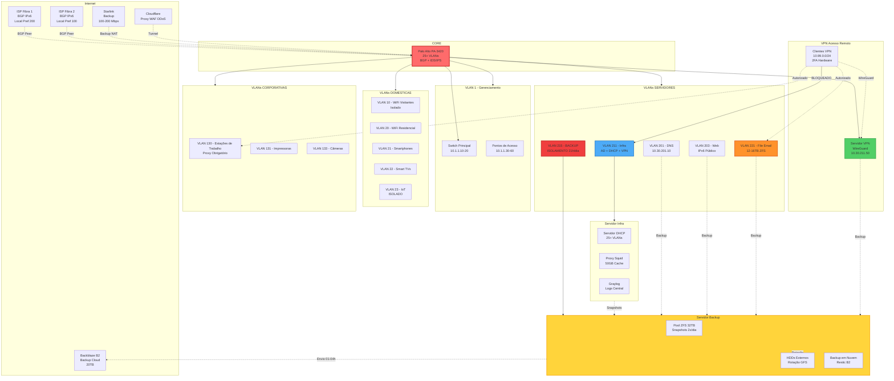
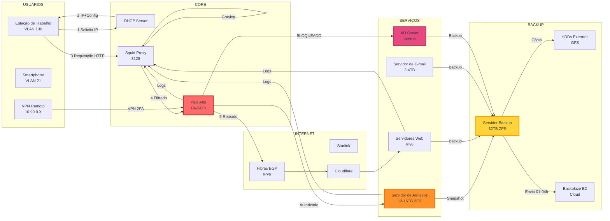
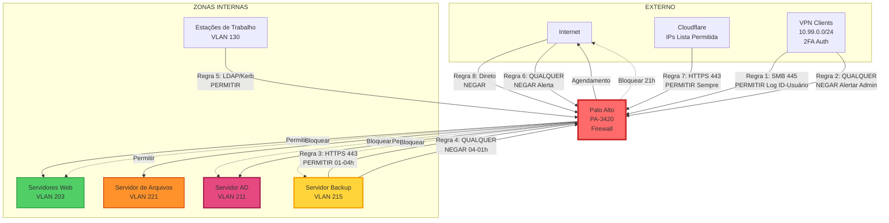
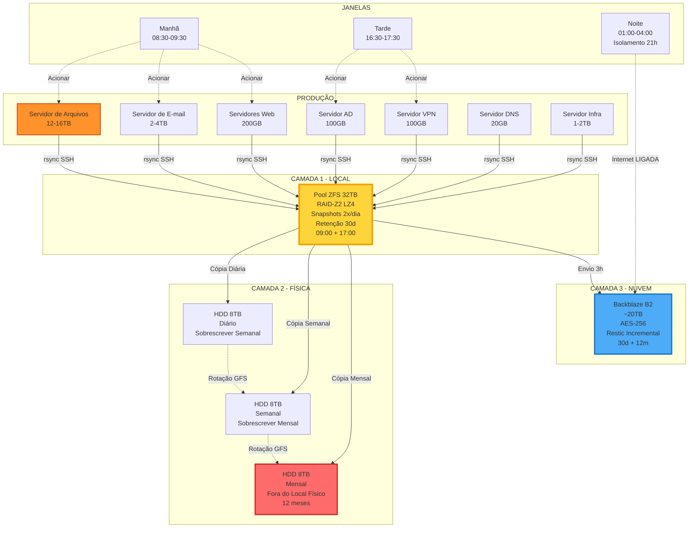

# 📊 Documentação de Infraestrutura de Rede e Servidores

**Versão:** 1.0  
**Data:** 2026-01-03  
**Responsável:** Equipe de TI  
**Status:** Arquitetura Aprovada para Implementação

---

## 📑 Índice

1. [Visão Geral](#visão-geral)
2. [Conectividade e BGP](#conectividade-e-bgp)
3. [Firewall e Roteamento](#firewall-e-roteamento)
4. [Endereçamento IP](#endereçamento-ip)
5. [VLANs e Segmentação](#vlans-e-segmentação)
6. [Servidores](#servidores)
7. [Backup e Disaster Recovery](#backup-e-disaster-recovery)
8. [VPN e Acesso Remoto](#vpn-e-acesso-remoto)
9. [Segurança](#segurança)
10. [Diagramas Topológicos](#diagramas-topológicos)
11. [Procedimentos Operacionais](#procedimentos-operacionais)

---

## 🌐 Visão Geral

### Objetivos da Infraestrutura

- **Alta Disponibilidade:** Redundância de links (BGP multihoming 2 ISPs + Starlink backup)
- **Segurança em Camadas:** Isolamento VLANs, firewall granular, autenticação 2FA hardware
- **Escalabilidade Futura:** IPv6 nativo, ASN próprio, bloco /48 LACNIC, hardware modular
- **Resiliência Total:** Backup 3-2-1 (local + físico + cloud), failover automático BGP
- **Rastreabilidade Completa:** Logs centralizados Graylog, auditoria User-ID, compliance

### Princípios de Design

1. **Separação por Função:** Serviços críticos em hardware dedicado (VPN, Backup, Servidor de Arquivos)
2. **Zero Trust Architecture:** Nenhum acesso implícito, validação obrigatória em cada camada
3. **Defense in Depth:** Múltiplas camadas de segurança sobrepostas
4. **IPv6 First:** Todos servidores públicos com IPv6 fixo do bloco próprio
5. **Automação Máxima:** Processos automatizados (backup, failover, monitoramento, alertas)
6. **Hardware Isolado por Criticidade:** Backup, VPN e Servidor de Arquivos em hardware próprio
7. **🔒 Controle de Mudanças Obrigatório:** TODA alteração na infraestrutura DEVE ser analisada e autorizada pelo arquiteto da topologia antes da implementação

### Governança e Controle de Mudanças

**⚠️ POLÍTICA CRÍTICA - FATOR HUMANO (Ponto de Falha Residual):**

Toda a infraestrutura foi desenhada com defesa em profundidade, redundância e isolamento. Porém, o **único ponto de falha remanescente é o erro humano durante configuração/alteração**. Para mitigar:

**Regra de Ouro:**
> **NENHUMA alteração na infraestrutura pode ser executada sem análise e autorização prévia do arquiteto da topologia (pessoa que desenhou toda a arquitetura e possui visão completa).**

**Processo de Change Management Obrigatório:**

1. **Solicitação de Mudança (Qualquer alteração):**
   - ✅ Todas alterações de configuração em firewalls (Palo Alto, FortiGate)
   - ✅ Todas alterações em roteamento (BGP, rotas estáticas, inter-VLAN)
   - ✅ Todas alterações em VLANs (criação, modificação, exclusão)
   - ✅ Todas alterações em políticas de firewall (novas regras, modificação, desativação)
   - ✅ Todas alterações em DHCP/DHCPv6 (pools, reservas, escopo)
   - ✅ Todas alterações em DNS (zonas, registros A/AAAA)
   - ✅ Todas alterações em servidores (VMs, hosts físicos, storage)
   - ✅ Todas alterações em VPN (usuários, configurações, 3FA)
   - ✅ Todas alterações em backup (políticas, agendamento, retenção)
   - ✅ Todas alterações em hardware (substituição de componentes, upgrades, manutenção)
   - ✅ Todas alterações em energia (UPS, nobreaks, baterias, PDUs)
   - ✅ Todas alterações em cabeamento (patch panels, fiber, copper)
   - ✅ Todas atualizações de firmware/software (switches, APs, servidores, firewalls)
   - ✅ Qualquer intervenção física ou lógica na infraestrutura
   - ⛔ **SEM EXCEÇÕES - ABSOLUTAMENTE NENHUMA ALTERAÇÃO SEM APROVAÇÃO PRÉVIA**
   - ⛔ **EMERGÊNCIA NÃO AUTORIZA MUDANÇA - Aprovação é SEMPRE obrigatória**

2. **Análise Prévia (Arquiteto da Topologia):**
   - ✅ Revisar impacto da mudança em toda a topologia
   - ✅ Identificar dependências ocultas (outras VLANs, rotas, serviços)
   - ✅ Validar se mudança não quebra princípios de design (isolamento, defesa em profundidade)
   - ✅ Verificar se mudança não cria vetores de ataque não previstos
   - ✅ Simular mentalmente ou em laboratório (quando possível)

3. **Autorização Formal:**
   - ✅ Arquiteto aprova por escrito (e-mail, ticket, documento assinado)
   - ✅ Documenta justificativa da mudança
   - ✅ Documenta plano de rollback (como reverter se der errado)
   - ✅ Define janela de manutenção (horário de menor impacto)

4. **Implementação Controlada:**
   - ✅ Backup de configuração atual ANTES da mudança (firewalls, switches, etc)
   - ✅ Implementação em horário aprovado
   - ✅ Teste imediato após mudança (validar se funcionou)
   - ✅ Monitoramento intensivo por 24-48h após mudança

5. **Documentação Pós-Implementação:**
   - ✅ Atualizar Topologia.md com mudança aplicada
   - ✅ Registrar data, hora, responsável pela execução
   - ✅ Documentar eventuais problemas encontrados e como foram resolvidos
   - ✅ Atualizar diagramas de rede (se aplicável)

**Justificativa:**
- 🧠 **Visão Completa:** Apenas o arquiteto possui visão holística da topologia e entende TODAS as dependências
- 🔒 **Evita Cascata de Falhas:** Uma mudança em uma VLAN pode quebrar serviço em outra (ex: DHCP relay, rotas inter-VLAN)
- 🛡️ **Previne Vetores de Ataque:** Mudança mal feita pode abrir brecha de segurança não prevista
- 📊 **Mantém Documentação Atualizada:** Garante que Topologia.md sempre reflete realidade
- ⚖️ **Compliance:** Auditoria exige rastreabilidade de quem autorizou mudanças críticas

**Consequência de Descumprimento:**
- ⛔ **Mudança não autorizada = violação grave de política**
- ⛔ **Rollback IMEDIATO obrigatório (reverter para estado anterior)**
- ⛔ **Responsável pela mudança não autorizada assume TOTAL responsabilidade por qualquer problema causado**
- ⛔ **Análise formal de incidente obrigatória (independente de ter causado problema ou não)**
- ⛔ **Medidas disciplinares cabíveis (advertência, suspensão, demissão conforme gravidade)**

**⚠️ ATENÇÃO CRÍTICA:**
> **NÃO EXISTE "EMERGÊNCIA" QUE JUSTIFIQUE MUDANÇA SEM APROVAÇÃO**  
> Sistema caiu? Aguardar aprovação antes de qualquer ação.  
> Incêndio no datacenter? Evacuar, acionar bombeiros, mas QUALQUER mudança técnica aguarda aprovação.  
> Guerra mundial? Aprovação continua obrigatória.  
> Bateria de nobreak precisa troca? Aprovação obrigatória.  
> **A PALAVRA FINAL É SEMPRE DO ARQUITETO DA TOPOLOGIA - SEM EXCEÇÕES.**

---

### Documentação Viva Obrigatória por Dispositivo

**Princípio Fundamental:**
> **Cada dispositivo de infraestrutura DEVE ter documentação individual, viva e atualizada. Documentação desatualizada = pior que não ter documentação (cria falsa sensação de controle).**

**⚠️ OBRIGATORIEDADE DE DOCUMENTAÇÃO INDIVIDUAL:**

Todos os dispositivos abaixo DEVEM ter documento próprio com configuração, função, histórico e dependências:

**1. Equipamentos de Rede (Obrigatório):**
- ✅ **Palo Alto PA-3420** (firewall border)
- ✅ **FortiGate 700G** (firewall core)
- ✅ **Switch Piso 2 - Ubiquiti UniFi** (sw-p2.empresa.local)
- ✅ **Switch Piso 3 - Ubiquiti UniFi** (sw-p3.empresa.local)
- ✅ **Switch Servidores - Ubiquiti UniFi** (sw-servers.empresa.local)
- ✅ **Access Points - Ubiquiti UniFi** (cada AP individualmente)
- ✅ **UPS/Nobreaks** (cada unidade com modelo, capacidade, histórico de baterias)

**2. Servidores Físicos e Virtuais (Obrigatório - CADA VM = documento separado):**
- ✅ **Servidor físico Proxmox** (webhost01.empresa.local)
- ✅ **Servidor físico KVM** (infrahost01.empresa.local)
- ✅ **VM LicitaAki** (licitaaki.empresa.local) - documento próprio
- ✅ **VM API** (api.empresa.local) - documento próprio
- ✅ **VM Site** (site.empresa.local) - documento próprio
- ✅ **VM Landing** (landing.empresa.local) - documento próprio
- ✅ **VM Painel** (painel.empresa.local) - documento próprio
- ✅ **VM DHCP** (dhcp.empresa.local) - documento próprio
- ✅ **VM DNS** (dns.empresa.local) - documento próprio
- ✅ **VM Proxy** (proxy.empresa.local) - documento próprio
- ✅ **VM Graylog** (graylog.empresa.local) - documento próprio
- ✅ **VM Backup** (backup01.empresa.local) - documento próprio
- ✅ **VM VPN** (vpn.empresa.local) - documento próprio
- ✅ **VM File Server** (files.empresa.local) - documento próprio
- ✅ **VM Email** (email.empresa.local) - documento próprio
- ✅ **VM AD/LDAP** (ad.empresa.local) - documento próprio
- ✅ Qualquer outra VM criada no futuro

**3. Sistemas de Vigilância - Ubiquiti UniFi Protect (Obrigatório):**
- ✅ **NVR - Ubiquiti UniFi Protect** (Network Video Recorder) - documento próprio
- ✅ **Cada câmera individualmente - Ubiquiti UniFi Protect** (cam-entrada, cam-piso2-corredor, etc)
  - Modelo UniFi, resolução, localização física, VLAN, IP, MAC, configurações

**4. Dispositivos de Autenticação (Obrigatório):**
- ✅ **Cada pendrive-token 2FA** (identificador único, usuário vinculado, data emissão)
- ✅ **Dispositivos BLE autorizados** (MAC, nome, usuário vinculado)

**5. Armazenamento (Obrigatório):**
- ✅ **Storage físico** (NAS, SAN, DAS - cada unidade)
- ✅ **Pools de armazenamento** (ZFS pools, LVM, RAID)

**📋 BENS IMOBILIZADOS - DOCUMENTAÇÃO OBRIGATÓRIA:**

Dispositivos de usuário final que compõem os bens imobilizados da empresa DEVEM ser documentados em inventário centralizado:

**✅ Smartphones Corporativos:**
- **Obrigatório documentar:** 
  - Destinatário (funcionário/setor)
  - Modelo e especificações
  - Número de série/IMEI
  - Data de aquisição e garantia
  - Propósito de uso (acesso VPN, autenticação 2FA, comunicação corporativa, etc)
  - Valor patrimonial
  - Status (em uso, em manutenção, disponível)
- **Políticas de Uso:** 
  - Referência a políticas corporativas de uso de smartphones
  - Restrições e permissões específicas
  - Apps corporativos obrigatórios
  - Políticas MDM (Mobile Device Management) aplicadas

**✅ Desktops/Workstations Corporativos:**
- **Obrigatório documentar:** 
  - Destinatário (funcionário/setor)
  - Modelo e configuração (CPU, RAM, Storage)
  - Número de série e número patrimonial
  - Data de aquisição e garantia
  - Propósito de uso (desenvolvimento, administrativo, design, etc)
  - Sistema operacional e softwares licenciados instalados
  - Periféricos vinculados (monitor, teclado, mouse)
  - Valor patrimonial
  - Status (em uso, em manutenção, disponível)
- **Políticas de Uso:** 
  - Referência a políticas corporativas de uso de estações de trabalho
  - Softwares permitidos/proibidos
  - Políticas de segurança aplicadas
  - Restrições de instalação e configuração

**✅ Notebooks Corporativos:**
- **Obrigatório documentar:** 
  - Destinatário (funcionário/setor)
  - Modelo e configuração (CPU, RAM, Storage)
  - Número de série e número patrimonial
  - Data de aquisição e garantia
  - Propósito de uso (trabalho remoto, viagens, apresentações, etc)
  - Sistema operacional e softwares licenciados instalados
  - Acessórios (bolsa, carregador, mouse, adaptadores)
  - Valor patrimonial
  - Status (em uso, em manutenção, disponível)
- **Políticas de Uso:** 
  - Referência a políticas corporativas de uso de notebooks
  - Políticas de trabalho remoto
  - Criptografia de disco obrigatória
  - Backup local/cloud obrigatório
  - Restrições de rede e VPN

**✅ Tablets Corporativos:**
- **Obrigatório documentar:** 
  - Destinatário (funcionário/setor)
  - Modelo e especificações
  - Número de série
  - Data de aquisição e garantia
  - Propósito de uso (apresentações, leitura de documentos, mobilidade, etc)
  - Valor patrimonial
  - Status (em uso, em manutenção, disponível)
- **Políticas de Uso:** 
  - Referência a políticas corporativas de uso de tablets
  - Apps corporativos permitidos
  - Políticas MDM aplicadas

**✅ Impressoras Corporativas:**
- **Obrigatório documentar:** 
  - Localização física (setor/sala)
  - Modelo e capacidades (impressão, scanner, cópia, fax)
  - Número de série e número patrimonial
  - Conectividade (IP fixo, VLAN)
  - Propósito de uso (documentos gerais, contratos, etiquetas, etc)
  - Consumíveis (tipos de toner/tinta compatíveis)
  - Valor patrimonial
  - Status (operacional, em manutenção)
  - **Para multifuncionais com escaneamento para servidor:** Documento individual completo como dispositivo de infraestrutura

**📊 Formato do Inventário de Bens:**

O inventário centralizado DEVE conter tabela com:

| ID Patrimonial | Tipo | Modelo | Destinatário | Propósito | Data Aquisição | Garantia | Valor | Status | Políticas Aplicadas | Observações |
| -------------- | ---- | ------ | ------------ | --------- | -------------- | -------- | ----- | ------ | ------------------- | ----------- |
| PAT-2025-001   | ...  | ...    | ...          | ...       | ...            | ...      | ...   | ...    | ...                 | ...         |

**🔍 Requisitos de Documentação por Categoria:**

Para TODOS os dispositivos patrimoniais, documentar:
- **Motivo de existência:** Por que este dispositivo foi adquirido
- **O que faz:** Função/uso atual do dispositivo
- **Propósito:** Para qual finalidade é utilizado
- **Políticas aplicáveis:** Referências às políticas de uso (quando existirem)
- **Restrições:** O que pode e não pode ser feito com o dispositivo (quando aplicável)
- **Histórico:** Transferências, reparos, upgrades

**⛔ NÃO PATRIMONIAIS - SEM DOCUMENTAÇÃO INDIVIDUAL:**

Dispositivos pessoais e equipamentos não corporativos:

- ❌ **Smartphones pessoais** (mesmo que usados ocasionalmente para trabalho)
- ❌ **Notebooks pessoais** (mesmo em BYOD - Bring Your Own Device)
- ❌ **TVs** (displays comuns para entretenimento)
- ❌ **IoT genéricos** (lâmpadas inteligentes, tomadas, sensores comuns)
- ❌ **Tablets pessoais**
- ❌ **Periféricos de baixo valor** (mouses, teclados, webcams avulsas)

**Conteúdo Mínimo Obrigatório por Documento:**

Cada documento de dispositivo DEVE conter:

```markdown
# [Nome do Dispositivo] - Documentação Técnica

**Versão da Documentação:** X.Y
**Última Atualização:** YYYY-MM-DD
**Responsável:** [Nome]
**Status:** [Ativo | Inativo | Manutenção | Deprecado]

## 1. Identificação
- **Hostname:** [hostname.empresa.local]
- **Tipo:** [Firewall | Switch | Servidor | VM | Câmera | etc]
- **Modelo/Hardware:** [Fabricante, modelo, specs]
- **Serial Number:** [S/N se aplicável]
- **Localização Física:** [Rack, sala, piso]

## 2. Conectividade de Rede
- **VLAN:** [ID e nome]
- **IPv4:** [IP fixo ou range DHCP]
- **IPv6:** [IP do bloco próprio]
- **MAC Address:** [MAC físico]
- **Gateway:** [IP do gateway]
- **DNS:** [Servidores DNS]
- **Interfaces:** [eth0, eth1, etc com função]

## 3. Função e Dependências
- **Função Principal:** [O que este dispositivo faz]
- **Serviços Prestados:** [Lista de serviços]
- **Dependências (Upstream):** [De quem depende para funcionar]
- **Dependentes (Downstream):** [Quem depende deste dispositivo]
- **Criticidade:** [Crítico | Alto | Médio | Baixo]

## 4. Configuração Atual
- **Sistema Operacional/Firmware:** [Versão]
- **Configurações Específicas:** [Detalhes importantes]
- **Portas/Serviços Ativos:** [Lista com função]
- **Autenticação:** [Método, usuários, chaves]
- **Backup de Configuração:** [Local e frequência]

## 5. Políticas de Firewall/Segurança
- **Zona de Segurança:** [Nome da zona]
- **Regras Aplicadas:** [Lista de policies relevantes]
- **Acesso Permitido De:** [Origens autorizadas]
- **Acesso Permitido Para:** [Destinos autorizados]

## 6. Backup e Recuperação
- **Método de Backup:** [Como é feito backup]
- **Frequência:** [Diário, semanal, etc]
- **Retenção:** [Por quanto tempo]
- **RTO (Recovery Time Objective):** [Tempo máximo para restaurar]
- **RPO (Recovery Point Objective):** [Perda máxima de dados aceitável]

## 7. Histórico de Mudanças
| Data       | Mudança   | Aprovado Por | Implementado Por | Resultado     |
| ---------- | --------- | ------------ | ---------------- | ------------- |
| YYYY-MM-DD | Descrição | Arquiteto    | Técnico          | Sucesso/Falha |

## 8. Procedimentos Específicos
- **Inicialização:** [Como ligar/iniciar]
- **Desligamento:** [Como desligar corretamente]
- **Troubleshooting Comum:** [Problemas frequentes e soluções]
- **Contatos de Suporte:** [Fabricante, parceiros, etc]

## 9. Informações de Garantia/Licenças
- **Garantia:** [Válida até]
- **Licenças:** [Tipo, validade, renovação]
- **Contrato de Suporte:** [Número, validade]

## 10. Observações Adicionais
[Qualquer informação relevante não coberta acima]

---

### 📋 SEÇÕES ADICIONAIS ESPECÍFICAS POR TIPO DE DISPOSITIVO

---

#### A) SERVIDORES FÍSICOS - Seções Adicionais Obrigatórias:

```markdown
## 11. Recursos de Hardware (Servidores Físicos)
- **CPU:** [Modelo, quantidade cores/threads, clock]
- **RAM:** [Capacidade total, tipo, velocidade, slots ocupados/livres]
- **Storage Local:**
  - **Discos:** [Quantidade, tipo (SSD/HDD/NVMe), capacidade cada]
  - **RAID:** [Nível, configuração, controladora]
  - **Capacidade Total:** [TB utilizável]
  - **Capacidade Livre:** [TB disponível]
- **Rede:** [Interfaces físicas, velocidade cada, agregação se houver]
- **Placa de Gerenciamento:** [iLO, iDRAC, IPMI - IP, credenciais onde estão]
- **Slots de Expansão:** [PCIe livres, planejamento futuro]

## 12. Virtualização (Se for Hypervisor)
- **Hypervisor:** [Proxmox, KVM, VMware ESXi, Hyper-V - versão]
- **VMs Hospedadas:** [Lista completa de VMs neste host]
- **Recursos Alocados vs Disponíveis:**
  - **CPU:** [X vCPUs alocadas de Y cores físicos]
  - **RAM:** [X GB alocados de Y GB total]
  - **Storage:** [X TB alocados de Y TB total]
- **Overcommit:** [CPU: ratio, RAM: ratio]
- **HA/Cluster:** [Faz parte de cluster? Qual?]
- **Live Migration:** [Configurado? Para onde pode migrar?]
- **Storage Pool:** [Tipo (local, NFS, iSCSI), path, capacidade]

## 13. Performance e Monitoramento (Servidores Físicos)
- **Baseline Performance:**
  - **CPU Idle:** [% médio]
  - **CPU Load:** [% médio em operação normal]
  - **RAM Uso:** [% médio]
  - **Disco I/O:** [IOPS médio]
  - **Rede RX/TX:** [Mbps médio]
- **Alertas Configurados:**
  - [CPU > 80% por 10min → alerta]
  - [RAM > 90% → alerta]
  - [Disco > 85% → alerta]
  - [Temperatura > Xºc → alerta]
- **Ferramenta de Monitoramento:** [Graylog, Zabbix, Prometheus, etc]
- **Logs Centralizados:** [Para onde envia logs]

## 14. Manutenção de Hardware (Servidores Físicos)
- **Última Limpeza Física:** [Data]
- **Temperatura Operacional:** [ºC médio]
- **Ventilação:** [Status dos fans]
- **Último Teste de Memória:** [Data, ferramenta usada]
- **Último Teste de Disco:** [Data, SMART status]
- **Histórico de Falhas de Hardware:** [Discos substituídos, RAM trocada, etc]
```

---

#### B) MÁQUINAS VIRTUAIS (VMs) - Seções Adicionais Obrigatórias:

```markdown
## 11. Recursos Virtuais Alocados (VMs)
- **vCPU:** [Quantidade de cores virtuais]
- **vRAM:** [GB alocados]
- **vDisk:**
  - **Disco 1 (Sistema):** [Tamanho, tipo (thin/thick), formato (qcow2, vmdk)]
  - **Disco 2 (Dados):** [Se aplicável]
  - **Disco 3 (Logs):** [Se aplicável]
- **Rede Virtual:** [Interface virtual, bridge, VLAN tag]
- **Boot Order:** [Disco, rede, etc]
- **Recursos Garantidos vs Burstable:** [CPU/RAM garantidos ou shared]

## 12. Host Físico e Migração (VMs)
- **Host Físico Atual:** [Onde está rodando agora]
- **Hosts Compatíveis:** [Para onde pode ser migrada]
- **Migração Planejada:** [Quando/por que migrar]
- **Afinidade/Anti-afinidade:** [Deve/não deve rodar com quais outras VMs]
- **Pin de CPU:** [Cores específicos se aplicável]
- **NUMA:** [Node awareness se aplicável]

## 13. Sistema Operacional e Aplicações (VMs)
- **SO:** [Linux, Windows - distribuição, versão, kernel]
- **Aplicações Instaladas:** [Lista completa]
- **Serviços Ativos:** [Daemons/services rodando]
- **Portas Abertas:** [Lista completa com finalidade]
- **Processos Críticos:** [Quais processos DEVEM estar rodando sempre]
- **Usuários do Sistema:** [Usuários criados, propósito, shell]
- **Cron Jobs:** [Tarefas agendadas, quando rodam]

## 14. Dados e Volumes (VMs)
- **Diretórios Importantes:**
  - **/var/www/html:** [Aplicação web]
  - **/opt/app:** [Aplicação específica]
  - **/var/log:** [Logs locais]
  - **/data:** [Dados persistentes]
- **Montagens Externas:** [NFS, iSCSI, CIFS]
- **Tamanho de Dados:** [GB/TB atual]
- **Taxa de Crescimento:** [GB/mês estimado]
- **Limpeza Automática:** [Logs rotacionados? Dados antigos purgados?]

## 15. Performance e Limites (VMs)
- **Baseline Performance:**
  - **CPU Uso Médio:** [%]
  - **RAM Uso Médio:** [%]
  - **Disco I/O:** [IOPS, throughput]
  - **Rede RX/TX:** [Mbps médio]
- **Picos de Uso:** [Quando ocorrem, quanto aumenta]
- **Limites Configurados:**
  - **CPU Throttle:** [Limite máximo de CPU]
  - **RAM Máxima:** [Hard limit]
  - **Disco I/O Limit:** [IOPS cap]
  - **Banda de Rede:** [Mbps limit]
- **Necessidade de Upgrade:** [Previsão quando precisará mais recursos]

## 16. Snapshots e Clones (VMs)
- **Snapshots Atuais:** [Lista, data, propósito]
- **Política de Snapshot:** [Antes de mudanças, frequência]
- **Retenção de Snapshot:** [Quantos manter, por quanto tempo]
- **Template:** [Esta VM é template? Pode ser clonada?]
- **Clones Existentes:** [Outras VMs derivadas desta]

## 17. Integrações e APIs (VMs)
- **APIs Expostas:** [Endpoints, autenticação]
- **APIs Consumidas:** [Serviços externos que consome]
- **Webhooks:** [Notificações que envia/recebe]
- **Filas/Mensageria:** [RabbitMQ, Redis, Kafka - se usa]
- **Cache:** [Redis, Memcached - configuração]
- **Banco de Dados:** [Se usa BD externo - qual, onde]
```

---

#### C) CÂMERAS E NVR - Seções Adicionais Obrigatórias:

```markdown
## 11. Especificações de Vídeo (Câmeras)
- **Resolução:** [1080p, 4K, etc]
- **FPS:** [Frames por segundo]
- **Codec:** [H.264, H.265/HEVC]
- **Bitrate:** [Mbps configurado]
- **Visão Noturna:** [IR, distância]
- **Campo de Visão (FOV):** [Graus]
- **Zoom:** [Óptico/Digital]
- **PTZ:** [Pan/Tilt/Zoom - se aplicável]

## 12. Localização e Cobertura (Câmeras)
- **Localização Física Exata:** [Corredor piso 2, entrada principal, etc]
- **Altura de Instalação:** [Metros]
- **Ângulo de Visão:** [Direção que aponta]
- **Área Coberta:** [O que essa câmera monitora]
- **Câmeras Adjacentes:** [Cobertura sobreposta]
- **Pontos Cegos:** [Áreas não cobertas]

## 13. Armazenamento de Gravação (NVR/Câmeras)
- **Local de Gravação:** [NVR, storage específico]
- **Retenção:** [Dias de gravação mantidos]
- **Espaço Usado:** [GB/TB por câmera]
- **Taxa de Crescimento:** [GB/dia por câmera]
- **Movimento vs Contínuo:** [Grava sempre ou só com movimento?]
- **Qualidade Noturna vs Diurna:** [Configurações diferentes?]

## 14. Acesso e Visualização (NVR/Câmeras)
- **Software de Gerenciamento:** [Milestone, Blue Iris, Frigate, etc]
- **Acesso Web:** [URL, porta]
- **Acesso Mobile:** [App, configuração]
- **Usuários Autorizados:** [Quem pode visualizar]
- **RTSP Stream:** [URL rtsp://...]
```

---

#### D) PENDRIVE-TOKENS 2FA - Seções Adicionais Obrigatórias:

```markdown
## 11. Identificação de Token (Pendrive 2FA)
- **Identificador Único:** [Código gravado, etiqueta]
- **Cor/Marca Visual:** [Para fácil identificação]
- **Capacidade:** [GB - se relevante]
- **Modelo/Fabricante:** [Marca do pendrive]

## 12. Usuário e Vínculo (Pendrive 2FA)
- **Usuário Vinculado:** [Nome completo]
- **Data de Emissão:** [Quando foi entregue]
- **Data de Revogação:** [Quando foi desativado, se aplicável]
- **Status:** [Ativo | Revogado | Perdido | Substituído]
- **Motivo de Revogação:** [Se aplicável]

## 13. Chave Criptográfica (Pendrive 2FA)
- **Tipo de Chave:** [SSH, GPG, Certificado]
- **Fingerprint:** [Hash da chave pública]
- **Data de Criação:** [Quando chave foi gerada]
- **Data de Expiração:** [Se aplicável]
- **Backup da Chave:** [Onde está backup seguro da privada]
- **Dispositivos Autorizados:** [Em quais máquinas esta chave funciona]

## 14. Histórico de Uso (Pendrive 2FA)
| Data             | Ação      | IP Origem   | Dispositivo | Sucesso/Falha |
| ---------------- | --------- | ----------- | ----------- | ------------- |
| YYYY-MM-DD HH:MM | Login VPN | 10.0.130.10 | ws-admin    | Sucesso       |
```

---

#### E) SWITCHES E ACCESS POINTS - Seções Adicionais Obrigatórias:

```markdown
## 11. Portas e Conectividade (Switches)
- **Total de Portas:** [48 portas, 4 SFP+, etc]
- **Portas em Uso:** [Quantidade ocupada]
- **Portas Livres:** [Quantidade disponível]
- **Mapa de Portas:**
  | Porta | Dispositivo Conectado | VLAN  | Velocidade | PoE     | Status |
  | ----- | --------------------- | ----- | ---------- | ------- | ------ |
  | 1     | FortiGate port3       | Trunk | 10G        | Não     | Up     |
  | 2     | AP-Piso2-Sala1        | 1     | 1G         | Sim 15W | Up     |
  | 3     | cam-corredor          | 51    | 1G         | Sim 30W | Up     |
  | ...   | ...                   | ...   | ...        | ...     | ...    |

## 12. VLANs Configuradas (Switches)
- **VLANs Permitidas:** [1, 10, 20, 51, 130, 203, 211]
- **VLAN Nativa:** [1 Management]
- **Trunk Ports:** [Portas 1, 24, 48 - uplink]
- **Access Ports:** [Demais portas]
- **Voice VLAN:** [Se aplicável]

## 13. PoE e Energia (Switches)
- **PoE Total Disponível:** [Watts]
- **PoE em Uso:** [Watts atual]
- **PoE por Porta:** [Máximo por porta]
- **Consumo Total do Switch:** [Watts]
- **Alimentação Redundante:** [Dual PSU?]

## 14. Cobertura WiFi (Access Points)
- **SSID Broadcast:** [Lista de redes]
- **Segurança por SSID:** [WPA3, WPA2, aberto]
- **VLANs por SSID:**
  - **Empresa-Secure** → VLAN 130
  - **Empresa-Guest** → VLAN 10
  - **Empresa-IoT** → VLAN 50
- **Banda:** [2.4GHz, 5GHz, 6GHz]
- **Canais:** [Canal fixo ou auto]
- **Potência de Transmissão:** [dBm]
- **Clientes Conectados:** [Atual e máximo suportado]
- **Área de Cobertura:** [Metros quadrados, ambientes]
```

---

#### F) FIREWALLS (Palo Alto, FortiGate) - Seções Adicionais Obrigatórias:

```markdown
## 11. Interfaces e Zonas (Firewalls)
- **Interfaces Físicas:**
  | Interface | Tipo | Zona         | VLAN | Função           |
  | --------- | ---- | ------------ | ---- | ---------------- |
  | port1     | 10G  | WAN-TRANSIT  | 999  | Uplink Palo Alto |
  | port2     | 1G   | GUEST        | 10   | Visitantes       |
  | port3     | 10G  | WORKSTATIONS | 130  | Usuários         |
  | ...       | ...  | ...          | ...  | ...              |

## 12. Políticas de Segurança (Firewalls)
- **Total de Políticas Ativas:** [Número]
- **Políticas por Zona:** [Lista quantidade por zona]
- **Políticas Mais Usadas:** [Hit count alto]
- **Políticas Obsoletas:** [Candidatas a remoção - hit count zero]
- **Ordem de Avaliação:** [Crítico - ordem importa]

## 13. NAT e BGP (Firewalls)
- **NAT Configurado:**
  - **Source NAT:** [VLANs que fazem SNAT para IPs públicos]
  - **Destination NAT:** [Port forwarding, se houver]
- **BGP Peers:**
  | Peer   | AS    | IP      | Status      | Prefixos Recebidos | Prefixos Anunciados |
  | ------ | ----- | ------- | ----------- | ------------------ | ------------------- |
  | Fibra1 | 12345 | x.x.x.x | Established | 850000             | 1 (/48 IPv6)        |

## 14. Throughput e Performance (Firewalls)
- **Throughput Atual:** [Gbps médio]
- **Throughput Máximo Observado:** [Gbps pico]
- **Capacidade do Equipamento:** [Gbps nominal]
- **Sessões Concorrentes:** [Atual vs máximo]
- **CPU/RAM Uso:** [% médio]
- **Latência Introduzida:** [ms]

## 15. Logs e IPS/IDS (Firewalls)
- **Logs Habilitados:** [Traffic, Threat, URL, etc]
- **Destino dos Logs:** [Graylog, Syslog, local]
- **Retenção Local:** [Dias]
- **IPS/IDS:** [Habilitado? Perfil aplicado?]
- **Antivirus:** [Habilitado? Perfil?]
- **URL Filtering:** [Habilitado? Categorias bloqueadas?]
- **Alertas Críticos:** [Quais eventos geram alerta imediato]
```

---

**⚠️ IMPORTANTE:**
- Estas seções adicionais são **OBRIGATÓRIAS** para o tipo de dispositivo correspondente
- Ignorar seções específicas = documentação incompleta = dispositivo não pode entrar em produção
- Template base (seções 1-10) + seções específicas = documentação completa

**Responsabilidade pela Documentação:**
- 📝 **Criação:** Técnico que configura/implementa (sob supervisão do arquiteto)
- ✅ **Aprovação:** Arquiteto da topologia (valida se documentação está completa e correta)
- 🔄 **Atualização:** Qualquer pessoa que faça mudança APROVADA (atualizar documento é parte da mudança)
- 🔍 **Auditoria:** Arquiteto revisa mensalmente se documentação reflete realidade

**Frequência de Revisão:**
- ⚡ **Imediato:** Após qualquer mudança aprovada no dispositivo
- 📅 **Mensal:** Validação de que documentação está atualizada
- 📆 **Trimestral:** Revisão completa com testes de procedimentos documentados

**Formato e Localização:**
- 📁 **Formato:** Markdown (.md) ou Wiki interno
- 📂 **Estrutura de pastas:**
  ```
  /docs/dispositivos/
    /firewalls/
      palo-alto-pa3420.md
      fortigate-700g.md
    /switches/
      sw-p2.md
      sw-p3.md
      sw-servers.md
    /servidores-fisicos/
      webhost01.md
      infrahost01.md
    /vms/
      licitaaki-vm.md
      api-vm.md
      ...
    /cameras/
      nvr.md
      cam-entrada.md
      cam-piso2-corredor.md
      ...
    /tokens/
      pendrive-token-001.md
      pendrive-token-002.md
      ...
  ```

**Consequência de Documentação Desatualizada:**
- ⚠️ **Documentação desatualizada = violação de política**
- ⚠️ **Auditor (arquiteto) identifica discrepância = responsável pela última mudança deve atualizar imediatamente**
- ⚠️ **Dispositivo sem documentação = não pode entrar em produção**
- ⚠️ **Mudança sem atualização de documentação = mudança incompleta (rollback se necessário)**

### Filosofia de Segurança

**Air-Gap Lógico:**
- Servidor Backup isolado 21 horas/dia (apenas 3h janela upload cloud)
- Firewall Baseado em agendamento controla acesso temporal
- Zero acesso inbound ao servidor backup (exceto admin único)

**Isolamento por Criticidade:**
- Servidor AD:  ZERO acesso externo (nem via VPN autenticada)
- Servidor de Arquivos: Acesso apenas VPN 2FA + estações de trabalho internas
- Servidor Backup:  Pull model (servidores conectam nele, não o contrário)

**Rastreabilidade:**
- Logs User-ID identificam QUEM acessou (nome + IP + dispositivo)
- Graylog centraliza todos logs (firewall, proxy, servidores, DHCP)
- Auditoria completa para compliance

---

## 🔌 Conectividade e BGP

### Links de Internet

| Link         | Tipo     | Velocidade   | Latência Típica | IPv4 Público   | IPv6       | Função              | Status Padrão |
| ------------ | -------- | ------------ | --------------- | -------------- | ---------- | ------------------- | ------------- |
| **Fibra 1**  | Dedicado | 1 Gbps       | 15-30 ms        | 1 IP (ISP)     | BGP Nativo | Primário            | Ativo         |
| **Fibra 2**  | Dedicado | 1 Gbps       | 20-35 ms        | 1 IP (ISP)     | BGP Nativo | Secundário/Failover | Em espera     |
| **Starlink** | Satélite | 100-200 Mbps | 40-80 ms        | Dinâmico/CGNAT | NAT        | Emergencial         | Desconectado  |

**Observação Crítica - IPv4 vs IPv6:**

**IPv4 Público:**
- ❌ **NÃO temos bloco IPv4 próprio**
- ✅ **Fibra 1:** 1 IP público fornecido pelo ISP (ex: 200.xxx.xxx.1)
- ✅ **Fibra 2:** 1 IP público fornecido pelo ISP (ex: 201.xxx.xxx.1)
- ⚠️ **Starlink:** IP dinâmico (pode mudar) ou CGNAT (compartilhado)
- **Total:** Apenas 2 IPs IPv4 públicos fixos (1 por fibra)

**IPv6 Público:**
- ✅ **Bloco próprio LACNIC:** 2801:1234:5678::/48 (65.536 sub-redes /64)
- ✅ **Anunciado via BGP:** ASN próprio multihoming
- ✅ **Roteável globalmente:** IPs públicos diretos (sem NAT)
- ✅ **Total:** 1.208.925.819.614.629.174.706.176 endereços utilizáveis

**Implicações:**
- Servidores públicos: **IPv6 é o endereço principal** (bloco próprio)
- IPv4: Usado via Cloudflare proxy (não expõe IPs ISP diretamente)
- NAT IPv4: Rede interna 10.0.0.0/8 com NAT para IPv4 público dos ISPs
- Acesso externo: Cloudflare mascara IPs IPv4 dos ISPs (segurança)

### Sistema Autônomo BGP (Apenas IPv6)

**Informações Registro:**
- **ASN:** AS26XXXX (registrado LACNIC - Brasil)
- **Bloco IPv6:** 2801:1234:5678::/48 (público roteável global)
- **IPv4:** ❌ NÃO temos bloco IPv4 próprio (usamos IPs dos ISPs)
- **Organização:** Registrada como pessoa jurídica
- **Contatos:** NOC, Abuse, Technical (registrados LACNIC)

**Anúncio BGP (IPv6 apenas):**
- ✅ **Prefixo Anunciado IPv6:** 2801:1234:5678::/48 (bloco próprio LACNIC)
- ❌ **IPv4:** Não anunciamos (não temos bloco IPv4 próprio)
- **Peers:** 2 ISPs diferentes (multihoming IPv6)
- **Política:** Anunciar apenas /48 IPv6 (filtro proteção route leak)
- **Nota:** IPs IPv4 dos ISPs são usados apenas para NAT de saída (não BGP)

**Peering (IPv6):**

| Peer   | ISP     | ASN Upstream | IPv6 Peer Address    | Local Preference | Função       |
| ------ | ------- | ------------ | -------------------- | ---------------- | ------------ |
| Peer 1 | Fibra 1 | AS12345      | 2804:ISP1:TRANSIT::1 | 200              | Preferencial |
| Peer 2 | Fibra 2 | AS67890      | 2801:ISP2:TRANSIT::1 | 100              | Backup       |

**Local Preference** determina preferência saída:
- 200 (Fibra 1): Tráfego outbound prefere Fibra 1
- 100 (Fibra 2): Usado apenas se Fibra 1 falhar

### Cenários de Failover

#### Modo Normal (Operação Padrão)
**Status:**
- ✅ Fibra 1: Ativa, BGP Established, 100% tráfego
- ✅ Fibra 2: Em espera, BGP Established, sem tráfego
- ❌ Starlink: Desconectado

**Características:**
- Latência: 15-30 ms
- IPv6: Público direto (sem NAT) via bloco próprio 2801:1234:5678::/48
- IPv4: NAT usando IP público da Fibra 1 (fornecido pelo ISP)
- Roteamento global: 2801:1234:5678::/48 via AS12345 (apenas IPv6)

#### Failover Fibra 1 → Fibra 2
**Detecção:**
- Temporizador de Espera BGP expira (~90 segundos)
- Palo Alto detecta par inativo
- Remove rotas via Fibra 1 da tabela

**Convergência:**
- Tempo: 30-90 segundos (convergência BGP)
- Ação: BGP converge para Fibra 2 automaticamente
- Upstream: ASN propagam mudança globalmente

**Impacto:**
- Tempo de inatividade: ~60 segundos (interrupção breve)
- Sessões TCP: Algumas podem cair (dependem de tempo limite)
- Usuários: Reconectam automaticamente
- IPv4: NAT agora usa IP público da Fibra 2 (troca automática)

**Status Final:**
- ❌ Fibra 1: Down, BGP Ocioso
- ✅ Fibra 2: Ativa, 100% tráfego
- ❌ Starlink: Desconectado

#### Modo Desastre (Ambas Fibras Down)
**Detecção:**
- Ambos pares BGP inativos
- Rotas BGP removidas globalmente
- Palo Alto ativa rota estática backup (Starlink)

**Ações Automáticas:**
1. Palo Alto habilita NAT de Origem para Starlink
2. Tráfego IPv4 de saída com NAT para IP dinâmico Starlink
3. IPv6 público inacessível globalmente (BGP apagado - sem anúncio)
4. Túnel Cloudflare assume (já ativo em espera)

**Serviços Afetados:**
- ❌ IPv6 Direto: Inacessível (BGP removido global)
- ✅ Sites HTTP/HTTPS: Funcionam via Cloudflare Tunnel
- ❌ Email de Entrada: Temporariamente indisponível (MX inacessível)
- ⚠️ VPN: Funciona via Starlink + NAT (pode ter CGNAT limitações)
- ✅ Servidor de Arquivos: Acessível via VPN (se Starlink não estiver CGNAT)

**Tempo Recuperação:**
- Sites públicos: ~5 minutos (Cloudflare detecta e assume)
- Email de entrada: Depende fibras voltarem (fila ISP remetente)
- Acesso VPN:  Imediato (Starlink ativo)

### Integração Cloudflare

**Funções:**
- **Proxy Reverso:** HTTP/HTTPS com DDoS protection e WAF
- **Túnel Permanente:** Sempre ativo em espera, assume em desastre
- **DNS Autoritativo:** Gerencia zona pública empresa. com. br

**Configuração DNS Cloudflare:**
- Registros A/AAAA: **Proxied** (ícone laranja)
- IPs retornados: IPs Cloudflare (não seu real)
- Túnel: Conexão outbound servidor → Cloudflare (sempre ativa)
- Failover: Verificação de saúde detecta IPv6 down, Túnel assume

**Lista de permissões do Firewall:**
- Apenas IPs Cloudflare acessam Servidores Web
- Ranges IPv6 Cloudflare mantidos em address group
- Acesso direto por IP:  BLOQUEADO (força via Cloudflare)

**Vantagens:**
- IP real nunca exposto (não aparece em DNS público)
- DDoS absorvido por Cloudflare (não chega em você)
- WAF protege aplicações web
- Cache acelera carregamento
- Túnel funciona sobre NAT (modo desastre Starlink)

---

## 🔥 Arquitetura de Firewall e Roteamento

### Visão Geral - Defense in Depth

**Arquitetura em Camadas:**

```
Internet (BGP Multihoming)
    ↓
┌─────────────────────────────────────┐
│  Palo Alto PA-3420                  │ ← PERÍMETRO (Border Firewall)
│  • Proteção entrada/saída           │
│  • BGP com ISPs                     │
│  • IPS/IDS perímetro                │
│  • Threat Prevention                │
└─────────────────────────────────────┘
    ↓ (Fibra 10G - BGP iBGP)
┌─────────────────────────────────────┐
│  FortiGate 700G                     │ ← CORE (Internal Segmentation)
│  • Roteamento inter-VLAN            │
│  • Políticas micro-segmentação      │
│  • Inspeção tráfego L2-L7           │
│  • Zonas granulares                 │
└─────────────────────────────────────┘
    ↓ (Fibras 10G - Múltiplos trunks)
┌──────────────┐  ┌──────────────┐  ┌──────────────┐
│  Switch P2   │  │  Switch P3   │  │  sw-servers  │ ← ACESSO (L2 apenas)
│  (Layer 2)   │  │  (Layer 2)   │  │  (Layer 2)   │
└──────────────┘  └──────────────┘  └──────────────┘
    ↓                  ↓                  ↓
  Endpoints        Workstations       Servidores
```

**Separação de Responsabilidades:**

| Camada        | Equipamento       | Função Principal                         | Escopo                      |
| ------------- | ----------------- | ---------------------------------------- | --------------------------- |
| **Perímetro** | Palo Alto PA-3420 | Proteção Internet, BGP, IPS entrada      | Internet ↔ Rede Interna     |
| **Core**      | FortiGate 700G    | Roteamento inter-VLAN, micro-segmentação | VLAN ↔ VLAN, zonas internas |
| **Acesso**    | Switches (L2)     | VLAN isolation física, link aggregation  | Endpoints ↔ VLAN assignment |

**Benefícios Arquitetura:**
- ✅ **Perímetro dedicado:** Palo Alto foca 100% em ameaças externas
- ✅ **Segmentação interna robusta:** FortiGate gerencia tráfego leste-oeste (VLAN-to-VLAN)
- ✅ **Inspeção dupla:** Tráfego inspecionado 2x (entrada + inter-VLAN)
- ✅ **Políticas granulares:** FortiGate controla até mesmo servidores na mesma VLAN
- ✅ **Switches simplificados:** L2 puro (sem ACLs complexas limitadas)
- ✅ **Failure isolation:** Problema em um firewall não derruba o outro

### 🔄 Redundância Cruzada de Firewalls

**Estratégia de Alta Disponibilidade:**

A infraestrutura implementa **redundância cruzada ativa-passiva** entre os dois firewalls, onde cada um pode assumir as funções do outro em caso de falha.

**Configurações de Backup:**

**1. Palo Alto → Backup do FortiGate:**
- ✅ Configuração completa de roteamento inter-VLAN pré-configurada
- ✅ Todos os gateways das VLANs (.1) podem ser assumidos pelo Palo Alto
- ✅ Políticas de micro-segmentação inter-VLAN importadas
- ✅ DHCP Relay configurado para todas as VLANs
- ✅ BGP iBGP com rotas internas preservadas
- ⚙️ **Modo:** Standby (ativação manual via mudança de cabeamento)

**2. FortiGate → Backup do Palo Alto:**
- ✅ Configuração BGP com ISPs externos (ASN 26XXXX)
- ✅ Políticas de perímetro (Internet → Interna) pré-configuradas
- ✅ NAT policies para saída IPv4
- ✅ IPS/IDS de entrada configurado
- ✅ Sessões BGP com Fibra 1, Fibra 2 e Starlink preparadas
- ⚙️ **Modo:** Standby (ativação manual via mudança de cabeamento)

**Procedimento de Failover Manual:**

**Cenário 1: FortiGate Falha**
1. Identificar falha do FortiGate (perda de conectividade inter-VLAN)
2. Desconectar cabos das interfaces FortiGate (port1, port2, port3, port4)
3. Conectar cabos equivalentes nas interfaces Palo Alto correspondentes
4. Ativar configuração de backup do FortiGate no Palo Alto (comando CLI ou web)
5. Aguardar convergência BGP (~30-90 segundos)
6. Validar conectividade (ping entre VLANs, acesso servidores)
7. **Downtime estimado:** 2-5 minutos (mudança física de cabos + convergência)

**Cenário 2: Palo Alto Falha**
1. Identificar falha do Palo Alto (perda de Internet)
2. Desconectar cabos WAN (Fibra 1, Fibra 2, Starlink) do Palo Alto
3. Conectar cabos WAN diretamente nas interfaces FortiGate correspondentes
4. Desconectar cabo transit (Palo Alto ↔ FortiGate)
5. Ativar configuração de backup do Palo Alto no FortiGate
6. Aguardar estabelecimento de sessões BGP com ISPs (~60-120 segundos)
7. Validar conectividade Internet e anúncio de rotas
8. **Downtime estimado:** 3-7 minutos (mudança física de cabos + convergência BGP externo)

**Justificativa de Redundância Manual (vs Automática):**

**Por que não VRRP/HSRP/FGCP automático:**
- ⚠️ **Custo:** Requer duplicação de hardware (2x Palo Alto + 2x FortiGate = 4 dispositivos vs 2 atuais)
- ⚠️ **Complexidade:** Configurações de cluster aumentam pontos de falha (split-brain scenarios)
- ⚠️ **Licenciamento:** Licenças de HA têm custo adicional significativo
- ✅ **Balanceamento custo-benefício:** Downtime de 2-7 minutos é aceitável para nossa estrutura
- ✅ **Redundância suficiente:** Problema isolado em um firewall não afeta o outro (configurações independentes)

**Cenário 3: Ambos os Firewalls Falham (Desastre Total)**

Se AMBOS os firewalls caírem simultaneamente, isso indica **evento catastrófico** que vai além de falha de equipamento individual:

**Possíveis Causas:**
- 🔥 Incêndio no rack/datacenter
- ⚡ Falha elétrica catastrófica (UPS + gerador falharam)
- 💧 Inundação/água no equipamento
- 🌪️ Desastre natural (terremoto, raio, etc)
- 🔌 Falha de infraestrutura elétrica do prédio inteiro

**Realidade:**
- ⚠️ Nesse cenário, **TODA a infraestrutura terá caído junto** (servidores, switches, storage)
- ⚠️ **Redundância passiva local não resolve:** Se o ambiente físico foi comprometido, equipamentos de backup no mesmo local também estarão comprometidos
- ⚠️ **Solução real seria backup geográfico:** Datacenter secundário em localização física diferente

**⚡ Continuidade Parcial de Serviços:**

**Impacto Real do Desastre Total:**
- ❌ **Operações internas:** Totalmente paralisadas (workstations, servidor de arquivos, AD, VPN, backup)
- ❌ **Email corporativo:** Servidor local offline - comunicação via email comprometida
- ✅ **Serviços WEB públicos:** **CONTINUAM OPERANDO NORMALMENTE**
  - Site público (site.empresa.local)
  - Landing pages (landing.empresa.local)
  - Painel administrativo (painel.empresa.local)
  - API REST (api.empresa.local)
  - Sistema LicitaAki (licitaaki.empresa.local)

**Justificativa - Serviços Web em VPS:**
- ✅ Todos os serviços web públicos estão hospedados em **VPS (Virtual Private Server) externos**
- ✅ Localização geográfica diferente do datacenter local
- ✅ Infraestrutura independente (não afetada por desastre local)
- ✅ **Continuidade de negócio crítico:** Clientes/usuários externos continuam com acesso aos sistemas principais
- ⚠️ **Limitação:** Servidor de email é local, então comunicação corporativa fica comprometida

**Impacto no Negócio:**
- 📊 **Operações diárias internas:** Paralisadas (equipe não consegue trabalhar do escritório)
- 📊 **Trabalho remoto:** Impossibilitado (VPN está no datacenter local)
- 📊 **Acesso a arquivos corporativos:** Indisponível (file server local)
- ✅ **Usuários finais externos:** **Sem impacto** - sistemas web continuam funcionando
- ✅ **Receita:** Mantida parcialmente (serviços públicos operacionais)
- ⚠️ **Comunicação:** Comprometida (email corporativo offline)

**Estratégia de Trabalho Durante DR:**
- 📧 Comunicação via email pessoal ou serviços externos (Gmail, Outlook.com)
- 💻 Equipe trabalha de casa usando sistemas VPS (que continuam operando)
- 📂 Arquivos críticos: Acesso via backup Backblaze B2 (baixar temporariamente)
- ⏱️ Operações internas podem ser retomadas parcialmente mesmo antes de hardware chegar

**Por que NÃO implementamos backup geográfico:**
- 💰 **Custo proibitivo:** Requer infraestrutura completa duplicada em localização separada
- 💰 **OPEX elevado:** Links dedicados entre sites, licenças duplicadas, equipe em 2 locais
- 📊 **Criticidade vs Custo:** Nossa operação não justifica investimento de backup geográfico
- 📊 **RTO aceitável:** Em caso de desastre total, recuperação em 24-48h é aceitável (restauração de hardware + backup cloud)
- 🔄 **Estratégia de recuperação:** Backup Backblaze B2 (cloud) permite restauração completa em hardware novo em caso de perda total

**Estratégia de Disaster Recovery (DR) Atual:**
1. **Backup 3-2-1:** 
   - 3 cópias de dados
   - 2 mídias diferentes (local ZFS + HDD rotativo)
   - 1 cópia offsite (Backblaze B2 cloud)
2. **Plano de Recuperação:**
   - Em caso de destruição total do datacenter local
   - Adquirir hardware substituto (3-5 dias úteis)
   - Restaurar configurações de firewalls de backup (arquivos em cloud)
   - Restaurar dados de servidores de Backblaze B2
   - **RTO:** 5-7 dias (hardware novo + restauração completa)
   - **RPO:** 24 horas (backup diário em cloud)
3. **Aceitação de Risco:**
   - ✅ Probabilidade de desastre total: Extremamente baixa
   - ✅ Custo de backup geográfico: Não justificável para escala atual
   - ✅ RTO de 5-7 dias: Aceitável para operação (negócio pode aguardar)

**Manutenção de Configurações de Backup:**
- 📝 **Sincronização:** Toda mudança em um firewall DEVE ser replicada na configuração de backup do outro
- 📝 **Validação:** Revisão trimestral das configurações de backup (garantir que estão atualizadas)
- 📝 **Documentação:** Procedimentos de failover documentados e testados anualmente
- 📝 **Treinamento:** Equipe treinada para executar mudança de cabeamento em caso de emergência

---

## 🛡️ Palo Alto PA-3420 (Border Firewall)

**Especificações Técnicas:**
- **Taxa de transferência Firewall:** 3.8 Gbps
- **Taxa de transferência Threat Prevention:** 2.2 Gbps (IDS/IPS + Antivirus)
- **Conexões Simultâneas:** 500.000
- **Novas Conexões/seg:** 80.000

**Função na Arquitetura:**
- 🎯 **Border Firewall:** Primeira linha de defesa (Internet → Rede interna)
- 🎯 **BGP Speaker Externo:** Anuncia bloco IPv6 2801:1234:5678::/48 para ISPs externos
- 🎯 **"ISP" do FortiGate:** Atua como provedor de Internet para rede interna via BGP iBGP
- 🎯 **Delegação de Blocos IP:** Repassa blocos IPv4/IPv6 para FortiGate (não distribui IPs)
- 🎯 **Threat Prevention:** IPS/IDS focado em ameaças externas
- 🎯 **NAT Gateway:** IPv4 (RFC1918 → IPs públicos ISP)

**⚠️ IMPORTANTE: Palo Alto NÃO é servidor DHCP**
- ✅ Delega blocos IP para uso interno via BGP
- ✅ Tem IP estático próprio (management): 172.16.254.1 / 2801:...:FFFF::1
- ❌ **NÃO distribui** IPs para dispositivos finais
- ❌ **NÃO é DHCP server** (função do servidor dhcp.empresa.local)

**Interfaces Físicas:**
- **ethernet1/1:** WAN Fibra 1 (1 Gbps, BGP peer ISP1)
- **ethernet1/2:** WAN Fibra 2 (1 Gbps, BGP peer ISP2)
- **ethernet1/3:** WAN Starlink (backup emergencial, 100-200 Mbps)
- **ethernet1/4:** SFP+ 10G → FortiGate (fibra, transit network)

**Endereçamento Interface FortiGate:**
- **Sub-interface:** ethernet1/4.999 (VLAN transit)
- **IPv4:** 172.16.254.1/30 (rede transit)
- **IPv6:** 2801:1234:5678:FFFF::1/126 (rede transit)
- **Peer:** FortiGate (172.16.254.2 / 2801:1234:5678:FFFF::2)

**Sessão BGP com FortiGate (Palo Alto como "ISP Interno"):**

**Relação:** Palo Alto = "ISP" / FortiGate = "Cliente BGP"

- **Protocolo:** iBGP (ASN 26XXXX compartilhado)
- **Peer IPv4:** 172.16.254.2 (FortiGate)
- **Peer IPv6:** 2801:1234:5678:FFFF::2 (FortiGate)

**Anúncio Palo Alto → FortiGate (Upstream):**
- ✅ **Default route IPv4:** 0.0.0.0/0 ("Internet está por aqui")
- ✅ **Default route IPv6:** ::/0 ("Internet IPv6 por aqui")
- ✅ **Delegação de blocos:**
  - 10.0.0.0/8 → "Use este bloco RFC1918 internamente"
  - 2801:1234:5678::/48 → "Use nosso bloco LACNIC internamente"
- 🎯 **Resultado:** FortiGate pode usar qualquer IP desses blocos para VLANs

**Anúncio FortiGate → Palo Alto (Downstream):**
- ✅ **Sub-redes em uso:** 10.0.0.0/8 (todas VLANs ativas)
- ✅ **Sub-redes IPv6:** 2801:1234:5678::/48 (VLANs específicas)
- ✅ **Rede VPN:** 10.99.0.0/24
- 🎯 **Resultado:** Palo Alto sabe como rotear para VLANs internas

**Observação:** BGP apenas delega/anuncia **blocos IP**, não distribui IPs individuais (isso é função do servidor DHCP)

**Licenças Ativas:**
- ✅ Prevenção de Ameaças (IDS/IPS, antivirus, anti-spyware, vulnerability protection)
- ✅ Filtragem de URL (categorização e bloqueio sites)
- ✅ WildFire (isolamento de malware em nuvem Palo Alto)
- ❌ GlobalProtect (não utilizado - VPN via WireGuard separado)

**Zonas de Segurança Palo Alto:**

| Zona            | Descrição                              | Interfaces      | Função                       |
| --------------- | -------------------------------------- | --------------- | ---------------------------- |
| **WAN**         | Internet (3 ISPs)                      | ethernet1/1-3   | Entrada/saída Internet       |
| **INTERNAL**    | Rede interna (via FortiGate)           | ethernet1/4.999 | Transit para FortiGate       |
| **DMZ-SERVERS** | Servidores isolados (bypass FortiGate) | ethernet1/4.203 | Triplo isolamento servidores |

**Políticas Firewall Palo Alto (Perímetro):**

1. **Internet → INTERNAL (Entrada):**
   - ✅ Cloudflare IPs → Servidores Web (HTTPS)
   - ✅ Email inbound → Servidor Email (SMTP/IMAP)
   - ❌ Todo resto: NEGADO

2. **INTERNAL → Internet (Saída):**
   - ✅ Permitido com inspeção (IPS, Antivirus, URL Filtering)
   - ✅ NAT IPv4 (10.0.0.0/8 → IP público ISP)
   - ✅ IPv6 sem NAT (bloco próprio)

3. **DMZ-SERVERS (Triplo Isolamento):**
   - ✅ Zona isolada fisicamente no Palo Alto
   - ✅ Também gerenciada pelo FortiGate (dupla inspeção)
   - ✅ Switch dedicado (isolamento físico)
   - ❌ Sem comunicação entre servidores (por padrão)

---

## 🔒 FortiGate 700G (Core Internal Firewall)

**Especificações Técnicas:**
- **Modelo:** FortiGate 700G
- **Taxa de transferência Firewall:** 40 Gbps
- **Taxa de transferência IPS:** 20 Gbps
- **Taxa de transferência SSL Inspection:** 10 Gbps
- **Conexões Simultâneas:** 10.000.000
- **Interfaces:** 16x SFP+ 10G, 2x QSFP+ 40G

**Função na Arquitetura:**
- 🎯 **Core Router:** Todos os gateways das VLANs (10.X.X.1, 2801:...::1)
- 🎯 **Inter-VLAN Firewall:** Controla TODO tráfego entre VLANs
- 🎯 **Micro-segmentação:** Políticas granulares (dispositivo-a-dispositivo)
- 🎯 **BGP Client:** Recebe default route + blocos IP do Palo Alto
- 🎯 **DHCP Relay Agent:** Encaminha requisições DHCP para servidor dhcp.empresa.local
- 🎯 **Gateway redundante:** VRRP/FGCP para alta disponibilidade (futuro)

**⚠️ IMPORTANTE: FortiGate NÃO é servidor DHCP**
- ✅ Gateway das VLANs (primeiro hop dos dispositivos)
- ✅ DHCP Relay: Intercepta broadcasts DHCP → encaminha para 10.30.211.31
- ✅ IP estático próprio (management): 172.16.254.2 / 2801:...:FFFF::2
- ✅ IPs estáticos em todas VLANs (gateways .1)
- ❌ **NÃO distribui** IPs (repassa requisições para servidor DHCP)
- ❌ **NÃO decide** qual IP alocar (servidor DHCP decide via políticas)

**Interfaces Físicas (Fibra 10G):**

| Interface   | Conexão          | Tipo           | Função              | VLANs                    |
| ----------- | ---------------- | -------------- | ------------------- | ------------------------ |
| **port1**   | Palo Alto eth1/4 | SFP+ 10G Fibra | Uplink WAN/Internet | 999 (transit), 203 (DMZ) |
| **port2**   | Switch Piso 2    | SFP+ 10G Fibra | Trunk VLANs Piso 2  | 10, 20, 21               |
| **port3**   | Switch Piso 3    | SFP+ 10G Fibra | Trunk VLANs Piso 3  | 130-139, 211, 215, 221   |
| **port4**   | sw-servers       | SFP+ 10G Fibra | Trunk servidores    | 201, 203                 |
| **port5-6** | Reserva expansão | SFP+ 10G       | Futuro              | -                        |

**Endereçamento Interfaces:**

**Transit para Palo Alto (port1.999):**
- IPv4: 172.16.254.2/30
- IPv6: 2801:1234:5678:FFFF::2/126
- Gateway: Palo Alto (172.16.254.1 / 2801:...:FFFF::1)

**VLANs Internas (sub-interfaces):**
| VLAN | Interface             | IPv4 Gateway (FG) | IPv6 Gateway (FG)   | Descrição        | DHCP Server          |
| ---- | --------------------- | ----------------- | ------------------- | ---------------- | -------------------- |
| 10   | port2.10              | 10.20.10.1/24     | 2801:...:000A::1/64 | Visitantes       | 10.30.211.31 (relay) |
| 20   | port2.20              | 10.20.20.1/24     | 2801:...:0014::1/64 | Home WiFi        | 10.30.211.31 (relay) |
| 130  | port3.130             | 10.30.130.1/24    | 2801:...:0082::1/64 | Workstations     | 10.30.211.31 (relay) |
| 201  | port4.201             | 10.30.201.1/24    | 2801:...:00C9::1/64 | DNS/Proxy        | 10.30.211.31 (relay) |
| 203  | port1.203 + port4.203 | 10.30.203.1/24    | 2801:...:00CB::1/64 | Servidores Web   | 10.30.211.31 (relay) |
| 211  | port3.211             | 10.30.211.1/24    | 2801:...:00D3::1/64 | Infra (AD/DHCP)  | 10.30.211.31 (local) |
| 215  | port3.215             | 10.30.215.1/24    | 2801:...:00D7::1/64 | Backup (air-gap) | 10.30.211.31 (relay) |
| 221  | port3.221             | 10.30.221.1/24    | 2801:...:00DD::1/64 | File/Email       | 10.30.211.31 (relay) |

**Observação Gateways:**
- Todos IPs .1 são **estáticos no FortiGate** (configuração manual)
- FortiGate NÃO obtém esses IPs via DHCP (óbvio, ele é o gateway!)
- DHCP Server (10.30.211.31) também é **estático** (rota crítica)

**Sessão BGP com Palo Alto:**
- **Tipo:** iBGP (ASN 26XXXX compartilhado)
- **Peer:** Palo Alto 172.16.254.1 (IPv4) e 2801:...:FFFF::1 (IPv6)
- **Recebe do Palo Alto (upstream):**
  - 0.0.0.0/0 (default route IPv4)
  - ::/0 (default route IPv6)
  - 10.0.0.0/8 (delegação bloco RFC1918 para uso interno)
  - 2801:1234:5678::/48 (delegação bloco LACNIC próprio)
- **Anuncia para Palo Alto (downstream):**
  - 10.0.0.0/8 (agregado todas VLANs)
  - 2801:1234:5678:0000::/52 (sub-redes internas específicas)
  - 10.99.0.0/24 (rede VPN)

### IPs Estáticos Obrigatórios (Infraestrutura - Dual Stack)

**Princípio:** Toda infraestrutura de rede (firewalls, switches, gateways, servidor DHCP) DEVE ter IP estático **IPv4 E IPv6**. Nada disso pode depender de DHCP (óbvio - não pode haver dependência circular).

**⚠️ IMPORTANTE:** Todos equipamentos têm **dual-stack** (IPv4 + IPv6 simultaneamente):
- ✅ **IPv6 do nosso bloco:** 2801:1234:5678::/48 (endereço principal)
- ✅ **IPv4 RFC1918:** 10.0.0.0/8 ou 172.16.0.0/12 (fallback/legado)

**Tabela IPs Estáticos da Infraestrutura (Dual-Stack):**

| Equipamento              | Hostname                 | IPv4 Estático   | IPv6 Estático (Bloco Próprio) | Função                 | Config |
| ------------------------ | ------------------------ | --------------- | ----------------------------- | ---------------------- | ------ |
| **Palo Alto**            | pa-3420.empresa.local    | 172.16.254.1/30 | 2801:1234:5678:03E7::1/126    | Border FW (transit)    | Manual |
| **FortiGate**            | fg-700g.empresa.local    | 172.16.254.2/30 | 2801:1234:5678:03E7::2/126    | Core FW (transit)      | Manual |
| **FortiGate VLAN 1**     | fg-700g.empresa.local    | 10.0.1.1/24     | 2801:1234:5678:0001::1/64     | Gateway Management     | Manual |
| **FortiGate VLAN 10**    | fg-700g.empresa.local    | 10.0.10.1/24    | 2801:1234:5678:000A::1/64     | Gateway Visitantes     | Manual |
| **FortiGate VLAN 20**    | fg-700g.empresa.local    | 10.0.20.1/24    | 2801:1234:5678:0014::1/64     | Gateway Home WiFi      | Manual |
| **FortiGate VLAN 21**    | fg-700g.empresa.local    | 10.0.21.1/24    | 2801:1234:5678:0015::1/64     | Gateway Home Wired     | Manual |
| **FortiGate VLAN 50**    | fg-700g.empresa.local    | 10.0.50.1/24    | 2801:1234:5678:0032::1/64     | Gateway IoT            | Manual |
| **FortiGate VLAN 51**    | fg-700g.empresa.local    | 10.0.51.1/24    | 2801:1234:5678:0033::1/64     | Gateway Câmeras        | Manual |
| **FortiGate VLAN 130**   | fg-700g.empresa.local    | 10.0.130.1/24   | 2801:1234:5678:0082::1/64     | Gateway Workstations   | Manual |
| **FortiGate VLAN 201**   | fg-700g.empresa.local    | 10.0.201.1/24   | 2801:1234:5678:00C9::1/64     | Gateway DNS/Proxy      | Manual |
| **FortiGate VLAN 203**   | fg-700g.empresa.local    | 10.0.203.1/24   | 2801:1234:5678:00CB::1/64     | Gateway Servidores Web | Manual |
| **FortiGate VLAN 211**   | fg-700g.empresa.local    | 10.0.211.1/24   | 2801:1234:5678:00D3::1/64     | Gateway Infra          | Manual |
| **FortiGate VLAN 215**   | fg-700g.empresa.local    | 10.0.215.1/24   | 2801:1234:5678:00D7::1/64     | Gateway Backup         | Manual |
| **FortiGate VLAN 221**   | fg-700g.empresa.local    | 10.0.221.1/24   | 2801:1234:5678:00DD::1/64     | Gateway File/Email     | Manual |
| **Switch Piso 2**        | sw-p2.empresa.local      | 10.0.1.10/24    | 2801:1234:5678:0001::10/64    | Management VLAN 1      | Manual |
| **Switch Piso 3**        | sw-p3.empresa.local      | 10.0.1.11/24    | 2801:1234:5678:0001::11/64    | Management VLAN 1      | Manual |
| **Switch Servidores**    | sw-servers.empresa.local | 10.0.1.12/24    | 2801:1234:5678:0001::12/64    | Management VLAN 1      | Manual |
| **Servidor DHCP/DHCPv6** | dhcp.empresa.local       | 10.0.211.31/24  | 2801:1234:5678:00D3::31/64    | DHCP+DHCPv6 Server     | Manual |

**Observações Críticas:**
- 🎯 **IPv6 é endereço principal:** Todos usam bloco próprio 2801:1234:5678::/48
- 🎯 **IPv4 é fallback:** RFC1918 apenas para dispositivos sem suporte IPv6
- 🎯 **Dual-stack simultâneo:** Equipamentos respondem em ambos protocolos
- 🎯 **Transit VLAN 999:** Usa 2801:...:03E7::/126 (4 IPs, link P2P)

**Justificativa IPs Estáticos (ambos protocolos):**
- 🔒 **Rota crítica:** DHCP server protegido por PA → FG → VLAN 211
- 🔒 **Sem dependência circular:** Servidores DHCP não podem depender de DHCP
- 🔒 **Gateways fixos:** Dispositivos precisam saber gateway (não pode mudar)
- 🔒 **BGP peers:** Sessões BGP exigem IPs fixos (IPv4 e IPv6)
- 🔒 **Management switches:** Acesso admin precisa IPs conhecidos (ambos protocolos)
- 🔒 **DNS:** Registros A e AAAA fixos para toda infraestrutura

### Fluxo DHCP/DHCPv6 Real (com Relay Dual-Stack)

**Cenário:** Workstation na VLAN 130 liga e precisa de IPs (IPv4 + IPv6)

#### Fluxo DHCPv4 (Legado):

```
1. Workstation (sem IPv4 ainda)
   ↓ DHCP Discover (broadcast: 255.255.255.255)
   ↓ "Preciso de um IPv4!"

2. FortiGate port3.130 (10.0.130.1) ← Gateway VLAN 130
   ↓ Intercepta broadcast DHCPv4
   ↓ Atua como DHCP Relay Agent
   ↓ Adiciona giaddr: 10.0.130.1
   ↓ Encaminha para servidor DHCP: 10.0.211.31
   ↓ (unicast, não broadcast)

3. Servidor DHCP (dhcp.empresa.local - 10.0.211.31)
   ↓ Recebe requisição via FortiGate
   ↓ Vê giaddr: 10.0.130.1 → "Cliente está na VLAN 130"
   ↓ Consulta políticas/pool VLAN 130: 10.0.130.100-200
   ↓ Verifica MAC address: reserva estática? Novo dispositivo?
   ↓ Decide: "Vou alocar 10.0.130.105"
   ↓ DHCP Offer: IP 10.0.130.105, Gateway 10.0.130.1, DNS 10.0.211.33
   ↓ Envia para FortiGate (10.0.130.1)

4. FortiGate port3.130
   ↓ Recebe DHCP Offer do servidor
   ↓ Encaminha para workstation (via broadcast ou unicast)
   ↓ "Servidor disse: seu IPv4 é 10.0.130.105"

5. Workstation
   ↓ Recebe DHCP Offer
   ↓ DHCP Request: "Aceito! Quero esse IPv4"
   ↓ (via FortiGate relay novamente)

6. Servidor DHCP
   ↓ Recebe Request
   ↓ Marca IP 10.0.130.105 como "em uso" (lease database)
   ↓ DHCP ACK: "Confirmado! IPv4 é seu por 24h"
   ↓ (via FortiGate relay)

7. Workstation
   ↓ Recebe ACK
   ↓ Configura interface IPv4: 10.0.130.105/24, Gateway 10.0.130.1
   ↓ ✅ IPv4 configurado! (fallback)
```

#### Fluxo DHCPv6 Stateful (Principal - Bloco Próprio):

```
1. Workstation (sem IPv6 ainda)
   ↓ Interface ativa
   ↓ Envia ICMPv6 Router Solicitation (RS)
   ↓ Destino: ff02::2 (all-routers multicast)
   ↓ "Tem algum roteador IPv6 aqui?"

2. FortiGate port3.130 (2801:1234:5678:0082::1) ← Gateway VLAN 130
   ↓ Recebe RS
   ↓ Responde com Router Advertisement (RA):
   ↓   - Prefix: 2801:1234:5678:0082::/64
   ↓   - M flag = 1 (Managed, use DHCPv6 para endereços)
   ↓   - O flag = 1 (Other config, use DHCPv6 para DNS/etc)
   ↓   - A flag = 0 (NÃO use SLAAC)
   ↓   - Gateway: fe80::fg:700g (link-local) + 2801:...:0082::1
   ↓ Destino: ff02::1 (all-nodes) ou unicast para workstation
   ↓ "Use DHCPv6 para pegar seu IP! Servidor em 2801:...:00D3::31"

3. Workstation
   ↓ Recebe RA com M=1
   ↓ "OK, preciso usar DHCPv6 stateful"
   ↓ Envia DHCPv6 Solicit
   ↓ Origem: fe80::workstation (link-local temporário)
   ↓ Destino: ff02::1:2 (All_DHCP_Relay_Agents_and_Servers)
   ↓ "Preciso de um IPv6!"

4. FortiGate port3.130
   ↓ Intercepta DHCPv6 Solicit (multicast ff02::1:2)
   ↓ Atua como DHCPv6 Relay Agent
   ↓ Adiciona Relay-Forward message:
   ↓   - Interface-ID: VLAN 130
   ↓   - Link-address: 2801:1234:5678:0082::1 (identifica VLAN)
   ↓ Encaminha para servidor DHCPv6: 2801:1234:5678:00D3::31
   ↓ (unicast IPv6)

5. Servidor DHCPv6 (dhcp.empresa.local - 2801:1234:5678:00D3::31)
   ↓ Recebe Solicit via FortiGate relay
   ↓ Vê Link-address: 2801:...:0082::1 → "Cliente na VLAN 130"
   ↓ Consulta pool DHCPv6 VLAN 130: 2801:...:0082:0:0:0:100 - :200
   ↓ Verifica DUID (Device Unique Identifier) do cliente
   ↓ Decide: "Vou alocar 2801:1234:5678:0082::105"
   ↓ DHCPv6 Advertise:
   ↓   - IPv6: 2801:1234:5678:0082::105/64
   ↓   - DNS: 2801:1234:5678:00D3::33 (dns.empresa.local)
   ↓   - NTP, Domain, etc.
   ↓ Encapsula em Relay-Reply
   ↓ Envia para FortiGate (2801:...:0082::1)

6. FortiGate port3.130
   ↓ Recebe Relay-Reply do servidor DHCPv6
   ↓ Extrai DHCPv6 Advertise
   ↓ Encaminha para workstation (unicast para link-local workstation)
   ↓ "Servidor ofereceu: 2801:1234:5678:0082::105"

7. Workstation
   ↓ Recebe DHCPv6 Advertise
   ↓ "OK, aceito esse IPv6!"
   ↓ Envia DHCPv6 Request:
   ↓ "Confirmo que quero 2801:1234:5678:0082::105"
   ↓ Destino: ff02::1:2
   ↓ (via FortiGate relay novamente)

8. Servidor DHCPv6 (via relay)
   ↓ Recebe Request
   ↓ Marca 2801:...:0082::105 como "em uso" (lease database)
   ↓ DHCPv6 Reply:
   ↓   - Confirmação: 2801:1234:5678:0082::105/64
   ↓   - Valid lifetime: 86400s (24h)
   ↓   - Preferred lifetime: 43200s (12h)
   ↓   - DNS, gateway, etc.
   ↓ (via FortiGate relay)

9. Workstation
   ↓ Recebe DHCPv6 Reply
   ↓ Configura interface IPv6:
   ↓   - IP Principal: 2801:1234:5678:0082::105/64
   ↓   - Gateway: 2801:1234:5678:0082::1 (FortiGate)
   ↓   - DNS: 2801:1234:5678:00D3::33
   ↓   - Link-local: fe80::workstation (mantém para local)
   ↓ ✅ Online com IPv6 do bloco próprio! (endereço principal)
```

**Resultado Final (Dual-Stack):**
```
Workstation na VLAN 130:
├── IPv6 (Principal - Bloco Próprio): 2801:1234:5678:0082::105/64
│   ├── Gateway: 2801:1234:5678:0082::1 (FortiGate)
│   ├── DNS: 2801:1234:5678:00D3::33 (dns.empresa.local)
│   └── Origem: DHCPv6 stateful (servidor dhcp.empresa.local)
│
├── IPv4 (Fallback - RFC1918): 10.0.130.105/24
│   ├── Gateway: 10.0.130.1 (FortiGate)
│   ├── DNS: 10.0.211.33 (dns.empresa.local)
│   └── Origem: DHCPv4 (servidor dhcp.empresa.local)
│
└── Link-Local (IPv6): fe80::workstation/64
    └── Usado apenas para comunicação local (descoberta vizinhança, RA, etc)
```

**Observações Críticas DHCPv6:**
- 🎯 **IPv6 = Endereço Principal:** Do bloco próprio 2801:1234:5678::/48
- 🎯 **IPv4 = Fallback:** RFC1918 para dispositivos sem IPv6 ou legado
- ✅ **FortiGate:** Relay Agent DHCPv6 (não servidor, só encaminha)
- ✅ **Servidor DHCPv6:** Mesmo servidor DHCP (dual-stack: DHCPv4 + DHCPv6)
- ✅ **M flag = 1:** Obriga uso de DHCPv6 stateful (não SLAAC)
- ✅ **Link-address:** FortiGate adiciona para identificar VLAN origem
- ✅ **Multicast ff02::1:2:** All DHCPv6 Servers and Relay Agents
- ✅ **DUID:** Identificador único por dispositivo (não MAC, mais seguro)
- ✅ **Lease 24h:** Renovação automática a cada 12h
- ✅ **Rota estática:** PA e FG sabem que 2801:...:00D3::31 está via BGP

### Zonas de Segurança FortiGate (Micro-segmentação)

**Filosofia:** Cada VLAN ou grupo de VLANs = zona única com políticas específicas.

| Zona               | VLANs   | Interfaces           | Nível Confiança | Descrição                          |
| ------------------ | ------- | -------------------- | --------------- | ---------------------------------- |
| **WAN-TRANSIT**    | 999     | port1.999            | Não confiável   | Transit para Palo Alto             |
| **DMZ-ISOLATED**   | 203     | port1.203, port4.203 | Restrito        | Servidores Web (triplo isolamento) |
| **INFRA-CRITICAL** | 211     | port3.211            | Crítico         | AD, DHCP, DNS, Proxy, Logs         |
| **BACKUP-AIRGAP**  | 215     | port3.215            | Crítico         | Servidor Backup isolado            |
| **FILE-EMAIL**     | 221     | port3.221            | Crítico         | Servidor Arquivos + Email          |
| **SERVERS-CORE**   | 201     | port4.201            | Alto            | DNS autoritativo, Proxy reverso    |
| **WORKSTATIONS**   | 130-139 | port3.130-139        | Médio           | Estações trabalho corporativo      |
| **HOME-USERS**     | 20-29   | port2.20-29          | Médio           | Dispositivos residenciais          |
| **GUEST**          | 10      | port2.10             | Baixo           | Visitantes (isolado total)         |
| **IOT**            | 50-59   | port2.50-59          | Baixo           | Dispositivos IoT, Câmeras          |
| **MANAGEMENT**     | 1       | port2.1              | Alto            | Switches, APs, infra física        |

### Políticas Firewall FortiGate (Inter-VLAN)

### Políticas Firewall FortiGate (Inter-VLAN)

**Princípio:** Zero Trust entre VLANs. Nenhum tráfego permitido por padrão.

#### 1. WORKSTATIONS → FILE-EMAIL (Acesso Servidor Arquivos)
- **Origem:** WORKSTATIONS (10.30.130.0/24)
- **Destino:** FILE-EMAIL (10.30.221.10 - Servidor Arquivos)
- **Serviços:** SMB (TCP 445), CIFS
- **Aplicação:** ms-ds-smb, netbios
- **Ação:** PERMITIR
- **Inspeção:** Antivirus, IPS (deep inspection)
- **User-ID:** Habilitado (logs identificam usuário específico)
- **Logging:** Sim (início e fim sessão)

#### 2. WORKSTATIONS → INFRA-CRITICAL (DNS/DHCP)
- **Origem:** WORKSTATIONS
- **Destino:** INFRA-CRITICAL (10.30.211.30 - DNS/DHCP)
- **Serviços:** DNS (UDP 53), DHCP (UDP 67-68)
- **Ação:** PERMITIR
- **Inspeção:** IPS básico (sem proxy)
- **Logging:** Resumido (não logar cada query DNS)

#### 3. WORKSTATIONS → DMZ-ISOLATED (BLOQUEADO)
- **Origem:** WORKSTATIONS
- **Destino:** DMZ-ISOLATED (Servidores Web)
- **Serviços:** QUALQUER
- **Ação:** NEGAR
- **Justificativa:** Workstations não acessam servidores web diretamente (apenas via proxy/internet)
- **Logging:** Sim + Alerta (tentativa suspeita)

#### 4. DMZ-ISOLATED (Triplo Isolamento)

**Camada 1 - Isolamento Físico:**
- Switch dedicado (sw-servers) apenas para VLAN 203
- Sem uplink direto para outros switches

**Camada 2 - Isolamento FortiGate:**
- **Política padrão:** Servidores NÃO podem se comunicar entre si
- **Exceções específicas:**
  - Servidor Web1 → DNS (UDP 53): PERMITIDO
  - Servidor Web1 → NTP (UDP 123): PERMITIDO
  - Servidor Web1 → Servidor Web2: **NEGADO** (isolamento lateral)

**Camada 3 - Isolamento Palo Alto:**
- VLAN 203 também presente no Palo Alto (port1.203)
- Entrada Internet → Palo Alto inspeciona → FortiGate inspeciona novamente
- **Dupla inspeção:** Ameaça precisa passar por 2 firewalls

**Regras DMZ-ISOLATED → Qualquer:**
- **Origem:** DMZ-ISOLATED
- **Destino:** INFRA-CRITICAL (10.30.211.30 - DNS)
- **Serviços:** DNS (UDP 53)
- **Ação:** PERMITIR
- **Logging:** Sim

**Regras DMZ-ISOLATED → Internet:**
- **Origem:** DMZ-ISOLATED
- **Destino:** WAN-TRANSIT
- **Serviços:** HTTPS (TCP 443 - updates), NTP (UDP 123)
- **Ação:** PERMITIR
- **Inspeção:** SSL Deep Inspection, IPS, Antivirus
- **Logging:** Sim

#### 5. BACKUP-AIRGAP → WAN (Janela Temporal)
- **Origem:** BACKUP-AIRGAP (10.30.215.10)
- **Destino:** WAN-TRANSIT (saída Internet)
- **Serviços:** HTTPS (TCP 443 - Backblaze B2)
- **Horário:** 01:00-04:00 diário (schedule)
- **Ação:** PERMITIR
- **Fora do horário:** **NEGADO** (air-gap 21h/dia)
- **Logging:** Sim (crítico)

#### 6. Qualquer → BACKUP-AIRGAP (Modelo Pull)
- **Origem:** INFRA-CRITICAL, SERVERS-CORE, FILE-EMAIL
- **Destino:** BACKUP-AIRGAP (10.30.215.10)
- **Serviços:** SSH (TCP 22 - rsync over SSH)
- **Horário:** 08:30-09:30, 16:30-17:30 diário
- **Ação:** PERMITIR
- **Logging:** Sim

**Regra Reversa (Proteção):**
- **Origem:** BACKUP-AIRGAP
- **Destino:** QUALQUER (exceto WAN)
- **Ação:** NEGAR + ALERTA CRÍTICO
- **Justificativa:** Backup nunca inicia conexões internas (comportamento anômalo)

#### 7. GUEST → Isolamento Total
- **Origem:** GUEST (VLAN 10)
- **Destino:** QUALQUER (exceto WAN-TRANSIT)
- **Ação:** NEGAR
- **Permitido:** Apenas Internet (via WAN-TRANSIT)
- **Bloqueado:** Todas VLANs internas, impressoras, servidores
- **Logging:** Sim (tentativas de acesso)

#### 8. HOME-USERS → FILE-EMAIL (Acesso Limitado)
- **Origem:** HOME-USERS (VLAN 20)
- **Destino:** FILE-EMAIL (10.30.221.10)
- **Serviços:** SMB (TCP 445) apenas
- **Horário:** 06:00-23:00 (não permitido madrugada)
- **Ação:** PERMITIR
- **Inspeção:** Antivirus completo
- **Logging:** Sim

#### 9. IOT → Internet (Restrito)
- **Origem:** IOT (VLANs 50-59)
- **Destino:** WAN-TRANSIT
- **Serviços:** HTTPS (TCP 443), DNS (UDP 53)
- **Destinos permitidos:** Apenas fabricantes (whitelist IPs/URLs)
- **Ação:** PERMITIR (apenas whitelist)
- **Bloqueado:** Todo resto (incluindo VLANs internas)
- **Logging:** Sim

#### 10. MANAGEMENT → Switches/APs
- **Origem:** INFRA-CRITICAL (10.30.211.20 - Admin workstation)
- **Destino:** MANAGEMENT (VLAN 1 - Switches/APs)
- **Serviços:** SSH (TCP 22), HTTPS (TCP 443 - web UI)
- **Ação:** PERMITIR
- **User-ID:** Obrigatório (identificar admin)
- **Logging:** Sim (auditoria)

**Regra Proteção:**
- **Origem:** MANAGEMENT
- **Destino:** QUALQUER
- **Ação:** NEGAR
- **Justificativa:** Switches/APs não devem iniciar conexões (comportamento anômalo)

### Matriz de Acesso Inter-VLAN (FortiGate)

| Origem ↓ / Destino → | GUEST | HOME | WORKSTATIONS | IOT | SERVERS | INFRA  | BACKUP | FILE-EMAIL | WAN       |
| -------------------- | ----- | ---- | ------------ | --- | ------- | ------ | ------ | ---------- | --------- |
| **GUEST**            | ❌     | ❌    | ❌            | ❌   | ❌       | ❌      | ❌      | ❌          | ✅         |
| **HOME-USERS**       | ❌     | ✅    | ❌            | ❌   | ❌       | DNS    | ❌      | SMB*       | ✅         |
| **WORKSTATIONS**     | ❌     | ❌    | ✅            | ❌   | Proxy   | AD/DNS | ❌      | SMB        | ✅         |
| **IOT**              | ❌     | ❌    | ❌            | ✅   | ❌       | DNS    | ❌      | ❌          | Whitelist |
| **DMZ-ISOLATED**     | ❌     | ❌    | ❌            | ❌   | ❌       | DNS    | ❌      | ❌          | ✅         |
| **INFRA-CRITICAL**   | ❌     | ❌    | Gerenciar    | ❌   | ✅       | ✅      | SSH*   | ✅          | ✅         |
| **BACKUP-AIRGAP**    | ❌     | ❌    | ❌            | ❌   | ❌       | ❌      | ❌      | ❌          | 01-04h    |
| **FILE-EMAIL**       | ❌     | ❌    | ❌            | ❌   | ❌       | DNS    | SSH*   | ✅          | ✅         |

**Legenda:**
- ✅ = Permitido
- ❌ = Negado
- DNS = Apenas DNS (UDP 53)
- SMB* = Apenas SMB com horário restrito
- SSH* = Apenas janela backup
- Proxy = Apenas HTTP/HTTPS via proxy
- 01-04h = Janela temporal específica

### Switches - Layer 2 Apenas

**Função:** Switches agora são **Layer 2 puros** (sem roteamento).

**Responsabilidades:**
- ✅ Atribuição de VLAN por porta (VLAN assignment)
- ✅ Trunk 802.1Q para FortiGate (todas VLANs)
- ✅ Spanning Tree Protocol (STP)
- ✅ Link Aggregation (LACP)
- ✅ PoE para APs/câmeras
- ❌ **NÃO fazem roteamento** inter-VLAN
- ❌ **NÃO gerenciam** ACLs complexas (apenas VLAN isolation)

**Configuração Típica (Porta Workstation):**
```
interface GigabitEthernet0/10
 switchport mode access
 switchport access vlan 130
 spanning-tree portfast
 no ip routing
```

**Configuração Uplink FortiGate:**
```
interface TenGigabitEthernet0/1
 switchport mode trunk
 switchport trunk allowed vlan 10,20,130,211,215,221
 channel-group 1 mode active (LACP)
 no ip routing
```

---

## 🔐 Políticas Firewall Palo Alto (Border)

### Políticas Críticas Palo Alto

#### 1. Internet → DMZ-SERVERS (Cloudflare Apenas)
- **Zona Origem:** WAN
- **Origem:** Cloudflare-IPv6-Ranges (address group atualizado)
- **Zona Destino:** DMZ-ISOLATED (via VLAN 203)
- **Destino:** 2801:1234:5678:00CB::/64 (servidores web)
- **Serviços:** HTTPS (TCP 443)
- **Ação:** PERMITIR
- **Inspeção:** IPS, Antivirus, URL Filtering
- **Logging:** Sim
- **Observação:** Tráfego então passa pelo FortiGate (dupla inspeção)

**Regra Complementar (Bloqueia Acesso Direto):**
- **Origem:** QUALQUER (exceto Cloudflare)
- **Destino:** DMZ-ISOLATED
- **Ação:** NEGAR
- **Logging:** Sim + Alerta (tentativa bypass Cloudflare)

#### 2. INTERNAL → Internet (Saída Geral)
- **Zona Origem:** INTERNAL (FortiGate)
- **Origem:** 10.0.0.0/8, 2801:1234:5678::/48
- **Zona Destino:** WAN
- **Ação:** PERMITIR
- **Inspeção:** IPS, Antivirus, URL Filtering, WildFire
- **NAT:** IPv4 sim (10.x → IP ISP), IPv6 não (bloco próprio)
- **Logging:** Sim

#### 3. Internet → INTERNAL (Entrada Bloqueada)
- **Zona Origem:** WAN
- **Zona Destino:** INTERNAL
- **Ação:** NEGAR (padrão)
- **Exceções:**
  - Email inbound: SMTP (TCP 25) → 10.30.221.20
  - VPN WireGuard: UDP 51820 → 10.30.211.50
- **Logging:** Sim

#### 4. VPN → Servidor de Arquivos (Permitido com Rastreamento)
- **Zona de Origem:** VPN-USERS
- **Origem:** 10.99.0.0/24 (todos usuários VPN)
- **Zona de Destino:** FILE-EMAIL
- **Destino:** 10.30.221.10 (Servidor de Arquivos)
- **Serviço:** SMB (TCP 445)
- **Aplicação:** ms-ds-smb, ms-ds-smb2
- **Ação:** PERMITIR
- **Perfis:** Antivirus, Anti-Spyware (escanear tráfego)
- **ID de Usuário:** Habilitado (registra NOME usuário, não só IP)
- **Registro:** Sim (início e fim sessão)

**Resultado:** Logs identificam "João Silva acessou Servidor de Arquivos via VPN às 14:23"

**Observação:** Tráfego passa primeiro pelo Palo Alto (zona VPN-USERS), depois FortiGate inspeciona (zona FILE-EMAIL).

#### 5. VPN → Servidor AD (BLOQUEADO SEMPRE)
- **Zona de Origem:** VPN-USERS (Palo Alto)
- **Destino:** 10.30.211.10 (Servidor AD via FortiGate)
- **Serviço:** QUALQUER
- **Ação:** NEGAR (Palo Alto bloqueia antes de chegar no FortiGate)
- **Registro:** Sim + Alertar Administrador (email/SMS)

**Justificativa:** AD = "chave do reino". Mesmo VPN autenticada não acessa. Admin precisa estar fisicamente na rede interna.

#### 6. INTERNAL → INTERNAL (FortiGate Gerencia)
- **Política:** Palo Alto **não** gerencia tráfego inter-VLAN
- **Responsável:** FortiGate (todas políticas inter-VLAN documentadas na seção FortiGate acima)
- **Palo Alto:** Apenas vê tráfego origem/destino INTERNAL como agregado
- **Observação:** Micro-segmentação é função exclusiva do FortiGate
- **Zona de Origem:** BACKUP
- **Origem:** 10.30.215.10
- **Zona de Destino:** WAN
- **Serviço:** HTTPS (TCP 443)
- **Aplicação:** web-browsing, ssl
- **Agendamento:** BACKUP-CLOUD-WINDOW (01:00-04:00 diário) ⚠️
- **Ação:** PERMITIR
- **Registro:** Sim

**Objeto de Agendamento:**
- **Nome:** BACKUP-CLOUD-WINDOW
- **Tipo:** Recorrente Diário
- **Horário:** 01:00-04:00 (3 horas)

**Resultado:**
- 01:00-04:00: Internet habilitada (upload Backblaze B2)
- 04:00-01:00: Internet BLOQUEADA (air-gap 21 horas/dia = 87. 5% tempo)

**Proteção:**
- Ransomware não exfiltra dados (sem Internet 21h)
- Atacante não baixa ferramentas adicionais
- Servidor isolado máximo possível

#### 4. Internet → Servidor Backup (BLOQUEADO TOTAL)
- **Zona de Origem:** WAN
- **Zona de Destino:** BACKUP
- **Destino:** 10.30.215.10
- **Serviço:** QUALQUER
- **Ação:** NEGAR
- **Registro:** Sim + Alerta Segurança (tentativa = suspeita)

**Exceção ÚNICA (Admin):**
- **Origem:** 10.99.0.2/32 (IP VPN admin específico - apenas 1 pessoa)
- **Serviço:** SSH (TCP 22), HTTPS (TCP 443)
- **Ação:** PERMITIR
- **Registro:** Sim (auditoria)

#### 5. Servidores Produção → Backup (Janela Backup)
- **Zona de Origem:** INFRA, SERVIDORES, FILE-EMAIL
- **Origem:** 10.30.211.0/24, 10.30.201.0/24, 10.30.203.0/24, 10.30.221.0/24
- **Zona de Destino:** BACKUP
- **Destino:** 10.30.215.10
- **Serviço:** SSH (TCP 22 - rsync over SSH)
- **Agendamento:** BACKUP-WINDOWS (08:30-09:30, 16:30-17:30 diário)
- **Ação:** PERMITIR
- **Registro:** Sim

**Modelo Pull:** Servidores conectam NO backup (não o contrário). Mais seguro.

**Observação:** Essas políticas agora são gerenciadas pelo **FortiGate** (seção "Políticas Firewall FortiGate" acima), não mais pelo Palo Alto.

### Políticas de NAT (Palo Alto)

#### Modo Normal (BGP Ativo)

**IPv6 - SEM NAT:**
- **Origem:** 2801:1234:5678::/48 (nosso bloco público)
- **Tradução:** NENHUMA (usa endereço real)
- **Justificativa:** IPv6 público não precisa NAT. Endereço preservado ponto a ponto.
- **Destino:** Internet via BGP (Fibra 1 preferencial, Fibra 2 backup)

**IPv4 - NAT DE SAÍDA:**
- **Regra:** SNAT-FIBRA-ATIVA
- **Origem:** 10.0.0.0/8 (rede privada RFC1918)
- **Interface de Saída:** ethernet1/1 (Fibra 1 preferencial)
- **Tradução:** IP público fornecido pelo ISP da Fibra 1
  - Exemplo: 200.xxx.xxx.1 (estático ISP)
- **Failover automático:** Se Fibra 1 cair → NAT usa IP da Fibra 2
- **Justificativa:** Não temos bloco IPv4 próprio, usamos IPs dos ISPs via NAT

#### Modo Desastre (Starlink - Ambas Fibras Down)

**IPv6 - INACESSÍVEL:**
- ❌ **BGP desconectado:** Prefixo 2801:1234:5678::/48 não anunciado globalmente
- ❌ **Rotas removidas:** Internet não sabe como rotear para nosso bloco
- ❌ **Servidores IPv6:** Inacessíveis de fora (apenas via Cloudflare Tunnel)
- ⚠️ **Starlink IPv6:** Geralmente indisponível ou via NAT64 (não roteável)

**IPv4 - NAT STARLINK:**
- **Regra:** SNAT-STARLINK-EMERGENCIAL
- **Origem:** 10.0.0.0/8 (rede privada RFC1918)
- **Interface de Saída:** ethernet1/3 (Starlink)
- **Tradução:** IP dinâmico Starlink (pode ser CGNAT compartilhado)
  - ⚠️ IP pode mudar a qualquer momento
  - ⚠️ Pode estar atrás de CGNAT (vários clientes compartilham IP)
- **Prioridade:** 250 (muito baixa - usado apenas se rotas BGP ausentes)

**Limitações CGNAT:**
- ❌ Portas de entrada bloqueadas (não pode receber conexões)
- ⚠️ VPN pode funcionar (WireGuard atravessa NAT)
- ❌ Acesso remoto direto impossível
- ✅ Navegação e tráfego de saída funcionam normalmente

**Funcionamento:** Tráfego IPv4 interno (10.0.0.0/8) sai via NAT usando IP dinâmico/CGNAT Starlink.

### Roteamento

**Roteador Virtual:** default

**Rotas BGP (Aprendidas Dinamicamente):**

| Destino | Via                   | Protocolo | Preferência Local | Métrica | Estado              |
| ------- | --------------------- | --------- | ----------------- | ------- | ------------------- |
| : :/0   | 2804:ISP1:TRANSIT:: 1 | BGP       | 200               | 100     | Ativa (Fibra 1)     |
| ::/0    | 2801:ISP2:TRANSIT:: 1 | BGP       | 100               | 100     | Em espera (Fibra 2) |

**Rotas Estáticas (Backup):****

| Destino        | Via                    | Admin Distance | Metric | Status                |
| -------------- | ---------------------- | -------------- | ------ | --------------------- |
| : :/0          | ethernet1/3 (Starlink) | 250            | 250    | Inativa (BGP prefere) |
| 10.99.0.0/24   | 10.30.211.50 (VPN)     | 10             | 10     | Ativa                 |
| 10.30.215.0/24 | ethernet1/4. 215       | -              | -      | Connected             |

**Distância Admin 250:** Muito baixa prioridade. Rota Starlink só ativa se rotas BGP sumirem.

---

## 🔢 Endereçamento IP

### ⚠️ CONCEITO CRÍTICO: Blocos IPv4 vs IPv6

**IPv4 (NÃO temos bloco próprio):**
- ❌ **Não temos bloco IPv4 público registrado**
- ❌ **Não anunciamos IPv4 via BGP** (apenas IPv6)
- ✅ Usamos **RFC1918 privado** internamente: 10.0.0.0/8
- ✅ NAT de saída usa **IPs fornecidos pelos ISPs**:
  - Fibra 1: 1 IP estático (ex: 200.xxx.xxx.1) - fornecido ISP
  - Fibra 2: 1 IP estático (ex: 201.xxx.xxx.1) - fornecido ISP
  - Starlink: IP dinâmico/CGNAT - fornecido ISP
- ⚠️ IPv4 usado APENAS para dispositivos sem suporte IPv6

**IPv6 (Único bloco próprio registrado):**
- ✅ **Bloco próprio LACNIC:** 2801:1234:5678::/48
- ✅ **Anunciado via BGP:** ASN 26XXXX (nosso AS)
- ✅ **Roteável globalmente:** IPs públicos diretos
- ✅ **Sem NAT:** Dispositivos usam IPs públicos diretamente
- 🎯 **IPv6 é o endereço principal** de todos dispositivos

### Esquema IPv4 (RFC1918 - Privado Interno)

**Subdivisão por VLAN (facilita identificação lógica):**

Cada VLAN tem seu próprio bloco /16 ou /24 dentro de 10.0.0.0/8:

```
Formato: 10.0.VLAN.HOST/24

10.0 = Prefixo fixo
VLAN = ID da VLAN (identifica segmento)
HOST = Dispositivo (.1 = gateway, .10-99 = fixos, .100+ = DHCP)
```

**Tabela Completa VLANs com Blocos Dedicados:**

| VLAN    | Descrição                   | Bloco IPv4      | Gateway    | IPs Fixos      | Pool DHCP        | Capacidade |
| ------- | --------------------------- | --------------- | ---------- | -------------- | ---------------- | ---------- |
| **1**   | Management (Switches/APs)   | 10.0.1.0/24     | 10.0.1.1   | 10.0.1.10-99   | -                | 254 IPs    |
| **10**  | Visitantes                  | 10.0.10.0/24    | 10.0.10.1  | -              | 10.0.10.100-250  | ~150 IPs   |
| **20**  | Home WiFi                   | 10.0.20.0/24    | 10.0.20.1  | 10.0.20.10-99  | 10.0.20.100-250  | ~150 IPs   |
| **21**  | Home Wired                  | 10.0.21.0/24    | 10.0.21.1  | 10.0.21.10-99  | 10.0.21.100-200  | ~100 IPs   |
| **50**  | IoT                         | 10.0.50.0/24    | 10.0.50.1  | 10.0.50.10-99  | 10.0.50.100-250  | ~150 IPs   |
| **51**  | Câmeras                     | 10.0.51.0/24    | 10.0.51.1  | 10.0.51.10-99  | 10.0.51.100-200  | ~100 IPs   |
| **130** | Workstations                | 10.0.130.0/24   | 10.0.130.1 | 10.0.130.10-99 | 10.0.130.100-200 | ~100 IPs   |
| **201** | Servidores Core (DNS/Proxy) | 10.0.201.0/24   | 10.0.201.1 | 10.0.201.10-99 | -                | Manual     |
| **203** | Servidores Web (DMZ)        | 10.0.203.0/24   | 10.0.203.1 | 10.0.203.10-99 | -                | Manual     |
| **211** | Infra (AD/DHCP/Logs/VPN)    | 10.0.211.0/24   | 10.0.211.1 | 10.0.211.10-99 | -                | Manual     |
| **215** | Backup (air-gap)            | 10.0.215.0/24   | 10.0.215.1 | 10.0.215.10    | -                | Manual     |
| **221** | File/Email                  | 10.0.221.0/24   | 10.0.221.1 | 10.0.221.10-99 | -                | Manual     |
| **999** | Transit PA-FG               | 172.16.254.0/30 | -          | 172.16.254.1-2 | -                | Link P2P   |

**Vantagens Blocos Dedicados por VLAN:**
- 🔍 **Identificação imediata:** Ver IP 10.0.130.45 → VLAN 130 (Workstations)
- 🔍 **Troubleshooting facilitado:** Logs mostram segmento pela segunda octet
- 🔍 **Isolamento lógico claro:** Cada VLAN tem "namespace" próprio
- 🔍 **ACLs simplificadas:** Permitir/bloquear por bloco inteiro
- 📊 **Capacidade:** 254 IPs por VLAN (/24) - suficiente para maioria das VLANs

**Observação Rede Transit (VLAN 999):**
- Usa 172.16.254.0/30 (RFC1918 diferente) para diferenciar
- Apenas 2 IPs úteis: .1 (Palo Alto), .2 (FortiGate)
- Bloco dedicado para link P2P (best practice)

**Conversão Exemplos:**
```
IP 10.0.10.125   → VLAN 10 (Visitantes), dispositivo DHCP
IP 10.0.20.55    → VLAN 20 (Home WiFi), dispositivo fixo
IP 10.0.130.150  → VLAN 130 (Workstations), dispositivo DHCP
IP 10.0.203.20   → VLAN 203 (Servidores Web), servidor fixo
IP 10.0.211.31   → VLAN 211 (Infra), servidor DHCP
```

**Uso Apenas para Legado:**
- ⚠️ IPv4 RFC1918 usado APENAS para dispositivos sem suporte IPv6
- ⚠️ Todo tráfego IPv4 sai via NAT (IPs públicos dos ISPs)
- ✅ IPv6 sempre preferido (bloco próprio, sem NAT)

### Esquema IPv6 (Bloco Público LACNIC - Único Próprio)

**✅ ÚNICO bloco próprio registrado:** 2801:1234:5678::/48

**Características:**
- ✅ **Registro LACNIC:** América Latina e Caribe (Brasil)
- ✅ **Anunciado via BGP:** ASN 26XXXX (nosso AS registrado)
- ✅ **Roteável globalmente:** IPs públicos diretos (sem NAT)
- ✅ **Capacidade:** 65.536 sub-redes /64 (1,2 sextilhão de IPs)
- 🎯 **Endereço principal:** Todos dispositivos modernos usam IPv6 deste bloco

**Distribuição via DHCPv6 Stateful:**
- ✅ **Todos dispositivos com IPv6:** Recebem IP do nosso bloco via DHCPv6
- ✅ **Sem NAT:** IPs públicos diretos 2801:1234:5678::...
- ✅ **Reservas estáticas:** Por MAC/DUID (rastreabilidade)
- ✅ **Permanente:** IPs fixos por dispositivo (não mudam)

**Formato Padronizado:**
```
2801:1234:5678:00VV::/64

2801:1234:5678 = Prefixo /48 (nosso bloco LACNIC - fixo, registrado)
00VV = VLAN ID em hexadecimal (identifica segmento)
/64 = Sub-rede padrão IPv6 (18 quintilhões de IPs por VLAN)
```

**Conversão VLAN → Sub-rede IPv6 (Tamanhos Otimizados):**

| VLAN | Hex   | Sub-rede IPv6             | Gateway | Capacidade     | Dispositivos | Descrição                            |
| ---- | ----- | ------------------------- | ------- | -------------- | ------------ | ------------------------------------ |
| 1    | 0x01  | 2801:1234:5678:0001::/64  | ::1     | 18 quintilhões | ~50          | Management (3 switches + APs)        |
| 10   | 0x0A  | 2801:1234:5678:000A::/64  | ::1     | 18 quintilhões | Ilimitado    | Visitantes (alta rotatividade)       |
| 20   | 0x14  | 2801:1234:5678:0014::/64  | ::1     | 18 quintilhões | ~100         | Home WiFi (pessoais + SLAAC)         |
| 21   | 0x15  | 2801:1234:5678:0015::/64  | ::1     | 18 quintilhões | ~50          | Home Wired (pessoais + SLAAC)        |
| 50   | 0x32  | 2801:1234:5678:0032::/120 | ::1     | 256 IPs        | ~30          | IoT (quantidade limitada)            |
| 51   | 0x33  | 2801:1234:5678:0033::/120 | ::1     | 256 IPs        | ~15          | Câmeras UniFi (~10-15 unidades)      |
| 130  | 0x82  | 2801:1234:5678:0082::/64  | ::1     | 18 quintilhões | ~200         | Workstations (crescimento futuro)    |
| 201  | 0xC9  | 2801:1234:5678:00C9::/124 | ::1     | 16 IPs         | 2-5          | Servidores Core (DNS/Proxy: 2-5 VMs) |
| 203  | 0xCB  | 2801:1234:5678:00CB::/123 | ::1     | 32 IPs         | 6            | Servidores Web (5 VMs + 1 host)      |
| 211  | 0xD3  | 2801:1234:5678:00D3::/120 | ::1     | 256 IPs        | ~20          | Infra (AD/DHCP/Logs/VPN: 10-20 VMs)  |
| 215  | 0xD7  | 2801:1234:5678:00D7::/126 | ::1     | 4 IPs          | 1            | Backup (1 servidor air-gap ÚNICO)    |
| 221  | 0xDD  | 2801:1234:5678:00DD::/125 | ::1     | 8 IPs          | 2-3          | File/Email (2 servidores)            |
| 999  | 0x3E7 | 2801:1234:5678:03E7::/126 | ::1     | 4 IPs          | 2            | Transit PA-FG (P2P link)             |

**Exemplo Completo VLAN 203 (Servidores Web - DMZ):**
```
Sub-rede: 2801:1234:5678:00CB::/123 (32 IPs)
Gateway: 2801:1234:5678:00CB::1 (FortiGate)

Servidores com IPs fixos (reservas DHCPv6):
- ::1  = Gateway (FortiGate)
- ::2  = Reservado
- ::10 = webhost01 (Proxmox host físico)
- ::20 = VM LicitaAki
- ::21 = VM API
- ::22 = VM Site
- ::23 = VM Landing
- ::24 = VM Painel
- ::25-31 = Reservados (futuras VMs)

Dispositivos: 6 (1 host + 5 VMs)
Capacidade: 32 IPs (suficiente com margem para ~5 VMs adicionais)
Justificativa /123: Exatamente 6 dispositivos atuais + margem mínima para crescimento
Segurança: Se atacante conectar dispositivo malicioso, apenas ~20 IPs disponíveis
```

**Exemplo VLAN 130 (Workstations - Crescimento Futuro):**
```
Sub-rede: 2801:1234:5678:0082::/64 (18 quintilhões de IPs)
Gateway: 2801:1234:5678:0082::1 (FortiGate)

Workstations com IPs fixos (reservas DHCPv6 por DUID):
- ::10 = ws-admin
- ::11 = ws-dev01
- ::12 = ws-dev02
- ::13 = ws-design
- ::14-99 = Reservados para workstations fixas
- ::100-500 = Pool DHCP dinâmico

Dispositivos atuais: ~20 workstations
Capacidade: 18 quintilhões (praticamente ilimitada)
Justificativa /64: Crescimento futuro esperado - empresa pode expandir para centenas de funcionários
Segurança: VLAN não crítica (não contém servidores sensíveis), limitação não necessária
```

**Exemplo VLAN 51 (Câmeras UniFi Protect - Quantidade Fixa):**
```
Sub-rede: 2801:1234:5678:0033::/120 (256 IPs)
Gateway: 2801:1234:5678:0033::1 (FortiGate)

Câmeras UniFi com IPs fixos (reservas DHCPv6 por MAC):
- ::1  = Gateway (FortiGate)
- ::2  = Reservado
- ::10 = NVR UniFi Protect
- ::20 = cam-entrada
- ::21 = cam-piso2-corredor
- ::22 = cam-piso3-corredor
- ::23 = cam-datacenter
- ::24 = cam-garagem
- ::25 = cam-fundos
- ::26-30 = Câmeras adicionais (~10 total)
- ::31-50 = Reservados (crescimento futuro)

Dispositivos: ~12 (1 NVR + ~10 câmeras)
Capacidade: 256 IPs (suficiente para ~200 câmeras)
Justificativa /120: Quantidade fixa conhecida, 256 IPs é margem mais que suficiente
Segurança: Se atacante infiltrar, máximo ~240 IPs disponíveis (vs 16,7 milhões antes)
```

**Exemplo VLAN 201 (DNS/Proxy - Poucos Servidores):**
```
Sub-rede: 2801:1234:5678:00C9::/124 (16 IPs)
Gateway: 2801:1234:5678:00C9::1 (FortiGate)

Servidores com IPs fixos:
- ::1  = Gateway (FortiGate)
- ::2  = Reservado
- ::10 = dns.empresa.local (VM)
- ::11 = proxy.empresa.local (VM)
- ::12 = (futura VM adicional)
- ::13 = (futura VM adicional)
- ::14 = (futura VM adicional)
- ::15 = Reservado

Dispositivos: 2-5 VMs máximo
Capacidade: 16 IPs (suficiente para 5 VMs + gateway + reservas)
Justificativa /124: VLAN crítica com quantidade extremamente limitada
Segurança: Máximo de ~12 IPs disponíveis para alocação - barreira forte contra infiltração
```

**Exemplo VLAN 215 (Backup Air-Gap - 1 Servidor ÚNICO):**
```
Sub-rede: 2801:1234:5678:00D7::/126 (4 IPs)
Gateway: 2801:1234:5678:00D7::1 (FortiGate)

Alocação COMPLETA:
- ::0 = Endereço de rede (reservado)
- ::1 = Gateway (FortiGate)
- ::2 = backup01.empresa.local (ÚNICO dispositivo permitido)
- ::3 = Último endereço utilizável

⚠️ IMPORTANTE - Configuração DHCPv6 SEM Pool Dinâmico:
- ✅ Reserva estática: backup01.empresa.local (MAC/DUID) → ::2
- ❌ Pool dinâmico: DESABILITADO (nenhum range configurado)
- ❌ Alocação automática: DESABILITADA

Segurança Implementada:
1. ✅ Bloco /126 limita a 4 IPs totais (2 utilizáveis: gateway + servidor)
2. ✅ DHCPv6 configurado SEM pool dinâmico
3. ✅ APENAS 1 reserva estática (servidor legítimo via DUID)
4. ❌ Qualquer outro dispositivo: SEM IP disponível

Cenário de Ataque:
- Atacante infiltra fisicamente e conecta dispositivo malicioso
- Dispositivo envia DHCP Solicit (requisição de IP)
- Servidor DHCP verifica: DUID não corresponde à reserva estática
- Servidor DHCP responde: Nenhum IP disponível (sem pool dinâmico)
- Dispositivo malicioso: Isolado sem endereço IPv6
- Resultado: Dispositivo não consegue se comunicar na VLAN

Para o atacante conseguir IP, precisaria:
1. Acessar servidor DHCP (dhcp.empresa.local)
2. Modificar configuração DHCPv6
3. Adicionar nova reserva estática OU criar pool dinâmico
4. Conhecer DUID do dispositivo malicioso OU liberar range

Dispositivos: EXATAMENTE 1 (servidor de backup)
Capacidade: 4 IPs total (2 utilizáveis, 1 já alocado)
Justificativa /126: Mínimo possível mantendo padrão IPv6 (/127 existe mas é não-padrão)
Segurança: Bloco restrito + DHCPv6 sem pool dinâmico + reserva única estática

Esta é a VLAN mais crítica da infraestrutura:
- Contém TODOS os backups da empresa
- Air-gap 21h/dia (isolamento temporal)
- /126 + DHCPv6 sem pool = isolamento por limitação
- Camadas: Física + Temporal + DHCPv6 restrito + Firewall
```

**Observação Transit VLAN 999:**
- Usa /126 (4 IPs) para link P2P (best practice IPv6 point-to-point)
- 2801:1234:5678:03E7::1 (Palo Alto)
- 2801:1234:5678:03E7::2 (FortiGate)
- Justificativa: Apenas 2 dispositivos, /126 é padrão para links P2P

**Observação Tamanhos de Sub-redes (Redesenhado para Segurança por Limitação):**

**Blocos Abertos (SLAAC ou Crescimento Esperado):**
- **/64:** VLANs com SLAAC obrigatório (Management com APs, Visitantes, Home) ou crescimento futuro significativo (Workstations)
  - SLAAC requer /64 (requisito técnico do protocolo)
  - Workstations: crescimento de empresa justifica bloco maior

**Blocos Restritos (Segurança por Limitação - DHCPv6 Stateful):**
- **/120 (256 IPs):** VLANs com quantidade média conhecida (IoT ~30, Câmeras ~15, Infra ~20)
- **/123 (32 IPs):** VLANs com poucos dispositivos (Servidores Web: 6 dispositivos)
- **/124 (16 IPs):** VLANs com quantidade mínima (DNS/Proxy: 2-5 VMs)
- **/125 (8 IPs):** VLANs com 2-3 dispositivos (File/Email: 2 servidores)
- **/126 (4 IPs):** **Máxima restrição** - VLAN com 1 dispositivo ÚNICO (Backup) ou P2P links (Transit)

**Filosofia Aplicada:**
- ✅ **VLAN Backup (/126 - 4 IPs):** EXATAMENTE 1 servidor - máxima restrição possível
- ✅ **VLAN Câmeras (/120 - 256 IPs):** ~12 dispositivos - margem para crescimento moderado
- ✅ **VLAN Servidores (/123-124 - 16-32 IPs):** Quantidade conhecida e limitada
- ✅ **VLAN Workstations (/64):** Crescimento futuro esperado - sem restrição
- ✅ **VLANs SLAAC (/64):** Requisito técnico do protocolo

### 🔐 Justificativa de Tamanhos Variáveis de Blocos IPv6

**Princípio Central:**
> Os tamanhos de blocos IPv6 são dimensionados conforme o **uso e propósito da VLAN**, não por economia de endereços. IPv6 não tem escassez - temos 1,2 octilhões de endereços disponíveis. O dimensionamento serve como **camada adicional de segurança por limitação**.

**Por Que Tamanhos Diferentes (Não é economia de endereços):**

**1. Definição Baseada em Uso Real:**
- ✅ **VLAN de Backup (/96 - 4,29 bilhões):** Apenas 1 servidor existe e existirá nessa VLAN
- ✅ **VLAN de Câmeras (/88 - 16,7 milhões):** ~10 câmeras fixas, quantidade conhecida e limitada
- ✅ **VLAN de Servidores Web (/88 - 16,7 milhões):** 5 VMs + 1 host físico = 6 dispositivos
- ✅ **VLAN Workstations (/64 - 18 quintilhões):** Crescimento futuro esperado (empresa pode expandir)
- ✅ **VLAN Visitantes (/64 - 18 quintilhões):** Alta rotatividade, muitos dispositivos temporários

**2. Segurança por Limitação (Defense in Depth):**

**Cenário de Ataque - VLAN Backup:**
- ⚠️ Atacante consegue infiltração física na sala de servidores
- ⚠️ Conecta dispositivo malicioso na VLAN de backup (fisicamente)
- ✅ **Bloqueio 1:** Mecanismos de dispositivos não registrados (já implementados)
- ✅ **Bloqueio 2:** Política de firewall (VLAN backup isolada)
- ✅ **Bloqueio 3:** Bloco /126 (apenas 4 IPs totais, 2 utilizáveis)
- ✅ **Bloqueio 4:** DHCPv6 configurado **SEM pool dinâmico** - apenas 1 reserva estática (servidor legítimo)
- ❌ **Resultado:** DHCPv6 verifica DUID do dispositivo → não corresponde à reserva estática → nenhum IP fornecido

**Sem essa limitação:**
- ⚠️ VLAN com /64 (18 quintilhões de IPs): DHCPv6 com pool dinâmico poderia alocar milhões
- ⚠️ Dispositivo malicioso receberia IP automaticamente do pool
- ⚠️ Mais uma chance para o atacante tentar exploração

**Com limitação aplicada:**
- ✅ VLAN com /126 (4 IPs): Espaço mínimo
- ✅ DHCPv6 **sem pool dinâmico**: Apenas reservas estáticas por DUID/MAC
- ✅ Dispositivo desconhecido: DHCPv6 nega alocação (DUID não registrado)
- ✅ Barreira adicional efetiva

**3. "E se o atacante reconfigurar tudo?"**

**Cadeia de Comprometimento Necessária:**
Para o atacante conseguir IP em VLAN restrita, ele precisaria:

1. ✅ Infiltrar-se fisicamente na sala de servidores (segurança física)
2. ✅ Contornar detecção de dispositivos não registrados (802.1X, autenticação de porta, etc)
3. ✅ Acessar Palo Alto e modificar delegação de blocos IPv6 para FortiGate
4. ✅ Acessar FortiGate e reconfigurar distribuição interna de sub-redes
5. ✅ Acessar servidor DHCP e modificar políticas de alocação
6. ✅ Liberar manualmente mais 1 endereço IPv6 para o dispositivo malicioso

**Conclusão:**
> Se um atacante conseguiu comprometer TODOS esses pontos (segurança física + 3 equipamentos críticos + reconfiguração completa de rede), então **essa pessoa mereceu ter acesso**. A cadeia de proteções foi exaustiva e razoável.

**4. Não é Sobre Economia - É Sobre Arquitetura:**

**IPv6 não tem escassez:**
- ❌ **NÃO estamos economizando endereços** (temos 1,2 octilhões disponíveis)
- ❌ **NÃO há preocupação com desperdício** (bloco /48 próprio é gigantesco)
- ✅ **Estamos definindo arquitetura por função**
- ✅ **Estamos criando barreiras de segurança por design**

**Comparação com IPv4:**
- No IPv4, /24 ou /27 seria por economia (escassez real)
- No IPv6, /88 vs /64 não é economia, é **propósito arquitetural**

**5. Exceção: VLANs com Access Points (APs):**

**SLAAC será usado APENAS em:**
- ✅ VLAN 1 (Management): Access Points UniFi usam SLAAC para descoberta
- ✅ VLAN 10 (Visitantes): Dispositivos móveis diversos, Android, iOS
- ✅ VLAN 20/21 (Home): Dispositivos pessoais, Android, iOS

**Por que SLAAC nessas VLANs:**
- 📱 Android NÃO suporta DHCPv6 stateful (apenas SLAAC)
- 📡 Access Points UniFi usam SLAAC para autoconfiguração
- 🔄 Alta rotatividade de dispositivos (não faz sentido controle rígido)

**Nessas VLANs com SLAAC:**
- ✅ Usamos /64 (padrão SLAAC - requisito técnico)
- ✅ Limitação de endereços não é possível (SLAAC = cliente escolhe IP)
- ⚠️ Segurança vem de isolamento de VLAN (não podem acessar VLANs críticas)

**VLANs corporativas/servidores:**
- ❌ **NÃO usaremos SLAAC** (controle total via DHCPv6 stateful)
- ✅ Tamanhos variáveis conforme uso (/80, /88, /96)
- ✅ Limitação de endereços como camada de segurança adicional

**6. Resumo da Estratégia (Redesenhada):**

| VLAN | Bloco    | Capacidade     | Dispositivos | Justificativa                                            | SLAAC? |
| ---- | -------- | -------------- | ------------ | -------------------------------------------------------- | ------ |
| 1    | /64      | 18 quintilhões | ~50          | Management: switches + APs (SLAAC necessário)            | ✅ Sim  |
| 10   | /64      | 18 quintilhões | Ilimitado    | Visitantes: alta rotatividade, Android (SLAAC)           | ✅ Sim  |
| 20   | /64      | 18 quintilhões | ~100         | Home WiFi: pessoais, Android (SLAAC)                     | ✅ Sim  |
| 21   | /64      | 18 quintilhões | ~50          | Home Wired: pessoais (SLAAC)                             | ✅ Sim  |
| 50   | /120     | 256 IPs        | ~30          | IoT: quantidade limitada (segurança por limitação)       | ❌ Não  |
| 51   | /120     | 256 IPs        | ~15          | Câmeras: ~12 unidades (segurança por limitação)          | ❌ Não  |
| 130  | /64      | 18 quintilhões | ~200         | Workstations: crescimento futuro esperado                | ❌ Não  |
| 201  | /124     | 16 IPs         | 2-5          | DNS/Proxy: 2-5 VMs (segurança FORTE por limitação)       | ❌ Não  |
| 203  | /123     | 32 IPs         | 6            | Web: 6 dispositivos (segurança FORTE por limitação)      | ❌ Não  |
| 211  | /120     | 256 IPs        | ~20          | Infra: 10-20 VMs (segurança por limitação)               | ❌ Não  |
| 215  | /126     | 4 IPs          | **1**        | Backup: 1 servidor ÚNICO (**MÁXIMA segurança**)          | ❌ Não  |
| 221  | /125     | 8 IPs          | 2-3          | File/Email: 2 servidores (segurança FORTE por limitação) | ❌ Não  |
| 999  | /126     | 4 IPs          | 2            | Transit P2P: 2 firewalls (padrão point-to-point)         | ❌ Não  |

**Destaque - VLAN 215 (Backup):**
- 🔒 **/126 = 4 IPs totais** (::0 rede, ::1 gateway, ::2 servidor, ::3 último utilizável)
- 🔒 **DHCPv6 SEM pool dinâmico** - apenas 1 reserva estática (servidor legítimo)
- 🔒 **EXATAMENTE 1 dispositivo** autorizado via DUID/MAC
- 🔒 Se atacante infiltrar fisicamente: DHCPv6 nega IP (DUID não registrado)
- 🔒 Dispositivo malicioso não consegue endereço automaticamente
- 🔒 Atacante precisaria acessar servidor DHCP e adicionar reserva estática OU criar pool dinâmico
- 🔒 Esta é a camada de segurança por limitação + configuração restrita em seu grau **MÁXIMO**

**Configuração DHCPv6 nas VLANs Críticas:**
- ✅ VLANs de servidores (/123, /124, /125, /126): **SEM pool dinâmico**
- ✅ Apenas reservas estáticas por DUID/MAC para dispositivos conhecidos
- ✅ Qualquer dispositivo não registrado: DHCPv6 nega alocação
- ⚠️ VLANs de usuários (/64, /120): Pool dinâmico permitido (necessário para operação)

**Comparação Antes vs Depois:**
- ❌ **Antes - VLAN Backup /96:** 4,29 bilhões de IPs + pool dinâmico = atacante consegue IP facilmente
- ✅ **Depois - VLAN Backup /126:** 4 IPs totais + sem pool dinâmico + 1 reserva estática = **impossível** sem comprometer DHCP
- ❌ **Antes - VLAN Câmeras /88:** 16,7 milhões de IPs + pool dinâmico = sem restrição real
- ✅ **Depois - VLAN Câmeras /120:** 256 IPs + sem pool dinâmico + reservas estáticas = restrição real
- ❌ **Antes - VLAN DNS/Proxy /88:** 16,7 milhões de IPs + pool dinâmico = sem restrição
- ✅ **Depois - VLAN DNS/Proxy /124:** 16 IPs + sem pool dinâmico + reservas estáticas = restrição FORTE

**Implementação - Servidor DHCPv6:**
```
# VLAN 215 (Backup) - Máxima Restrição
subnet6 2801:1234:5678:00D7::/126 {
    # SEM pool dinâmico (comentado/removido)
    # range6 2801:1234:5678:00D7::2 2801:1234:5678:00D7::3;
    
    # APENAS reserva estática
    host backup01 {
        host-identifier option dhcp6.client-id <DUID-do-servidor>;
        fixed-address6 2801:1234:5678:00D7::2;
    }
}

# VLAN 201 (DNS/Proxy) - Restrição Forte
subnet6 2801:1234:5678:00C9::/124 {
    # SEM pool dinâmico
    
    host dns-server {
        host-identifier option dhcp6.client-id <DUID>;
        fixed-address6 2801:1234:5678:00C9::10;
    }
    
    host proxy-server {
        host-identifier option dhcp6.client-id <DUID>;
        fixed-address6 2801:1234:5678:00C9::11;
    }
}

# VLAN 130 (Workstations) - Pool Dinâmico Permitido
subnet6 2801:1234:5678:0082::/64 {
    # Pool dinâmico necessário para operação
    range6 2801:1234:5678:0082::100 2801:1234:5678:0082::500;
    
    # Também aceita reservas estáticas para workstations específicas
}
```

**Filosofia Final:**
> "O custo de criar mais uma camada de segurança (limitação de endereços) é zero. O benefício é real. Em IPv6, não há motivo para NÃO implementar."

---

**Observação Gateway:**
- Todos gateways (::1) estão no **FortiGate 700G**
- FortiGate tem IP estático em cada VLAN (configuração manual)
- Web2: 2801:1234:5678:00CB::11 (fixo manual)
- Web3: 2801:1234:5678:00CB::12 (fixo manual)

### Alocação de IPs

**Convenção Geral:**
- **. 1** = Gateway (Palo Alto sempre)
- **.2-.9** = Reservado (expansão futura)
- **.10-.99** = IPs fixos manuais (servidores, dispositivos críticos)
- **.100-.250** = Grupo DHCP (dispositivos dinâmicos)
- **.251-.254** = Reservado (broadcast, testes)

---

## � IPv6 - Implementação Detalhada

### Filosofia de Alocação IPv6

**Princípio Fundamental:**
> Bloco /48 próprio = 65.536 sub-redes /64 = 1.208.925.819.614.629.174.706.176 endereços totais  
> **NÃO há escassez. Usar extensivamente.**

**Estratégia Dual-Stack:**

**IPv6 (Preferencial - Bloco Próprio):**
- ✅ Distribuído via DHCPv6 stateful para TODOS dispositivos que aceitam IPv6
- ✅ IPs públicos diretos do bloco 2801:1234:5678::/48 (sem NAT)
- ✅ IPs ESTÁTICOS perpetuados via reservas MAC/DUID
- ✅ Controle total através de DHCPv6 Stateful
- ✅ Evitar SLAAC (endereços aleatórios não gerenciáveis)
- ❌ NÃO usar endereços temporários (exceto VLAN 10 Visitantes)

**IPv4 (Legado - RFC1918 + NAT):**
- ⚠️ Distribuído via DHCPv4 APENAS para dispositivos que:
  - Não aceitam IPv6 (hardware/software antigo)
  - Precisam IPv4 por compatibilidade específica
- ❌ Rede privada 10.0.0.0/8 (RFC1918)
- ❌ NAT de saída usando IPs públicos dos ISPs (2 estáticos fibras)
- ⚠️ Não temos bloco IPv4 público próprio

### DHCPv6 Stateful vs SLAAC

**Comparação:**

| Aspecto                     | SLAAC                          | DHCPv6 Stateful                      |
| --------------------------- | ------------------------------ | ------------------------------------ |
| **Controle**                | ❌ Mínimo (cliente escolhe)     | ✅ Total (servidor controla)          |
| **IPs Fixos**               | ❌ Não (muda frequentemente)    | ✅ Sim (reservas por MAC)             |
| **Rastreabilidade**         | ❌ Difícil (IPs mudam)          | ✅ Total (IP fixo = dispositivo fixo) |
| **Privacy Extensions**      | ✅ Sim (RFC 4941)               | ❌ Não necessário                     |
| **DNS Automático**          | ⚠️ Via RA (opção RDNSS)         | ✅ Via DHCPv6                         |
| **Gestão Centralizada**     | ❌ Não                          | ✅ Sim (servidor DHCP)                |
| **Compatibilidade Android** | ✅ Sim (único método suportado) | ❌ Não (Android ignora DHCPv6)        |

**⚠️ PROBLEMA CRÍTICO IDENTIFICADO: ANDROID NÃO SUPORTA DHCPv6**

**Realidade Técnica:**
- 🚫 **Android (todas versões até 2026):** NÃO implementa DHCPv6 stateful
- 🚫 **Android aceita APENAS:** SLAAC (Stateless Address Autoconfiguration) com RDNSS
- 🚫 **iOS (algumas versões antigas):** Também pode ter limitações DHCPv6
- ✅ **Windows, Linux, macOS moderno:** Suportam DHCPv6 stateful perfeitamente

**Decisão: Estratégia Híbrida (DHCPv6 Stateful + SLAAC para Android)**

**Justificativa:**
1. ✅ DHCPv6 stateful para workstations, servidores, equipamentos compatíveis (controle total)
2. ⚠️ SLAAC + RDNSS para Android e dispositivos incompatíveis (compatibilidade)
3. 🎯 Segregação por VLAN: VLANs corporativas (DHCPv6) vs VLANs pessoais/guest (SLAAC)
4. 📊 Rastreabilidade Android via logs de RA e monitoramento de prefixo usado

### Configuração Router Advertisement (RA) por VLAN

**Estratégia por Tipo de Rede:**

#### A) VLANs Corporativas Controladas (DHCPv6 Stateful)
**Aplicável a:**
- VLAN 130 (Workstations corporativas)
- VLAN 201 (Servidores DNS/Proxy)
- VLAN 203 (Servidores Web)
- VLAN 211 (Infraestrutura)
- VLAN 215 (Backup)
- VLAN 221 (File/Email)

**Configuração RA (FortiGate):**
```
Managed Flag (M-bit): 1 (Enabled)
Other Config Flag (O-bit): 1 (Enabled)
Autonomous Flag (A-bit): 0 (Disabled)
RDNSS: 2801:1234:5678:00D3::33 (dns.empresa.local)
```

**Comportamento:**
- ✅ **Windows/Linux/macOS:** Usam DHCPv6 stateful (IPs controlados)
- 🚫 **Android:** Recebe M=1, ignora, não configura IPv6 (usa apenas IPv4)
- ⚠️ **Política:** Smartphones corporativos Android proibidos nestas VLANs (usar apenas em VLANs pessoais)

#### B) VLANs Pessoais/IoT/Guest (SLAAC + DHCPv6 Opcional)
**Aplicável a:**
- VLAN 10 (Visitantes - alta rotatividade)
- VLAN 20 (Home WiFi - dispositivos pessoais)
- VLAN 21 (Home Wired - dispositivos pessoais)
- VLAN 50 (IoT - diversos fabricantes)
- VLAN 51 (Câmeras - podem ou não suportar DHCPv6)

**Configuração RA (FortiGate):**
```
Managed Flag (M-bit): 0 (Disabled)
Other Config Flag (O-bit): 1 (Enabled)
Autonomous Flag (A-bit): 1 (Enabled)
Prefix: 2801:1234:5678:00VV::/64
RDNSS: 2801:1234:5678:00D3::33 (dns.empresa.local)
DNS Search: empresa.local
Prefix Lifetime: 86400s (24h)
```

**Comportamento:**
- ✅ **Android:** Usa SLAAC, gera IP baseado em EUI-64 ou aleatório (privacy extensions)
- ✅ **iOS:** Usa SLAAC preferencialmente
- ✅ **Windows/Linux/macOS:** Podem usar SLAAC ou DHCPv6 (ambos disponíveis)
- ✅ **DNS:** Via RDNSS (todos dispositivos recebem DNS via RA)
- ⚠️ **Controle reduzido:** IPs não são fixos, mas rastreáveis via logs ND (Neighbor Discovery)

**Significado dos Flags (VLAN Pessoal/Guest):**
- **M=0**: "DHCPv6 opcional, pode usar SLAAC"
- **O=1**: "Use DHCPv6 para DNS/NTP se quiser" (mas RDNSS também disponível)
- **A=1**: "Pode usar SLAAC, prefixo está no RA"

### Rastreabilidade Android (SLAAC)

**Problema:** IPs SLAAC mudam frequentemente (privacy extensions)

**Soluções de Rastreabilidade:**

1. **Logs de Neighbor Discovery (ND):**
   - FortiGate loga todas mensagens ICMPv6 Neighbor Solicitation/Advertisement
   - Cada dispositivo Android anuncia seu IP quando entra na rede
   - Graylog centraliza: [Timestamp, MAC, IPv6 gerado, hostname se fornecido]

2. **Reservas SLAAC por Range:**
   - Mesmo sem controle individual, sabemos que dispositivos VLAN 20 usam: 2801:...:0014::/64
   - Políticas de firewall aplicadas ao /64 inteiro (não por IP individual)

3. **MAC Address Tracking:**
   - MAC permanece fixo (exceto se device usa MAC randomization)
   - FortiGate User-ID pode associar: MAC → usuário autenticado (se aplicável)
   - Portal captive em VLAN 10 (visitantes) registra: MAC, nome, CPF antes de liberar

4. **DHCPv6 Opcional Simultâneo:**
   - Servidor DHCPv6 continua disponível mesmo com A=1
   - Dispositivos compatíveis (Windows/Linux) podem optar por DHCPv6
   - Android ignora DHCPv6, usa SLAAC

5. **Monitoramento Ativo:**
   - FortiGate CLI: diagnose ipv6 neighbor-cache list (ver tabela de vizinhos IPv6)
   - FortiGate CLI: diagnose ipv6 address list (ver IPs IPv6 ativos por VLAN)

### Matriz de Compatibilidade IPv6

| Dispositivo         | DHCPv6 Stateful | SLAAC     | RDNSS   | Estratégia Recomendada             |
| ------------------- | --------------- | --------- | ------- | ---------------------------------- |
| **Windows 10/11**   | ✅ Sim           | ✅ Sim     | ✅ Sim   | DHCPv6 stateful (VLAN corporativa) |
| **Linux (moderno)** | ✅ Sim           | ✅ Sim     | ✅ Sim   | DHCPv6 stateful (VLAN corporativa) |
| **macOS**           | ✅ Sim           | ✅ Sim     | ✅ Sim   | DHCPv6 stateful (VLAN corporativa) |
| **Android (todos)** | ❌ Não           | ✅ Sim     | ✅ Sim   | SLAAC (VLAN pessoal/guest)         |
| **iOS (moderno)**   | ⚠️ Parcial       | ✅ Sim     | ✅ Sim   | SLAAC (VLAN pessoal/guest)         |
| **Câmeras IP**      | ⚠️ Varia         | ✅ Maioria | ⚠️ Varia | SLAAC + config manual se crítico   |
| **IoT genérico**    | ❌ Raro          | ✅ Comum   | ⚠️ Varia | SLAAC (VLAN 50)                    |
| **Impressoras**     | ⚠️ Varia         | ✅ Sim     | ⚠️ Varia | IPv4 apenas ou SLAAC               |

### Políticas de Acesso por VLAN

**VLAN 130 (Workstations Corporativas):**
- 🔒 **Apenas Windows, Linux, macOS corporativos**
- 🔒 **DHCPv6 stateful obrigatório**
- 🚫 **Android proibido** (não configura IPv6, não atende política)
- ✅ **Controle total de IPs**

**VLAN 20/21 (Home - Dispositivos Pessoais):**
- ✅ **Android permitido (SLAAC)**
- ✅ **Smartphones, tablets, dispositivos pessoais**
- ⚠️ **Controle reduzido** (rastreabilidade via logs ND)
- 🔒 **Isolamento total de VLAN corporativa**

**VLAN 10 (Visitantes):**
- ✅ **Qualquer dispositivo (SLAAC)**
- ✅ **Portal captive obrigatório** (registra MAC, nome, CPF)
- 🔒 **Acesso apenas Internet** (zero acesso interno)

**VLAN 51 (Câmeras):**
- ✅ **SLAAC + configuração manual se necessário**
- 🔒 **IPs podem ser fixados manualmente nas câmeras** (mesmo com SLAAC disponível)
- 📝 **Documentação de cada câmera tem IPv6 fixo configurado**

**Clientes Comportamento (Dual-Stack):**

**1. IPv6 (se dispositivo aceita):**
   a. Cliente recebe RA do gateway (Palo Alto)
   b. Cliente vê M=1 → "Preciso de DHCPv6"
   c. Cliente envia DHCPv6 Solicit (broadcast ff02::1:2)
   d. Servidor DHCPv6 (10.30.211.30) responde com IP do bloco próprio
   e. Cliente configura IPv6 público: 2801:1234:5678:00VV::XXX

**2. IPv4 (sempre disponível como fallback):**
   a. Cliente envia DHCP Discover (broadcast)
   b. Servidor DHCP (10.30.211.30) responde com IP RFC1918
   c. Cliente configura IPv4 privado: 10.PISO.VLAN.HOST
   d. Tráfego IPv4 sai via NAT (usando IPs públicos dos ISPs)

**3. Resultado:**
   - ✅ Dispositivos modernos: Dual-stack (IPv6 público + IPv4 privado)
   - ⚠️ Dispositivos antigos: Apenas IPv4 privado (sem IPv6)
   - 🎯 Aplicações preferem IPv6 automaticamente (RFC 6724)

### Servidor DHCPv6 (infra01.empresa.local)

**Software:** ISC DHCPv6 (dhcpd6)

**Arquivo:** /etc/dhcp/dhcpd6.conf

**Estrutura Global:**

Opções globais DHCPv6 incluem name-servers IPv6, domain-search, SNTP servers, default-lease-time 24h e max-lease-time 7 dias.

**Exemplo de Subnet (VLAN 130 - Workstations):**

Configuração inclui range ::1000-::1FFF para dispositivos sem reserva, lease curto (1-2h) para incentivar criação de reservas fixas, e reservas individuais por DUID (client-id) para cada workstation com IPs permanentes.

**Observação Client-ID:**
- DHCPv6 usa DUID (DHCP Unique Identifier), não MAC direto
- Formato comum: `00:01:00:01:<timestamp>:<MAC address>`
- Obter via logs DHCPv6 quando dispositivo conecta primeira vez

### Estratégia por Tipo de VLAN

#### VLANs Corporativas (Reservas Permanentes)

**VLANs:** 130 (Workstations), 131 (Impressoras), 133 (Câmeras), 201-221 (Servidores)

**Política:**
- ✅ TODAS dispositivos recebem reserva DHCPv6
- ✅ IPs fixos perpetuados (nunca mudam)
- ✅ Range dinâmico pequeno (apenas para novos dispositivos temporariamente)
- ✅ Após dispositivo aparecer no log → criar reserva manualmente

**Processo:**
1. Dispositivo novo conecta → recebe IP do range temporário
2. Admin verifica log DHCPv6 → identifica DUID
3. Admin cria reserva no dhcpd6.conf
4. Admin recarrega DHCPv6: `systemctl reload isc-dhcp-server6`
5. Dispositivo renova lease → recebe IP fixo reservado
6. IP permanece perpetuamente enquanto dispositivo existir

**Exemplo VLAN 131 (Impressoras):**

Configuração subnet6 com range temporário mínimo (F00-FFF) e reservas host com host-identifier e fixed-address6 para cada impressora.

#### VLANs Domésticas (Reservas Seletivas)

**VLANs:** 20 (Home WiFi), 21 (Smartphones), 22 (Smart TVs), 23 (IoT)

**Política:**
- ✅ Dispositivos frequentes/importantes → reservas
- ✅ Range dinâmico maior (aceitável para dispositivos casuais)
- ✅ Lease time mais longo (24h-7d)

**Exemplo VLAN 22 (Smart TVs):**

Configuração inclui range ::100-::1FF, lease longo (7 dias), reservas para TVs principais por DUID.

#### VLAN 10 (Visitantes) - Única Exceção Dinâmica

**Política:**
- ❌ SEM reservas (dispositivos temporários)
- ✅ Range grande (muitos visitantes simultâneos)
- ✅ Lease time curto (2h - rotatividade)
- ✅ Cleanup automático (leases expirados removidos)

**Configuração:**

Range completo ::1000-::FFFF (exceto gateway e reservados), lease curto 2-4h para rotatividade, sem reservas (todos dinâmicos).

### Tabela de Ranges e Reservas por VLAN

| VLAN    | Nome          | Sub-rede IPv6  | Range Dinâmico | Reservas Fixas      | Lease Time |
| ------- | ------------- | -------------- | -------------- | ------------------- | ---------- |
| **1**   | Gerenciamento | :0001::/64     | ::F00-FFF      | ::10-EF             | 7d         |
| **10**  | Visitantes    | :000A::/64     | ::1000-FFFF    | ❌ Nenhuma           | 2h         |
| **20**  | Home WiFi     | :0014::/64     | ::200-FFF      | ::10-1FF            | 24h        |
| **21**  | Smartphones   | :0015::/64     | ::200-FFF      | ::10-1FF            | 12h        |
| **22**  | Smart TVs     | :0016::/64     | ::100-1FF      | ::10-FF             | 7d         |
| **23**  | IoT           | :0017::/64     | ::200-FFF      | ::10-1FF            | 30d        |
| **130** | Workstations  | :0082::/64     | ::1000-1FFF    | ::100-FFF           | 24h        |
| **131** | Impressoras   | :0083::/64     | ::F00-FFF      | ::10-EFF            | 30d        |
| **133** | Câmeras       | :0085::/64     | ❌ Sem DHCP     | ::101-1FF (manual)  | N/A        |
| **99**  | **VPN Túnel** | **:0099::/64** | **❌ Sem DHCP** | **::2-FF (manual)** | **N/A**    |
| **201** | DNS           | :00C9::/64     | ❌ Sem DHCP     | ::10-FF (manual)    | N/A        |
| **203** | Web           | :00CB::/64     | ❌ Sem DHCP     | ::10-FF (manual)    | N/A        |
| **211** | Infra         | :00D3::/64     | ❌ Sem DHCP     | ::10-FF (manual)    | N/A        |
| **215** | Backup        | :00D7::/64     | ❌ Sem DHCP     | ::10-FF (manual)    | N/A        |
| **221** | File/Email    | :00DD::/64     | ❌ Sem DHCP     | ::10-FF (manual)    | N/A        |

**Legenda Prefixo:** `:0001:` = `2801:1234:5678:0001:`

### Firewall IPv6 (Palo Alto)

**Regras IPv6 Espelhando IPv4:**

Todas as regras de firewall IPv4 possuem equivalente IPv6.

**Exemplo: VPN → File Server**

**IPv4:**
- Origem: 10.99.0.0/24
- Destino: 10.30.221.10
- Serviço: SMB

**IPv6 (adicional):**
- Origem: 2801:1234:5678:VPN::/64 (túnel VPN)
- Destino: 2801:1234:5678:00DD::10
- Serviço: SMB
- **Mesma ação**: PERMITIR + User-ID + Log

**ICMPv6 (CRÍTICO - IPv6 Depende):**

```
Regra: PERMITIR-ICMPv6-NECESSÁRIO
- Origem: Qualquer
- Destino: Qualquer
- ICMPv6 Types:
  ✅ 1 (Destination Unreachable)
  ✅ 2 (Packet Too Big)
  ✅ 3 (Time Exceeded)
  ✅ 4 (Parameter Problem)
  ✅ 128 (Echo Request - ping6)
  ✅ 129 (Echo Reply)
  ✅ 133 (Router Solicitation)
  ✅ 134 (Router Advertisement)
  ✅ 135 (Neighbor Solicitation)
  ✅ 136 (Neighbor Advertisement)
  
Ação: PERMITIR (essencial para IPv6 funcionar)
```

**Neighbor Discovery (ND) Proteção:**

```
Palo Alto → Zone Protection Profile:

IPv6:
- RA Guard: Enabled (apenas gateway pode enviar RA)
- Neighbor Solicitation Rate Limit: 100/s
- Neighbor Advertisement Rate Limit: 100/s
- Duplicate Address Detection (DAD): Protect

Previne: RA spoofing, ND flooding, DoS
```

### DNS - Registros AAAA

**Servidor DNS Interno (10.30.201.10):**

**Zona:** empresa.local

Configuração de registros AAAA para servidores (dns01, web01, web02, ad01, infra01, vpn01, backup01, fileserver01, mail01), workstations (ws-joao-silva, ws-maria-santos) e impressoras.

**DNS Reverso (PTR):**

```
Zona: 8.7.6.5.4.3.2.1.1.0.8.2.ip6.arpa

0.1.0.0.0.0.0.0.0.0.0.0.0.0.0.0.9.C.0.0.8.7.6.5.4.3.2.1.1.0.8.2.ip6.arpa. 
    IN PTR dns01.empresa.local.

0.1.0.0.0.0.0.0.0.0.0.0.0.0.0.0.B.C.0.0.8.7.6.5.4.3.2.1.1.0.8.2.ip6.arpa.
    IN PTR web01.empresa.local.
```

**Cloudflare (DNS Público):**

```
empresa.com.br.    IN  AAAA  <IPs Cloudflare - proxied>
www.empresa.com.br. IN AAAA  <IPs Cloudflare - proxied>
api.empresa.com.br. IN AAAA  <IPs Cloudflare - proxied>

; MX com IPv6
empresa.com.br.    IN  MX  10 mail01.empresa.com.br.
mail01.empresa.com.br. IN AAAA 2801:1234:5678:00DD::20
```

### Dual Stack (IPv4 + IPv6)

**Todos dispositivos recebem:**
- ✅ IPv4 (RFC1918 via DHCP)
- ✅ IPv6 (bloco próprio via DHCPv6)

**Preferência de Conexão:**
- Clientes modernos preferem IPv6 automaticamente (RFC 6724)
- Servidores escutam em ambos (dual bind)
- Firewall filtra ambos (regras espelhadas)

**Happy Eyeballs (RFC 8305):**
- Clientes tentam IPv6 e IPv4 simultaneamente
- Conexão mais rápida vence
- Geralmente IPv6 vence (menor latência, sem NAT)

### Monitoramento e Troubleshooting

**Verificar DHCPv6 Funcionando:**

Comandos: tail -f /var/log/syslog | grep dhcpd6 (servidor), dhcp-lease-list --ipv6 (leases ativos), ip -6 addr show (cliente ver IPv6), ip -6 route show (verificar rota padrão via RA).

**Testar Conectividade IPv6:**

Comandos: ping6 <gateway> (testar gateway), ping6 <DNS> (testar DNS interno), ping6 google.com (testar Internet), traceroute6 google.com (rastrear rota).

**Logs Graylog - IPv6:**

```
Extrair campo:
- source_ipv6: <endereço origem>
- dest_ipv6: <endereço destino>

Dashboard:
- Top 10 IPv6 origins
- IPv6 vs IPv4 traffic ratio
- DHCPv6 lease statistics
```

### Procedimento: Adicionar Reserva DHCPv6

**Tempo:** 5 minutos

**Cenário:** Novo dispositivo (ex: workstation nova) precisa IP fixo

**Passos:**

1. **Dispositivo conecta → recebe IP do range temporário**
   - Workstation conecta VLAN 130
   - Recebe: 2801:1234:5678:0082::1523 (temporário)

2. **Verificar log DHCPv6:**
   Comando: ssh admin@10.30.211.30, depois sudo grep dhcpd6 /var/log/syslog | tail -20

3. **Identificar DUID no log:**
   ```
   Jan 03 14:23:45 infra01 dhcpd6: DHCPREQUEST for 2801:...:1523 from 
       00:01:00:01:2c:3a:4e:70:a1:b2:c3:d4:e5:f6 (ws-pedro-costa)
   ```

4. **Escolher IP fixo:**
   - Próximo disponível: ::104

5. **Editar dhcpd6.conf:**
   Comando: sudo nano /etc/dhcp/dhcpd6.conf

   Adicionar entrada host com host-identifier (DUID) e fixed-address6.

6. **Recarregar DHCPv6:**
   Comandos: sudo systemctl reload isc-dhcp-server6, sudo systemctl status isc-dhcp-server6

7. **Forçar renovação no cliente:**
   Windows: ipconfig /release6 + ipconfig /renew6
   Linux: sudo dhclient -6 -r eth0 + sudo dhclient -6 eth0

8. **Validar IP fixo:**
   Comando: ip -6 addr show | grep 2801 (deve mostrar ::104 ao invés de ::1523)

9. **Atualizar DNS (se aplicável):****
   Editar /etc/bind/empresa.local.zone, adicionar registro AAAA, recarregar com sudo rndc reload.

10. **Documentar:**
    - Planilha inventário: Nome, MAC, IPv4, IPv6, Usuário
    - Log: "Reserva DHCPv6 criada para ws-pedro-costa (::104)"

### Automação - Script de Criação de Reserva

**Arquivo:** /usr/local/bin/add-dhcpv6-reservation.sh

Script bash que automatiza criação de reservas DHCPv6. Recebe hostname, DUID e IPv6, faz backup da config, adiciona reserva, valida e recarrega o serviço isc-dhcp-server6.

---

## �🏢 VLANs e Segmentação

### VLAN 1 - Gerenciamento

**Identificação:**
- **VLAN ID:** 1
- **Nome:** Gerenciamento
- **IPv4:** 10.1.1.0/24
- **IPv6:** 2801:1234:5678:0001::/64

**Dispositivos:**
- Comutadores Principais:  10.1.1.10-20 (IPs fixos)
- Pontos de Acesso UniFi: 10.1.1.30-60 (IPs fixos)
- Grupo DHCP: 10.1.1.100-150 (dispositivos temporários)

**Controle de Acesso:**
- ✅ Admin via VPN (IP específico autorizado)
- ✅ Internet (apenas updates fabricantes)
- ❌ Outras VLANs (isolado por firewall)

**Segurança:**
- Acesso SSH apenas com chave pública (senha desabilitada)
- HTTPS para gestão web (certificado válido)
- SNMP v3 com autenticação (se utilizado)

---

### VLANs Domésticas (Piso 2 - 10.20.X.0/24)

#### VLAN 10 - WiFi Visitantes

**Identificação:**
- **VLAN ID:** 10
- **Nome:** Home-Visitantes-WiFi
- **IPv4:** 10.20.10.0/24
- **IPv6:** 2801:1234:5678:000A::/64

**Características:**
- **Grupo DHCP:** 10.20.10.100-250 (150 IPs)
- **Tempo de concessão:** 2 horas (rotatividade alta visitantes)
- **Isolamento de Cliente:** Habilitado (visitantes não veem uns aos outros)
- **Portal Cativo:** Opcional (termo de uso/aceite)
- **QoS:** Banda limitada 50% do total (prioridade baixa)

**Controle de Acesso:**
- ✅ Internet: HTTP, HTTPS, DNS, NTP apenas
- ❌ Rede interna: TODAS VLANs bloqueadas
- ❌ File Server: Bloqueado
- ❌ Impressoras: Bloqueado
- ❌ Guest → Guest: Bloqueado (client isolation)

**Uso Típico:** Visitantes, convidados, dispositivos não confiáveis

#### VLAN 20 - Home WiFi

**Identificação:**
- **VLAN ID:** 20
- **Nome:** Home-WiFi
- **IPv4:** 10.20.20.0/24
- **IPv6:** 2801:1234:5678:0014::/64

**Características:**
- **Grupo DHCP:** 10.20.20.100-250
- **Tempo de concessão:** 24 horas
- **IPv6:** SLAAC + DHCPv6 Sem Estado (DNS)

**Dispositivos Típicos:**
- Portáteis familiares
- Tablets
- Dispositivos pessoais confiáveis

**Controle de Acesso:**
- ✅ Internet: Acesso completo
- ✅ File Server: Leitura apenas (compartilhamentos públicos)
- ✅ Impressoras (VLAN 131)
- ❌ Servidores críticos (AD, Backup)

#### VLAN 21 - Smartphones

**Identificação:**
- **VLAN ID:** 21
- **Nome:** Home-Smartphones
- **IPv4:** 10.20.21.0/24
- **IPv6:** 2801:1234:5678:0015::/64

**Características:**
- **Grupo DHCP:** 10.20.21.100-250
- **Tempo de concessão:** 12 horas (amigável para roaming)
- **IPv6:** SLAAC + Extensões de Privacidade (amigável para mobile)

**Uso:** Telefones pessoais, tablets móveis

#### VLAN 22 - Smart TVs

**Identificação:**
- **VLAN ID:** 22
- **Nome:** Home-TVs
- **IPv4:** 10.20.22.0/24
- **IPv6:** 2801:1234:5678:0016::/64

**Características:**
- **DHCP Pool:** 10.20.22.100-200
- **Tempo de concessão:** 7 dias (dispositivos estáveis)
- **Reservas DHCP:** Sim (IPs fixos via endereço MAC)

**Exemplo de Reservas:**
- Samsung TV Sala:  MAC aa:bb:cc:dd:ee:01 → 10.20.22.10
- LG TV Quarto: MAC aa:bb:cc:dd:ee:02 → 10.20.22.11

**Controle de Acesso:**
- ✅ Internet: Streaming (Netflix, YouTube, Prime Video)
- ✅ File Server: Media sharing (se Plex/Jellyfin)
- ❌ Outras VLANs
- **QoS:** Alta prioridade (streaming sem buffering)

#### VLAN 23 - IoT (Alexa, Google Home, Lâmpadas)

**Identificação:**
- **VLAN ID:** 23
- **Nome:** Home-IoT
- **IPv4:** 10.20.23.0/24
- **IPv6:** 2801:1234:5678:0017::/64 (maioria não suporta)

**Características:**
- **DHCP Pool:** 10.20.23.100-250
- **Tempo de concessão:** 30 dias (dispositivos sempre ligados)
- **Reservas DHCP:** Sim (IoT beneficia IP fixo)

**Exemplo de Reservas:**
- Alexa Echo Sala: 10.20.23.10
- Google Home Cozinha: 10.20.23.11
- Lâmpadas Philips Hue: 10.20.23.20-30

**Controle de Acesso (CRÍTICO):**
- ✅ Internet: Permitido (cloud APIs fabricantes)
- ❌ File Server: BLOQUEADO TOTAL
- ❌ Servidores: BLOQUEADO TOTAL
- ❌ Estações de trabalho: BLOQUEADO
- ✅ IoT → IoT: Permitido (automações locais)

**Justificativa Isolamento:**
- IoT frequentemente vulnerável (firmware desatualizado)
- Compromisso IoT não propaga para rede crítica
- Defense in depth (mesmo IoT hackeado, isolado)

**Monitoramento:**
- Alertas se IoT tentar acessar VLAN proibida
- Análise de tráfego para detectar anomalias

---

### VLANs Corporativas (Piso 3 - 10.30.1XX.0/24)

#### VLAN 130 - Estações de trabalho

**Identificação:**
- **VLAN ID:** 130
- **Nome:** Corp-Estações-de-trabalho
- **IPv4:** 10.30.130.0/24
- **IPv6:** 2801:1234:5678:0082::/64

**Características:**
- **DHCP Pool:** 10.30.130.100-200
- **IPs Fixos:** 10.30.130.10-99 (estações de trabalho específicas)
- **Tempo de concessão:** 12 horas (renovação durante expediente)

**Opções DHCP:**
- Gateway: 10.30.130.1
- DNS: 10.30.201.10 (DNS interno), 10.30.211.10 (AD integrado)
- WPAD (opção 252): http://10.30.211.30/wpad.dat (proxy auto-config)
- NTP: 200.160.0.8, 201.49.148.135 (NTP. br)
- Domínio:  empresa.local
- WINS: 10.30.211.10 (Servidor AD)

**Controle de Acesso:**
- ✅ Servidor AD: Autenticação LDAP/Kerberos
- ✅ Servidor de Arquivos: SMB (leitura/escrita conforme permissões)
- ✅ Servidor de Email: IMAP/SMTP
- ✅ Impressoras (VLAN 131)
- ✅ Internet via Proxy: Obrigatório (WPAD auto-config)
- ❌ Servidor Backup: Bloqueado (não necessário)

**IPv6:** DHCPv6 Com Estado (controle) OU SLAAC (simplicidade) - definir na implementação

#### VLAN 131 - Impressoras

**Identificação:**
- **VLAN ID:** 131
- **Nome:** Corp-Impressoras
- **IPv4:** 10.30.131.0/24
- **IPv6:** 2801:1234:5678:0083::/64

**Características:**
- **DHCP Pool:** 10.30.131.100-150 (apenas temporário)
- **Tempo de concessão:** 30 dias
- **TODAS impressoras:** Reservas DHCP (IPs fixos via MAC)

**Exemplo de Reservas:**
- HP LaserJet Andar 1: MAC aa:bb:cc:dd: ee:20 → 10.30.131.10
- Epson L3150 Andar 2: MAC aa:bb:cc:dd:ee:21 → 10.30.131.11
- Canon MG3610 Andar 3: MAC aa:bb:cc:dd: ee:22 → 10.30.131.12

**Controle de Acesso:**
- ✅ Estações de trabalho (VLAN 130): Impressão permitida
- ✅ Internet: Apenas atualizações de firmware (lista de permissões fabricantes)
- ❌ Servidores: Bloqueado (exceto servidor de impressão se houver)

**IPv6:** Fixo manual preferível (impressoras = configuração estática mais confiável)

**Segurança:**
- SNMP v3 apenas (gestão - v1/v2 desabilitados)
- Interface web:  HTTPS + senha forte (não padrão)
- Firmware atualizado regularmente (vulnerabilidades conhecidas)

#### VLAN 133 - Câmeras de Segurança (Ubiquiti UniFi Protect)

**Identificação:**
- **VLAN ID:** 133
- **Nome:** Cameras-Seguranca
- **IPv4:** 10.30.133.0/24
- **IPv6:** 2801:1234:5678:0085::/64

**Sistema:** Ubiquiti UniFi Protect (ecossistema integrado)

**Características:**
- **DHCP:** Nenhum (todas IPs fixos manuais)
- **IPs Fixos:**
  - Gravador NVR UniFi Protect: 10.30.133.10
  - Câmeras UniFi: 10.30.133.101-150 (intervalo reservado)

**Dispositivos Exemplo:**
- NVR UniFi Protect: 10.30.133.10
- Câmera UniFi G4 (Entrada): 10.30.133.101
- Câmera UniFi G4 (Garagem): 10.30.133.102
- Câmera UniFi G4 (Fundos): 10.30.133.103

**Controle de Acesso (RESTRITO):**
- ✅ NVR → Câmeras:  RTSP/ONVIF (transmissão de vídeo)
- ✅ Estação Segurança (específica): Acesso interface web NVR
- ❌ Internet:  BLOQUEADO TOTAL (exceto NVR se backup em nuvem necessário)
- ❌ Outras VLANs: BLOQUEADO

**Justificativa Isolamento:**
- Câmeras IP frequentemente vulneráveis (firmware defasado)
- Câmera hackeada não deve acessar rede interna
- Segmentação total (compromisso contido)

**Segurança:**
- Senhas fortes (NUNCA padrão de fábrica)
- Firmware atualizado (vulnerabilidades corrigidas)
- Registros de acesso NVR (auditoria)

**IPv6:** Não configurado (câmeras = IPv4-only geralmente)

---

### VLANs Servidores (Piso 3 - 10.30.2XX.0/24)

#### VLAN 201 - Servidor DNS

**Identificação:**
- **VLAN ID:** 201
- **Nome:** DNS
- **IPv4:** 10.30.201.0/24
- **IPv6:** 2801:1234:5678:00C9::/64

**Servidores (IPs Fixos Manuais):**

**DNS Primário:**
- Nome do host: dns01.empresa.local
- IPv4: 10.30.201.10
- IPv6: 2801:1234:5678:00C9:: 10
- Programa:  BIND9 / PowerDNS
- Função: DNS Autoritativo (empresa.local) + Recursivo (encaminhamento)

**DNS Secundário (Opcional):**
- Nome do host: dns02.empresa.local
- IPv4: 10.30.201.11
- IPv6: 2801:1234:5678:00C9::11

**Funções:**
- **DNS Autoritativo:** Zona empresa.local (interna)
- **DNS Recursivo:** Forward para 1.1.1.1, 8.8.8.8
- **DNS Público:** Cloudflare gerencia (delegação externa)

**Controle de Acesso:**
- ✅ Todas VLANs internas: Consultas DNS (UDP/TCP 53)
- ✅ Internet: Encaminhamento de consultas (se recursivo)
- ❌ Internet → DNS: BLOQUEADO (DNS interno não exposto)

**Reserva:** Configurações + zonas → Servidor de Reserva (semanal)

#### VLAN 203 - Servidores Web (Consolidação Virtualizada)

**Identificação:**
- **VLAN ID:** 203
- **Nome:** Servidores-Web
- **IPv4:** 10.30.203.0/24
- **IPv6:** 2801:1234:5678:00CB::/64

**Estratégia de Hospedagem:**

> **Filosofia:** Consolidação inicial em hardware único via VMs. Migração para hardware dedicado APENAS se crescimento prejudicar performance coletiva.

**Hardware Físico (Host):**
- Nome do host: webhost01.empresa.local
- IPv4: 10.30.203.10 (host físico)
- IPv6: 2801:1234:5678:00CB::10 (host físico)
- SO: Proxmox VE / KVM / VMware ESXi
- CPU: 16 cores / 32 threads (consolidação)
- RAM: 64 GB (alocação dinâmica entre VMs)
- Disco: 2 TB NVMe SSD (VMs + dados)
- Rede: 1 Gbps (10 Gbps futuro se necessário)

**Hypervisor:** Proxmox VE (open-source, gestão web, suporte KVM)

**VMs Hospedadas (Serviços Web):**

Cada serviço = 1 VM isolada com IPv6 próprio

| VM      | Hostname                         | IPv4         | IPv6              | vCPU | RAM  | Disco  | Stack         | Serviço               |
| ------- | -------------------------------- | ------------ | ----------------- | ---- | ---- | ------ | ------------- | --------------------- |
| **VM1** | licitaaki.empresa.local          | 10.30.203.20 | 2801:...:00CB::20 | 4    | 8 GB | 100 GB | .NET/Node.js  | LicitaAki (principal) |
| **VM2** | api.empresa.local                | 10.30.203.21 | 2801:...:00CB::21 | 2    | 4 GB | 50 GB  | Node.js       | API pública empresa   |
| **VM3** | site-institucional.empresa.local | 10.30.203.22 | 2801:...:00CB::22 | 2    | 4 GB | 50 GB  | WordPress/PHP | Site institucional    |
| **VM4** | painel-clientes.empresa.local    | 10.30.203.23 | 2801:...:00CB::23 | 2    | 4 GB | 50 GB  | Laravel/PHP   | Painel clientes       |
| **VM5** | servico-novo.empresa.local       | 10.30.203.24 | 2801:...:00CB::24 | 2    | 4 GB | 50 GB  | [Stack]       | Expansão futura       |
| **...** | ...                              | ...24-99     | ...::24-FF        | ...  | ...  | ...    | ...           | Crescimento           |

**Recursos Totais Alocados (Exemplo Inicial):**
- vCPUs: 12 (de 16 disponíveis = 75% uso)
- RAM: 24 GB (de 64 GB disponíveis = 37.5% uso)
- Disco: 300 GB (de 2 TB disponíveis = 15% uso)

**Overhead Reservado:**
- 4 vCPUs livres (25%) - burst temporário
- 40 GB RAM livre (62.5%) - expansão/cache
- 1.7 TB disco livre (85%) - crescimento

**VM LicitaAki (Detalhes - VM Principal):**

**Identificação:**
- Nome do host: licitaaki.empresa.local
- IPv4: 10.30.203.20
- IPv6: 2801:1234:5678:00CB::20
- SO: Ubuntu Server 24.04 LTS
- vCPU: 4 cores dedicados
- RAM: 8 GB
- Disco: 100 GB (sistema + banco de dados + uploads)

**Stack Tecnológica:**
- **Backend:** .NET 8 / ASP.NET Core (C#)
- **Frontend:** React/Vue/Angular (SPA)
- **Banco de Dados:** PostgreSQL 16 (na mesma VM ou separado)
- **Cache:** Redis (se necessário)
- **Proxy Reverso:** Nginx (frontend VM)

**Banco de Dados (Opções):**

**Opção A - Banco na Mesma VM (simplicidade):**
- PostgreSQL rodando na VM licitaaki
- Endereço: localhost:5432
- Backup: pg_dump diário → Servidor Backup

**Opção B - Banco em VM Separada (recomendado):**
- VM6: db-licitaaki.empresa.local
- IPv4: 10.30.203.30
- IPv6: 2801:...:00CB::30
- vCPU: 2, RAM: 8 GB, Disco: 200 GB
- PostgreSQL com replicação (futuro)

**Domínios Públicos (Cloudflare Proxied):**
- licitaaki.com.br → 2801:...:00CB::20
- www.licitaaki.com.br → 2801:...:00CB::20
- api.licitaaki.com.br → 2801:...:00CB::20

**Nginx (na VM LicitaAki):**

Configuração nginx com server blocks para HTTP→HTTPS redirect, SSL/TLS (Let's Encrypt), reverse proxy para backend .NET Kestrel (127.0.0.1:5000), headers proxy, e cache de arquivos estáticos.

**Integração Cloudflare:**
- DNS: Proxied (A/AAAA apontam para IPs Cloudflare)
- Túnel: Sempre ativo (em espera para failover)
- Firewall: Whitelist IPs Cloudflare apenas

**Controle de Acesso:**
- ✅ Cloudflare IPs: HTTP/HTTPS permitido
- ✅ Servidor de Backup: Sincronização durante janela backup
- ✅ VPN (admin): Acesso SSH/gestão
- ❌ Acesso direto por IP: BLOQUEADO (força via Cloudflare)

**SSL/TLS:**
- Certificados: Let's Encrypt (wildcard *.licitaaki.com.br)
- Renovação: Automática (certbot + cron)
- Protocolos: TLS 1.3 preferencial, TLS 1.2 mínimo

**Backup VM LicitaAki:**
- **Snapshot VM:** Diário (Proxmox snapshot → Servidor Backup)
- **Banco de Dados:** pg_dump 2x/dia (09:00, 17:00)
- **Uploads/Arquivos:** rsync incremental diário
- **Código:** Git (repositório privado)
- **Retenção:** 30 dias local, 90 dias cloud

**Monitoramento Específico:**
- **Uptime:** Probe Cloudflare + Graylog
- **Performance:** Tempo resposta API (<200ms)
- **Recursos:** CPU/RAM/Disco VM (Prometheus)
- **Logs:** Aplicação → Graylog (GELF)
- **Erros:** Exception tracking (Sentry/Raygun)

---

### Critérios de Migração para Hardware Dedicado

**Migração de VM → Hardware Dedicado APENAS SE:**

1. **CPU Saturado Consistentemente:**
   - VM usando >80% CPU por >24h consecutivas
   - Impactando performance de outras VMs
   - Otimização de código não resolve

2. **RAM Insuficiente:**
   - VM com swap frequente (memória esgotada)
   - OOMKiller matando processos
   - Cache impossível (RAM limitada)

3. **I/O Disco Saturado:**
   - Banco de dados com latência alta (>50ms queries)
   - Discos do host saturados (IOPS limitado)
   - VMs competindo por I/O

4. **Crescimento Desproporcional:**
   - Uma VM requer >50% recursos totais do host
   - Inviável alocar sem prejudicar outras

5. **Isolamento Crítico Necessário:**
   - Compliance exige hardware dedicado
   - Falha de uma VM não pode afetar outra

**Processo de Migração:**

1. **Provisionar Hardware Novo:**
   - Servidor físico com recursos apropriados
   - Mesmo bloco IPv6 (ex: ::40 para hardware dedicado)

2. **Preparar Ambiente:**
   - Instalar SO diretamente (sem hypervisor)
   - Configurar rede (IPv4 + IPv6)
   - Instalar stack (mesmo da VM)

3. **Migração de Dados:**
   - Dump banco de dados
   - rsync arquivos/uploads
   - Deploy código (Git)

4. **Cutover:**
   - Modo manutenção (página "em manutenção")
   - Sincronização final (delta)
   - Atualizar DNS (novo IPv6)
   - Cloudflare aponta para novo IP
   - Validar funcionamento
   - Remover VM antiga (após 7 dias validação)

5. **Documentar:**
   - Atualizar inventário (novo hardware)
   - Logs de auditoria (migração executada)
   - Baseline nova (performance esperada)

**Exemplo Hipotético - LicitaAki Cresce:**

```
Cenário: LicitaAki cresce 10x (10.000 usuários ativos)

Sintomas:
- VM usando 95% CPU constante
- Queries lentas (200ms → 2s)
- Outras VMs afetadas (site institucional lento)

Decisão: Migrar para hardware dedicado

Novo Hardware:
- webhost02.empresa.local
- 32 cores, 128 GB RAM, 4 TB NVMe
- IPv4: 10.30.203.100
- IPv6: 2801:...:00CB::100
- 100% dedicado ao LicitaAki

Resultado:
- CPU: 95% → 25% (sobra para crescimento)
- Queries: 2s → 50ms (SSD dedicado)
- Outras VMs: Voltam ao normal (sem competição)
```

**Monitoramento Proativo (Prevenir Migração Emergencial):**

Dashboard Grafana:
- CPU/RAM/Disco por VM (individual)
- CPU/RAM/Disco host (total)
- Ratio: alocado vs disponível
- Threshold: Alerta se VM >70% por >6h

**Alertas:**
- VM CPU >80% por >4h → Investigar otimização
- VM CPU >90% por >1h → Preparar migração
- Host recursos <20% livres → Planejar expansão

**Backup:**
- Código: Repositório Git (versionamento)
- Banco de dados:  Despejo diário → Servidor Backup
- Recursos: Sincronização diária → Servidor Backup

#### VLAN 211 - Infra (AD + DHCP/Proxy/Logs + VPN)

**Identificação:**
- **VLAN ID:** 211
- **Nome:** Infra
- **IPv4:** 10.30.211.0/24
- **IPv6:** 2801:1234:5678:00D3::/64

**Servidores Nesta VLAN:**

---

**1. Servidor AD (Active Directory)**

**Identificação:**
- Nome do host: ad01.empresa.local
- IPv4: 10.30.211.10
- IPv6: 2801:1234:5678:00D3::10
- SO: Windows Server 2022
- Funções: AD DS, DNS integrado AD

**Domínio:**
- Nome: empresa.local
- Nível funcional: Windows Server 2016

**Controle de Acesso (CRÍTICO):**
- ✅ Estações de trabalho (VLAN 130): Autenticação LDAP/Kerberos
- ✅ Servidores internos: Integração LDAP (se necessário)
- ✅ Internet: APENAS Windows Update (lista de permissões Microsoft)
- ❌ VPN: BLOQUEADO TOTAL (mesmo autenticada 2FA)
- ❌ Home VLANs: BLOQUEADO

**Justificativa Isolamento AD:**
- AD = "chave do reino" (controle total rede se comprometido)
- Mesmo VPN 2FA não acessa (segurança máxima)
- Admin precisa estar FISICAMENTE na rede interna
- Compromisso AD = fim do jogo (atacante controla tudo)

**Backup:** Diário (Estado do Sistema + dados) → Servidor Backup

---

**2. Servidor Infra (Múltiplas funções:  DHCP + Proxy + Logs)**

**Identificação:**
- Nome do host: infra01.empresa.local
- IPv4: 10.30.211.30
- IPv6: 2801:1234:5678:00D3::30
- SO: Ubuntu Server 24.04 LTS

**Hardware:**
- CPU: 6 cores / 12 threads
- RAM:  16 GB DDR4
- Disco 1: 256 GB SSD (SO + apps)
- Disco 2: 2 TB SSD (logs Graylog)
- Rede: 1 Gbps

**Serviços Integrados:**

**a) Servidor DHCP:**
- Programa: ISC DHCP (dhcpd + dhcpd6)
- Protocolo: DHCPv4 + DHCPv6
- Escopos: 25+ VLANs (via revezamento DHCP Palo Alto)
- Opção 252: WPAD (configuração automática de proxy)

**b) Squid Proxy:**
- Portas: 3128 (HTTP), 3129 (HTTPS)
- Cache: 50 GB disco, 512 MB RAM
- Filtro: SquidGuard (categorias de sites)
- Configuração automática:  WPAD via DHCP opção 252

**c) Graylog (Centralização Logs):**
- Porta Web: 9000 (interface gestão)
- Syslog: UDP 514, TCP 514, TLS 6514
- GELF: TCP 12201 (Graylog Extended Log Format)
- Armazenamento: 1-2 TB (/var/lib/elasticsearch)
- Retenção: 30-90 dias (configurável por tipo log)

**Entradas Graylog:**
- Palo Alto Firewall (syslog)
- Squid Proxy (syslog local4)
- Servidores Linux (rsyslog)
- DHCP (syslog local6)

**Fluxos Graylog:**
- Firewall (facilidade local0)
- Proxy (facilidade local4)
- DHCP (facilidade local6)
- Servidores (facilidade local7)

**Backup:** 2x/dia → Servidor Backup

---

**3. Servidor VPN (WireGuard)**

**Identificação:**
- Nome do host: vpn01.empresa.local
- IPv4: 10.30.211.50
- IPv6: 2801:1234:5678:00D3::50
- SO: Ubuntu Server 24.04 LTS
- Hardware: Máquina virtual dedicada em hardware isolado

**Configuração VPN:**
- Programa: WireGuard
- Interface: wg0
- Endereço: 10.99.0.1/24 (gateway túnel VPN)
- Porta de Escuta: 51820 (UDP)

**Autenticação:** 2FA Hardware (Token Pendrive + Sinalizador BLE)

**Acesso VPN Permite:**
- ✅ Servidor de Arquivos (VLAN 221) - SMB
- ✅ Estações de trabalho (VLAN 130) - RDP/SSH
- ✅ Servidores Web (gestão) - HTTPS
- ❌ Servidor AD - BLOQUEADO SEMPRE
- ❌ Servidor Backup - BLOQUEADO (exceto admin único específico)

#### VLAN 215 - Servidor de Backup (Air-Gap Lógico) ⚠️

**Identificação:**
- **VLAN ID:** 215
- **Nome:** Backup-Server
- **IPv4:** 10.30.215.0/24
- **IPv6:** 2801:1234:5678:00D7::/64

**Servidor (Único Nesta VLAN):**

**Identificação:**
- Nome do host: backup01.empresa.local
- IPv4: 10.30.215.10
- IPv6: 2801:1234:5678:00D7::10
- SO: Ubuntu Server 24.04 LTS + ZFS

**Hardware:**
- CPU: 4 cores
- RAM: 16 GB
- Grupo de Armazenamento ZFS: 
  - 6x HDD 8TB (RAID-Z2 - tolera 2 falhas)
  - Usável: ~32 TB
  - Compressão: LZ4 (economiza ~30% espaço)
  - Deduplicação: DESLIGADA (RAM insuficiente)

---

**Segurança AIR-GAP LÓGICO:**

⚠️ **CRÍTICO - Isolamento Temporal:**
- **Rede DESABILITADA:** 21 horas por dia (87. 5% do tempo)
- **Internet APENAS:** 01:00-04:00 (3 horas upload cloud)
- **Zero Acesso de Entrada:** Exceto admin único específico via VPN
- **Modelo de Puxação:** Servidores conectam NELE (não o contrário)

**Agendamentos de Firewall (Palo Alto):**

**Agendamento 1:** BACKUP-CLOUD-WINDOW
- Tipo: Recorrente Diário
- Horário: 01:00-04:00

**Agendamento 2:** BACKUP-WINDOWS
- Tipo: Recorrente Diário  
- Horário: 08:30-09:30, 16:30-17:30

**Regras Firewall:**

**1.  NEGAR-ENTRADA-PARA-BACKUP:**
- Origem: QUALQUER
- Destino: 10.30.215.10
- Ação: NEGAR
- Registro: SIM + Alerta
- Exceção: Admin VPN (10.99.0.2/32) - SSH/HTTPS apenas

**2. PERMITIR-SERVIDORES-PARA-BACKUP:**
- Origem: VLANs 201, 203, 211, 221 (servidores)
- Destino: 10.30.215.10
- Serviço: SSH (rsync over SSH)
- Agendamento: BACKUP-WINDOWS (08:30-09:30, 16:30-17:30)
- Ação: PERMITIR

**3. PERMITIR-BACKUP-PARA-CLOUD:**
- Origem: 10.30.215.10
- Destino: WAN
- Serviço: HTTPS (443)
- Agendamento: BACKUP-CLOUD-WINDOW (01:00-04:00)
- Ação: PERMITIR

**4. NEGAR-BACKUP-PARA-SERVIDORES:**
- Origem: 10.30.215.10
- Destino:  Qualquer servidor produção
- Ação: NEGAR
- Registro: SIM + Alerta Crítico (comportamento anômalo - possível comprometimento)

**Resultado Isolamento:**
- **01:00-04:00:** Envio para nuvem Backblaze B2
- **04:00-08:30:** Isolado (sem rede)
- **08:30-09:30:** Recebe backups servidores
- **09:30-16:30:** Isolado (sem rede)
- **16:30-17:30:** Recebe backups servidores
- **17:30-01:00:** Isolado (sem rede)

**Total:** 21h isolado (air-gap) de 24h = 87.5% tempo offline

---

**Proteção Ransomware:**
- Air-gap lógico impede exfiltração dados
- Servidor não acessível externamente
- Modelo de puxação (servidor não inicia conexões)
- Snapshots ZFS imutáveis (somente leitura)
- Atacante não consegue alcançar backup mesmo comprometendo prod

**Estratégia de Backup (3 Camadas):**

**Camada 1:** Snapshots ZFS locais
- Frequência: 2x/dia (09:00, 17:00)
- Retenção: 30 dias
- Tecnologia: ZFS snapshots nativos

**Camada 2:** HDDs externos (rotação física)
- Esquema: Avô-Pai-Filho
- HDD 1: Diário (Segunda-Sexta)
- HDD 2: Semanal (4 semanas)
- HDD 3: Mensal (12 meses, fora do local físico)

**Camada 3:** Cloud Backblaze B2
- Frequência:  Diário (02:00 madrugada)
- Ferramenta: restic (criptografia AES-256 no cliente)
- Retenção: 30 diários + 12 mensais
- Envio: Durante janela 01:00-04:00

**Validação Pré-Backup (Automática):**
1. Teste de conexão servidor origem (conectividade)
2. Serviço ativo (SMB, SSH, etc)
3. Sistema de arquivos limpo (sem corrupção)
4. Zero erros E/S (verificação dmesg)
5. Espaço disco suficiente

**SE erro detectado:**
- ❌ ABORTAR backup (não snapshot servidor corrompido)
- 📧 Email + SMS admin
- 📊 Log crítico Graylog

**SE tudo OK:**
- ✅ Prosseguir rsync incremental
- ✅ Criar snapshot ZFS
- ✅ Validar soma de verificação snapshot
- ✅ Log sucesso Graylog

#### VLAN 221 - File Server + Email

**Identificação:**
- **VLAN ID:** 221
- **Nome:** File-Email-Servers
- **IPv4:** 10.30.221.0/24
- **IPv6:** 2801:1234:5678:00DD::/64

**Servidores Nesta VLAN:**

---

**1. Servidor de Arquivos (Armazenamento Compartilhado)****

**Identificação:**
- Nome do host: fileserver01.empresa.local
- IPv4: 10.30.221.10
- IPv6: 2801:1234:5678:00DD::10
- SO: Ubuntu Server 24.04 LTS + ZFS

**Hardware:**
- CPU: 4 cores
- RAM: 8-16 GB (cache ZFS)
- Armazenamento: 5x HDD 4TB (RAID-Z1 = 16 TB usável)
- Efetivo: ~20 TB (com compressão LZ4)
- Rede: 1 Gbps

**Sistema de Arquivos:** ZFS
- Grupo: fileserver-pool
- RAID:  RAID-Z1 (tolera 1 disco falhar)
- Compressão: LZ4 (economiza ~20-30%)
- Snapshots locais:  A cada hora (retenção 24h)
- Deduplicação: DESLIGADA (RAM insuficiente)

**Protocolo:** SMB/CIFS (Samba)

**Compartilhamentos Principais:**
- **/projetos** - Arquivos projetos (rw para grupos específicos)
- **/documentos** - Documentos corporativos
- **/arquivos** - Arquivos gerais
- **/publico** - Leitura pública (visitante ok)

**Controle de Acesso:**
- ✅ VPN 2FA: Permitido (logs identificam usuário específico)
- ✅ Workstations (VLAN 130): Permitido (autenticação AD)
- ✅ Home WiFi (VLAN 20): Leitura apenas (shares públicos)
- ❌ Internet direto: BLOQUEADO TOTAL (firewall)
- ❌ Guest WiFi (VLAN 10): BLOQUEADO

**Segurança:**
- Autenticação:  LDAP (integração AD)
- Snapshots locais:  Hourly (restore rápido < 5 min)
- Backup remoto: 2x/dia → Servidor Backup
- Antivírus: ClamAV (scan periódico)
- Logs: Auditoria completa (quem acessou qual arquivo)

**Recovery Objectives:**
- RPO (Recovery Point Objective): 30 minutos
- RTO (Recovery Time Objective): 1 hora

---

**2. Servidor de Email (Correio Eletrônico)****

**Identificação:**
- Nome do host: mail01.empresa.local
- IPv4: 10.30.221.20
- IPv6: 2801:1234:5678:00DD::20
- SO: Ubuntu Server 24.04 LTS

**Hardware:**
- CPU: 4 cores
- RAM: 8 GB
- Armazenamento: 2x HDD 4TB (RAID 1 = 4 TB usável)
- Rede: 1 Gbps

**Pilha de Programas:**
- MTA (envio): Postfix (SMTP)
- MDA (entrega): Dovecot (IMAP/POP3)
- Anti-Spam: SpamAssassin + Rspamd
- Antivirus: ClamAV
- Webmail: Roundcube (opcional)

**Portas de Serviço:**
- SMTP Submissão: 587 (STARTTLS obrigatório)
- IMAP SSL: 993
- POP3 SSL: 995
- Webmail HTTPS: 443

**Registros DNS (MX):**
- Primário: empresa.local. IN MX 10 mail01.empresa.local.
- Backup: empresa.local. IN MX 20 backup-mx.cloudflare.com.

**Controle de Acesso:**
- ✅ Workstations (VLAN 130): IMAP/SMTP
- ✅ VPN:  Acesso remoto email permitido
- ✅ Internet:  SMTP outbound (envio emails)
- ❌ Internet Inbound direto: BLOQUEADO (MX via relay ou interno)

**Cotas por Usuário:**
- Padrão: 5 GB/usuário
- Administradores: 10 GB/usuário
- Listas/grupos:  Sem cota

**Backup:**
- Frequência: 2x/dia → Servidor Backup
- Retenção servidor prod:  Ilimitada (gerenciada por usuário)
- Retenção backup: 90 dias

**Alternativa Considerada:**
- Migração Google Workspace / Microsoft 365
- Custo: R$ 25-50/usuário/mês
- Armazenamento:  Ilimitado (praticamente)
- Decisão: Servidor próprio se < 20 usuários, nuvem se > 20

---

## 🖥️ Servidores

### Princípio de Isolamento por VM

**⚠️ CONCEITO CRÍTICO: Isolamento Total Entre Serviços**

Mesmo que múltiplos serviços estejam hospedados no **mesmo hardware físico** (via virtualização), cada serviço opera como se estivesse em **servidor físico completamente separado**:

**Características do Isolamento:**
- ✅ **Cada VM = IP único:** Não existe "localhost" compartilhado
- ✅ **Zero comunicação direta:** VMs no mesmo host NÃO se enxergam diretamente
- ✅ **Todo tráfego via FortiGate:** VM-A → FortiGate → VM-B (mesmo host físico!)
- ✅ **Políticas firewall aplicadas:** FortiGate inspeciona até mesmo tráfego intra-host
- ✅ **Isolamento rede:** Cada VM tem interface virtual própria (vmbr/bridge)
- ✅ **Isolamento disco:** Cada VM tem disco virtual separado (sem acesso ao host)
- ✅ **Isolamento memória:** RAM VM-A inacessível para VM-B

**Exemplo: Servidor Infra (infra01.empresa.local)**

**Hardware Físico:**
- Nome: infra01.empresa.local
- IP: 10.30.211.30 (IP da VM host, não usado para serviços)
- Função: Hypervisor (KVM/Proxmox)

**VMs no mesmo hardware:**

| VM  | Hostname              | IPv4         | IPv6              | Serviço            | Comunicação      |
| --- | --------------------- | ------------ | ----------------- | ------------------ | ---------------- |
| VM1 | dhcp.empresa.local    | 10.30.211.31 | 2801:...:00D3::31 | DHCP/DHCPv6        | ❌ Não vê VM2/VM3 |
| VM2 | proxy.empresa.local   | 10.30.211.32 | 2801:...:00D3::32 | Squid Proxy        | ❌ Não vê VM1/VM3 |
| VM3 | graylog.empresa.local | 10.30.211.33 | 2801:...:00D3::33 | Logs centralizados | ❌ Não vê VM1/VM2 |

**Fluxo de comunicação DHCP → Proxy:**
```
DHCP VM (10.30.211.31)
    ↓ (bridge virtual vmbrX)
FortiGate port3.211 (10.30.211.1) ← Gateway VLAN 211
    ↓ (política firewall INFRA-CRITICAL → INFRA-CRITICAL)
FortiGate inspeciona e permite
    ↓
Proxy VM (10.30.211.32)
    ↓ (bridge virtual vmbrY)
```

**Resultado:** Mesmo estando no **mesmo hardware físico**, VMs comportam-se como servidores fisicamente distantes. Firewall FortiGate controla TODO tráfego entre elas.

**Exemplo: Servidor Web (webhost01.empresa.local)**

**Hardware Físico:**
- Nome: webhost01.empresa.local
- IP: 10.30.203.10 (Proxmox host management)
- Função: Hypervisor Proxmox VE
- CPU: 16 cores / RAM: 64 GB / Disco: 2 TB NVMe

**VMs no mesmo hardware físico:**

| VM  | Hostname                  | IPv4         | IPv6              | Aplicação               | Isolamento                   |
| --- | ------------------------- | ------------ | ----------------- | ----------------------- | ---------------------------- |
| VM1 | licitaaki.empresa.local   | 10.30.203.20 | 2801:...:00CB::20 | LicitaAki (principal)   | ❌ Não sabe que VM2-5 existem |
| VM2 | api.empresa.local         | 10.30.203.21 | 2801:...:00CB::21 | API REST pública        | ❌ Não sabe que VM1 existe    |
| VM3 | site.empresa.local        | 10.30.203.22 | 2801:...:00CB::22 | Site institucional      | ❌ Isolada de todas           |
| VM4 | landingpage.empresa.local | 10.30.203.23 | 2801:...:00CB::23 | Landing pages marketing | ❌ Isolada de todas           |
| VM5 | painel.empresa.local      | 10.30.203.24 | 2801:...:00CB::24 | Painel clientes         | ❌ Isolada de todas           |

**Cenário: LicitaAki (VM1) precisa consultar API (VM2)**

**Incorreto (não funciona):**
Comandos curl localhost:8080 ou diretamente para 10.30.203.21 falham (sem rota direta VM-a-VM).

**Correto (tráfego via FortiGate):**
```
VM LicitaAki (10.30.203.20)
    ↓ (bridge Proxmox vmbr203)
    ↓ Default gateway: 10.30.203.1 (FortiGate)
FortiGate port4.203
    ↓ Política: DMZ-ISOLATED → DMZ-ISOLATED
    ↓ Inspeção IPS/Antivirus
    ↓ Permitir? (depende política configurada)
FortiGate port4.203
    ↓
VM API (10.30.203.21)
    ↓ (bridge Proxmox vmbr203)
```

**Resultado:** Tráfego intra-VM passa pelo FortiGate como se fossem 2 servidores em switches diferentes!

**Política FortiGate para VMs Web (Exemplo):**
```
# Política 1: LicitaAki → Internet (PERMITIDO)
Origem: 10.30.203.20 (LicitaAki)
Destino: WAN-TRANSIT
Ação: PERMITIR

# Política 2: LicitaAki → API interna (BLOQUEADO por padrão)
Origem: 10.30.203.20 (LicitaAki)
Destino: 10.30.203.21 (API)
Ação: NEGAR (zero trust - servidores isolados)

# Política 3: API → LicitaAki (BLOQUEADO por padrão)
Origem: 10.30.203.21 (API)
Destino: 10.30.203.20 (LicitaAki)
Ação: NEGAR

# Política 4: Qualquer VM Web → DNS (PERMITIDO)
Origem: 10.30.203.0/24 (todas VMs web)
Destino: 10.30.211.33 (Graylog DNS via FortiGate)
Serviço: DNS (UDP 53)
Ação: PERMITIR
```

**Vantagens Isolamento por VM:**
- 🔒 **Segurança:** VM comprometida não propaga lateralmente
- 🔍 **Rastreabilidade:** Firewall logs identificam exatamente qual VM fez qual requisição
- 🎯 **Granularidade:** Políticas específicas por serviço (não por servidor físico)
- 📊 **Monitoramento:** Uso recursos por VM (CPU/RAM/disco/rede individual)
- 🔄 **Flexibilidade:** Migrar VM para outro host sem alterar políticas firewall

**Observação sobre Proxmox Host IP:**
- **10.30.203.10:** IP do hypervisor Proxmox (management/admin apenas)
- **NÃO usado** para serviços de produção (apenas gestão Proxmox web UI)
- Acesso restrito: Apenas admin via VLAN INFRA-CRITICAL

### Resumo Consolidado

| Servidor/VM         | Nome do Host               | IPv4         | IPv6              | VLAN | Função Principal        | SO/Tipo   | Hardware/Host       |
| ------------------- | -------------------------- | ------------ | ----------------- | ---- | ----------------------- | --------- | ------------------- |
| **AD** (físico)     | ad01.empresa.local         | 10.30.211.10 | 2801:...:00D3::10 | 211  | Active Directory        | Win2022   | 4c/8GB/256GB        |
| **Infra Host**      | infra01.empresa.local      | 10.30.211.30 | 2801:...:00D3::30 | 211  | Hypervisor (KVM)        | Ubuntu    | 6c/16GB/2TB         |
| **├─VM DHCP**       | dhcp.empresa.local         | 10.30.211.31 | 2801:...:00D3::31 | 211  | DHCP/DHCPv6             | Ubuntu VM | 2vCPU/4GB/50GB      |
| **├─VM Proxy**      | proxy.empresa.local        | 10.30.211.32 | 2801:...:00D3::32 | 211  | Squid Proxy             | Ubuntu VM | 2vCPU/4GB/100GB     |
| **└─VM Graylog**    | graylog.empresa.local      | 10.30.211.33 | 2801:...:00D3::33 | 211  | Logs centralizados      | Ubuntu VM | 2vCPU/8GB/1TB       |
| **VPN** (físico)    | vpn01.empresa.local        | 10.30.211.50 | 2801:...:00D3::50 | 211  | WireGuard 3FA           | Ubuntu    | 4c/4GB/50GB         |
| **Backup** (físico) | backup01.empresa.local     | 10.30.215.10 | 2801:...:00D7::10 | 215  | Backup ZFS (air-gap)    | Ubuntu    | 4c/16GB/32TB        |
| **File** (físico)   | fileserver01.empresa.local | 10.30.221.10 | 2801:...:00DD::10 | 221  | File Server SMB         | Ubuntu    | 4c/16GB/16TB        |
| **Email** (físico)  | mail01.empresa.local       | 10.30.221.20 | 2801:...:00DD::20 | 221  | Mail Server             | Ubuntu    | 4c/8GB/4TB          |
| **DNS** (físico)    | dns01.empresa.local        | 10.30.201.10 | 2801:...:00C9::10 | 201  | DNS interno/recursivo   | Ubuntu    | 2c/4GB/128GB        |
| **WebHost**         | webhost01.empresa.local    | 10.30.203.10 | 2801:...:00CB::10 | 203  | Hypervisor Proxmox      | Proxmox   | 16c/64GB/2TB NVMe   |
| **├─VM LicitaAki**  | licitaaki.empresa.local    | 10.30.203.20 | 2801:...:00CB::20 | 203  | LicitaAki (principal)   | Ubuntu VM | 4vCPU/8GB/100GB     |
| **├─VM API**        | api.empresa.local          | 10.30.203.21 | 2801:...:00CB::21 | 203  | API REST pública        | Ubuntu VM | 2vCPU/4GB/50GB      |
| **├─VM Site**       | site.empresa.local         | 10.30.203.22 | 2801:...:00CB::22 | 203  | Site institucional      | Ubuntu VM | 2vCPU/4GB/50GB      |
| **├─VM Landing**    | landingpage.empresa.local  | 10.30.203.23 | 2801:...:00CB::23 | 203  | Landing pages marketing | Ubuntu VM | 2vCPU/4GB/50GB      |
| **├─VM Painel**     | painel.empresa.local       | 10.30.203.24 | 2801:...:00CB::24 | 203  | Painel clientes         | Ubuntu VM | 2vCPU/4GB/50GB      |
| **└─VMs Futuras**   | (expansão)                 | ...25-99     | ...::25-FF        | 203  | Serviços futuros        | Ubuntu VM | conforme necessário |

*(Abreviação: ...  = 1234: 5678)*

**Legenda:**
- **(físico)** = Servidor físico dedicado (não virtualizado)
- **Host** = Hypervisor (KVM/Proxmox) que hospeda VMs
- **VM** = Máquina Virtual (isolada, com IP próprio)
- **vCPU** = CPU virtual alocada à VM
- **└─** = VM filha (hospedada no host acima)

**Observação CRÍTICA sobre VMs:**
- Cada VM listada comporta-se como servidor físico independente
- VMs no mesmo host **NÃO comunicam diretamente** (tráfego via FortiGate)
- Políticas firewall aplicadas por IP individual (granularidade por VM)

### Dimensionamento de Armazenamento

| Servidor/VM                       | Dados Atuais Estimados | Crescimento Anual | Provisionado          | Tecnologia           | Justificativa                           |
| --------------------------------- | ---------------------- | ----------------- | --------------------- | -------------------- | --------------------------------------- |
| **File Server** (físico)          | 12-16 TB               | ~2-3 TB           | 16 TB (20 TB efetivo) | ZFS RAID-Z1 (5x 4TB) | Projetos volumosos, histórico acumulado |
| **Email Server** (físico)         | 2-4 TB                 | ~500 GB           | 4 TB                  | RAID 1 (2x 4TB)      | Depende nº usuários e retenção          |
| **Infra Host** (físico)           | 2 TB total             | -                 | 2 TB SSD              | SSD                  | Todas VMs infra consolidadas            |
| **├─VM DHCP**                     | 10-20 GB               | ~5 GB/ano         | 50 GB                 | Disco virtual        | Leases database + logs                  |
| **├─VM Proxy**                    | 30-50 GB               | ~10 GB/ano        | 100 GB                | Disco virtual        | Cache Squid + logs                      |
| **└─VM Graylog**                  | 800 GB-1.5 TB          | ~200-300 GB/ano   | 1 TB                  | Disco virtual        | Índices logs volumosos                  |
| **Backup Server** (físico)        | 20-25 TB               | Proporcional      | 32 TB                 | ZFS RAID-Z2 (6x 8TB) | Todos servidores + retenção 30d         |
| **WebHost** (físico)              | 500 GB-1 TB usado      | ~100-200 GB/ano   | 2 TB NVMe             | NVMe SSD             | Todas VMs web consolidadas              |
| **├─VM LicitaAki**                | 50-100 GB              | ~20 GB/ano        | 100 GB                | Disco virtual        | App + DB + uploads                      |
| **├─VM API**                      | 20-30 GB               | ~10 GB/ano        | 50 GB                 | Disco virtual        | API + cache                             |
| **├─VM Site**                     | 15-20 GB               | ~5 GB/ano         | 50 GB                 | Disco virtual        | Site WordPress/estático                 |
| **├─VM Landing**                  | 10-15 GB               | ~5 GB/ano         | 50 GB                 | Disco virtual        | Landing pages marketing                 |
| **├─VM Painel**                   | 30-50 GB               | ~10 GB/ano        | 50 GB                 | Disco virtual        | Painel clientes + DB                    |
| **└─VMs Futuras**                 | -                      | -                 | 50 GB cada            | Disco virtual        | Expandir conforme necessário            |
| **Outros** (DNS, VPN, AD físicos) | < 200 GB               | Mínimo            | 128-256 GB            | SSD                  | Sistemas base + configs                 |

**Observação Infra Host (3 VMs no mesmo hardware):**
- **Total provisionado:** 2 TB SSD (suficiente para 3 VMs + overhead)
- **VM DHCP:** Leve (apenas leases database crescem lentamente)
- **VM Proxy:** Médio (cache Squid pode crescer rapidamente)
- **VM Graylog:** Pesado (índices Elasticsearch volumosos)
- **Isolamento:** Cada VM tem disco virtual separado, sem acesso aos discos das outras VMs

**Observação WebHost (5+ VMs no mesmo hardware):**
- **2 TB NVMe total:** Permite ~40 VMs de 50 GB cada (overhead Proxmox considerado)
- **NVMe obrigatório:** Performance crítica (IOPS alto para múltiplas VMs simultâneas)
- **Thin provisioning:** Proxmox aloca sob demanda (50 GB provisionado ≠ 50 GB usado)
- **Expansão:** Adicionar SSD NVMe adicional M.2 se necessário
- **Isolamento:** Cada VM completamente separada (sem acesso ao disco físico ou outras VMs)

**Observação VM LicitaAki:**
- 100 GB inicial suficiente para começar
- Banco de dados PostgreSQL = 20-30 GB (crescimento variável por usuários)
- Uploads usuários = 10-20 GB (crescimento rápido possível)
- Logs aplicação = 5-10 GB
- Expansão: Aumentar disco virtual (Proxmox permite hot-resize sem downtime)

**Observação Armazenamento File Server:**
- Estimativa inicial 2TB considerada "ridiculamente pequena" (experiência real)
- Provisionado 16TB usável (~20TB efetivo com compressão ZFS)
- Permite crescimento 3-5 anos sem atualização hardware
- Projetos design/vídeo/CAD consomem espaço rapidamente

**Observação Armazenamento Email:**
- Altamente variável (depende nº usuários, retenção, anexos)
- Requer análise durante implementação: 
  - Quantos usuários? (10, 50, 100?)
  - Retenção? (1 ano, 5 anos, infinito?)
  - Quotas? (1GB, 5GB, 10GB por usuário?)

**Observação Armazenamento Graylog (VM):**
- **Volume depende:** Quantidade dispositivos monitorados + retenção configurada
- **Firewall Palo Alto:** Mais volumoso (~2-5 GB/dia)
- **FortiGate:** Adiciona mais logs (~3-6 GB/dia com inspeção completa)
- **Proxy:** Médio (~500 MB/dia)
- **DHCP:** Leve (~10 MB/dia)
- **Total estimado:** 5-10 GB/dia
- **1 TB provisionado:** Permite 100-200 dias retenção (3-6 meses)

### Justificativa Hardware Separado vs Consolidado

**Servidores em Hardware Dedicado (Isolamento Físico):**

**VPN Server:**
- **Razão:** Segurança (isolamento físico total)
- **Benefício:** Desempenho previsível (túnel não compete recursos com outros serviços)
- **Risco Mitigado:** Comprometimento VPN não propaga para outros serviços

**Backup Server:**
- **Razão:** Falha física isolada (servidor prod pega fogo ≠ perde backup)
- **Benefício:** Snapshot confiável (não corrompido se origem corromper)
- **Risco Mitigado:** Ransomware não propaga (air-gap + hardware separado)

**File Server:**
- **Razão:** Dados críticos business (projetos = core business)
- **Benefício:** Desempenho I/O previsível (ZFS intensivo disco)
- **Risco Mitigado:** Falha hardware não afeta outros serviços


**Servidor Consolidado (Multi-função Eficiente via VMs):**

**Servidor Infra (DHCP + Proxy + Logs em VMs separadas):**

**Hardware Físico:** infra01.empresa.local (10.30.211.30 - apenas management)
- **CPU:** 6 cores
- **RAM:** 16 GB
- **Disco:** 2 TB SSD

**VMs Isoladas (cada uma com IP/recursos próprios):**

1. **VM DHCP (dhcp.empresa.local - 10.30.211.31)**
   - **Recursos:** 2 vCPU / 4 GB RAM / 50 GB disco
   - **Pico uso:** Manhã/tarde (PCs ligando), depois ocioso
   - **Carga:** Baixa constante

2. **VM Proxy (proxy.empresa.local - 10.30.211.32)**
   - **Recursos:** 2 vCPU / 4 GB RAM / 100 GB disco
   - **Pico uso:** Horário comercial (navegação distribuída ao longo do dia)
   - **Carga:** Média constante

3. **VM Graylog (graylog.empresa.local - 10.30.211.33)**
   - **Recursos:** 2 vCPU / 8 GB RAM / 1 TB disco
   - **Pico uso:** I/O disco constante (escritas logs), CPU/RAM moderado
   - **Carga:** I/O intensivo, CPU/RAM médio

**Isolamento entre VMs:**
- ❌ **VM DHCP NÃO enxerga VM Proxy/Graylog:** Cada VM opera isoladamente
- ✅ **Comunicação via FortiGate:** Se DHCP precisar consultar Graylog, tráfego passa pelo firewall
- ✅ **Políticas firewall:** FortiGate controla exatamente quem pode falar com quem
- ✅ **Falha isolada:** Problema na VM Proxy não derruba DHCP ou Graylog

**Razão Consolidação (VMs no mesmo hardware):**
- ✅ Serviços complementares (picos recursos **não** coincidem)
- ✅ Economia hardware (3 VMs em 1 servidor físico vs 3 servidores físicos)
- ✅ Recursos compartilhados eficientemente (6 cores = 2+2+2 vCPU distribuídos)
- ✅ Gestão simplificada (1 hypervisor para manter)
- ✅ Backup único (1 host físico para fazer backup)

**Resultado:** Hardware bem utilizado (CPU/RAM não ociosos, recursos otimizados). VMs isoladas mantêm segurança mesmo compartilhando hardware.

**Vantagens Consolidação via VMs:**
- ✅ Economia hardware (3 VMs em 1 servidor físico)
- ✅ Isolamento mantido (VMs não se comunicam diretamente)
- ✅ Recursos elásticos (aumentar RAM de 1 VM sem afetar outras)
- ✅ Backup granular (snapshot individual por VM)
- ✅ Políticas firewall por serviço (IP único por VM)

**Desvantagens Consolidação:**
- ❌ Falha hardware afeta 3 serviços (maior impacto vs servidores separados)
- ❌ Recursos totais limitados (crescimento precisa considerar todas VMs)
- ⚠️ **Mitigação:** DHCP/Proxy/Logs não são críticos isoladamente (downtime tolerável)

**Decisão:** Consolidar DHCP+Proxy+Logs **em VMs separadas** justificado por:
- Serviços não críticos isoladamente (tempo de inatividade tolerável)
- Perfis uso complementares (não competem recursos no mesmo momento)
- Isolamento mantido via virtualização (segurança preservada)
- Custo-benefício positivo (economia vs segurança adequada)

---

## 💾 Backup e Disaster Recovery

### Estratégia 3-2-1 (Padrão Indústria)

**Definição:**
```
3 CÓPIAS DE DADOS: 
  1️⃣ Servidor produção (dados originais ao vivo)
  2️⃣ Servidor Backup local (snapshots ZFS)
  3️⃣ HDD externo OU Cloud (fora do local)

2 MÍDIAS DIFERENTES:
  💿 Disco interno servidor backup (ZFS pool)
  💿 HDD externo USB OU Cloud storage

1 CÓPIA FORA DO LOCAL (geograficamente distante):
  ☁️ Nuvem Backblaze B2 (datacenter outro país)
  🏦 OU HDD mensal em cofre banco/outra cidade
```

**Proteção Contra:**
- ✅ Falha disco:  Cópia 2 e 3 disponíveis
- ✅ Ransomware: Cópia fora do local imune (desconectada ou cloud)
- ✅ Desastre físico (incêndio, enchente, roubo): Cópia fora do local preservada
- ✅ Erro humano: Múltiplos pontos no tempo (snapshots)

### Camadas de Backup Detalhadas

#### Camada 1: Snapshots Locais (Servidor de Backup ZFS)

**Servidor:** backup01.empresa.local (10.30.215.10 - VLAN 215)

**Tecnologia:** ZFS Snapshots Nativos

**Pool ZFS:**
```
Nome: backup-pool
Configuração:  RAID-Z2 (6x HDD 8TB)
Capacidade Bruta: 48 TB
Capacidade Usável: ~32 TB (após sobrecarga de RAID)
Compressão: LZ4 (economiza ~30% espaço transparente)
Deduplicação: OFF (requer ~1GB RAM por TB - insuficiente)
```

**Datasets (Separação por Servidor):**
- backup-pool/fileserver (12-16 TB esperado)
- backup-pool/email (2-4 TB)
- backup-pool/infra (1-2 TB logs)
- backup-pool/web (200 GB)
- backup-pool/vpn (100 GB)
- backup-pool/dns (20 GB)
- backup-pool/ad (100 GB)
- backup-pool/configs (10 GB - Palo Alto, switches)

**Frequência Snapshots:**
- **2x por dia:** 09:00 (manhã) + 17:00 (tarde)
- **Justificativa:** RPO = 4 horas máximo (perda de dados limitada)

**Nomenclatura Snapshots:**
```
Formato: @snapshot-YYYY-MM-DD-HH: MM

Exemplos:
- backup-pool/fileserver@snapshot-2026-01-03-09:00
- backup-pool/fileserver@snapshot-2026-01-03-17:00
- backup-pool/email@snapshot-2026-01-03-09:00
```

**Retenção:** 30 dias (limpeza automática)

**Validação Pré-Backup (CRÍTICO - Não Fazer Snapshot de Servidor Corrompido):**

**Lista de Verificação Automática:**
1. ✅ **Conectividade:** Ping servidor origem (3 tentativas, tempo limite 5s)
2. ✅ **Serviço Ativo:** Porta de serviço respondendo (SMB 445, SSH 22, etc)
3. ✅ **Sistema de Arquivos Limpo:** Verificar estado do sistema de arquivos (tune2fs, zpool status)
4. ✅ **Zero Erros E/S:** Verificar dmesg por "I/O error", "corruption"
5. ✅ **Espaço Suficiente:** Disco origem < 90% usado (não cheio)
6. ✅ **Integridade de Dados:** Checksum amostras aleatórias

**SE Qualquer Validação FALHAR:**
- ❌ **ABORTAR Backup** imediatamente (não snapshot servidor corrompido)
- 📧 **E-mail do Administrador:** "Backup do Servidor de Arquivos abortado - sistema de arquivos com erros"
- 📱 **SMS Crítico:** Alerta urgente
- 📊 **Log Graylog:** Severidade CRÍTICA com detalhes do erro
- 🔔 **Tíquete Automático:** Sistema de gestão de incidentes (se configurado)

**SE Todas Validações OK:**
- ✅ **Prosseguir rsync** incremental (apenas arquivos alterados)
- ✅ **Criar snapshot ZFS** (ponto no tempo imutável)
- ✅ **Validar snapshot** criado (checksum, zfs list)
- ✅ **Log de sucesso** Graylog (severidade INFO)
- ✅ **Métricas:** Tempo de execução, tamanho transferido

**Processo Backup (Alto Nível):**
1. Executar validações pré-backup
2. Rsync incremental servidor origem → backup-pool/[servidor]/data/
3. Criar instantâneo ZFS após rsync completo
4. Verificar integridade snapshot
5. Registrar sucesso/falha em logs
6. Notificar se necessário

**Recovery de Snapshot ZFS (Exemplo Prático):**

**Cenário:** Usuário apagou arquivo importante às 14:00

**Procedimento:**
1. Identificar snapshot mais próximo ANTES do problema
   - Lista: backup-pool/fileserver@snapshot-2026-01-03-09:00 (mais recente)
2. Navegar no snapshot (montagem somente leitura automática ZFS)
   - Caminho: /backup-pool/fileserver/.zfs/snapshot/snapshot-2026-01-03-09:00/
3. Localizar arquivo deletado
4. Copiar para área restore
5. Enviar para servidor produção

**RTO (Recovery Time):** ~5-10 minutos  
**RPO (Recovery Point):** 4 horas máximo (último snapshot)

#### Camada 2: HDDs Externos (Rotação Física - Proteção Ransomware)

**Esquema:** Avô-Pai-Filho (GFS)

**HDD 1 - Diário (8TB):****
- **Função:** Backup incremental diário
- **Conectado:** Segunda a Sexta (ou conforme necessário)
- **Processo:**
  1. Conectar HDD USB (auto-mount via udev rules)
  2. Montar em /mnt/backup-external-daily
  3. Rsync /backup-pool/ → /mnt/backup-external-daily/
  4. Verificar integridade (diff -qr sample)
  5. Desmontar com segurança
  6. Desconectar fisicamente
  7. Guardar em cofre/local seguro
- **Rotação:** Sexta-feira 18h desconecta, segunda-feira 08h reconecta
- **Retenção:** 7 dias (overwrite na próxima semana)

**HDD 2 - Semanal (8TB):**
- **Função:** Backup completo semanal
- **Conectado:** Sábado (ou última sexta do mês)
- **Processo:** Similar ao diário, mas backup completo (não incremental)
- **Rotação:** 4 semanas (cada sábado sobrescreve semana 4 atrás)
- **Retenção:** 28 dias

**HDD 3 - Mensal (8TB):**
- **Função:** Backup completo mensal (arquivo longo prazo)
- **Conectado:** Último dia do mês
- **Processo:** Backup completo verificado
- **Rotação:** 12 meses (cada mês sobrescreve mês 12 atrás)
- **Retenção:** 1 ano
- **Armazenamento:** Fora do local físico (cofre banco, casa, outra localização)

**Proteção Ransomware Crítica:**
- ✅ **HDD Desconectado Fisicamente:** Ransomware não alcança (não está na rede)
- ✅ **Air-Gap Físico:** Atacante não consegue criptografar disco offline
- ✅ **Último Recurso:** Se tudo mais falhar, HDD mensal fora do local preserva dados

**Automação:**
- Udev rules:  Auto-mount quando HDD conectado (reconhece por UUID)
- Script: /usr/local/bin/backup-to-external.sh
- Notificação: Som + popup quando pronto desconectar

**Estação de acoplamento:** Hot-swap USB 3.0 (troca fácil HDDs)

#### Camada 3: Nuvem Externa (Backblaze B2)

**Serviço:** Backblaze B2 (S3-compatible)

**Características:**
- **Custo:** $6/TB/mês (~R$ 30/TB)
- **Saída de dados:** Primeiros 3x armazenamento gratuito (depois $0.01/GB)
- **API:** S3-compatible (ferramentas compatíveis)
- **Localização:** Datacenter EUA/Europa (geograficamente distante)

**Ferramenta:** restic (backup criptografado, dedupe, incremental)

**Criptografia:**
- **Tipo:** AES-256-GCM (lado do cliente - antes de enviar)
- **Chave:** Apenas você possui (nuvem não acessa dados)
- **Senha:** 64 caracteres alta entropia (armazenada segura)

**Frequência:** Diário (02:00 madrugada)

**Janela Envio:** 01:00-04:00 (agendamento de firewall permite Internet apenas nestas 3h)

**Modo:** Incremental automático + deduplicação

**Retenção:**
- Snapshots diários: 30 dias
- Snapshots mensais: 12 meses
- Limpeza automática: restic forget (remove antigos)

**Processo:**
1. 01:00 - Firewall habilita Internet servidor backup
2. 02:00 - Restic inicia backup incremental
3. Restic identifica arquivos novos/alterados (dedupe automático)
4. Criptografa lado do cliente (AES-256)
5. Envio para Backblaze B2 (fragmentos paralelos)
6. Verifica integridade (checksums)
7. 04:00 - Firewall desabilita Internet servidor backup
8. Log sucesso/falha Graylog

**Verificação Integridade:** Semanal (domingo 03:00 - restic check)

**Estimativa Custo:**
- Armazenamento:   ~20 TB × R$ 30/TB = R$ 600/mês
- Tráfego de saída:  Gratuito (3x armazenamento) ou mínimo (restauração rara)
- **Total:** ~R$ 600/mês

**Vantagens Cloud:**
- ✅ Fora do local geográfico (protege desastre físico)
- ✅ Sempre disponível (restauração de qualquer lugar com Internet)
- ✅ Versionamento múltiplo (múltiplos pontos no tempo)
- ✅ Criptografado (privacidade garantida)
- ✅ Automatizado (sem intervenção manual)

**Restauração da Nuvem:**
- **Tempo:** 4-24 horas (depende da banda de Internet e tamanho)
- **Custo de tráfego de saída:** Primeiros 60TB gratuitos (3x 20TB armazenamento)
- **Uso:** Último recurso (desastre total local + HDDs perdidos)

### Matriz de Backup por Servidor

| Servidor                | Dados    | Snapshot Local (2x/dia) | HDD Externo (rotação)   | Cloud B2 (diário) | RPO | RTO |
| ----------------------- | -------- | ----------------------- | ----------------------- | ----------------- | --- | --- |
| **File Server**         | 12-16 TB | ✅ 09:00, 17:00          | ✅ Diário/Semanal/Mensal | ✅ 02:00           | 4h  | 1h  |
| **Email Server**        | 2-4 TB   | ✅ 09:00, 17:00          | ✅ Diário/Semanal/Mensal | ✅ 02:00           | 4h  | 2h  |
| **Servidor Infra**      | 1-2 TB   | ✅ 09:00, 17:00          | ✅ Semanal               | ✅ 02:00           | 4h  | 4h  |
| **Web Servers**         | 200 GB   | ✅ 09:00, 17:00          | ✅ Semanal               | ✅ 02:00           | 4h  | 2h  |
| **VPN Server**          | 100 GB   | ✅ 09:00, 17:00          | ✅ Semanal               | ✅ 02:00           | 4h  | 1h  |
| **DNS Server**          | 20 GB    | ✅ Semanal               | ❌ (baixo volume)        | ✅ 02:00           | 7d  | 2h  |
| **AD Server**           | 100 GB   | ✅ 09:00, 17:00          | ✅ Semanal/Mensal        | ✅ 02:00           | 4h  | 4h  |
| **Configs (Palo Alto)** | 10 GB    | ✅ Diário (export)       | ✅ Semanal               | ✅ 02:00           | 1d  | 30m |

**RPO (Recovery Point Objective):** Máxima perda dados tolerável  
**RTO (Recovery Time Objective):** Tempo máximo para restaurar serviço

### Procedimentos de Restauração

#### Restauração Rápida (Snapshot ZFS Local)

**Tempo:** 5-10 minutos  
**Cenário:** Arquivo/pasta deletado recentemente

**Procedimento:**
1. Identificar horário problema (ex: arquivo deletado 14:00)
2. Escolher snapshot anterior (ex: 09:00)
3. Navegar snapshot (caminho: /.zfs/snapshot/nome-snapshot/)
4. Copiar arquivo/pasta
5. Restaurar para servidor produção

#### Restauração Completa (Desastre Total Servidor)

**Tempo:** 4-24 horas (depende método)  
**Cenário:** Servidor pegou fogo, disco perdido total

**Procedimento:**
1. Provisionar novo hardware (ou VM)
2. Instalar SO base (Ubuntu/Windows)
3. Configurar rede (mesmo IP original)
4. Escolher método restore: 

**Método A - ZFS Send/Receive (mais rápido):**
- Tempo: 2-6 horas
- ZFS send via rede (preserva snapshots, dedup, compressão)

**Método B - HDD Externo:**
- Tempo: 4-12 horas
- Conectar HDD, rsync para servidor novo

**Método C - Nuvem (último recurso):**
- Tempo: 12-48 horas (depende da banda)
- Restic restore, depois validar integridade

5. Validar integridade dados restaurados
6. Testar serviço (SMB, IMAP, etc)
7. Restaurar operação normal
8. Documentar incidente (análise pós-incidente)

### Testes de Backup (Essencial)

**Mensal - Teste de Restauração:**
- Selecionar arquivo aleatório backup
- Restaurar para ambiente teste
- Validar integridade (checksum, conteúdo)
- Documentar resultado (passou/falhou)
- **Objetivo:** Garantir que backup realmente funciona

**Trimestral - Simulado de Recuperação de Desastre:**
- Simular perda total de servidor
- Provisionar VM nova
- Restore completo de backup
- Validar TODOS serviços
- Medir tempo total (RTO real)
- Documentar lições aprendidas
- **Objetivo:** Treinar equipe, validar procedimentos

**Anual - Restauração da Nuvem:**
- Restaurar conjunto de dados completo Backblaze B2
- Medir tempo de download
- Validar integridade total
- Medir custo real de tráfego de saída
- Atualizar documentação
- **Objetivo:** Validar que a última linha de defesa funciona

**Importância Testes:**
> "Backup sem teste é Schrödinger's backup - não sabe se funciona até precisar"

---

## 🔐 VPN e Acesso Remoto

### WireGuard VPN

**Servidor:** vpn01.empresa.local (10.30.211.50 - VLAN 211)

**Tecnologia:** WireGuard (nativo do kernel, criptografia moderna)

**Por Que WireGuard vs IPSec/OpenVPN:**
- ✅ Desempenho:  Mais rápido que IPSec/OpenVPN (~30-40% melhor)
- ✅ Código limpo: 4. 000 linhas vs 600. 000 OpenVPN (menos falhas)
- ✅ Criptografia moderna: ChaCha20, Curve25519 (estado da arte)
- ✅ Configuração simples:  Arquivo texto (~10 linhas)
- ✅ Roaming perfeito: Troca WiFi/4G sem queda de conexão
- ✅ Economiza bateria: Mobile mantém conexão sem drenar
- ✅ NAT traversal: Funciona sobre CGNAT, NAT múltiplos

**Configuração Interface VPN (Dual Stack):**
- **Interface:** wg0
- **Endereço IPv4:** 10.99.0.1/24 (gateway do túnel)
- **Endereço IPv6:** 2801:1234:5678:0099::1/64 (gateway IPv6)
- **Porta de Escuta:** 51820 (UDP)
- **MTU:** 1420 (1500 - 80 overhead WireGuard)

**Subnets VPN:**
- **IPv4:** 10.99.0.0/24 (RFC1918 privado)
- **IPv6:** 2801:1234:5678:0099::/64 (bloco próprio LACNIC)
  - Conversão: 0x99 = 153 decimal (alinhado com 99 do IPv4)
  - IPs públicos roteáveis globalmente
  - Sem NAT (acesso direto bidirecional)

**Vantagens IPv6 no Túnel VPN:**
- ✅ Clientes VPN recebem IPv6 público roteável
- ✅ Acesso direto a servidores internos via IPv6 nativo
- ✅ Sem double NAT (simplicidade)
- ✅ Logs identificam cliente por IPv6 único
- ✅ Preparado para futuro (IPv4 eventualmente obsoleto)

**Peers (Usuários) - Dual Stack:**

Cada usuário recebe 2 IPs fixos:

| Usuário             | IPv4 Túnel   | IPv6 Túnel           | Função              |
| ------------------- | ------------ | -------------------- | ------------------- |
| Admin (João)        | 10.99.0.2/32 | 2801:...:0099::2/128 | Administração total |
| Dev (Maria)         | 10.99.0.3/32 | 2801:...:0099::3/128 | Desenvolvimento     |
| Suporte (Pedro)     | 10.99.0.4/32 | 2801:...:0099::4/128 | Suporte remoto      |
| Contabilidade (Ana) | 10.99.0.5/32 | 2801:...:0099::5/128 | Acesso arquivos     |
| ...                 | ...          | ...                  | ...                 |
| User N              | 10.99.0.N/32 | 2801:...:0099::N/128 | Conforme necessário |

**Alocação:**
- ::2-::FF: Reservado para usuários (254 usuários)
- ::100-::FFF: Reservado para dispositivos especiais (routers site-to-site, etc)
- ::1000+: Expansão futura

**Configuração Servidor WireGuard (wg0):**

Arquivo ini com Interface (Address dual-stack, ListenPort 51820, PostUp/PostDown para ip_forward e iptables/ip6tables) e Peers (cada peer com PublicKey, AllowedIPs dual-stack /32+/128, PersistentKeepalive 25).

**Configuração Cliente (Exemplo - João):**

Arquivo ini com Interface (Address dual-stack /32+/128, PrivateKey, DNS dual-stack) e Peer (PublicKey servidor, Endpoint público:51820, AllowedIPs 10.0.0.0/8 + 2801:1234:5678::/48, PersistentKeepalive 25).

**Roteamento Cliente:**
- **AllowedIPs IPv4:** 10.0.0.0/8 (toda rede interna RFC1918)
- **AllowedIPs IPv6:** 2801:1234:5678::/48 (todo bloco próprio)
- **Significado:** Apenas rede interna vai pelo túnel (split tunnel)
- **Internet geral:** Via WiFi/4G local (não pelo túnel)
- **Vantagem:** Netflix/YouTube/Streaming não passa pela VPN (desempenho)

**Encaminhamento de Porta Palo Alto:**
- WAN (qualquer IP) UDP 51820 → 10.30.211.50 (Servidor VPN)
- Firewall permitir WAN → Servidor-VPN UDP 51820
- **IPv6:** 2801:1234:5678::/48 (qualquer origem) UDP 51820 → 2801:...:00D3::50

**Rotas Estáticas Palo Alto (VPN Subnet):**

IPv4: Destino 10.99.0.0/24 via 10.30.211.50 (interface ethernet1/4.211)
IPv6: Destino 2801:1234:5678:0099::/64 via 2801:1234:5678:00D3::50 (interface ethernet1/4.211)

**Firewall VPN Zone (Atualização):**

Anteriormente documentado como:
- Zona: VPN-USERS
- Origem: 10.99.0.0/24

**Atualização - Dual Stack:**
- Zona: VPN-USERS
- **IPv4:** 10.99.0.0/24
- **IPv6:** 2801:1234:5678:0099::/64

**Regras de Firewall (IPv6 Adicionado):**

#### Regra 1: VPN → File Server (IPv4 + IPv6)

**IPv4 (existente):**
- Origem: 10.99.0.0/24
- Destino: 10.30.221.10
- Serviço: SMB (TCP 445)
- Ação: PERMITIR + User-ID + Log

**IPv6 (novo):**
- Origem: 2801:1234:5678:0099::/64
- Destino: 2801:1234:5678:00DD::10
- Serviço: SMB (TCP 445)
- Ação: PERMITIR + User-ID + Log

**User-ID IPv6:**
- Palo Alto identifica usuário por IPv6 do túnel
- Log: "João Silva (2801:...:0099::2) acessou File Server às 14:23"
- Rastreabilidade total (IPv6 fixo = usuário específico)

#### Regra 2: VPN → AD (BLOQUEADO - IPv4 + IPv6)

**IPv4 (existente):**
- Origem: 10.99.0.0/24
- Destino: 10.30.211.10
- Ação: NEGAR + Alerta

**IPv6 (novo):**
- Origem: 2801:1234:5678:0099::/64
- Destino: 2801:1234:5678:00D3::10
- Ação: NEGAR + Alerta

**Justificativa:** AD bloqueado SEMPRE (mesmo com autenticação 3FA VPN)

### DNS para Clientes VPN

**Clientes VPN recebem (via WireGuard DNS option):**
- **IPv4 DNS:** 10.30.201.10 (dns01.empresa.local)
- **IPv6 DNS:** 2801:1234:5678:00C9::10 (dns01.empresa.local)

**Resolução DNS:**
- Clientes preferem IPv6 automaticamente (RFC 6724)
- DNS resolve registros A (IPv4) e AAAA (IPv6)
- Clientes conectam via IPv6 se disponível

**Exemplo Query:**

Comando: nslookup fileserver01.empresa.local (via DNS IPv6 2801:1234:5678:00C9::10, retorna AAAA e A records).

**Conexão:**
- Cliente tenta IPv6 primeiro: 2801:...:00DD::10
- Caminho: Cliente VPN (::2) → Servidor VPN (::1) → File Server (::10)
- Sem NAT, ponta a ponta, latência mínima

### BGP Announcement - Subnet VPN

**Importante:** Subnet VPN NÃO é anunciada via BGP externamente

**Configuração BGP (Palo Alto):**

```
Prefixo Anunciado: 2801:1234:5678::/48
Rotas Específicas Não Anunciadas:
  - 2801:1234:5678:0099::/64 (VPN - interno apenas)
```

**Razão:**
- Subnet VPN é interna (túnel criptografado)
- Clientes VPN alcançam via túnel WireGuard, não via Internet direta
- Apenas bloco /48 completo anunciado (roteamento agregado)

**Roteamento Interno:**
- Palo Alto conhece rota para ::0099::/64 via servidor VPN
- Servidor VPN conhece cada peer individual (::2, ::3, ::4, etc)
- Packets destinados a VPN subnet roteados internamente

### Procedimento: Adicionar Usuário VPN (Atualizado)

**Passos:**

1. **Criar Usuário AD** (se integrado)
   - Nome, e-mail, grupo de acesso

2. **Gerar Par de Chaves WireGuard**
   Comando: wg genkey | tee user_privatekey | wg pubkey > user_publickey

3. **Determinar IPs (próximo disponível)**
   - IPv4: 10.99.0.6 (exemplo)
   - IPv6: 2801:1234:5678:0099::6

4. **Adicionar Peer no Servidor (wg0.conf)**
   Adicionar entrada [Peer] com PublicKey, AllowedIPs dual-stack (/32 + /128), PersistentKeepalive 25.

5. **Recarregar WireGuard (sem derrubar túneis ativos)**
   Comando: wg syncconf wg0 <(wg-quick strip wg0)

6. **Criar Configuração Cliente (arquivo .conf)**
   Arquivo ini com Interface (Address dual-stack, PrivateKey, DNS dual-stack) e Peer (PublicKey servidor, Endpoint público, AllowedIPs, PersistentKeepalive).

7. **Gerar Pendrive Token** (autenticação 3FA)
   - Pendrive formatado com token
   - DUID registrado no banco de dados
   - BLE UUID do smartphone registrado

8. **Registrar no Banco de Dados**
   ```sql
   INSERT INTO users (name, ipv4_vpn, ipv6_vpn, pendrive_serial, ble_uuid, status)
   VALUES ('João Novo', '10.99.0.6', '2801:1234:5678:0099::6', 'SERIAL789', 'UUID789', 'ativo');
   ```

9. **Atualizar DNS Interno (opcional)**
   Adicionar registros A e AAAA em /etc/bind/empresa.local.zone para vpn-joao-novo.empresa.local.

10. **Entregar ao Usuário**
    - Pendrive token
    - Arquivo .conf (ou QR code para mobile)
    - Instruções instalação WireGuard
    - Manual autenticação 3FA

11. **Teste Inicial**
   Comandos: wg-quick up wg0, ping 10.30.221.10, ping6 2801:1234:5678:00DD::10, nslookup fileserver01.empresa.local, smbclient (testar conexão SMB).

12. **Validar Logs**
   Comandos: Verificar Palo Alto User-ID, Graylog logs (IPv4 + IPv6), WireGuard handshake (sudo wg show wg0).

**Log Auditoria:**
- "Novo usuário VPN: João Novo (10.99.0.6 / 2801:...:0099::6) adicionado por Admin em 2026-01-03"

### Monitoramento VPN (IPv4 + IPv6)

**Comandos Servidor:**

Comandos: sudo wg show wg0 (status), sudo wg show wg0 peers (conectados), sudo wg show wg0 transfer (dados por peer), sudo wg show wg0 latest-handshakes (último handshake).

**Logs Graylog - VPN:**

```
Extração de campos:
- vpn_user_ipv4: 10.99.0.X
- vpn_user_ipv6: 2801:...:0099::X
- vpn_user_name: João Silva (via User-ID)
- destination_service: SMB, RDP, HTTPS, etc
- data_transferred: bytes

Dashboard:
- Usuários VPN ativos (últimas 24h)
- Top 10 usuários por tráfego
- Tentativas de acesso bloqueadas (ex: AD)
- Handshakes VPN por hora (detectar anômalo)
- Ratio IPv4 vs IPv6 (preferência dos clientes)
```

**Alertas:**

```
1. Peer inativo > 7 dias → Investigar (usuário não trabalha mais?)
2. Tentativa acesso AD via VPN → Alerta crítico admin
3. Tráfego incomum (>10GB/dia) → Possível exfiltração?
4. Múltiplos handshakes falhos → Possível ataque?
5. Peer conectando de país estranho → Geofencing alerta
```

### Autenticação 2FA Hardware (Sistema Customizado)

**Princípio:** Autenticação Multi-Fator Física
- **Fator 1:** POSSE (Pendrive Token físico)
- **Fator 2:** PROXIMIDADE (Smartphone/Smartwatch BLE)
- **Lógica:** Fator 1 AND Fator 2 = AUTENTICADO

**Por Que Não Senha:**
- ❌ Senha pode ser phishing
- ❌ Senha pode ser capturada por registrador de teclas
- ❌ Senha pode ser força bruta
- ✅ Hardware físico não pode ser phishing remoto
- ✅ Dois dispositivos físicos = segurança alta

#### Justificativa: Solução Proprietária vs Soluções Prontas

**Por Que Implementação Própria de Autenticação:**

A decisão de desenvolver um sistema de autenticação proprietário, em vez de adotar soluções comerciais ou open source existentes (como Google Authenticator, Microsoft Authenticator, Duo Security, RSA SecurID, YubiKey, etc.), baseia-se em princípios fundamentais de segurança por obscuridade estratégica:

**🔓 Vulnerabilidade de Soluções Conhecidas:**
- ✅ **Realidade:** Todas as soluções de autenticação amplamente adotadas são publicamente conhecidas pela comunidade de segurança global, incluindo hackers maliciosos
- ✅ **Consequência:** Métodos de ataque, exploits, vulnerabilidades e técnicas de contorno estão em constante desenvolvimento e compartilhamento na comunidade hacker
- ✅ **Exemplos Históricos:** 
  - Bypass de TOTP via engenharia social (SIM swapping)
  - Clonagem de tokens físicos comerciais
  - Ataques man-in-the-middle em protocolos conhecidos
  - Exploração de vulnerabilidades em implementações populares

**🔐 Vantagens de Solução Totalmente Proprietária:**
- ✅ **Obscuridade Total:** O sistema é completamente desconhecido fora da organização
- ✅ **Protocolo Customizado:** Não há documentação pública, RFC ou especificação disponível
- ✅ **Ausência de Ferramentas Prontas:** Não existem exploits, frameworks de ataque ou ferramentas automatizadas para o sistema
- ✅ **Barreira de Tempo:** Um atacante precisaria primeiro realizar engenharia reversa completa do sistema antes de tentar exploração
- ✅ **Custo de Ataque Elevado:** O esforço necessário para comprometer o sistema é ordens de magnitude maior
- ✅ **Detecção de Tentativas:** Qualquer tentativa de exploração requer experimentação, gerando logs e alertas

**⚠️ Reconhecimento de Limitações:**
- ⚠️ **Não é Invulnerável:** Uma solução proprietária PODE eventualmente ser comprometida através de engenharia reversa
- ⚠️ **Fator Tempo:** A diferença crítica está no TEMPO necessário para comprometimento:
  - Solução conhecida: Dias/semanas (ferramentas existem, vulnerabilidades documentadas)
  - Solução proprietária: Meses/anos (requer engenharia reversa completa, análise de protocolo, desenvolvimento de exploits customizados)
- ⚠️ **Segurança em Camadas:** A solução proprietária é UMA camada adicional, não substitui outras medidas (criptografia forte, logs, monitoramento)

**🎯 Posicionamento Estratégico:**

Esta abordagem não se baseia na falácia de "segurança por obscuridade" como único mecanismo de defesa, mas sim como uma camada adicional crítica em um sistema de defesa em profundidade. Analogia:

- **Fechadura comercial conhecida:** Lockpickers têm ferramentas prontas, vídeos no YouTube ensinando exploração
- **Fechadura customizada única:** Lockpicker precisa primeiro estudar o mecanismo, desenvolver ferramentas específicas, testar múltiplas vezes

O tempo adicional requerido é a diferença entre:
- Ataque oportunista automatizado (segundos/minutos)
- Ataque direcionado com recursos significativos (meses/anos)

**📊 Análise Risco-Benefício:**

Para uma infraestrutura corporativa de médio porte, a probabilidade de ser alvo de ataques direcionados sofisticados com recursos para engenharia reversa completa é significativamente menor que ataques oportunistas automatizados contra vulnerabilidades conhecidas. A solução proprietária mitiga efetivamente a segunda categoria (mais provável) enquanto aumenta consideravelmente a barreira para a primeira.

**Nota Técnica:** Este posicionamento é embasado em princípios sólidos de segurança cibernética e não deve ser interpretado como subestimação de riscos. A implementação inclui criptografia estado-da-arte (AES-256, HMAC-SHA256, curve25519), validações múltiplas, logging extensivo e monitoramento ativo, garantindo que a obscuridade é complementar, não substituta, de práticas rigorosas de segurança.

#### Fator 1: Pendrive Token

**Hardware:** Pendrive USB comum (8-16GB)

**Estrutura do Sistema de Arquivos:**
- **Somente leitura:** SquashFS ou similar (imutável)
- **Arquivo token. dat:** Token criptografado mutável
- **Arquivo device_id:** Número de série único do pendrive (impossível falsificar)
- **Script mutate:** Rotaciona token após cada uso
- **Arquivo canary:** Sentinela anti-violação (se alterado = auto-destruição)

**Token Mutável:**
- **Algoritmo:** Tipo TOTP (baseado em tempo + valor único)
- **Janela Validade:** 1 hora
- **Rotação:** Automática após uso bem-sucedido
- **Anti-Repetição:** Valor único (token usado = invalidado)

**Proteção Anti-Clonagem:**
- Token vinculado ao ID do Dispositivo (número de série do hardware do pendrive)
- Servidor valida:  "Token X só funciona em Pendrive Y"
- Se token aparece em pendrive diferente = clonagem detectada
- Ação: Revogar AMBOS pendrives + alerta crítico admin

**Proteção Anti-Violação:**
- Sistema de arquivos somente leitura (tentativa de escrita = erro)
- Arquivo canary (soma de verificação validada)
- Se canary alterado = auto-destruição (zera token)
- Assinatura digital (GPG/RSA) validada no servidor

**Auto-Destruição:**
- Tentativa de reescrita detectada → zera token
- Pendrive vira "tijolo" (não funciona mais)
- Usuário precisa solicitar novo pendrive do admin

#### Fator 2: Sinalizador BLE (Smartphone/Smartwatch)

**Dispositivo:** Smartphone Android/iOS ou Smartwatch

**App:** Leve (~10MB), roda em segundo plano sempre

**Transmissão BLE:**
- **UUID Único:** Identifica usuário (ex: 550e8400-e29b-41d4-a716-446655440001)
- **Renovação:** 15 minutos (anti-repetição)
- **Assinatura:** HMAC(UUID + Marca de tempo + UserSecret)
- **Alcance:** 5-10 metros (proximidade física)

**Validação Laptop:**
1. Cliente VPN escaneia BLE (5 segundos)
2. Detecta UUID smartphone
3. Valida assinatura HMAC
4. Mede RSSI (Received Signal Strength Indicator)
5. Se RSSI < limite = muito longe = rejeitar
6. Se tudo OK = proximidade confirmada

**Bateria:** BLE = baixo consumo (~2-5% bateria/dia, impacto mínimo)

#### Fluxo Completo Autenticação VPN

**Passo a Passo:**

1. **Usuário conecta pendrive USB** no laptop
2. **Cliente de Autenticação detecta** pendrive (evento USB)
3. **Cliente de Autenticação lê token** do pendrive
4. **Auth Client escaneia BLE** (5 segundos máx)
5. **Auth Client detecta** smartphone UUID
6. **Cliente de Autenticação envia** para servidor VPN: 
   - Token pendrive
   - BLE UUID
   - Impressão digital do dispositivo laptop
   - Geolocalização (IP, fuso horário)
7. **Servidor VPN valida:**
   - ✅ Token válido? 
   - ✅ Token não expirado?  (janela 1h)
   - ✅ BLE UUID corresponde usuário?
   - ✅ ID do Dispositivo pendrive corresponde?
   - ✅ Integridade pendrive OK?  (soma de verificação canary)
   - ✅ Token não é repetição?  (valor único)
   - ✅ Geolocalização normal?  (não é país incomum)
8. **SE TUDO OK:**
   - ✅ Servidor gera chave WireGuard temporária (8 horas)
   - ✅ Adiciona peer WireGuard com chave
   - ✅ Cliente configura WireGuard
   - ✅ Túnel estabelecido
   - ✅ Log registra:  "Usuário João Silva (10.99.0.2) autenticado via BR-São Paulo"
9. **SE ALGUMA FALHA:**
   - ❌ Acesso negado
   - 📊 Log:   "Tentativa falha - motivo: BLE não detectado"
   - 📧 E-mail admin (se múltiplas tentativas)

**Database (PostgreSQL):**

**Tabela users:**
- user_id, name, pendrive_serial, ble_uuid, status (ativo/revogado)

**Tabela tokens:**
- token_id, user_id, token_hash, generated_at, used_at, expires_at, valor_unico

**Tabela auth_logs:**
- log_id, user_id, marca_temporal, source_ip, geolocalizacao, device_fingerprint,
  pendrive_serial, ble_uuid, status (sucesso/falha), motivo

### Controle de Acesso VPN

**VPN Permite Acesso:**
- ✅ File Server (10.30.221.10) - SMB
- ✅ Workstations (10.30.130.0/24) - RDP/SSH
- ✅ Web Servers (gestão) - HTTPS
- ✅ Email Server - IMAP/SMTP
- ❌ AD Server - **BLOQUEADO SEMPRE**
- ❌ Servidor Backup - **BLOQUEADO** (exceto admin único 10.99.0.2)

**Rastreabilidade:**
- Logs Palo Alto com User-ID identificam nome usuário
- Não é "alguém acessou", é "João Silva acessou File Server às 14:23"
- Auditoria completa (quem, quando, onde, o quê)

### Revogação Imediata

**Cenário:** Funcionário demitido

**Procedimento:**
1. Admin acessa painel de gestão VPN
2. Seleciona usuário:  "João Silva"
3. Clica "Revogar Acesso"
4. Confirmação obrigatória
5. Sistema: 
   - Marca user. status = 'revogado' (banco de dados)
   - Remove peer WireGuard (conexão cai imediatamente)
   - Lista de bloqueio pendrive_serial
   - Lista de bloqueio ble_uuid
   - Log auditoria: "Acesso João Silva revogado por Admin em 2026-01-03 15:30"
6. Efeito: < 30 segundos (sessão ativa desconectada, novas tentativas negadas)

**Pendrive:** Vira inútil (não funciona mais mesmo que João tente)

---

## 🛡️ Segurança

### Princípios Gerais

**Zero Trust Architecture:**
- Nenhum acesso implícito (validação sempre obrigatória)
- "Nunca confie, sempre verifique"
- Segmentação granular (VLAN isolamento)
- Autenticação forte (2FA hardware)

**Defesa em Profundidade:**
- Múltiplas camadas sobrepostas: 
  1. Firewall (Palo Alto - primeira linha)
  2. Isolamento VLAN (segmentação rede)
  3. Autenticação (2FA, LDAP/AD)
  4. Logs/Monitoramento (detecção de anomalias)
  5. Backup fora do local (último recurso)

**Privilégio Mínimo:**
- Usuários/serviços com acesso mínimo necessário
- Escalonamento apenas quando justificado
- Revisão periódica de permissões

### Controles Implementados

#### Rede/Firewall
- ✅ Segmentação VLANs (25+ isoladas)
- ✅ Firewall granular por aplicação (não só porta)
- ✅ IDS/IPS ativo (Threat Prevention Palo Alto)
- ✅ Regras baseadas em agendamento (servidor backup com isolamento temporal)
- ✅ Lista de permissões Cloudflare (servidores web não acessíveis diretamente)
- ✅ Geo-blocking (opcional - bloquear países incomuns)

#### Acesso
- ✅ VPN 2FA hardware (pendrive + BLE)
- ✅ AD Server zero acesso externo (nem VPN)
- ✅ File/Email Server apenas VPN ou interno
- ✅ Servidor Backup sem entrada (exceto admin único)
- ✅ SSH apenas com chave pública (senha desabilitada)
- ✅ Certificados SSL válidos (Let's Encrypt)

#### Dados
- ✅ Backup 3-2-1 (local + físico + nuvem)
- ✅ Criptografia do lado do cliente na nuvem (AES-256)
- ✅ Isolamento lógico de backup (21h/dia offline)
- ✅ Snapshots imutáveis ZFS (somente leitura)
- ✅ Antivirus (ClamAV servidores, Defender workstations)

#### Monitoramento
- ✅ Logs centralizados Graylog (firewall, proxy, servidores)
- ✅ Rastreamento de identificação de usuário (identifica QUEM, não só IP)
- ✅ Alertas automáticos (tentativas de de acesso negado, anomalias)
- ✅ Retenção 30-90 dias (conformidade)

### Ameaças Mitigadas

| Ameaça                       | Controle                                               | Efetividade |
| ---------------------------- | ------------------------------------------------------ | ----------- |
| **Ransomware**               | Backup fora do local + isolamento + HDDs desconectados | ⭐⭐⭐⭐⭐       |
| **DDoS**                     | Cloudflare proxy + BGP multihoming                     | ⭐⭐⭐⭐⭐       |
| **Phishing VPN**             | 2FA hardware (não pode sofrer phishing)                | ⭐⭐⭐⭐⭐       |
| **Comprometimento IoT**      | VLAN isolada (sem acesso a servidores)                 | ⭐⭐⭐⭐        |
| **Exfiltração Dados**        | Firewall outbound + air-gap backup                     | ⭐⭐⭐⭐        |
| **Acesso Não Autorizado AD** | Sem acesso externo + VLAN isolada                      | ⭐⭐⭐⭐⭐       |
| **Falha de Hardware**        | RAID + Backup múltiplo + Peças de reposição            | ⭐⭐⭐⭐        |
| **Desastre Físico**          | Backup em nuvem fora do local + HDD outra localização  | ⭐⭐⭐⭐⭐       |

---

## 📊 Diagramas Topológicos

### Diagrama 1: Topologia Geral Completa



### Diagrama 2: Fluxo de Dados e Requisições



### Diagrama 3: Regras de Firewall e Segurança



#### Regras de Firewall (Palo Alto PA-3420)

| #   | Regra             | Origem                     | Destino                 | Serviço   | Ação       | Agendamento | Log/Alerta       |
| --- | ----------------- | -------------------------- | ----------------------- | --------- | ---------- | ----------- | ---------------- |
| 1   | VPN → Arquivos    | VPN (10.99.0.0/24)         | Servidor Arquivos (221) | SMB 445   | ✅ PERMITIR | Sempre      | ID-Usuário       |
| 2   | VPN → AD          | VPN (10.99.0.0/24)         | Servidor AD (211)       | QUALQUER  | ❌ NEGAR    | Sempre      | Alertar Admin    |
| 3   | Backup → Nuvem    | Backup (215)               | WAN                     | HTTPS 443 | ✅ PERMITIR | 01:00-04:00 | Sim              |
| 4   | Backup → Internet | Backup (215)               | WAN                     | QUALQUER  | ❌ NEGAR    | 04:00-01:00 | Sim              |
| 5   | Trabalho → AD     | Estações de Trabalho (130) | Servidor AD (211)       | LDAP/Kerb | ✅ PERMITIR | Sempre      | Sim              |
| 6   | WAN → Backup      | WAN                        | Backup (215)            | QUALQUER  | ❌ NEGAR    | Sempre      | Alerta Segurança |
| 7   | Cloudflare → Web  | IPs Cloudflare             | Web (203)               | HTTPS 443 | ✅ PERMITIR | Sempre      | Sim              |
| 8   | Direto → Web      | QUALQUER (não CF)          | Web (203)               | HTTPS 443 | ❌ NEGAR    | Sempre      | Sim              |

#### Prioridades de Segurança (Ordem de Importância)

1. **🔴 CRÍTICO** - Servidor AD: ZERO acesso externo (nem VPN)
2. **🔴 CRÍTICO** - Servidor de Backup: Isolamento 21h/dia + zero entrada
3. **🟠 ALTO** - Servidor de Arquivos: Apenas VPN 2FA + Log de ID-Usuário
4. **🟠 ALTO** - Servidores Web: Lista de permissões Cloudflare obrigatório
5. **🟡 MÉDIO** - Estações de Trabalho: Proxy obrigatório + autenticação AD

### Diagrama 4: Estratégia Backup 3-2-1



#### 💾 Camadas de Backup

**CAMADA 1 - LOCAL (Servidor Backup 10.30.215.10)**

| Servidor Origem      | Dados    | Frequência | Método    | Janela                   |
| -------------------- | -------- | ---------- | --------- | ------------------------ |
| Servidor de Arquivos | 12-16 TB | 2x/dia     | rsync SSH | 08:30-09:30, 16:30-17:30 |
| Servidor de E-mail   | 2-4 TB   | 2x/dia     | rsync SSH | 08:30-09:30, 16:30-17:30 |
| Servidor Infra       | 1-2 TB   | 2x/dia     | rsync SSH | 08:30-09:30, 16:30-17:30 |
| Servidores Web       | 200 GB   | 2x/dia     | rsync SSH | 08:30-09:30, 16:30-17:30 |
| Servidor VPN         | 100 GB   | 2x/dia     | rsync SSH | 08:30-09:30, 16:30-17:30 |
| Servidor DNS         | 20 GB    | Semanal    | rsync SSH | Conforme agendamento     |
| Servidor AD          | 100 GB   | 2x/dia     | rsync SSH | 08:30-09:30, 16:30-17:30 |

**Armazenamento:** Pool ZFS 32 TB RAID-Z2, Compressão LZ4, Snapshots ZFS

**CAMADA 2 - FÍSICA:** Rotação GFS (Diário→Semanal→Mensal), HDD 3 Fora do Local

**CAMADA 3 - NUVEM:** Backblaze B2 ~20TB, AES-256, Envio 01:00-04:00 apenas

#### 📋 Objetivos de Recuperação

| Métrica                                    | Valor       | Método                   |
| ------------------------------------------ | ----------- | ------------------------ |
| **RPO** (Objetivo de Ponto de Recuperação) | 4 horas     | Snapshots 2x/dia         |
| **RTO** (Objetivo de Tempo de Recuperação) | 1-4 horas   | Restauração ZFS local    |
| **RTO Nuvem** (Desastre total)             | 12-48 horas | Restauração Backblaze B2 |

### Diagrama 5: Estados de Failover BGP

```mermaid
stateDiagram-v2
    [*] --> Normal
    
    Normal --> Failover1 : Fibra 1 Falha
    Failover1 --> Normal : Fibra 1 Restaura
    
    Normal --> Desastre : Ambas as Fibras Falham
    Failover1 --> Desastre : Fibra 2 Falha
    
    Desastre --> Failover1 : Fibra 2 Restaura
    Desastre --> Normal : Fibra 1 Restaura
    
    state Normal {
        [*] --> Fibra1Ativa
        Fibra1Ativa --> BGPEstabelecido
        BGPEstabelecido --> IPv6Publico
        IPv6Publico --> LatenciaBaixa
    }
    
    state Failover1 {
        [*] --> Fibra2Ativa
        Fibra2Ativa --> BGPConvergido
        BGPConvergido --> IPv6Mantido
        IPv6Mantido --> InterrupcaoBreve
    }
    
    state Desastre {
        [*] --> StarlinkAtivo
        StarlinkAtivo --> SourceNAT
        SourceNAT --> CloudflareTunnel
        CloudflareTunnel --> SitesOK
        SitesOK --> E-mailForaDoAr
    }
    
    note right of Normal
        Modo de Operação Normal
        Fibra 1: Preferência Local 200
        BGP: 2 pares CONECTADOS
        IPv6: Público direto
        Latência: 15-30ms
    end note
    
    note right of Failover1
        Failover Automático
        Fibra 2: Preferência Local 100
        BGP: Convergência 30-90s
        IPv6: Mantido
        Interrupção breve
    end note
    
    note right of Desastre
        Modo Emergencial
        Starlink: NAT ativo
        BGP: 0 pares
        IPv6: Inacessível
        Cloudflare: Assume
        E-mail: Temporariamente fora do ar
    end note
```

#### Estados de Operação

**MODO NORMAL (Operação Padrão)**

| Aspecto               | Status/Valor                               |
| --------------------- | ------------------------------------------ |
| **Estado**            | ✅ Fibra 1 Ativa (BGP Estabelecido)         |
| **IPv6**              | 2801:1234:5678::/48 (roteável globalmente) |
| **Tráfego**           | 100% via Fibra 1                           |
| **Preferência Local** | 200 (preferencial)                         |
| **NAT**               | Desabilitado (IPv6 público direto)         |
| **Latência**          | 15-30ms                                    |
| **Fibra 2**           | Em espera (BGP Estabelecido, sem tráfego)  |
| **Starlink**          | Desconectado                               |

**Características:**
- BGP par Fibra 1: Estabelecido, ativo
- BGP par Fibra 2: Estabelecido, em espera
- Roteamento global: AS próprio anuncia /48
- Desempenho ótimo

---

**FAILOVER 1 (Fibra 1 → Fibra 2)**

| Aspecto               | Status/Valor                        |
| --------------------- | ----------------------------------- |
| **Estado**            | ⚠️ Fibra 1 FORA DO AR, Fibra 2 Ativa |
| **Convergência BGP**  | ~30-90 segundos                     |
| **Tráfego**           | 100% via Fibra 2                    |
| **Preferência Local** | 100                                 |
| **NAT**               | Desabilitado (IPv6 público direto)  |
| **Impacto**           | Interrupção breve (~60s)            |
| **Starlink**          | Desconectado                        |

**Processo de Failover:**
1. Fibra 1 falha (link fora do ar, problema no ISP)
2. Temporizador de retenção BGP expira (~90s)
3. Palo Alto remove rotas via Fibra 1
4. BGP converge para Fibra 2 automaticamente
5. ASNs upstream propagam mudança globalmente
6. Tráfego retomado via Fibra 2

**Sessões TCP:** Algumas podem cair (dependem de tempo limite)
**Ação dos usuários:** Reconectam automaticamente

---

**MODO DESASTRE (Ambas Fibras FORA DO AR)**

| Aspecto              | Status/Valor                        |
| -------------------- | ----------------------------------- |
| **Estado**           | ❌ Ambas Fibras FORA DO AR (crítico) |
| **BGP Global**       | Rotas removidas (AS não alcançável) |
| **Palo Alto**        | NAT de Origem ativo (Starlink)      |
| **IPv6 Direto**      | ❌ Inacessível (BGP apagado global)  |
| **Túnel Cloudflare** | ✅ Assume automaticamente            |
| **Sites HTTP/HTTPS** | ✅ Funcionam (via túnel)             |
| **Latência**         | 40-80ms (satélite Starlink)         |

**Ativação Automática:**
1. Ambos pares BGP fora do ar detectados
2. Rotas BGP removidas globalmente
3. Palo Alto ativa rota estática de backup (Starlink)
4. NAT de Origem habilitado para Starlink
5. Tráfego de saída convertido para NAT com IP Starlink
6. Túnel Cloudflare assume (verificação de saúde detecta)

**Serviços Afetados:**
- ❌ IPv6 Direto: Inacessível globalmente
- ✅ Sites HTTP/HTTPS: Via Túnel Cloudflare (~5 min)
- ❌ E-mail de Entrada: Temporariamente indisponível (fila do remetente)
- ✅ VPN: Via Starlink (WireGuard sobre NAT)
- ✅ Servidor de Arquivos: Acessível via VPN

**Tempo de Recuperação:**
- Sites públicos: ~5 minutos
- E-mail de entrada: Depende das fibras voltarem
- Acesso VPN: Imediato

#### Comparação dos Modos

| Aspecto        | Normal             | Failover 1      | Desastre           |
| -------------- | ------------------ | --------------- | ------------------ |
| Link Ativo     | Fibra 1            | Fibra 2         | Starlink           |
| Status BGP     | 2 pares CONECTADOS | 1 par CONECTADO | 0 pares CONECTADOS |
| IPv6 Público   | ✅ Sim              | ✅ Sim           | ❌ Não              |
| NAT            | ❌ Não              | ❌ Não           | ✅ Sim              |
| Latência       | 15-30ms            | 20-35ms         | 40-80ms            |
| Sites Públicos | ✅ Direto           | ✅ Direto        | ✅ Túnel            |
| E-mail Entrada | ✅ OK               | ✅ OK            | ❌ Fora do Ar       |
| VPN            | ✅ OK               | ✅ OK            | ✅ OK               |

### Diagrama 6: Autenticação VPN 2FA Sequencial


#### Fluxo de Autenticação Passo-a-Passo

**Participantes:**
- 👤 **Usuário** - Funcionário remoto
- 💻 **Laptop** - Dispositivo cliente
- 🔑 **Pendrive Token** - Fator 1 (POSSE)
- 📱 **Smartphone BLE** - Fator 2 (PROXIMIDADE)
- 🔐 **Servidor VPN** - WireGuard (10.30.211.50)
- 🔥 **Palo Alto** - Firewall
- 📁 **Servidor de Arquivos** - Destino (10.30.221.10)

---

**ETAPA 1: Início da Conexão**

```
1. Usuário liga laptop (trabalho remoto)
   └─> Laptop: Sistema operacional carrega

2. Usuário conecta pendrive USB
   └─> Laptop: Detecta pendrive (evento USB)
```

---

**ETAPA 2: Leitura do Token (Fator 1)**

```
3. Laptop → Pendrive: Lê token mutável + ID do Dispositivo
   │
   ├─ Token criptografado (tipo TOTP)
   ├─ ID do Dispositivo (número de série do hardware)
   └─ Arquivo canary (anti-violação)

4. Pendrive → Laptop: Retorna dados
   └─> Token válido por 1 hora
```

---

**ETAPA 3: Verificação BLE (Fator 2)**

```
5. Laptop escaneia BLE (5 segundos)
   └─> Procura UUID do smartphone do usuário

   [Smartphone no bolso]
   └─> Transmissão BLE ativa (UUID único)

6. Smartphone → Laptop: BLE UUID detectado + RSSI
   │
   ├─ UUID: 550e8400-e29b-41d4-a716-446655440001
   ├─ RSSI: Força do sinal (proximidade)
   └─ Assinatura: HMAC validada
```

---

**ETAPA 4: Envio de Credenciais**

```
7. Laptop → Servidor VPN: Envia credenciais completas
   │
   ├─ • Token pendrive (criptografado)
   ├─ • BLE UUID (smartphone)
   ├─ • Impressão digital do dispositivo (laptop)
   └─ • Geolocalização (IP de origem)
```

---

**ETAPA 5: Validação Multi-Fator**

```
8. Servidor VPN executa validações:

   ┌─────────────────────────────────────┐
   │ ✓ Token válido?                     │
   │ ✓ Token não expirado? (janela de 1h)   │
   │ ✓ BLE UUID corresponde ao usuário?     │
   │ ✓ ID do Dispositivo do pendrive correto?       │
   │ ✓ Integridade do pendrive OK?          │
   │ ✓ Token não é repetição? (valor único) │
   │ ✓ Geolocalização normal?            │
   └─────────────────────────────────────┘
```

---

**CENÁRIO A: ✅ AUTENTICAÇÃO BEM-SUCEDIDA**

```
9. Servidor VPN → Laptop: Chave WireGuard temporária (válida por 8h)

10. Laptop → Palo Alto: Estabelece túnel WireGuard (UDP 51820)
    └─> Túnel criptografado ativo

11. Palo Alto → Laptop: Configuração VPN
    │
    ├─ IP VPN: 10.99.0.2
    └─ Rotas: 10.0.0.0/8, 2801:1234:5678::/48

12. Laptop → Servidor de Arquivos: Acessa via SMB (porta 445)
    └─> Palo Alto: Valida regra + Log de ID-Usuário

13. Servidor de Arquivos → Laptop: ✅ Arquivos disponíveis
    └─> Usuário pode acessar compartilhamentos

14. Servidor de Arquivos → Servidor VPN: Log de auditoria
    └─> "João Silva acessou via VPN"
        IP: 10.99.0.2
        Geo: BR-São Paulo
        Marca Temporal: 2026-01-03 14:23:00
```

---

**CENÁRIO B: ❌ FALHA NA AUTENTICAÇÃO**

```
Motivo: BLE não detectado (smartphone longe ou desligado)

Servidor VPN → Laptop: ❌ Acesso Negado

Servidor VPN (interno): Registra log
└─> "Tentativa com falha - João Silva"
    Razão: BLE não detectado
    IP de origem: 200.xxx.xxx.xxx
    Marca Temporal: 2026-01-03 14:23:00

Servidor VPN → Usuário: 📧 Alerta por e-mail
└─> "Tentativa de acesso suspeita detectada"
    Se não foi você, contate admin imediatamente
```

---

#### Tabela de Validações

| #   | Validação                     | Tipo                | Objetivo                | Ação se Falhar      |
| --- | ----------------------------- | ------------------- | ----------------------- | ------------------- |
| 1   | Token válido                  | Criptográfica       | Verificar autenticidade | ❌ Negar             |
| 2   | Token não expirado            | Temporal            | Janela de 1h            | ❌ Negar             |
| 3   | BLE UUID corresponde          | Banco de Dados      | Usuário correto         | ❌ Negar             |
| 4   | ID do Dispositivo do pendrive | Hardware            | Anti-clonagem           | ❌ Negar + Alerta    |
| 5   | Integridade do pendrive       | Soma de Verificação | Anti-violação           | ❌ Negar + Alerta    |
| 6   | Token não repetição           | Valor Único         | Anti-reutilização       | ❌ Negar             |
| 7   | Geolocalização normal         | GeoIP               | Detectar anomalia       | ⚠️ Permitir + Alerta |

#### Segurança em Camadas

```
Camada 1: POSSE física
└─> Pendrive Token (não pode ser phishing)

Camada 2: PROXIMIDADE física
└─> Smartphone BLE (5-10 metros)

Camada 3: Vinculação de HARDWARE
└─> Token vinculado ao ID do Dispositivo (anti-clonagem)

Camada 4: TEMPORAL
└─> Token expira em 1h + valor único

Camada 5: AUDITORIA
└─> Log de ID-Usuário completo (QUEM, QUANDO, ONDE)
```

#### Comparação com Outros Métodos

| Método             | Resistente a Phishing | Hardware | Proximidade | Complexidade |
| ------------------ | --------------------- | -------- | ----------- | ------------ |
| **Senha**          | ❌ Não                 | ❌ Não    | ❌ Não       | Baixa        |
| **Senha + TOTP**   | ❌ Não                 | ❌ Não    | ❌ Não       | Média        |
| **YubiKey**        | ✅ Sim                 | ✅ Sim    | ❌ Não       | Média        |
| **Pendrive + BLE** | ✅ Sim                 | ✅ Sim    | ✅ Sim       | Alta         |

---

##  Procedimentos Operacionais

### Procedimento 1: Adicionar Novo Funcionário (VPN)

**Passos:**

1. **Criar Usuário AD** (se integrado)
   - Nome, e-mail, grupo de acesso

2. **Gerar Pendrive Token**
   - Formatar pendrive (8-16GB)
   - Copiar estrutura do token (sistema de arquivos somente leitura)
   - Gerar token inicial (vinculado ao user_id)
   - Registrar device_id (número de série do pendrive)

3. **Registrar Smartphone BLE**
   - Instalar aplicativo BLE no smartphone do funcionário
   - Gerar UUID único
   - Associar UUID ao usuário (banco de dados)

4. **Criar Peer WireGuard**
   - Gerar par de chaves WireGuard (cliente)
   - Adicionar peer no servidor (chave pública)
   - Atribuir IP VPN (ex: 10.99.0.5/32)
   - Recarregar configuração WireGuard

5. **Registrar no Banco de Dados**
   - INSERT INTO users (name, pendrive_serial, ble_uuid, status)
   - VALUES ('Maria Santos', 'SERIAL123', 'UUID456', 'ativo')

6. **Entregar ao Funcionário**
   - Pendrive token
   - Instruções de instalação do cliente de autenticação
   - Credenciais iniciais
   - Manual de uso da VPN

7. **Teste Inicial**
   - Funcionário testa conexão VPN
   - Valida acesso ao Servidor de Arquivos
   - Confirma que os logs estão rastreando corretamente

**Log Auditoria:**
- "Novo usuário Maria Santos adicionado VPN por Admin em 2026-01-03"

---

### Procedimento 2: Revogar Acesso Funcionário (Demissão)

**Passos:**

1. **Acessar Painel de Gestão VPN**
   - Login como administrador

2. **Selecionar Usuário**
   - Buscar:   "João Silva"

3. **Revogar Acesso**
   - Botão "Revogar"
   - Confirmação obrigatória
   - Motivo:   "Desligamento"

4. **Sistema Executa Automaticamente:**
   - UPDATE users SET status='revogado' WHERE user_id=X
   - Remove peer WireGuard (wg set wg0 peer Y remove)
   - Lista de bloqueio pendrive_serial
   - Lista de bloqueio ble_uuid
   - Desconecta sessão ativa (se houver)
   - Log:    "Acesso de João Silva revogado por Admin"

5. **Validar Revogação**
   - Tentar conectar VPN = negado
   - Log mostra:    "Acesso negado - usuário revogado"

6. **Coletar Pendrive Físico**
   - Solicitar devolução do pendrive (propriedade da empresa)
   - Destruir fisicamente (opcional - segurança máxima)

**Resultado:**
- Acesso negado em menos de 30 segundos
- Sessão ativa desconectada imediatamente
- Pendrive fica inútil (mesmo que João não devolva)

---

### Procedimento 3: Restaurar Arquivo Deletado (Snapshot)

**Cenário:** Usuário deletou arquivo importante às 14:30

**Passos:**

1. **Identificar Problema**
   - Usuário reporta: "Deletei documento.pdf às 14:30"
   - Localização: /projetos/cliente_x/proposta.pdf

2. **Escolher Snapshot**
   - Último snapshot antes do problema: 09:00 (manhã)
   - Perda aceitável: 5h30 de dados (desde 09:00 até 14:30)

3. **Acessar Servidor Backup (SSH)**
   - ssh admin@10.30.215.10

4. **Navegar Snapshot ZFS**
   - cd /backup-pool/fileserver/.zfs/snapshot/snapshot-2026-01-03-09:00/
   - ls projetos/cliente_x/
   - Arquivo encontrado: proposta.pdf

5. **Copiar para Área de Restauração**
   - cp proposta.pdf /restore/proposta_recovered.pdf

6. **Enviar para Servidor de Produção**
   - scp /restore/proposta_recovered.pdf fileserver:/mnt/data/projetos/cliente_x/

7. **Validar com Usuário**
   - Notificar usuário:   "Arquivo restaurado de backup 09:00"
   - Usuário valida conteúdo
   - Informar perda parcial:  "Alterações após 09:00 perdidas"

**Alternativa (Se Perda 5h Inaceitável):**
- Verificar snapshot 17:00 dia anterior (perda máxima 21h30)
- Avaliar com usuário qual versão preferível

**Log:**
- "Arquivo proposta.pdf restaurado de snapshot 09:00 por Admin para usuário João"

---

### Procedimento 4: Failover Manual Entre Firewalls

**Objetivo:** Procedimento para failover de um firewall para outro em caso de falha

---

#### Cenário A: FortiGate Falha (Palo Alto Assume)

**Sintomas:**
- Perda de conectividade entre VLANs
- Impossibilidade de acessar servidores internos
- Workstations sem gateway

**Validação Inicial:**
1. Tentar ping para gateway FortiGate: `ping 172.16.254.2`
2. Verificar interface física: LEDs apagados
3. Tentar acesso SSH/Web: sem resposta
4. **Confirmação:** FortiGate está offline

**Procedimento de Failover (Palo Alto assume funções do FortiGate):**

1. **Acessar Palo Alto**
   - Login via interface web ou SSH
   - Validar que Palo Alto está operacional

2. **Preparar Cabeamento (mapear antes de desconectar):**
   
   **FortiGate port1 (Palo Alto transit):**
   - Origem: FortiGate port1 → Palo Alto eth1/4
   - Ação: Manter (já conectado)
   
   **FortiGate port2 (Switch Piso 2):**
   - Origem: FortiGate port2 → Switch Piso 2
   - Destino novo: Palo Alto eth1/5 (interface reserva)
   
   **FortiGate port3 (Switch Piso 3):**
   - Origem: FortiGate port3 → Switch Piso 3
   - Destino novo: Palo Alto eth1/6 (interface reserva)
   
   **FortiGate port4 (sw-servers):**
   - Origem: FortiGate port4 → sw-servers
   - Destino novo: Palo Alto eth1/7 (interface reserva)

3. **Executar Mudança Física:**
   - Desconectar port2, port3, port4 do FortiGate
   - Conectar nos equivalentes do Palo Alto (eth1/5, eth1/6, eth1/7)
   - **Tempo estimado:** 2-3 minutos

4. **Ativar Configuração de Backup no Palo Alto:**
   ```
   configure
   set backup-config fortigate-mode enable yes
   commit
   ```
   - Isso ativa:
     - Gateways de todas VLANs (.1)
     - DHCP Relay para todas VLANs
     - Políticas inter-VLAN
     - Rotas internas

5. **Aguardar Convergência:**
   - BGP interno reconverge: ~30-60 segundos
   - Dispositivos renovam ARP: ~10-30 segundos
   - **Downtime total:** 3-5 minutos

6. **Validar Conectividade:**
   - Ping entre VLANs: `ping 10.30.130.10` (workstation)
   - Acesso a servidores: `ping 10.30.221.10` (file server)
   - Acesso à Internet: `ping 8.8.8.8`
   - Verificar logs de tráfego

7. **Notificar Equipe:**
   - "FortiGate em falha - Palo Alto assumiu funções"
   - "Conectividade restaurada"
   - "FortiGate em manutenção/substituição"

8. **Resolver Falha do FortiGate:**
   - Diagnosticar causa (hardware, software, energia)
   - Reparar ou substituir equipamento
   - Validar funcionamento em bancada

9. **Planejar Restauração:**
   - Agendar janela de manutenção
   - Reverter para configuração original (FortiGate volta)

**Downtime Estimado:** 3-5 minutos (mudança física + convergência)

---

#### Cenário B: Palo Alto Falha (FortiGate Assume)

**Sintomas:**
- Perda de conectividade com Internet
- BGP sessions down
- Tráfego externo parado

**Validação Inicial:**
1. Tentar ping para Palo Alto: `ping 172.16.254.1`
2. Verificar interface física: LEDs apagados
3. Tentar acesso SSH/Web: sem resposta
4. Verificar status BGP externo: sessões down
5. **Confirmação:** Palo Alto está offline

**Procedimento de Failover (FortiGate assume funções do Palo Alto):**

1. **Acessar FortiGate**
   - Login via interface web ou SSH
   - Validar que FortiGate está operacional

2. **Preparar Cabeamento WAN:**
   
   **Fibra 1:**
   - Origem: ISP Fibra 1 → Palo Alto eth1/1
   - Destino novo: ISP Fibra 1 → FortiGate port7 (interface reserva BGP)
   
   **Fibra 2:**
   - Origem: ISP Fibra 2 → Palo Alto eth1/2
   - Destino novo: ISP Fibra 2 → FortiGate port8 (interface reserva BGP)
   
   **Starlink (opcional):**
   - Origem: Starlink → Palo Alto eth1/3
   - Destino novo: Starlink → FortiGate port9 (interface reserva)
   
   **Transit (desconectar):**
   - Palo Alto eth1/4 ↔ FortiGate port1
   - Ação: Desconectar (não mais necessário)

3. **Executar Mudança Física:**
   - Desconectar Fibra 1, Fibra 2, Starlink do Palo Alto
   - Conectar diretamente no FortiGate
   - Desconectar transit link
   - **Tempo estimado:** 3-5 minutos

4. **Ativar Configuração de Backup no FortiGate:**
   ```
   config router bgp
     set as 26XXXX
     config neighbor
       edit "ISP1_FIBRA1"
         set remote-as 12345
         set interface "port7"
       next
       edit "ISP2_FIBRA2"
         set remote-as 67890
         set interface "port8"
       next
     end
   end
   ```
   - Isso ativa:
     - Sessões BGP externas com ISPs
     - Anúncio de bloco IPv6 próprio
     - NAT policies para saída
     - Políticas de perímetro

5. **Aguardar Estabelecimento BGP:**
   - Sessões BGP com ISPs: ~60-120 segundos
   - Anúncio de rotas: +30 segundos
   - Propagação global: +60-180 segundos
   - **Downtime total:** 5-10 minutos

6. **Validar Conectividade:**
   - Ping externo: `ping 8.8.8.8`
   - Verificar sessões BGP: `get router info bgp summary`
   - Teste DNS externo: `nslookup google.com`
   - Verificar rotas anunciadas: `get router info bgp network`

7. **Validar NAT IPv4:**
   - Tráfego interno deve sair com IP público das fibras
   - Verificar logs de NAT

8. **Notificar Equipe:**
   - "Palo Alto em falha - FortiGate assumiu perímetro"
   - "Conectividade Internet restaurada"
   - "Possível instabilidade BGP nos próximos minutos (convergência global)"

9. **Resolver Falha do Palo Alto:**
   - Diagnosticar causa
   - Reparar ou substituir
   - Validar funcionamento

10. **Planejar Restauração:**
    - Agendar janela de manutenção
    - Reverter para arquitetura original

**Downtime Estimado:** 5-10 minutos (mudança física + convergência BGP externo + propagação)

---

#### Cenário C: Ambos os Firewalls Falham (Desastre Total)

**Realidade:** Se ambos os firewalls caírem simultaneamente, é evento catastrófico que indica falha de infraestrutura crítica (energia, incêndio, inundação, desastre natural).

**Ações Imediatas:**
1. **Avaliar Situação:**
   - Verificar ambiente físico (temperatura, água, fumaça)
   - Verificar energia (UPS, gerador, entrada principal)
   - Verificar outros equipamentos (switches, servidores)

2. **Priorizar Segurança:**
   - Evacuar se necessário (incêndio, gás, etc)
   - Desligar energia se risco elétrico

3. **Acionar Plano de Disaster Recovery:**
   - Dados: Restaurar de Backblaze B2 (cloud)
   - Hardware: Adquirir substituto (3-5 dias)
   - Configurações: Restaurar de backup (arquivos em cloud)
   - **RTO:** 5-7 dias (restauração completa)

**Não há solução de redundância local para este cenário** - requer backup geográfico (não implementado por custo vs criticidade).

---

### Procedimento 4 (Original): Failover Manual Fibra (Teste BGP)

**Objetivo:** Testar failover BGP (Fibra 1 → Fibra 2)

**Objetivo:** Testar failover BGP Fibra 1 → Fibra 2

**Passos:**

1. **Notificar Usuários**
   - E-mail: "Teste de failover hoje às 02:00 (madrugada)"
   - Impacto esperado: ~60 segundos

2. **Validar Estado Atual**
   - Login no Palo Alto
   - show routing protocol bgp summary
   - Confirmar:  Fibra 1 ativo, Fibra 2 em espera

3. **Desabilitar Par BGP da Fibra 1 (Simulação de Falha)**
   - configure
   - set network virtual-router default protocol bgp peer-group fibra1 enable no
   - commit

4. **Observar Convergência**
   - Monitorar logs:  tail -f /var/log/bgp. log
   - Tempo de convergência: ~30-90 segundos
   - Estado final: Fibra 2 assume todo o tráfego

5. **Validar Conectividade**
   - Ping externo: ping -c 10 8.8.8.8
   - Teste DNS: nslookup google. com
   - Teste HTTP: curl https://google.com
   - Verificar logs do firewall (tráfego via interface Fibra 2)

6. **Medir Impacto Real**
   - Tempo de inatividade real: (registrar)
   - Sessões TCP que caíram: (quantas?)
   - Usuários reportaram problema: (sim/não?)

7. **Restaurar Fibra 1**
   - configure
   - set network virtual-router default protocol bgp peer-group fibra1 enable yes
   - commit

8. **Aguardar Convergência Reversa**
   - Fibra 1 volta como preferencial (Preferência Local 200)
   - Tempo:  ~30-90 segundos

9. **Validar Estado Normal**
   - show routing protocol bgp summary
   - Confirmar:   Fibra 1 ativa novamente

10. **Documentar Resultado**
    - Tempo de inatividade real:  Xs
    - Funcionou conforme esperado:  Sim/Não
    - Ajustes necessários: (se houver)

**Frequência Recomendada:** Trimestral (valida procedimento, treina equipe)

---

### Procedimento 5: Backup Manual de Emergência

**Cenário:** Servidor comprometido, backup imediato antes de desligar

**Passos:**

1. **Identificar Comprometimento**
   - Alerta:   "Comportamento anômalo no servidor de Arquivos"
   - Possível ransomware iniciando

2. **ISOLAR SERVIDOR IMEDIATAMENTE**
   - Palo Alto: Bloquear VLAN 221 (Servidor de Arquivos) de todas as outras VLANs
   - Manter apenas acesso ao backup (VLAN 215)
   - Objetivo: Impedir propagação do ransomware

3. **Snapshot de Emergência (Mesmo Se Comprometido)**
   - Melhor ter backup de servidor comprometido que nada
   - SSH no servidor backup: ssh admin@10.30.215.10
   - Executar backup manual (ignorar validações prévias):
     - EMERGENCY_MODE=1 /usr/local/bin/backup-snapshot.sh
   - Snapshot criado: backup-pool/fileserver@emergency-2026-01-03-16:45

4. **Snapshot Local do Servidor (Se Possível)**
   - SSH no servidor de Arquivos (se ainda acessível)
   - zfs snapshot fileserver-pool@emergency-before-shutdown
   - Objetivo:   Capturar estado exato antes de desligar

5. **Desligar Servidor Comprometido**
   - shutdown -h now (Servidor de Arquivos)
   - Desconectar cabos de rede (isolamento físico total)

6. **Cónar Disco para Análise Forense**
   - Remover disco do servidor
   - Conectar em estação forense (write-blocker)
   - Criar imagem bit-a-bit:  dd if=/dev/sdX of=/forensics/disk-image.raw

7. **Análise do Comprometimento**
   - Identificar vetor de ataque
   - Identificar malware (se houver)
   - Identificar extensão do dano

8. **Decisão de Restauração**
   - SE dano limitado:   Limpar malware, restauração seletiva
   - SE dano extenso:  Limpeza completa, restaurar snapshot anterior (não comprometido)

9. **Restauração (Se Necessário)**
   - Provisionar disco novo (ou formatar)
   - Restaurar snapshot anterior ao comprometimento
   - Ex: backup-pool/fileserver@snapshot-2026-01-03-09:00
   - Validar integridade

10. **Retorno à Operação**
    - Validar que o malware foi removido
    - Aplicar correções de segurança
    - Restaurar servidor na rede
    - Monitorar comportamento (48h de vigilância)

**Pós-Mortem:**
- Documentar incidente completo
- Identificar falha de segurança
- Implementar correções
- Treinar equipe

---

### Procedimento 6: Adicionar Nova VLAN

**Exemplo:** Adicionar VLAN 140 (VoIP)

**Passos:**

1. **Planejar VLAN**
   - ID: 140
   - Nome: VoIP
   - IPv4: 10.30.140.0/24
   - IPv6: 2801:1234:5678:008C::/64 (0x8C = 140 decimal)
   - Gateway: . 1

2. **Configurar Palo Alto**
   - Criar sub-interface:  ethernet1/4. 140
   - Atribuir IPs: 10.30.140.1, 2801:..  .: 008C:: 1
   - Criar zona: VOIP (ou adicionar à zona existente)
   - Habilitar retransmissão DHCP (apontar para 10.30.211.30)

3. **Configurar Switch**
   - Adicionar VLAN 140 no tronco (porta uplink)
   - Atribuir portas de acesso VLAN 140 (telefones IP)
   - Configurar LLDP-MED (energia, VLAN, QoS)

4. **Configurar DHCP (Servidor Infra)**
   - Editar /etc/dhcp/dhcpd.conf
   - Adicionar subnet 10.30.140.0/24
   - Opções específicas para VoIP (servidor TFTP, etc)
   - Reiniciar serviço:  systemctl restart isc-dhcp-server

5. **Configurar IPv6 (Se Utilizado)**
   - Editar /etc/dhcp/dhcpd6.conf
   - Adicionar subnet6 2801:..  .:008C: :/64
   - Restart:  systemctl restart isc-dhcp-server6

6. **Configurar Regras de Firewall**
   - VoIP → Internet:  PERMITIR (SIP, RTP)
   - VoIP → VOIP: PERMITIR (chamadas internas)
   - VoIP → Outras VLANs: NEGAR (isolamento)
   - QoS: Alta prioridade (baixa latência)

7. **Configurar QoS**
   - Palo Alto:  Perfil QoS para voz (prioridade 6-7)
   - Marcar tráfego SIP/RTP (DSCP EF)
   - Switch:   Priorizar fila de voz

8. **Testar**
   - Conectar telefone IP de teste
   - Validar que recebe IP (DHCP)
   - Validar conectividade (ping, registro SIP)
   - Testar chamada (interna e externa)
   - Validar QoS (latência < 50ms)

9. **Documentar**
   - Atualizar documentação (adicionar VLAN 140)
   - Atualizar diagramas (incluir VoIP)
   - Adicionar inventário de IPs

**Backup de Configuração:**
- Exportar configuração do Palo Alto (XML)
- Confirmar configurações DHCP (Git)

---

### Procedimento 7: Atualizar Firmware do Palo Alto

**Janela de Manutenção:** Madrugada (02:00-04:00)

**Preparação (1 Semana Antes):**

1. **Verificar Notas de Lançamento**
   - Ler notas de lançamento da nova versão
   - Identificar falhas conhecidas
   - Verificar compatibilidade de hardware
   - Verificar mudanças que quebram compatibilidade

2. **Backup da Configuração Atual**
   - Device → Configuração → Operações → Exportar Configuração Nomeada
   - Salvar XML localmente + nuvem + Git
   - Exportar configuração em execução (CLI): show config running

3. **Instantâneo Virtual (Se VM)**
   - Se Palo Alto for VM (não é, mas procedimento geral)
   - Instantâneo antes de atualização

4. **Notificar Partes Interessadas**
   - E-mail: "Manutenção do Palo Alto dia X, 02:00-04:00"
   - Impacto:  ~15 min de tempo de inatividade da Internet

**Execução (Dia da Manutenção):**

1. **Baixar Firmware**
   - Device → Software → Verificar Agora
   - Baixar nova versão (aguardar conclusão)

2. **Validar Soma de Verificação**
   - Verificar MD5/SHA256 do arquivo baixado
   - Comparar com o site do Palo Alto

3. **Instalar**
   - Device → Software → Install versão X
   - Aguardar instalação (~20 min)
   - NÃO fechar navegador

4. **Reinicialização**
   - Reinicialização automática após instalação
   - Tempo de inatividade: ~10-15 minutos
   - Monitorar:   Console serial (se disponível)

5. **Validação Pós-Atualização**
   - Login na interface web (aguardar carregamento)
   - Painel → Sistema → Software (verificar versão)
   - show system info (CLI)

6. **Validar Funcionalidade**
   - BGP:  show routing protocol bgp summary (pares CONECTADOS?)
   - Firewall:  Testar regra (ping para Internet)
   - VPN: Testar conexão WireGuard
   - Prevenção de Ameaças:   Verificar se as assinaturas foram atualizadas

7. **Monitorar Logs**
   - Monitorar → Logs → Sistema
   - Procurar por erros/avisos pós-reinicialização
   - Resolver se necessário

8. **Validar Desempenho**
   - Painel → ACC (Centro de Comando de Aplicativos)
   - Verificar taxa de transferência, sessões, latência
   - Comparar com linha de base pré-atualização

**Reversão (Se Houver Problema):**

1. **Identificar Problema Crítico**
   - Funcionalidade quebrada
   - Desempenho degradado
   - Falhas impactando a operação

2. **Restaurar Versão Anterior**
   - Device → Software → Reverter para X (versão anterior)
   - Reinicialização

3. **Restaurar Configuração**
   - Device → Configuração → Operações → Carregar Configuração Nomeada
   - Selecionar backup XML pré-atualização

4. **Validar**
   - Confirmar que a funcionalidade foi restaurada
   - Documentar o problema
   - Reportar ao Palo Alto (TAC)

**Pós-Manutenção:**

1. **Notificar Conclusão**
   - E-mail:   "Manutenção concluída com sucesso"
   - Tempo de inatividade real:  X minutos
   - Problemas:   Nenhum / [descrever]

2. **Documentar**
   - Versão anterior:  X. X.X
   - Versão nova:    Y.Y.Y
   - Problemas encontrados:  [se houver]
   - Tempo total: Xh Ymin

3. **Monitorar por 48h**
   - Vigilância nos logs (detectar problemas tardios)
   - Validar estabilidade

---

## 📚 Documentos Relacionados

### Documentos Complementares (A Criar)

1. **Manual de Procedimentos - Resolução de Problemas Comuns**
   - Internet lenta (diagnóstico passo a passo)
   - DHCP não funciona
   - VPN não conecta
   - Servidor de Arquivos inacessível
   - E-mail não envia/recebe

2. **Inventário Completo**
   - Planilha:  Nome do host, IP, MAC, Localização, Responsável
   - Senhas (gerenciador de senhas - 1Password, Bitwarden)
   - Licenças (validade, renovação)
   - Garantias de hardware (validade, contato de suporte)

3. **Contatos de Emergência**
   - ISP Fibra 1: Telefone do NOC, contrato, SLA
   - ISP Fibra 2: Telefone do NOC, contrato, SLA
   - Starlink: Suporte, login da conta
   - Palo Alto TAC: Telefone, número do contrato
   - Fornecedores de hardware: Contatos para RMA

4. **Política de Segurança**
   - Política de senhas (complexidade, rotação)
   - Política de acesso (quem acessa o quê)
   - Política de backup (retenção, testes)
   - Política BYOD (dispositivos pessoais)

5. **Plano de Recuperação de Desastres**
   - Cenários de desastre (incêndio, enchente, roubo)
   - Procedimentos de recuperação
   - Contatos de emergência
   - RTO/RPO por serviço

6. **Registro de Alterações**
   - Histórico de mudanças na infraestrutura
   - Data, responsável, o que mudou, por quê
   - Reversão se necessário

---

## 🔄 Manutenção e Revisões

### Manutenções Periódicas

**Diárias:**
- Verificar alertas do Graylog (críticos)
- Verificar backup noturno (sucesso/falha)
- Validar conectividade BGP (pares CONECTADOS)

**Semanais:**
- Verificar integridade do backup em nuvem (restic check)
- Revisar logs de segurança (tentativas de acesso negado)
- Validar espaço em disco nos servidores (< 80%)
- ⚠️ **Atualizar documentação (se houver mudanças AUTORIZADAS)**

**Mensais:**
- Teste de restauração de backup (arquivo aleatório)
- Atualizar firmware de switches/APs (se necessário - **COM APROVAÇÃO**)
- Revisar regras de firewall (remover obsoletas - **COM APROVAÇÃO**)
- Verificar certificados SSL (expiração em 30 dias)
- Revisar permissões de usuários (privilégio mínimo)
- Reunião de revisão de incidentes (se houver)
- 🔒 **Auditoria de mudanças não autorizadas (verificar logs de quem alterou configurações)**

**Trimestrais:**
- Simulado de Recuperação de Desastres (simulação completa)
- Teste de failover BGP (manual)
- Auditoria de segurança (varredura de vulnerabilidades)
- Revisar custos (otimização)
- Atualizar inventário completo

**Semestrais:**
- Atualizar firmware do Palo Alto (se lançamento estável)
- Renovar certificados (se não for Let's Encrypt)
- Revisar capacidade (armazenamento, CPU, RAM)
- Planejamento de expansão (se necessário)

**Anuais:**
- Restauração completa da nuvem (validação total)
- Renovação de licenças (Palo Alto, domínios, ASN)
- Auditoria de conformidade (se aplicável)
- Revisão de arquitetura (melhorias)
- Treinamento da equipe (procedimentos atualizados)

### Revisão da Documentação

**Responsável:** Arquiteto da Topologia (Autoridade Final)  
**Frequência:** Trimestral (ou após cada mudança aprovada)  
**Itens a Revisar:**
- Topologia atualizada (mudanças em VLANs, servidores - **APENAS as autorizadas**)
- IPs corretos (inventário atualizado)
- Procedimentos válidos (testados em produção)
- Contatos atualizados
- Custos atualizados
- 🔒 **Histórico de mudanças autorizadas vs não autorizadas (se houver)**
- 🔒 **Validação de que configuração real == documentação (auditoria)**

**Controle de Versão da Documentação:**
- ✅ Cada mudança aprovada gera nova versão minor (ex: 1.0 → 1.1)
- ✅ Mudanças estruturais (nova VLAN, novo firewall) geram versão major (ex: 1.5 → 2.0)
- ✅ Git commit obrigatório com mensagem: "Aprovado por [Arquiteto] em [Data] - [Descrição mudança]"
- ✅ Manter histórico completo de versões (rastreabilidade de decisões)
- Diagramas atualizados

---

## 📞 Suporte e Contatos

### Equipe Interna

| Função                      | Nome   | Email                  | Telefone | Responsabilidade                    |
| --------------------------- | ------ | ---------------------- | -------- | ----------------------------------- |
| **Administrador Redes**     | [Nome] | admin@empresa.local    | [Tel]    | Infraestrutura geral, firewall, BGP |
| **Administrador Sistemas**  | [Nome] | sysadmin@empresa.local | [Tel]    | Servidores Linux/Windows, backup    |
| **Administrador Segurança** | [Nome] | security@empresa.local | [Tel]    | VPN, políticas segurança, auditoria |

### Fornecedores e Suporte

| Fornecedor        | Serviço                  | Contato               | SLA                | Observações        |
| ----------------- | ------------------------ | --------------------- | ------------------ | ------------------ |
| **ISP Fibra 1**   | Conectividade primária   | NOC:   0800-XXX-XXXX  | 4h                 | Contrato #12345    |
| **ISP Fibra 2**   | Conectividade secundária | NOC:  0800-YYY-YYYY   | 4h                 | Contrato #67890    |
| **Starlink**      | Backup emergencial       | Suporte on-line       | Melhor esforço     | Conta: empresa@... |
| **Palo Alto TAC** | Suporte técnico firewall | +1-866-898-9087       | 24/7               | Contrato:  PAXXXX  |
| **LACNIC**        | Registro ASN/IPv6        | tickets@lacnic.net    | 48h                | ASN:  26XXXX       |
| **Cloudflare**    | CDN/Proxy/DNS            | dash.cloudflare.com   | Suporte via e-mail | Conta: empresa@... |
| **Backblaze**     | Backup em nuvem          | support@backblaze.com | Suporte via e-mail | Conta: empresa@... |

---

## ✅ Lista de Verificação de Implementação

### Fase 1: Planejamento

- [ ] Contratar ISPs (Fibra 1, Fibra 2)
- [ ] Registrar ASN no LACNIC
- [ ] Registrar bloco IPv6 no LACNIC
- [ ] Comprar hardware (Palo Alto, servidores, switches)
- [ ] Preparar localização física (rack, elétrica, refrigeração)

### Fase 2: Instalação Física

- [ ] Instalar rack
- [ ] Instalar Palo Alto
- [ ] Instalar switches
- [ ] Instalar pontos de acesso
- [ ] Cabeamento estruturado (painel de conexões, troncos)
- [ ] Conectar enlaces de Internet (fibras, Starlink)
- [ ] Testar conectividade básica

### Fase 3: Configuração Central

- [ ] Configurar Palo Alto (interfaces, zonas, NAT)
- [ ] Configurar BGP (pares, políticas, rotas)
- [ ] Configurar VLANs (25+ VLANs)
- [ ] Configurar regras de firewall (granular por serviço)
- [ ] Testar failover BGP
- [ ] Configurar Cloudflare (DNS, túnel, proxy)

### Fase 4: Servidores

- [ ] Instalar sistema operacional nos servidores (Ubuntu, Windows)
- [ ] Configurar IPs fixos
- [ ] Servidor de Infraestrutura:   DHCP + Proxy + Graylog
- [ ] Servidor VPN:  WireGuard + Autenticação 2FA
- [ ] Servidor de Backup:  ZFS + restic
- [ ] Servidor de Arquivos:  Samba + ZFS
- [ ] Servidor de E-mail: Postfix + Dovecot
- [ ] Servidor DNS:  BIND9/PowerDNS
- [ ] Servidores Web:  Nginx/Apache
- [ ] Servidor AD: Active Directory

### Fase 5: Backup

- [ ] Configurar servidor de backup (pool ZFS)
- [ ] Configurar snapshots automáticos (2x/dia)
- [ ] Configurar validação pré-backup
- [ ] Preparar HDDs externos (rotação GFS)
- [ ] Configurar Backblaze B2 (restic)
- [ ] Testar restauração (snapshot local)
- [ ] Testar restauração (HDD externo)
- [ ] Testar restauração (nuvem)

### Fase 6: VPN e Segurança

- [ ] Configurar servidor WireGuard
- [ ] Desenvolver autenticação 2FA (pendrive + BLE)
- [ ] Preparar pendrives com tokens (funcionários)
- [ ] Instalar aplicativo BLE nos smartphones
- [ ] Configurar redirecionamento de porta no Palo Alto
- [ ] Testar conexão VPN
- [ ] Testar autenticação 2FA
- [ ] Validar logs de rastreamento de User-ID

### Fase 7: Testes de Integração

- [ ] Teste de failover Fibra 1 → Fibra 2
- [ ] Teste de modo desastre (ambas fibras inativas)
- [ ] Teste de backup completo (todos os servidores)
- [ ] Teste de restauração completa (servidor de teste)
- [ ] Teste de VPN (acesso ao Servidor de Arquivos)
- [ ] Teste de regras de firewall (permitir/negar)
- [ ] Teste de logs centralizados (Graylog)
- [ ] Teste de alertas automáticos

### Fase 8: Documentação

- [ ] Finalizar documentação técnica (este documento)
- [ ] Criar manuais de resolução de problemas
- [ ] Criar inventário completo
- [ ] Documentar procedimentos operacionais
- [ ] Documentar contatos de emergência
- [ ] Criar diagramas atualizados

### Fase 9: Treinamento

- [ ] Treinar equipe de TI (procedimentos)
- [ ] Treinar usuários (VPN, acesso remoto)
- [ ] Treinar backup/restauração
- [ ] Treinar recuperação de desastres
- [ ] Documentar dúvidas/ajustes

### Fase 10: Entrada em Operação

- [ ] Migração gradual de serviços (baixo impacto)
- [ ] Monitoramento intensivo (24/7 na primeira semana)
- [ ] Suporte de plantao disponível
- [ ] Ajustes rápidos (se necessário)
- [ ] Validação funcional (todos os serviços)

### Fase 11: Pós-Entrada em Operação

- [ ] Revisão de 1 semana (identificar problemas)
- [ ] Revisão de 1 mês (ajustes finos)
- [ ] Simulado de Recuperação de Desastres (teste completo)
- [ ] Análise pós-incidente de problemas (se houver)
- [ ] Otimizações de desempenho
- [ ] Documentação de lições aprendidas

---

## 📝 Notas Finais

### Observações Importantes

**IPv6:**
- Todos os servidores públicos possuem IPv6 fixo do bloco próprio LACNIC
- Pilha dupla (IPv4 + IPv6) para compatibilidade
- Preferência por IPv6 quando possível (preparado para o futuro)

**Segurança:**
- Confiança Zero:   Validação sempre obrigatória, acesso mínimo necessário
- Defesa em Profundidade: Múltiplas camadas sobrepostas
- Backup com Isolação:   21h/dia isolado (proteção contra ransomware)
- 2FA por Hardware:  Resistente a phishing (pendrive + BLE)

**Resiliência:**
- Multiconexão BGP:   Redundância automática de enlaces
- Backup 3-2-1:  Proteção total (local + físico + nuvem)
- Hardware Separado:   Serviços críticos isolados fisicamente
- Testes Periódicos:  Simulados de recuperação de desastres validam procedimentos

**Rastreabilidade:**
- Logs de User-ID:  Identificam QUEM (não só IP)
- Graylog Centralizado:  Todos os logs em um lugar
- Auditoria Completa:  Conformidade garantida
- Retenção de 30-90 dias:  Investigação de incidentes

### Pontos de Atenção

⚠️ **Servidor de Backup com Isolação:**
- CRÍTICO manter isolamento 21h/dia
- Agendamento de firewall não pode falhar (monitorar)
- Validação pré-backup essencial (não fazer snapshot corrompido)

⚠️ **Servidor AD:**
- NUNCA expor externamente (nem por VPN)
- Compromisso do AD = controle total da rede
- Backup diário obrigatório (Estado do Sistema)

⚠️ **Servidor de Arquivos:**
- Dimensionamento de 12-16TB baseado em experiência real
- 2TB seria insuficiente rapidamente
- Monitorar crescimento (planejamento de capacidade)

⚠️ **Servidor de E-mail:**
- Volume depende do nº de usuários e retenção
- Analisar durante a implementação
- Considerar migração para nuvem se > 20 usuários

⚠️ **BGP:**
- Requer conhecimento técnico específico
- Testes de failover essenciais (validar convergência)
- Monitorar pares (alertar se inativos)

⚠️ **VPN 2FA:**
- Sistema personalizado requer desenvolvimento
- Alternativa:   Usar solução pronta (YubiKey, FIDO2)
- Compromisso: Personalizado (mais trabalho) vs Pronto (menos flexível)

### Melhorias Futuras (Plano de Ação)

**Curto Prazo:**
- Implementar Zabbix/Prometheus (monitoramento pró-ativo)
- Automatizar mais procedimentos (Ansible/Terraform)
- Implementar IPAM visual (phpIPAM)
- Adicionar redundância ao DHCP (servidor 2)

**Médio Prazo:**
- Implementar agrupamento de Alta Disponibilidade (se houver crescimento)
- Atualizar núcleo para 10 GbE (se necessário)
- Implementar SIEM completo (Wazuh + Graylog)
- Certificação ISO 27001 (se conformidade necessária)

**Longo Prazo:**
- Expansão de capacidade (mais servidores)
- VPN site a site (se houver filial)
- SD-WAN (se houver múltiplos sites)
- Cluster Kubernetes (se houver cargas de trabalho em contêineres)

---

## 📜 Histórico Versões

| Versão | Data       | Autor     | Mudanças                |
| ------ | ---------- | --------- | ----------------------- |
| 1.0    | 2026-01-03 | Equipe TI | Versão inicial aprovada |

---

## 📄 Licença e Propriedade

**Propriedade:** [Nome da Empresa]  
**Confidencialidade:** INTERNO - Não distribuir externamente  
**Classificação:** Confidencial  

Este documento contém informações sensíveis sobre a infraestrutura de rede e segurança.   
Acesso restrito à equipe de TI autorizada. 

---

**FIM DO DOCUMENTO**

---

**Documento gerado em:** 2026-01-03  
**Páginas:** ~120  
**Diagramas Mermaid:** 6  
**Tabelas:** 45+  
**Procedimentos:** 7