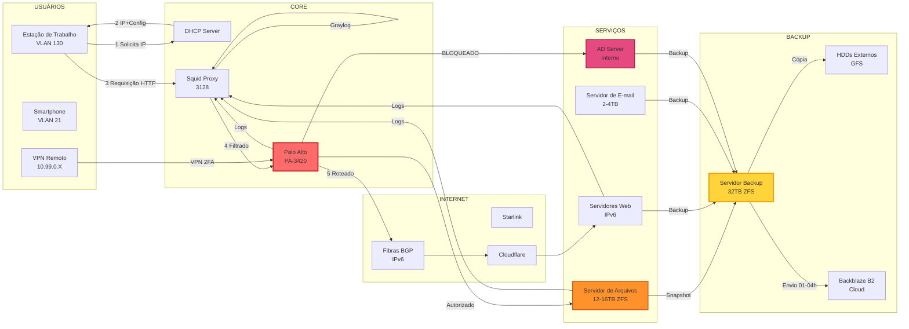
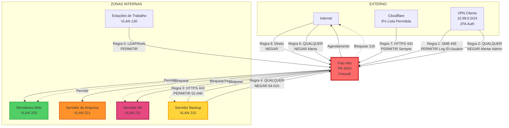
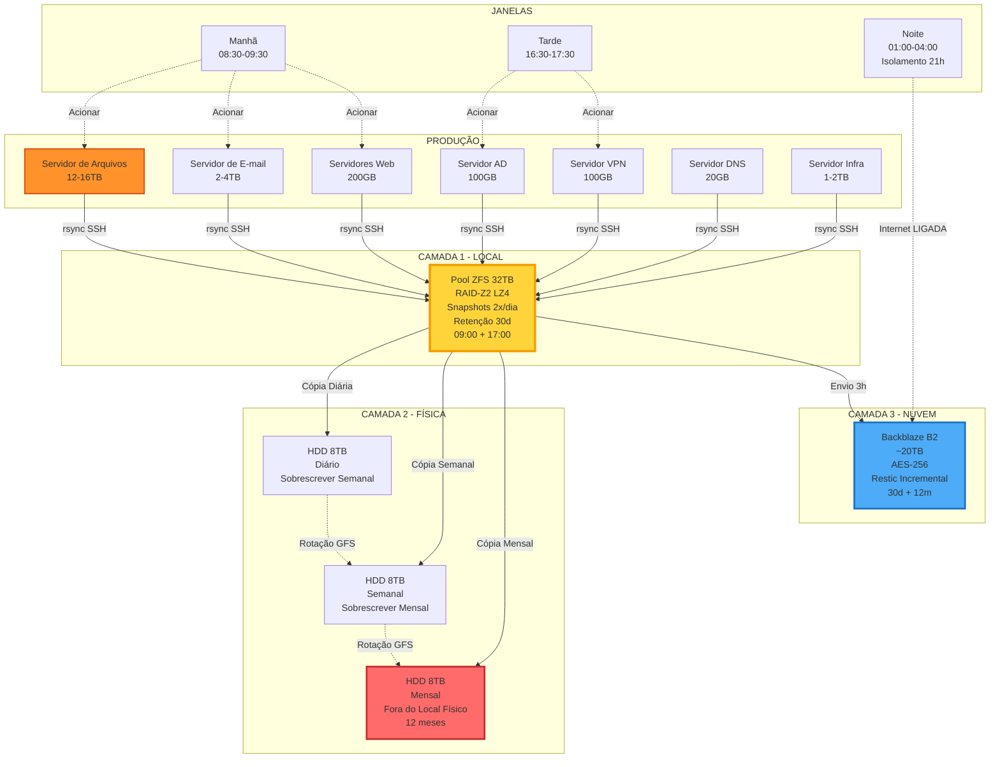
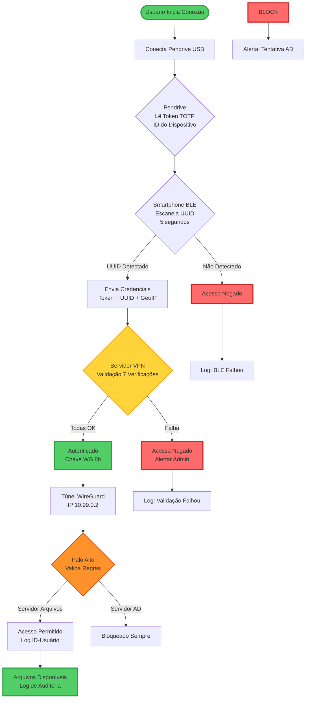

# 📊 Documentação de Infraestrutura de Rede e Servidores

**Versão:** 1.0  
**Data:** 2026-01-03  
**Responsável:** Equipe de TI  
**Status:** Arquitetura Aprovada para Implementação

---

## 📑 Índice

1. [Visão Geral](#visão-geral)
2. [Conectividade e BGP](#conectividade-e-bgp)
3. [Firewall e Roteamento](#firewall-e-roteamento)
4. [Endereçamento IP](#endereçamento-ip)
5. [VLANs e Segmentação](#vlans-e-segmentação)
6. [Servidores](#servidores)
7. [Backup e Disaster Recovery](#backup-e-disaster-recovery)
8. [VPN e Acesso Remoto](#vpn-e-acesso-remoto)
9. [Segurança](#segurança)
10. [Diagramas Topológicos](#diagramas-topológicos)
11. [Custos Estimados](#custos-estimados)
12. [Procedimentos Operacionais](#procedimentos-operacionais)

---

## 🌐 Visão Geral

### Objetivos da Infraestrutura

- **Alta Disponibilidade:** Redundância de links (BGP multihoming 2 ISPs + Starlink backup)
- **Segurança em Camadas:** Isolamento VLANs, firewall granular, autenticação 2FA hardware
- **Escalabilidade Futura:** IPv6 nativo, ASN próprio, bloco /48 LACNIC, hardware modular
- **Resiliência Total:** Backup 3-2-1 (local + físico + cloud), failover automático BGP
- **Rastreabilidade Completa:** Logs centralizados Graylog, auditoria User-ID, compliance

### Princípios de Design

1. **Separação por Função:** Serviços críticos em hardware dedicado (VPN, Backup, Servidor de Arquivos)
2. **Zero Trust Architecture:** Nenhum acesso implícito, validação obrigatória em cada camada
3. **Defense in Depth:** Múltiplas camadas de segurança sobrepostas
4. **IPv6 First:** Todos servidores públicos com IPv6 fixo do bloco próprio
5. **Automação Máxima:** Processos automatizados (backup, failover, monitoramento, alertas)
6. **Hardware Isolado por Criticidade:** Backup, VPN e Servidor de Arquivos em hardware próprio

### Filosofia de Segurança

**Air-Gap Lógico:**
- Servidor Backup isolado 21 horas/dia (apenas 3h janela upload cloud)
- Firewall Baseado em agendamento controla acesso temporal
- Zero acesso inbound ao servidor backup (exceto admin único)

**Isolamento por Criticidade:**
- Servidor AD:  ZERO acesso externo (nem via VPN autenticada)
- Servidor de Arquivos: Acesso apenas VPN 2FA + estações de trabalho internas
- Servidor Backup:  Pull model (servidores conectam nele, não o contrário)

**Rastreabilidade:**
- Logs User-ID identificam QUEM acessou (nome + IP + dispositivo)
- Graylog centraliza todos logs (firewall, proxy, servidores, DHCP)
- Auditoria completa para compliance

---

## 🔌 Conectividade e BGP

### Links de Internet

| Link         | Tipo     | Velocidade   | Latência Típica | Função              | IPv6       | Status Padrão |
| ------------ | -------- | ------------ | --------------- | ------------------- | ---------- | ------------- |
| **Fibra 1**  | Dedicado | 1 Gbps       | 15-30 ms        | Primário            | BGP Nativo | Ativo         |
| **Fibra 2**  | Dedicado | 1 Gbps       | 20-35 ms        | Secundário/Failover | BGP Nativo | Em espera     |
| **Starlink** | Satélite | 100-200 Mbps | 40-80 ms        | Emergencial         | NAT        | Desconectado  |

### Sistema Autônomo BGP

**Informações Registro:**
- **ASN:** AS26XXXX (registrado LACNIC - Brasil)
- **Bloco IPv6:** 2801:1234:5678::/48 (público roteável global)
- **Organização:** Registrada como pessoa jurídica
- **Contatos:** NOC, Abuse, Technical (registrados LACNIC)

**Anúncio BGP:**
- **Prefixo Anunciado:** /48 (único bloco, não fragmentado)
- **Peers:** 2 ISPs diferentes (multihoming)
- **Política:** Anunciar apenas 2801:1234:5678::/48 (filtro proteção route leak)

**Peering:**

| Peer   | ISP     | ASN Upstream | IPv6 Peer Address      | Local Preference | Função       |
| ------ | ------- | ------------ | ---------------------- | ---------------- | ------------ |
| Peer 1 | Fibra 1 | AS12345      | 2804:ISP1: TRANSIT:: 1 | 200              | Preferencial |
| Peer 2 | Fibra 2 | AS67890      | 2801:ISP2:TRANSIT:: 1  | 100              | Backup       |

**Local Preference** determina preferência saída:
- 200 (Fibra 1): Tráfego outbound prefere Fibra 1
- 100 (Fibra 2): Usado apenas se Fibra 1 falhar

### Cenários de Failover

#### Modo Normal (Operação Padrão)
**Status:**
- ✅ Fibra 1: Ativa, BGP Established, 100% tráfego
- ✅ Fibra 2: Em espera, BGP Established, sem tráfego
- ❌ Starlink: Desconectado

**Características:**
- Latência: 15-30 ms
- NAT:  Desabilitado (IPv6 público direto)
- Roteamento global: 2801:1234:5678::/48 via AS12345

#### Failover Fibra 1 → Fibra 2
**Detecção:**
- Temporizador de Espera BGP expira (~90 segundos)
- Palo Alto detecta par inativo
- Remove rotas via Fibra 1 da tabela

**Convergência:**
- Tempo: 30-90 segundos (convergência BGP)
- Ação: BGP converge para Fibra 2 automaticamente
- Upstream: ASN propagam mudança globalmente

**Impacto:**
- Tempo de inatividade: ~60 segundos (interrupção breve)
- Sessões TCP: Algumas podem cair (dependem de tempo limite)
- Usuários:  Reconectam automaticamente

**Status Final:**
- ❌ Fibra 1: Down, BGP Ocioso
- ✅ Fibra 2: Ativa, 100% tráfego
- ❌ Starlink: Desconectado

#### Modo Desastre (Ambas Fibras Down)
**Detecção:**
- Ambos pares BGP inativos
- Rotas BGP removidas globalmente
- Palo Alto ativa rota estática backup (Starlink)

**Ações Automáticas:**
1. Palo Alto habilita NAT de Origem para Starlink
2. Tráfego de saída com NAT para IP Starlink
3. IPv6 público inacessível globalmente (BGP apagado)
4. Túnel Cloudflare assume (já ativo em espera)

**Serviços Afetados:**
- ❌ IPv6 Direto:  Inacessível (BGP removido global)
- ✅ Sites HTTP/HTTPS: Funcionam via Cloudflare Tunnel
- ❌ Email de Entrada: Temporariamente indisponível (MX inacessível)
- ✅ VPN: Funciona via Starlink (WireGuard sobre NAT)
- ✅ Servidor de Arquivos: Acessível via VPN

**Tempo Recuperação:**
- Sites públicos: ~5 minutos (Cloudflare detecta e assume)
- Email de entrada: Depende fibras voltarem (fila ISP remetente)
- Acesso VPN:  Imediato (Starlink ativo)

### Integração Cloudflare

**Funções:**
- **Proxy Reverso:** HTTP/HTTPS com DDoS protection e WAF
- **Túnel Permanente:** Sempre ativo em espera, assume em desastre
- **DNS Autoritativo:** Gerencia zona pública empresa. com. br

**Configuração DNS Cloudflare:**
- Registros A/AAAA: **Proxied** (ícone laranja)
- IPs retornados: IPs Cloudflare (não seu real)
- Túnel: Conexão outbound servidor → Cloudflare (sempre ativa)
- Failover: Verificação de saúde detecta IPv6 down, Túnel assume

**Lista de permissões do Firewall:**
- Apenas IPs Cloudflare acessam Servidores Web
- Ranges IPv6 Cloudflare mantidos em address group
- Acesso direto por IP:  BLOQUEADO (força via Cloudflare)

**Vantagens:**
- IP real nunca exposto (não aparece em DNS público)
- DDoS absorvido por Cloudflare (não chega em você)
- WAF protege aplicações web
- Cache acelera carregamento
- Túnel funciona sobre NAT (modo desastre Starlink)

---

## 🔥 Firewall e Roteamento

### Palo Alto PA-3420

**Especificações Técnicas:**
- **Taxa de transferência Firewall:** 3.8 Gbps
- **Taxa de transferência Threat Prevention:** 2.2 Gbps (IDS/IPS + Antivirus)
- **Conexões Simultâneas:** 500. 000
- **Novas Conexões/seg:** 80.000

**Interfaces Físicas:**
- **ethernet1/1:** WAN Fibra 1 (IPv6: 2801:1234:5678:0203:: 10/64)
- **ethernet1/2:** WAN Fibra 2 (IPv6 do ISP)
- **ethernet1/3:** WAN Starlink (backup emergencial)
- **ethernet1/4:** Trunk 802.1Q (25+ VLANs, todas sub-interfaces)

**Licenças Ativas:**
- ✅ Prevenção de Ameaças (IDS/IPS, antivirus, anti-spyware, vulnerability protection)
- ✅ Filtragem de URL (categorização e bloqueio sites)
- ✅ WildFire (isolamento de malware em nuvem Palo Alto)
- ❌ GlobalProtect (não utilizado - VPN via WireGuard separado)

### Zonas de Segurança

| Zona           | VLANs Inclusas | Descrição                            | Nível Confiança |
| -------------- | -------------- | ------------------------------------ | --------------- |
| **WAN**        | -              | Internet (3 links)                   | Não confiável       |
| **GERENCIAMENTO** | 1              | Comutadores, Pontos de Acesso, infra física | Alta Confiança      |
| **HOME**       | 10-29          | Dispositivos domésticos              | Média Confiança    |
| **CORP**       | 130-139        | Estações de trabalho, impressoras, câmeras | Alta Confiança      |
| **INFRA**      | 211            | AD, DHCP/Proxy/Logs, VPN             | Crítico         |
| **SERVIDORES** | 201, 203       | DNS, Servidores Web                  | Crítico         |
| **BACKUP**     | 215            | Servidor backup (isolado air-gap)    | Crítico         |
| **FILE-EMAIL** | 221            | Servidor de Arquivos, Servidor de Email            | Crítico         |
| **VPN-USERS**  | -              | Clientes VPN remotos (10. 99.0.0/24) | Autenticado     |

### Políticas de Firewall Críticas

#### 1. VPN → Servidor de Arquivos (Permitido com Rastreamento)
- **Zona de Origem:** VPN-USERS
- **Origem:** 10.99.0.0/24 (todos usuários VPN)
- **Zona de Destino:** FILE-EMAIL
- **Destino:** 10.30.221.10 (Servidor de Arquivos)
- **Serviço:** SMB (TCP 445)
- **Aplicação:** ms-ds-smb, ms-ds-smb2
- **Ação:** PERMITIR
- **Perfis:** Antivirus, Anti-Spyware (escanear tráfego)
- **ID de Usuário:** Habilitado (registra NOME usuário, não só IP)
- **Registro:** Sim (início e fim sessão)

**Resultado:** Logs identificam "João Silva acessou Servidor de Arquivos via VPN às 14:23"

#### 2. VPN → Servidor AD (BLOQUEADO SEMPRE)
- **Zona de Origem:** VPN-USERS
- **Zona de Destino:** INFRA
- **Destino:** 10.30.211.10 (Servidor AD)
- **Serviço:** QUALQUER
- **Ação:** NEGAR
- **Registro:** Sim + Alertar Administrador (email/SMS)

**Justificativa:** AD = "chave do reino".  Mesmo VPN autenticada 2FA não acessa.  Admin precisa estar fisicamente na rede interna.

#### 3. Servidor Backup → Cloud (Janela Temporal)
- **Zona de Origem:** BACKUP
- **Origem:** 10.30.215.10
- **Zona de Destino:** WAN
- **Serviço:** HTTPS (TCP 443)
- **Aplicação:** web-browsing, ssl
- **Agendamento:** BACKUP-CLOUD-WINDOW (01:00-04:00 diário) ⚠️
- **Ação:** PERMITIR
- **Registro:** Sim

**Objeto de Agendamento:**
- **Nome:** BACKUP-CLOUD-WINDOW
- **Tipo:** Recorrente Diário
- **Horário:** 01:00-04:00 (3 horas)

**Resultado:**
- 01:00-04:00: Internet habilitada (upload Backblaze B2)
- 04:00-01:00: Internet BLOQUEADA (air-gap 21 horas/dia = 87. 5% tempo)

**Proteção:**
- Ransomware não exfiltra dados (sem Internet 21h)
- Atacante não baixa ferramentas adicionais
- Servidor isolado máximo possível

#### 4. Internet → Servidor Backup (BLOQUEADO TOTAL)
- **Zona de Origem:** WAN
- **Zona de Destino:** BACKUP
- **Destino:** 10.30.215.10
- **Serviço:** QUALQUER
- **Ação:** NEGAR
- **Registro:** Sim + Alerta Segurança (tentativa = suspeita)

**Exceção ÚNICA (Admin):**
- **Origem:** 10.99.0.2/32 (IP VPN admin específico - apenas 1 pessoa)
- **Serviço:** SSH (TCP 22), HTTPS (TCP 443)
- **Ação:** PERMITIR
- **Registro:** Sim (auditoria)

#### 5. Servidores Produção → Backup (Janela Backup)
- **Zona de Origem:** INFRA, SERVIDORES, FILE-EMAIL
- **Origem:** 10.30.211.0/24, 10.30.201.0/24, 10.30.203.0/24, 10.30.221.0/24
- **Zona de Destino:** BACKUP
- **Destino:** 10.30.215.10
- **Serviço:** SSH (TCP 22 - rsync over SSH)
- **Agendamento:** BACKUP-WINDOWS (08:30-09:30, 16:30-17:30 diário)
- **Ação:** PERMITIR
- **Registro:** Sim

**Modelo Pull:** Servidores conectam NO backup (não o contrário). Mais seguro.

#### 6. Backup → Servidores (BLOQUEADO - Anomalia)
- **Zona de Origem:** BACKUP
- **Zona de Destino:** INFRA, SERVIDORES, FILE-EMAIL
- **Serviço:** QUALQUER
- **Ação:** NEGAR
- **Registro:** Sim + Alerta Crítico (comportamento anômalo)

**Razão:** Servidor backup NÃO deve iniciar conexões.  Se tentar = possível comprometimento.

#### 7. Cloudflare → Servidores Web (Lista de Permissões)
- **Zona de Origem:** WAN
- **Origem:** Cloudflare-IPv6-Ranges (grupo de endereços atualizado)
- **Zona de Destino:** SERVIDORES
- **Destino:** 2801:1234:5678:0203::/64
- **Serviço:** HTTPS (TCP 443)
- **Ação:** PERMITIR
- **Perfis:** Prevenção de Ameaças, Filtragem de URL
- **Registro:** Sim

**Regra Complementar (Bloqueia Outros):**
- **Origem:** QUALQUER (exceto Cloudflare)
- **Destino:** 2801:1234:5678:0203::/64
- **Serviço:** HTTPS
- **Ação:** NEGAR
- **Registro:** Sim (detectar tentativas de contorno)

**Resultado:** TODO tráfego web forçado via Cloudflare.  Acesso direto IP = bloqueado.

#### 8. Internet → Servidores Críticos (BLOQUEADO)
- **Zona de Origem:** WAN
- **Zona de Destino:** FILE-EMAIL, INFRA
- **Destino:** 10.30.221.10 (Arquivos), 10.30.221.20 (Email), 10.30.211.10 (AD)
- **Serviço:** QUALQUER
- **Ação:** NEGAR
- **Registro:** Sim

**Justificativa:** File, Email, AD NUNCA expostos diretamente. Acesso via VPN ou rede interna apenas.

### Políticas de NAT

#### Modo Normal (BGP Ativo)
**Regra:** SEM-NAT-IPV6
- **Aplicação:** Servidores com IPv6 público
- **Origem:** 2801:1234:5678::/48
- **Tradução:** NENHUMA (usa endereço real)

**Justificativa:** IPv6 público não precisa NAT. Endereço de origem preservado ponto a ponto.

#### Modo Desastre (Starlink)
**Regra:** SNAT-STARLINK-EMERGENCIAL
- **Origem:** 10.0.0.0/8, 2801:1234:5678::/48 (todas redes)
- **Interface de Saída:** ethernet1/3 (Starlink)
- **Tradução:** IP Dinâmico (endereço da interface)
- **Prioridade:** 3 (baixa - usado apenas se rotas BGP ausentes)

**Funcionamento:** Origem com NAT para IP Starlink. IPv6 traduzido para IPv4/IPv6 Starlink (CGNAT).

### Roteamento

**Roteador Virtual:** default

**Rotas BGP (Aprendidas Dinamicamente):**

| Destino | Via                   | Protocolo | Preferência Local | Métrica | Estado            |
| ------- | --------------------- | -------- | ---------- | ------ | ----------------- |
| : :/0   | 2804:ISP1:TRANSIT:: 1 | BGP      | 200        | 100    | Ativa (Fibra 1)   |
| ::/0    | 2801:ISP2:TRANSIT:: 1 | BGP      | 100        | 100    | Em espera (Fibra 2) |

**Rotas Estáticas (Backup):****

| Destino        | Via                    | Admin Distance | Metric | Status                |
| -------------- | ---------------------- | -------------- | ------ | --------------------- |
| : :/0          | ethernet1/3 (Starlink) | 250            | 250    | Inativa (BGP prefere) |
| 10.99.0.0/24   | 10.30.211.50 (VPN)     | 10             | 10     | Ativa                 |
| 10.30.215.0/24 | ethernet1/4. 215       | -              | -      | Connected             |

**Distância Admin 250:** Muito baixa prioridade. Rota Starlink só ativa se rotas BGP sumirem.

---

## 🔢 Endereçamento IP

### Esquema IPv4 (RFC1918 - Privado)

**Formato Padronizado:**
```
10.PISO.VLAN.HOST

PISO = Andar físico (20 = piso 2, 30 = piso 3)
VLAN = ID da VLAN
HOST = Dispositivo (. 1 = gateway, .10-99 = fixos, .100+ = DHCP)
```

**Exemplos Práticos:**

| VLAN | Descrição             | Rede IPv4      | Gateway     | IPs Fixos       | Grupo DHCP        |
| ---- | --------------------- | -------------- | ----------- | --------------- | ----------------- |
| 20   | Home-WiFi (Piso 2)    | 10.20.20.0/24  | 10.20.20.1  | 10.20.20.10-99  | 10.20.20.100-250  |
| 130  | Estações de trabalho (Piso 3) | 10.30.130.0/24 | 10.30.130.1 | 10.30.130.10-99 | 10.30.130.100-200 |
| 211  | Infra (Piso 3)        | 10.30.211.0/24 | 10.30.211.1 | 10.30.211.10-99 | -                 |
| 215  | Backup (Piso 3)       | 10.30.215.0/24 | 10.30.215.1 | 10.30.215.10    | -                 |
| 221  | File/Email (Piso 3)   | 10.30.221.0/24 | 10.30.221.1 | 10.30.221.10-99 | -                 |

### Esquema IPv6 (Bloco Público LACNIC)

**Formato Padronizado:**
```
2801:1234:5678:00VV::/64

2801:1234:5678 = Prefixo /48 (seu bloco LACNIC - fixo)
00VV = VLAN ID em hexadecimal
/64 = Sub-rede padrão IPv6
```

**Conversão VLAN → Hexadecimal:**

| VLAN Decimal | Hex  | Sub-rede IPv6              | Gateway |
| ------------ | ---- | ------------------------ | ------- |
| 10           | 0x0A | 2801:1234:5678:000A::/64 | ::1     |
| 20           | 0x14 | 2801:1234:5678:0014::/64 | ::1     |
| 130          | 0x82 | 2801:1234:5678:0082::/64 | ::1     |
| 201          | 0xC9 | 2801:1234:5678:00C9::/64 | ::1     |
| 203          | 0xCB | 2801:1234:5678:00CB::/64 | ::1     |
| 211          | 0xD3 | 2801:1234:5678:00D3::/64 | ::1     |
| 215          | 0xD7 | 2801:1234:5678:00D7::/64 | ::1     |
| 221          | 0xDD | 2801:1234:5678:00DD::/64 | ::1     |

**Exemplo Completo VLAN 203 (Servidores Web):**
- Sub-rede: 2801:1234:5678:00CB::/64
- Gateway: 2801:1234:5678:00CB::1 (Palo Alto)
- Web1: 2801:1234:5678:00CB::10 (fixo manual)
- Web2: 2801:1234:5678:00CB::11 (fixo manual)
- Web3: 2801:1234:5678:00CB::12 (fixo manual)

### Alocação de IPs

**Convenção Geral:**
- **. 1** = Gateway (Palo Alto sempre)
- **.2-.9** = Reservado (expansão futura)
- **.10-.99** = IPs fixos manuais (servidores, dispositivos críticos)
- **.100-.250** = Grupo DHCP (dispositivos dinâmicos)
- **.251-.254** = Reservado (broadcast, testes)

---

## 🏢 VLANs e Segmentação

### VLAN 1 - Gerenciamento

**Identificação:**
- **VLAN ID:** 1
- **Nome:** Gerenciamento
- **IPv4:** 10.1.1.0/24
- **IPv6:** 2801:1234:5678:0001::/64

**Dispositivos:**
- Comutadores Principais:  10.1.1.10-20 (IPs fixos)
- Pontos de Acesso UniFi: 10.1.1.30-60 (IPs fixos)
- Grupo DHCP: 10.1.1.100-150 (dispositivos temporários)

**Controle de Acesso:**
- ✅ Admin via VPN (IP específico autorizado)
- ✅ Internet (apenas updates fabricantes)
- ❌ Outras VLANs (isolado por firewall)

**Segurança:**
- Acesso SSH apenas com chave pública (senha desabilitada)
- HTTPS para gestão web (certificado válido)
- SNMP v3 com autenticação (se utilizado)

---

### VLANs Domésticas (Piso 2 - 10.20.X.0/24)

#### VLAN 10 - WiFi Visitantes

**Identificação:**
- **VLAN ID:** 10
- **Nome:** Home-Visitantes-WiFi
- **IPv4:** 10.20.10.0/24
- **IPv6:** 2801:1234:5678:000A::/64

**Características:**
- **Grupo DHCP:** 10.20.10.100-250 (150 IPs)
- **Tempo de concessão:** 2 horas (rotatividade alta visitantes)
- **Isolamento de Cliente:** Habilitado (visitantes não veem uns aos outros)
- **Portal Cativo:** Opcional (termo de uso/aceite)
- **QoS:** Banda limitada 50% do total (prioridade baixa)

**Controle de Acesso:**
- ✅ Internet: HTTP, HTTPS, DNS, NTP apenas
- ❌ Rede interna: TODAS VLANs bloqueadas
- ❌ File Server: Bloqueado
- ❌ Impressoras: Bloqueado
- ❌ Guest → Guest: Bloqueado (client isolation)

**Uso Típico:** Visitantes, convidados, dispositivos não confiáveis

#### VLAN 20 - Home WiFi

**Identificação:**
- **VLAN ID:** 20
- **Nome:** Home-WiFi
- **IPv4:** 10.20.20.0/24
- **IPv6:** 2801:1234:5678:0014::/64

**Características:**
- **Grupo DHCP:** 10.20.20.100-250
- **Tempo de concessão:** 24 horas
- **IPv6:** SLAAC + DHCPv6 Sem Estado (DNS)

**Dispositivos Típicos:**
- Portáteis familiares
- Tablets
- Dispositivos pessoais confiáveis

**Controle de Acesso:**
- ✅ Internet: Acesso completo
- ✅ File Server: Leitura apenas (compartilhamentos públicos)
- ✅ Impressoras (VLAN 131)
- ❌ Servidores críticos (AD, Backup)

#### VLAN 21 - Smartphones

**Identificação:**
- **VLAN ID:** 21
- **Nome:** Home-Smartphones
- **IPv4:** 10.20.21.0/24
- **IPv6:** 2801:1234:5678:0015::/64

**Características:**
- **Grupo DHCP:** 10.20.21.100-250
- **Tempo de concessão:** 12 horas (amigável para roaming)
- **IPv6:** SLAAC + Extensões de Privacidade (amigável para mobile)

**Uso:** Telefones pessoais, tablets móveis

#### VLAN 22 - Smart TVs

**Identificação:**
- **VLAN ID:** 22
- **Nome:** Home-TVs
- **IPv4:** 10.20.22.0/24
- **IPv6:** 2801:1234:5678:0016::/64

**Características:**
- **DHCP Pool:** 10.20.22.100-200
- **Tempo de concessão:** 7 dias (dispositivos estáveis)
- **Reservas DHCP:** Sim (IPs fixos via endereço MAC)

**Exemplo de Reservas:**
- Samsung TV Sala:  MAC aa:bb:cc:dd:ee:01 → 10.20.22.10
- LG TV Quarto: MAC aa:bb:cc:dd:ee:02 → 10.20.22.11

**Controle de Acesso:**
- ✅ Internet: Streaming (Netflix, YouTube, Prime Video)
- ✅ File Server: Media sharing (se Plex/Jellyfin)
- ❌ Outras VLANs
- **QoS:** Alta prioridade (streaming sem buffering)

#### VLAN 23 - IoT (Alexa, Google Home, Lâmpadas)

**Identificação:**
- **VLAN ID:** 23
- **Nome:** Home-IoT
- **IPv4:** 10.20.23.0/24
- **IPv6:** 2801:1234:5678:0017::/64 (maioria não suporta)

**Características:**
- **DHCP Pool:** 10.20.23.100-250
- **Tempo de concessão:** 30 dias (dispositivos sempre ligados)
- **Reservas DHCP:** Sim (IoT beneficia IP fixo)

**Exemplo de Reservas:**
- Alexa Echo Sala: 10.20.23.10
- Google Home Cozinha: 10.20.23.11
- Lâmpadas Philips Hue: 10.20.23.20-30

**Controle de Acesso (CRÍTICO):**
- ✅ Internet: Permitido (cloud APIs fabricantes)
- ❌ File Server: BLOQUEADO TOTAL
- ❌ Servidores: BLOQUEADO TOTAL
- ❌ Estações de trabalho: BLOQUEADO
- ✅ IoT → IoT: Permitido (automações locais)

**Justificativa Isolamento:**
- IoT frequentemente vulnerável (firmware desatualizado)
- Compromisso IoT não propaga para rede crítica
- Defense in depth (mesmo IoT hackeado, isolado)

**Monitoramento:**
- Alertas se IoT tentar acessar VLAN proibida
- Análise de tráfego para detectar anomalias

---

### VLANs Corporativas (Piso 3 - 10.30.1XX.0/24)

#### VLAN 130 - Estações de trabalho

**Identificação:**
- **VLAN ID:** 130
- **Nome:** Corp-Estações-de-trabalho
- **IPv4:** 10.30.130.0/24
- **IPv6:** 2801:1234:5678:0082::/64

**Características:**
- **DHCP Pool:** 10.30.130.100-200
- **IPs Fixos:** 10.30.130.10-99 (estações de trabalho específicas)
- **Tempo de concessão:** 12 horas (renovação durante expediente)

**Opções DHCP:**
- Gateway: 10.30.130.1
- DNS: 10.30.201.10 (DNS interno), 10.30.211.10 (AD integrado)
- WPAD (opção 252): http://10.30.211.30/wpad.dat (proxy auto-config)
- NTP: 200.160.0.8, 201.49.148.135 (NTP. br)
- Domínio:  empresa.local
- WINS: 10.30.211.10 (Servidor AD)

**Controle de Acesso:**
- ✅ Servidor AD: Autenticação LDAP/Kerberos
- ✅ Servidor de Arquivos: SMB (leitura/escrita conforme permissões)
- ✅ Servidor de Email: IMAP/SMTP
- ✅ Impressoras (VLAN 131)
- ✅ Internet via Proxy: Obrigatório (WPAD auto-config)
- ❌ Servidor Backup: Bloqueado (não necessário)

**IPv6:** DHCPv6 Com Estado (controle) OU SLAAC (simplicidade) - definir na implementação

#### VLAN 131 - Impressoras

**Identificação:**
- **VLAN ID:** 131
- **Nome:** Corp-Impressoras
- **IPv4:** 10.30.131.0/24
- **IPv6:** 2801:1234:5678:0083::/64

**Características:**
- **DHCP Pool:** 10.30.131.100-150 (apenas temporário)
- **Tempo de concessão:** 30 dias
- **TODAS impressoras:** Reservas DHCP (IPs fixos via MAC)

**Exemplo de Reservas:**
- HP LaserJet Andar 1: MAC aa:bb:cc:dd: ee:20 → 10.30.131.10
- Epson L3150 Andar 2: MAC aa:bb:cc:dd:ee:21 → 10.30.131.11
- Canon MG3610 Andar 3: MAC aa:bb:cc:dd: ee:22 → 10.30.131.12

**Controle de Acesso:**
- ✅ Estações de trabalho (VLAN 130): Impressão permitida
- ✅ Internet: Apenas atualizações de firmware (lista de permissões fabricantes)
- ❌ Servidores: Bloqueado (exceto servidor de impressão se houver)

**IPv6:** Fixo manual preferível (impressoras = configuração estática mais confiável)

**Segurança:**
- SNMP v3 apenas (gestão - v1/v2 desabilitados)
- Interface web:  HTTPS + senha forte (não padrão)
- Firmware atualizado regularmente (vulnerabilidades conhecidas)

#### VLAN 133 - Câmeras de Segurança

**Identificação:**
- **VLAN ID:** 133
- **Nome:** Cameras-Seguranca
- **IPv4:** 10.30.133.0/24
- **IPv6:** 2801:1234:5678:0085::/64

**Características:**
- **DHCP:** Nenhum (todas IPs fixos manuais)
- **IPs Fixos:**
  - Gravador NVR: 10.30.133.10
  - Câmeras: 10.30.133.101-150 (intervalo reservado)

**Dispositivos Exemplo:**
- NVR: 10.30.133.10
- Câmera 1 (Entrada): 10.30.133.101
- Câmera 2 (Garagem): 10.30.133.102
- Câmera 3 (Fundos): 10.30.133.103

**Controle de Acesso (RESTRITO):**
- ✅ NVR → Câmeras:  RTSP/ONVIF (transmissão de vídeo)
- ✅ Estação Segurança (específica): Acesso interface web NVR
- ❌ Internet:  BLOQUEADO TOTAL (exceto NVR se backup em nuvem necessário)
- ❌ Outras VLANs: BLOQUEADO

**Justificativa Isolamento:**
- Câmeras IP frequentemente vulneráveis (firmware defasado)
- Câmera hackeada não deve acessar rede interna
- Segmentação total (compromisso contido)

**Segurança:**
- Senhas fortes (NUNCA padrão de fábrica)
- Firmware atualizado (vulnerabilidades corrigidas)
- Registros de acesso NVR (auditoria)

**IPv6:** Não configurado (câmeras = IPv4-only geralmente)

---

### VLANs Servidores (Piso 3 - 10.30.2XX.0/24)

#### VLAN 201 - Servidor DNS

**Identificação:**
- **VLAN ID:** 201
- **Nome:** DNS
- **IPv4:** 10.30.201.0/24
- **IPv6:** 2801:1234:5678:00C9::/64

**Servidores (IPs Fixos Manuais):**

**DNS Primário:**
- Nome do host: dns01.empresa.local
- IPv4: 10.30.201.10
- IPv6: 2801:1234:5678:00C9:: 10
- Programa:  BIND9 / PowerDNS
- Função: DNS Autoritativo (empresa.local) + Recursivo (encaminhamento)

**DNS Secundário (Opcional):**
- Nome do host: dns02.empresa.local
- IPv4: 10.30.201.11
- IPv6: 2801:1234:5678:00C9::11

**Funções:**
- **DNS Autoritativo:** Zona empresa.local (interna)
- **DNS Recursivo:** Forward para 1.1.1.1, 8.8.8.8
- **DNS Público:** Cloudflare gerencia (delegação externa)

**Controle de Acesso:**
- ✅ Todas VLANs internas: Consultas DNS (UDP/TCP 53)
- ✅ Internet: Encaminhamento de consultas (se recursivo)
- ❌ Internet → DNS: BLOQUEADO (DNS interno não exposto)

**Reserva:** Configurações + zonas → Servidor de Reserva (semanal)

#### VLAN 203 - Servidores Web

**Identificação:**
- **VLAN ID:** 203
- **Nome:** Servidores-Web
- **IPv4:** 10.30.203.0/24
- **IPv6:** 2801:1234:5678:00CB::/64

**Servidores (IPs Fixos Manuais):**

**Servidor Web 1:**
- Nome do host:  web01.empresa.local
- IPv4: 10.30.203.10
- IPv6: 2801:1234:5678:00CB::10 (público roteável)
- Pilha:  Nginx + Node.js
- Sites: app.empresa.com. br, api.empresa.com.br

**Servidor Web 2:**
- Nome do host: web02.empresa.local
- IPv4: 10.30.203.11
- IPv6: 2801:1234:5678:00CB::11
- Pilha: Apache + PHP
- Sites: site2.empresa.com.br

**Integração Cloudflare:**
- DNS:  Proxied (A/AAAA apontam para IPs Cloudflare, não reais)
- Túnel: Sempre ativo (em espera)
- Firewall: Lista de permissões apenas IPs Cloudflare

**Controle de Acesso:**
- ✅ Cloudflare IPs: HTTP/HTTPS permitido
- ✅ Servidor de Backup: Sincronização durante janela backup
- ❌ Acesso direto por IP: BLOQUEADO (força via Cloudflare)

**SSL/TLS:**
- Certificados:  Let's Encrypt (wildcard *.empresa.com.br)
- Renovação: Automática (certbot + cron)
- Protocolos: TLS 1.2+ apenas (1.0/1.1 desabilitados)

**Backup:**
- Código: Repositório Git (versionamento)
- Banco de dados:  Despejo diário → Servidor Backup
- Recursos: Sincronização diária → Servidor Backup

#### VLAN 211 - Infra (AD + DHCP/Proxy/Logs + VPN)

**Identificação:**
- **VLAN ID:** 211
- **Nome:** Infra
- **IPv4:** 10.30.211.0/24
- **IPv6:** 2801:1234:5678:00D3::/64

**Servidores Nesta VLAN:**

---

**1. Servidor AD (Active Directory)**

**Identificação:**
- Nome do host: ad01.empresa.local
- IPv4: 10.30.211.10
- IPv6: 2801:1234:5678:00D3::10
- SO: Windows Server 2022
- Funções: AD DS, DNS integrado AD

**Domínio:**
- Nome: empresa.local
- Nível funcional: Windows Server 2016

**Controle de Acesso (CRÍTICO):**
- ✅ Estações de trabalho (VLAN 130): Autenticação LDAP/Kerberos
- ✅ Servidores internos: Integração LDAP (se necessário)
- ✅ Internet: APENAS Windows Update (lista de permissões Microsoft)
- ❌ VPN: BLOQUEADO TOTAL (mesmo autenticada 2FA)
- ❌ Home VLANs: BLOQUEADO

**Justificativa Isolamento AD:**
- AD = "chave do reino" (controle total rede se comprometido)
- Mesmo VPN 2FA não acessa (segurança máxima)
- Admin precisa estar FISICAMENTE na rede interna
- Compromisso AD = fim do jogo (atacante controla tudo)

**Backup:** Diário (Estado do Sistema + dados) → Servidor Backup

---

**2. Servidor Infra (Múltiplas funções:  DHCP + Proxy + Logs)**

**Identificação:**
- Nome do host: infra01.empresa.local
- IPv4: 10.30.211.30
- IPv6: 2801:1234:5678:00D3::30
- SO: Ubuntu Server 24.04 LTS

**Hardware:**
- CPU: 6 cores / 12 threads
- RAM:  16 GB DDR4
- Disco 1: 256 GB SSD (SO + apps)
- Disco 2: 2 TB SSD (logs Graylog)
- Rede: 1 Gbps

**Serviços Integrados:**

**a) Servidor DHCP:**
- Programa: ISC DHCP (dhcpd + dhcpd6)
- Protocolo: DHCPv4 + DHCPv6
- Escopos: 25+ VLANs (via revezamento DHCP Palo Alto)
- Opção 252: WPAD (configuração automática de proxy)

**b) Squid Proxy:**
- Portas: 3128 (HTTP), 3129 (HTTPS)
- Cache: 50 GB disco, 512 MB RAM
- Filtro: SquidGuard (categorias de sites)
- Configuração automática:  WPAD via DHCP opção 252

**c) Graylog (Centralização Logs):**
- Porta Web: 9000 (interface gestão)
- Syslog: UDP 514, TCP 514, TLS 6514
- GELF: TCP 12201 (Graylog Extended Log Format)
- Armazenamento: 1-2 TB (/var/lib/elasticsearch)
- Retenção: 30-90 dias (configurável por tipo log)

**Entradas Graylog:**
- Palo Alto Firewall (syslog)
- Squid Proxy (syslog local4)
- Servidores Linux (rsyslog)
- DHCP (syslog local6)

**Fluxos Graylog:**
- Firewall (facilidade local0)
- Proxy (facilidade local4)
- DHCP (facilidade local6)
- Servidores (facilidade local7)

**Backup:** 2x/dia → Servidor Backup

---

**3. Servidor VPN (WireGuard)**

**Identificação:**
- Nome do host: vpn01.empresa.local
- IPv4: 10.30.211.50
- IPv6: 2801:1234:5678:00D3::50
- SO: Ubuntu Server 24.04 LTS
- Hardware: Máquina virtual dedicada em hardware isolado

**Configuração VPN:**
- Programa: WireGuard
- Interface: wg0
- Endereço: 10.99.0.1/24 (gateway túnel VPN)
- Porta de Escuta: 51820 (UDP)

**Autenticação:** 2FA Hardware (Token Pendrive + Sinalizador BLE)

**Acesso VPN Permite:**
- ✅ Servidor de Arquivos (VLAN 221) - SMB
- ✅ Estações de trabalho (VLAN 130) - RDP/SSH
- ✅ Servidores Web (gestão) - HTTPS
- ❌ Servidor AD - BLOQUEADO SEMPRE
- ❌ Servidor Backup - BLOQUEADO (exceto admin único específico)

#### VLAN 215 - Servidor de Backup (Air-Gap Lógico) ⚠️

**Identificação:**
- **VLAN ID:** 215
- **Nome:** Backup-Server
- **IPv4:** 10.30.215.0/24
- **IPv6:** 2801:1234:5678:00D7::/64

**Servidor (Único Nesta VLAN):**

**Identificação:**
- Nome do host: backup01.empresa.local
- IPv4: 10.30.215.10
- IPv6: 2801:1234:5678:00D7::10
- SO: Ubuntu Server 24.04 LTS + ZFS

**Hardware:**
- CPU: 4 cores
- RAM: 16 GB
- Grupo de Armazenamento ZFS: 
  - 6x HDD 8TB (RAID-Z2 - tolera 2 falhas)
  - Usável: ~32 TB
  - Compressão: LZ4 (economiza ~30% espaço)
  - Deduplicação: DESLIGADA (RAM insuficiente)

---

**Segurança AIR-GAP LÓGICO:**

⚠️ **CRÍTICO - Isolamento Temporal:**
- **Rede DESABILITADA:** 21 horas por dia (87. 5% do tempo)
- **Internet APENAS:** 01:00-04:00 (3 horas upload cloud)
- **Zero Acesso de Entrada:** Exceto admin único específico via VPN
- **Modelo de Puxação:** Servidores conectam NELE (não o contrário)

**Agendamentos de Firewall (Palo Alto):**

**Agendamento 1:** BACKUP-CLOUD-WINDOW
- Tipo: Recorrente Diário
- Horário: 01:00-04:00

**Agendamento 2:** BACKUP-WINDOWS
- Tipo: Recorrente Diário  
- Horário: 08:30-09:30, 16:30-17:30

**Regras Firewall:**

**1.  NEGAR-ENTRADA-PARA-BACKUP:**
- Origem: QUALQUER
- Destino: 10.30.215.10
- Ação: NEGAR
- Registro: SIM + Alerta
- Exceção: Admin VPN (10.99.0.2/32) - SSH/HTTPS apenas

**2. PERMITIR-SERVIDORES-PARA-BACKUP:**
- Origem: VLANs 201, 203, 211, 221 (servidores)
- Destino: 10.30.215.10
- Serviço: SSH (rsync over SSH)
- Agendamento: BACKUP-WINDOWS (08:30-09:30, 16:30-17:30)
- Ação: PERMITIR

**3. PERMITIR-BACKUP-PARA-CLOUD:**
- Origem: 10.30.215.10
- Destino: WAN
- Serviço: HTTPS (443)
- Agendamento: BACKUP-CLOUD-WINDOW (01:00-04:00)
- Ação: PERMITIR

**4. NEGAR-BACKUP-PARA-SERVIDORES:**
- Origem: 10.30.215.10
- Destino:  Qualquer servidor produção
- Ação: NEGAR
- Registro: SIM + Alerta Crítico (comportamento anômalo - possível comprometimento)

**Resultado Isolamento:**
- **01:00-04:00:** Envio para nuvem Backblaze B2
- **04:00-08:30:** Isolado (sem rede)
- **08:30-09:30:** Recebe backups servidores
- **09:30-16:30:** Isolado (sem rede)
- **16:30-17:30:** Recebe backups servidores
- **17:30-01:00:** Isolado (sem rede)

**Total:** 21h isolado (air-gap) de 24h = 87.5% tempo offline

---

**Proteção Ransomware:**
- Air-gap lógico impede exfiltração dados
- Servidor não acessível externamente
- Modelo de puxação (servidor não inicia conexões)
- Snapshots ZFS imutáveis (somente leitura)
- Atacante não consegue alcançar backup mesmo comprometendo prod

**Estratégia de Backup (3 Camadas):**

**Camada 1:** Snapshots ZFS locais
- Frequência: 2x/dia (09:00, 17:00)
- Retenção: 30 dias
- Tecnologia: ZFS snapshots nativos

**Camada 2:** HDDs externos (rotação física)
- Esquema: Avô-Pai-Filho
- HDD 1: Diário (Segunda-Sexta)
- HDD 2: Semanal (4 semanas)
- HDD 3: Mensal (12 meses, fora do local físico)

**Camada 3:** Cloud Backblaze B2
- Frequência:  Diário (02:00 madrugada)
- Ferramenta: restic (criptografia AES-256 no cliente)
- Retenção: 30 diários + 12 mensais
- Envio: Durante janela 01:00-04:00

**Validação Pré-Backup (Automática):**
1. Teste de conexão servidor origem (conectividade)
2. Serviço ativo (SMB, SSH, etc)
3. Sistema de arquivos limpo (sem corrupção)
4. Zero erros E/S (verificação dmesg)
5. Espaço disco suficiente

**SE erro detectado:**
- ❌ ABORTAR backup (não snapshot servidor corrompido)
- 📧 Email + SMS admin
- 📊 Log crítico Graylog

**SE tudo OK:**
- ✅ Prosseguir rsync incremental
- ✅ Criar snapshot ZFS
- ✅ Validar soma de verificação snapshot
- ✅ Log sucesso Graylog

#### VLAN 221 - File Server + Email

**Identificação:**
- **VLAN ID:** 221
- **Nome:** File-Email-Servers
- **IPv4:** 10.30.221.0/24
- **IPv6:** 2801:1234:5678:00DD::/64

**Servidores Nesta VLAN:**

---

**1. Servidor de Arquivos (Armazenamento Compartilhado)****

**Identificação:**
- Nome do host: fileserver01.empresa.local
- IPv4: 10.30.221.10
- IPv6: 2801:1234:5678:00DD::10
- SO: Ubuntu Server 24.04 LTS + ZFS

**Hardware:**
- CPU: 4 cores
- RAM: 8-16 GB (cache ZFS)
- Armazenamento: 5x HDD 4TB (RAID-Z1 = 16 TB usável)
- Efetivo: ~20 TB (com compressão LZ4)
- Rede: 1 Gbps

**Sistema de Arquivos:** ZFS
- Grupo: fileserver-pool
- RAID:  RAID-Z1 (tolera 1 disco falhar)
- Compressão: LZ4 (economiza ~20-30%)
- Snapshots locais:  A cada hora (retenção 24h)
- Deduplicação: DESLIGADA (RAM insuficiente)

**Protocolo:** SMB/CIFS (Samba)

**Compartilhamentos Principais:**
- **/projetos** - Arquivos projetos (rw para grupos específicos)
- **/documentos** - Documentos corporativos
- **/arquivos** - Arquivos gerais
- **/publico** - Leitura pública (visitante ok)

**Controle de Acesso:**
- ✅ VPN 2FA: Permitido (logs identificam usuário específico)
- ✅ Workstations (VLAN 130): Permitido (autenticação AD)
- ✅ Home WiFi (VLAN 20): Leitura apenas (shares públicos)
- ❌ Internet direto: BLOQUEADO TOTAL (firewall)
- ❌ Guest WiFi (VLAN 10): BLOQUEADO

**Segurança:**
- Autenticação:  LDAP (integração AD)
- Snapshots locais:  Hourly (restore rápido < 5 min)
- Backup remoto: 2x/dia → Servidor Backup
- Antivírus: ClamAV (scan periódico)
- Logs: Auditoria completa (quem acessou qual arquivo)

**Recovery Objectives:**
- RPO (Recovery Point Objective): 30 minutos
- RTO (Recovery Time Objective): 1 hora

---

**2. Servidor de Email (Correio Eletrônico)****

**Identificação:**
- Nome do host: mail01.empresa.local
- IPv4: 10.30.221.20
- IPv6: 2801:1234:5678:00DD::20
- SO: Ubuntu Server 24.04 LTS

**Hardware:**
- CPU: 4 cores
- RAM: 8 GB
- Armazenamento: 2x HDD 4TB (RAID 1 = 4 TB usável)
- Rede: 1 Gbps

**Pilha de Programas:**
- MTA (envio): Postfix (SMTP)
- MDA (entrega): Dovecot (IMAP/POP3)
- Anti-Spam: SpamAssassin + Rspamd
- Antivirus: ClamAV
- Webmail: Roundcube (opcional)

**Portas de Serviço:**
- SMTP Submissão: 587 (STARTTLS obrigatório)
- IMAP SSL: 993
- POP3 SSL: 995
- Webmail HTTPS: 443

**Registros DNS (MX):**
- Primário: empresa.local. IN MX 10 mail01.empresa.local.
- Backup: empresa.local. IN MX 20 backup-mx.cloudflare.com.

**Controle de Acesso:**
- ✅ Workstations (VLAN 130): IMAP/SMTP
- ✅ VPN:  Acesso remoto email permitido
- ✅ Internet:  SMTP outbound (envio emails)
- ❌ Internet Inbound direto: BLOQUEADO (MX via relay ou interno)

**Cotas por Usuário:**
- Padrão: 5 GB/usuário
- Administradores: 10 GB/usuário
- Listas/grupos:  Sem cota

**Backup:**
- Frequência: 2x/dia → Servidor Backup
- Retenção servidor prod:  Ilimitada (gerenciada por usuário)
- Retenção backup: 90 dias

**Alternativa Considerada:**
- Migração Google Workspace / Microsoft 365
- Custo: R$ 25-50/usuário/mês
- Armazenamento:  Ilimitado (praticamente)
- Decisão: Servidor próprio se < 20 usuários, nuvem se > 20

---

## 🖥️ Servidores

### Resumo Consolidado

| Servidor   | Nome do Host               | IPv4         | IPv6              | VLAN | Função Principal      | SO      | Hardware     |
| ---------- | -------------------------- | ------------ | ----------------- | ---- | --------------------- | ------- | ------------ |
| **AD**     | ad01.empresa.local         | 10.30.211.10 | 2801:...:00D3::10 | 211  | Active Directory      | Win2022 | 4c/8GB/256GB |
| **Infra**  | infra01.empresa.local      | 10.30.211.30 | 2801:...:00D3::30 | 211  | DHCP+Proxy+Logs       | Ubuntu  | 6c/16GB/2TB  |
| **VPN**    | vpn01.empresa.local        | 10.30.211.50 | 2801:...:00D3::50 | 211  | WireGuard 2FA         | Ubuntu  | 4c/4GB/50GB  |
| **Backup** | backup01.empresa.local     | 10.30.215.10 | 2801:...:00D7::10 | 215  | Backup ZFS (air-gap)  | Ubuntu  | 4c/16GB/32TB |
| **File**   | fileserver01.empresa.local | 10.30.221.10 | 2801:...:00DD::10 | 221  | File Server SMB       | Ubuntu  | 4c/16GB/16TB |
| **Email**  | mail01.empresa.local       | 10.30.221.20 | 2801:...:00DD::20 | 221  | Mail Server           | Ubuntu  | 4c/8GB/4TB   |
| **DNS**    | dns01.empresa.local        | 10.30.201.10 | 2801:...:00C9::10 | 201  | DNS interno/recursivo | Ubuntu  | 2c/4GB/128GB |
| **Web1**   | web01.empresa.local        | 10.30.203.10 | 2801:...:00CB::10 | 203  | Web Server público    | Ubuntu  | 4c/8GB/256GB |
| **Web2**   | web02.empresa.local        | 10.30.203.11 | 2801:...:00CB::11 | 203  | Web Server público    | Ubuntu  | 4c/8GB/256GB |

*(Abreviação: ...  = 1234: 5678)*

### Dimensionamento de Armazenamento

| Servidor                  | Dados Atuais Estimados | Crescimento Anual | Provisionado          | Tecnologia           | Justificativa                           |
| ------------------------- | ---------------------- | ----------------- | --------------------- | -------------------- | --------------------------------------- |
| **File Server**           | 12-16 TB               | ~2-3 TB           | 16 TB (20 TB efetivo) | ZFS RAID-Z1 (5x 4TB) | Projetos volumosos, histórico acumulado |
| **Email Server**          | 2-4 TB                 | ~500 GB           | 4 TB                  | RAID 1 (2x 4TB)      | Depende nº usuários e retenção          |
| **Servidor Infra (Logs)** | 1-2 TB                 | ~300 GB           | 2 TB                  | SSD                  | Graylog índices volumosos               |
| **Backup Server**         | 20-25 TB               | Proporcional      | 32 TB                 | ZFS RAID-Z2 (6x 8TB) | Todos servidores + retenção 30d         |
| **Web Servers**           | 200 GB                 | ~50 GB            | 256 GB                | SSD                  | Sites + assets                          |
| **Outros**                | < 200 GB               | Mínimo            | 128-256 GB            | SSD                  | DNS, VPN, AD                            |

**Observação Armazenamento File Server:**
- Estimativa inicial 2TB considerada "ridiculamente pequena" (experiência real)
- Provisionado 16TB usável (~20TB efetivo com compressão)
- Permite crescimento 3-5 anos sem atualização
- Projetos design/vídeo/CAD consomem rapidamente

**Observação Armazenamento Email:**
- Altamente variável (depende nº usuários, retenção, anexos)
- Requer análise durante implementação: 
  - Quantos usuários? (10, 50, 100?)
  - Retenção? (1 ano, 5 anos, infinito?)
  - Quotas? (1GB, 5GB, 10GB por usuário?)

**Observação Armazenamento Logs (Infra):**
- Volume depende quantidade dispositivos e retenção
- Firewall Palo Alto = mais volumoso (~2-5 GB/dia)
- Proxy = médio (~500 MB/dia)
- DHCP = leve (~10 MB/dia)
- Provisionado 2TB permite 30-90 dias retenção confortável

### Justificativa Hardware Separado vs Consolidado

**Servidores em Hardware Dedicado (Isolamento Físico):**

**VPN Server:**
- **Razão:** Segurança (isolamento físico)
- **Benefício:** Desempenho previsível (túnel não compete recursos com outros serviços)
- **Risco Mitigado:** Comprometimento VPN não propaga para outros serviços

**Backup Server:**
- **Razão:** Falha física isolada (servidor prod pega fogo ≠ perde backup)
- **Benefício:** Snapshot confiável (não corrompido se origem corromper)
- **Risco Mitigado:** Ransomware não propaga (air-gap + hardware separado)

**File Server:**
- **Razão:** Dados críticos business (projetos = core business)
- **Benefício:** Desempenho I/O previsível (ZFS intensivo disco)
- **Risco Mitigado:** Falha hardware não afeta outros serviços


**Servidor Consolidado (Multi-função Eficiente):**

**Servidor Infra (DHCP + Proxy + Logs):**
- **Razão:** Serviços complementares (picos recursos não coincidem)
- **DHCP:** Pico manhã/tarde (PCs ligando), depois ocioso
- **Proxy:** Uso constante ao longo do dia (navegação distribuída)
- **Logs:** I/O disco constante, CPU/RAM moderado
- **Resultado:** Hardware bem utilizado (CPU/RAM não ociosos, recursos otimizados)

**Vantagens Consolidação:**
- ✅ Economia hardware (3 servidores em 1)
- ✅ Gestão simplificada (1 sistema para manter)
- ✅ Recursos compartilhados eficientemente
- ✅ Backup único (1 servidor para fazer backup)

**Desvantagens Consolidação:**
- ❌ Falha única afeta 3 serviços (maior impacto)
- ❌ Recursos limitados (crescimento precisa considerar 3 serviços)

**Decisão:** Consolidar DHCP+Proxy+Logs justificado por:
- Serviços não críticos isoladamente (tempo de inatividade tolerável)
- Perfis uso complementares (não competem recursos)
- Custo-benefício positivo

---

## 💾 Backup e Disaster Recovery

### Estratégia 3-2-1 (Padrão Indústria)

**Definição:**
```
3 CÓPIAS DE DADOS: 
  1️⃣ Servidor produção (dados originais ao vivo)
  2️⃣ Servidor Backup local (snapshots ZFS)
  3️⃣ HDD externo OU Cloud (fora do local)

2 MÍDIAS DIFERENTES:
  💿 Disco interno servidor backup (ZFS pool)
  💿 HDD externo USB OU Cloud storage

1 CÓPIA FORA DO LOCAL (geograficamente distante):
  ☁️ Nuvem Backblaze B2 (datacenter outro país)
  🏦 OU HDD mensal em cofre banco/outra cidade
```

**Proteção Contra:**
- ✅ Falha disco:  Cópia 2 e 3 disponíveis
- ✅ Ransomware: Cópia fora do local imune (desconectada ou cloud)
- ✅ Desastre físico (incêndio, enchente, roubo): Cópia fora do local preservada
- ✅ Erro humano: Múltiplos pontos no tempo (snapshots)

### Camadas de Backup Detalhadas

#### Camada 1: Snapshots Locais (Servidor de Backup ZFS)

**Servidor:** backup01.empresa.local (10.30.215.10 - VLAN 215)

**Tecnologia:** ZFS Snapshots Nativos

**Pool ZFS:**
```
Nome: backup-pool
Configuração:  RAID-Z2 (6x HDD 8TB)
Capacidade Bruta: 48 TB
Capacidade Usável: ~32 TB (após sobrecarga de RAID)
Compressão: LZ4 (economiza ~30% espaço transparente)
Deduplicação: OFF (requer ~1GB RAM por TB - insuficiente)
```

**Datasets (Separação por Servidor):**
- backup-pool/fileserver (12-16 TB esperado)
- backup-pool/email (2-4 TB)
- backup-pool/infra (1-2 TB logs)
- backup-pool/web (200 GB)
- backup-pool/vpn (100 GB)
- backup-pool/dns (20 GB)
- backup-pool/ad (100 GB)
- backup-pool/configs (10 GB - Palo Alto, switches)

**Frequência Snapshots:**
- **2x por dia:** 09:00 (manhã) + 17:00 (tarde)
- **Justificativa:** RPO = 4 horas máximo (perda de dados limitada)

**Nomenclatura Snapshots:**
```
Formato: @snapshot-YYYY-MM-DD-HH: MM

Exemplos:
- backup-pool/fileserver@snapshot-2026-01-03-09:00
- backup-pool/fileserver@snapshot-2026-01-03-17:00
- backup-pool/email@snapshot-2026-01-03-09:00
```

**Retenção:** 30 dias (limpeza automática)

**Validação Pré-Backup (CRÍTICO - Não Fazer Snapshot de Servidor Corrompido):**

**Lista de Verificação Automática:**
1. ✅ **Conectividade:** Ping servidor origem (3 tentativas, tempo limite 5s)
2. ✅ **Serviço Ativo:** Porta de serviço respondendo (SMB 445, SSH 22, etc)
3. ✅ **Sistema de Arquivos Limpo:** Verificar estado do sistema de arquivos (tune2fs, zpool status)
4. ✅ **Zero Erros E/S:** Verificar dmesg por "I/O error", "corruption"
5. ✅ **Espaço Suficiente:** Disco origem < 90% usado (não cheio)
6. ✅ **Integridade de Dados:** Checksum amostras aleatórias

**SE Qualquer Validação FALHAR:**
- ❌ **ABORTAR Backup** imediatamente (não snapshot servidor corrompido)
- 📧 **E-mail do Administrador:** "Backup do Servidor de Arquivos abortado - sistema de arquivos com erros"
- 📱 **SMS Crítico:** Alerta urgente
- 📊 **Log Graylog:** Severidade CRÍTICA com detalhes do erro
- 🔔 **Tíquete Automático:** Sistema de gestão de incidentes (se configurado)

**SE Todas Validações OK:**
- ✅ **Prosseguir rsync** incremental (apenas arquivos alterados)
- ✅ **Criar snapshot ZFS** (ponto no tempo imutável)
- ✅ **Validar snapshot** criado (checksum, zfs list)
- ✅ **Log de sucesso** Graylog (severidade INFO)
- ✅ **Métricas:** Tempo de execução, tamanho transferido

**Processo Backup (Alto Nível):**
1. Executar validações pré-backup
2. Rsync incremental servidor origem → backup-pool/[servidor]/data/
3. Criar instantâneo ZFS após rsync completo
4. Verificar integridade snapshot
5. Registrar sucesso/falha em logs
6. Notificar se necessário

**Tempo Estimado:** 10-30 minutos (depende mudanças desde último backup)

**Recovery de Snapshot ZFS (Exemplo Prático):**

**Cenário:** Usuário apagou arquivo importante às 14:00

**Procedimento:**
1. Identificar snapshot mais próximo ANTES do problema
   - Lista: backup-pool/fileserver@snapshot-2026-01-03-09:00 (mais recente)
2. Navegar no snapshot (montagem somente leitura automática ZFS)
   - Caminho: /backup-pool/fileserver/.zfs/snapshot/snapshot-2026-01-03-09:00/
3. Localizar arquivo deletado
4. Copiar para área restore
5. Enviar para servidor produção

**RTO (Recovery Time):** ~5-10 minutos  
**RPO (Recovery Point):** 4 horas máximo (último snapshot)

#### Camada 2: HDDs Externos (Rotação Física - Proteção Ransomware)

**Esquema:** Avô-Pai-Filho (GFS)

**HDD 1 - Diário (8TB):****
- **Função:** Backup incremental diário
- **Conectado:** Segunda a Sexta (ou conforme necessário)
- **Processo:**
  1. Conectar HDD USB (auto-mount via udev rules)
  2. Montar em /mnt/backup-external-daily
  3. Rsync /backup-pool/ → /mnt/backup-external-daily/
  4. Verificar integridade (diff -qr sample)
  5. Desmontar com segurança
  6. Desconectar fisicamente
  7. Guardar em cofre/local seguro
- **Rotação:** Sexta-feira 18h desconecta, segunda-feira 08h reconecta
- **Retenção:** 7 dias (overwrite na próxima semana)

**HDD 2 - Semanal (8TB):**
- **Função:** Backup completo semanal
- **Conectado:** Sábado (ou última sexta do mês)
- **Processo:** Similar ao diário, mas backup completo (não incremental)
- **Rotação:** 4 semanas (cada sábado sobrescreve semana 4 atrás)
- **Retenção:** 28 dias

**HDD 3 - Mensal (8TB):**
- **Função:** Backup completo mensal (arquivo longo prazo)
- **Conectado:** Último dia do mês
- **Processo:** Backup completo verificado
- **Rotação:** 12 meses (cada mês sobrescreve mês 12 atrás)
- **Retenção:** 1 ano
- **Armazenamento:** Fora do local físico (cofre banco, casa, outra localização)

**Proteção Ransomware Crítica:**
- ✅ **HDD Desconectado Fisicamente:** Ransomware não alcança (não está na rede)
- ✅ **Air-Gap Físico:** Atacante não consegue criptografar disco offline
- ✅ **Último Recurso:** Se tudo mais falhar, HDD mensal fora do local preserva dados

**Automação:**
- Udev rules:  Auto-mount quando HDD conectado (reconhece por UUID)
- Script: /usr/local/bin/backup-to-external.sh
- Notificação: Som + popup quando pronto desconectar

**Estação de acoplamento:** Hot-swap USB 3.0 (troca fácil HDDs)

#### Camada 3: Nuvem Externa (Backblaze B2)

**Serviço:** Backblaze B2 (S3-compatible)

**Características:**
- **Custo:** $6/TB/mês (~R$ 30/TB)
- **Saída de dados:** Primeiros 3x armazenamento gratuito (depois $0.01/GB)
- **API:** S3-compatible (ferramentas compatíveis)
- **Localização:** Datacenter EUA/Europa (geograficamente distante)

**Ferramenta:** restic (backup criptografado, dedupe, incremental)

**Criptografia:**
- **Tipo:** AES-256-GCM (lado do cliente - antes de enviar)
- **Chave:** Apenas você possui (nuvem não acessa dados)
- **Senha:** 64 caracteres alta entropia (armazenada segura)

**Frequência:** Diário (02:00 madrugada)

**Janela Envio:** 01:00-04:00 (agendamento de firewall permite Internet apenas nestas 3h)

**Modo:** Incremental automático + deduplicação

**Retenção:**
- Snapshots diários: 30 dias
- Snapshots mensais: 12 meses
- Limpeza automática: restic forget (remove antigos)

**Processo:**
1. 01:00 - Firewall habilita Internet servidor backup
2. 02:00 - Restic inicia backup incremental
3. Restic identifica arquivos novos/alterados (dedupe automático)
4. Criptografa lado do cliente (AES-256)
5. Envio para Backblaze B2 (fragmentos paralelos)
6. Verifica integridade (checksums)
7. 04:00 - Firewall desabilita Internet servidor backup
8. Log sucesso/falha Graylog

**Verificação Integridade:** Semanal (domingo 03:00 - restic check)

**Estimativa Custo:**
- Armazenamento:   ~20 TB × R$ 30/TB = R$ 600/mês
- Tráfego de saída:  Gratuito (3x armazenamento) ou mínimo (restauração rara)
- **Total:** ~R$ 600/mês

**Vantagens Cloud:**
- ✅ Fora do local geográfico (protege desastre físico)
- ✅ Sempre disponível (restauração de qualquer lugar com Internet)
- ✅ Versionamento múltiplo (múltiplos pontos no tempo)
- ✅ Criptografado (privacidade garantida)
- ✅ Automatizado (sem intervenção manual)

**Restauração da Nuvem:**
- **Tempo:** 4-24 horas (depende da banda de Internet e tamanho)
- **Custo de tráfego de saída:** Primeiros 60TB gratuitos (3x 20TB armazenamento)
- **Uso:** Último recurso (desastre total local + HDDs perdidos)

### Matriz de Backup por Servidor

| Servidor                | Dados    | Snapshot Local (2x/dia) | HDD Externo (rotação)   | Cloud B2 (diário) | RPO | RTO |
| ----------------------- | -------- | ----------------------- | ----------------------- | ----------------- | --- | --- |
| **File Server**         | 12-16 TB | ✅ 09:00, 17:00          | ✅ Diário/Semanal/Mensal | ✅ 02:00           | 4h  | 1h  |
| **Email Server**        | 2-4 TB   | ✅ 09:00, 17:00          | ✅ Diário/Semanal/Mensal | ✅ 02:00           | 4h  | 2h  |
| **Servidor Infra**      | 1-2 TB   | ✅ 09:00, 17:00          | ✅ Semanal               | ✅ 02:00           | 4h  | 4h  |
| **Web Servers**         | 200 GB   | ✅ 09:00, 17:00          | ✅ Semanal               | ✅ 02:00           | 4h  | 2h  |
| **VPN Server**          | 100 GB   | ✅ 09:00, 17:00          | ✅ Semanal               | ✅ 02:00           | 4h  | 1h  |
| **DNS Server**          | 20 GB    | ✅ Semanal               | ❌ (baixo volume)        | ✅ 02:00           | 7d  | 2h  |
| **AD Server**           | 100 GB   | ✅ 09:00, 17:00          | ✅ Semanal/Mensal        | ✅ 02:00           | 4h  | 4h  |
| **Configs (Palo Alto)** | 10 GB    | ✅ Diário (export)       | ✅ Semanal               | ✅ 02:00           | 1d  | 30m |

**RPO (Recovery Point Objective):** Máxima perda dados tolerável  
**RTO (Recovery Time Objective):** Tempo máximo para restaurar serviço

### Procedimentos de Restauração

#### Restauração Rápida (Snapshot ZFS Local)

**Tempo:** 5-10 minutos  
**Cenário:** Arquivo/pasta deletado recentemente

**Procedimento:**
1. Identificar horário problema (ex: arquivo deletado 14:00)
2. Escolher snapshot anterior (ex: 09:00)
3. Navegar snapshot (caminho: /.zfs/snapshot/nome-snapshot/)
4. Copiar arquivo/pasta
5. Restaurar para servidor produção

#### Restauração Completa (Desastre Total Servidor)

**Tempo:** 4-24 horas (depende método)  
**Cenário:** Servidor pegou fogo, disco perdido total

**Procedimento:**
1. Provisionar novo hardware (ou VM)
2. Instalar SO base (Ubuntu/Windows)
3. Configurar rede (mesmo IP original)
4. Escolher método restore: 

**Método A - ZFS Send/Receive (mais rápido):**
- Tempo: 2-6 horas
- ZFS send via rede (preserva snapshots, dedup, compressão)

**Método B - HDD Externo:**
- Tempo: 4-12 horas
- Conectar HDD, rsync para servidor novo

**Método C - Nuvem (último recurso):**
- Tempo: 12-48 horas (depende da banda)
- Restic restore, depois validar integridade

5. Validar integridade dados restaurados
6. Testar serviço (SMB, IMAP, etc)
7. Restaurar operação normal
8. Documentar incidente (análise pós-incidente)

### Testes de Backup (Essencial)

**Mensal - Teste de Restauração:**
- Selecionar arquivo aleatório backup
- Restaurar para ambiente teste
- Validar integridade (checksum, conteúdo)
- Documentar resultado (passou/falhou)
- **Objetivo:** Garantir que backup realmente funciona

**Trimestral - Simulado de Recuperação de Desastre:**
- Simular perda total de servidor
- Provisionar VM nova
- Restore completo de backup
- Validar TODOS serviços
- Medir tempo total (RTO real)
- Documentar lições aprendidas
- **Objetivo:** Treinar equipe, validar procedimentos

**Anual - Restauração da Nuvem:**
- Restaurar conjunto de dados completo Backblaze B2
- Medir tempo de download
- Validar integridade total
- Medir custo real de tráfego de saída
- Atualizar documentação
- **Objetivo:** Validar que a última linha de defesa funciona

**Importância Testes:**
> "Backup sem teste é Schrödinger's backup - não sabe se funciona até precisar"

---

## 🔐 VPN e Acesso Remoto

### WireGuard VPN

**Servidor:** vpn01.empresa.local (10.30.211.50 - VLAN 211)

**Tecnologia:** WireGuard (nativo do kernel, criptografia moderna)

**Por Que WireGuard vs IPSec/OpenVPN:**
- ✅ Desempenho:  Mais rápido que IPSec/OpenVPN (~30-40% melhor)
- ✅ Código limpo: 4. 000 linhas vs 600. 000 OpenVPN (menos falhas)
- ✅ Criptografia moderna: ChaCha20, Curve25519 (estado da arte)
- ✅ Configuração simples:  Arquivo texto (~10 linhas)
- ✅ Roaming perfeito: Troca WiFi/4G sem queda de conexão
- ✅ Economiza bateria: Mobile mantém conexão sem drenar
- ✅ NAT traversal: Funciona sobre CGNAT, NAT múltiplos

**Configuração Interface VPN:**
- **Interface:** wg0
- **Endereço VPN:** 10.99.0.1/24 (gateway do túnel)
- **Porta de Escuta:** 51820 (UDP)
- **IPv6:** Opcional (foco IPv4 túnel)

**Subnet VPN:** 10.99.0.0/24 (dedicada, isolada)

**Peers (Usuários):**
- Cada usuário = 1 peer WireGuard
- IP fixo dentro do túnel (ex: 10.99.0.2, . 3, .4...)
- Chave pública única por usuário
- Manutenção persistente: 25s (manter túnel ativo através de NAT)

**Exemplo Peer:**
- User 1 (Admin): 10.99.0.2/32
- User 2 (Funcionário): 10.99.0.3/32
- User N:  10.99.0.N/32

**Roteamento Cliente:**
- **AllowedIPs:** 10.0.0.0/8, 2801:1234:5678::/48
- **Significado:** Apenas rede interna vai pelo túnel
- **Internet geral:** Via WiFi/4G local (túnel dividido)
- **Vantagem:** Desempenho (não roteiam Netflix/YouTube via VPN desnecessariamente)

**Encaminhamento de Porta Palo Alto:**
- WAN (qualquer IP) UDP 51820 → 10.30.211.50 (Servidor VPN)
- Firewall permitir WAN → Servidor-VPN UDP 51820

### Autenticação 2FA Hardware (Sistema Customizado)

**Princípio:** Autenticação Multi-Fator Física
- **Fator 1:** POSSE (Pendrive Token físico)
- **Fator 2:** PROXIMIDADE (Smartphone/Smartwatch BLE)
- **Lógica:** Fator 1 AND Fator 2 = AUTENTICADO

**Por Que Não Senha:**
- ❌ Senha pode ser phishing
- ❌ Senha pode ser capturada por registrador de teclas
- ❌ Senha pode ser força bruta
- ✅ Hardware físico não pode ser phishing remoto
- ✅ Dois dispositivos físicos = segurança alta

#### Fator 1: Pendrive Token

**Hardware:** Pendrive USB comum (8-16GB)

**Estrutura do Sistema de Arquivos:**
- **Somente leitura:** SquashFS ou similar (imutável)
- **Arquivo token. dat:** Token criptografado mutável
- **Arquivo device_id:** Número de série único do pendrive (impossível falsificar)
- **Script mutate:** Rotaciona token após cada uso
- **Arquivo canary:** Sentinela anti-violação (se alterado = auto-destruição)

**Token Mutável:**
- **Algoritmo:** Tipo TOTP (baseado em tempo + valor único)
- **Janela Validade:** 1 hora
- **Rotação:** Automática após uso bem-sucedido
- **Anti-Repetição:** Valor único (token usado = invalidado)

**Proteção Anti-Clonagem:**
- Token vinculado ao ID do Dispositivo (número de série do hardware do pendrive)
- Servidor valida:  "Token X só funciona em Pendrive Y"
- Se token aparece em pendrive diferente = clonagem detectada
- Ação: Revogar AMBOS pendrives + alerta crítico admin

**Proteção Anti-Violação:**
- Sistema de arquivos somente leitura (tentativa de escrita = erro)
- Arquivo canary (soma de verificação validada)
- Se canary alterado = auto-destruição (zera token)
- Assinatura digital (GPG/RSA) validada no servidor

**Auto-Destruição:**
- Tentativa de reescrita detectada → zera token
- Pendrive vira "tijolo" (não funciona mais)
- Usuário precisa solicitar novo pendrive do admin

#### Fator 2: Sinalizador BLE (Smartphone/Smartwatch)

**Dispositivo:** Smartphone Android/iOS ou Smartwatch

**App:** Leve (~10MB), roda em segundo plano sempre

**Transmissão BLE:**
- **UUID Único:** Identifica usuário (ex: 550e8400-e29b-41d4-a716-446655440001)
- **Renovação:** 15 minutos (anti-repetição)
- **Assinatura:** HMAC(UUID + Marca de tempo + UserSecret)
- **Alcance:** 5-10 metros (proximidade física)

**Validação Laptop:**
1. Cliente VPN escaneia BLE (5 segundos)
2. Detecta UUID smartphone
3. Valida assinatura HMAC
4. Mede RSSI (Received Signal Strength Indicator)
5. Se RSSI < limite = muito longe = rejeitar
6. Se tudo OK = proximidade confirmada

**Bateria:** BLE = baixo consumo (~2-5% bateria/dia, impacto mínimo)

#### Fluxo Completo Autenticação VPN

**Passo a Passo:**

1. **Usuário conecta pendrive USB** no laptop
2. **Cliente de Autenticação detecta** pendrive (evento USB)
3. **Cliente de Autenticação lê token** do pendrive
4. **Auth Client escaneia BLE** (5 segundos máx)
5. **Auth Client detecta** smartphone UUID
6. **Cliente de Autenticação envia** para servidor VPN: 
   - Token pendrive
   - BLE UUID
   - Impressão digital do dispositivo laptop
   - Geolocalização (IP, fuso horário)
7. **Servidor VPN valida:**
   - ✅ Token válido? 
   - ✅ Token não expirado?  (janela 1h)
   - ✅ BLE UUID corresponde usuário?
   - ✅ ID do Dispositivo pendrive corresponde?
   - ✅ Integridade pendrive OK?  (soma de verificação canary)
   - ✅ Token não é repetição?  (valor único)
   - ✅ Geolocalização normal?  (não é país incomum)
8. **SE TUDO OK:**
   - ✅ Servidor gera chave WireGuard temporária (8 horas)
   - ✅ Adiciona peer WireGuard com chave
   - ✅ Cliente configura WireGuard
   - ✅ Túnel estabelecido
   - ✅ Log registra:  "Usuário João Silva (10.99.0.2) autenticado via BR-São Paulo"
9. **SE ALGUMA FALHA:**
   - ❌ Acesso negado
   - 📊 Log:   "Tentativa falha - motivo: BLE não detectado"
   - 📧 E-mail admin (se múltiplas tentativas)

**Database (PostgreSQL):**

**Tabela users:**
- user_id, name, pendrive_serial, ble_uuid, status (ativo/revogado)

**Tabela tokens:**
- token_id, user_id, token_hash, generated_at, used_at, expires_at, valor_unico

**Tabela auth_logs:**
- log_id, user_id, marca_temporal, source_ip, geolocalizacao, device_fingerprint,
  pendrive_serial, ble_uuid, status (sucesso/falha), motivo

### Controle de Acesso VPN

**VPN Permite Acesso:**
- ✅ File Server (10.30.221.10) - SMB
- ✅ Workstations (10.30.130.0/24) - RDP/SSH
- ✅ Web Servers (gestão) - HTTPS
- ✅ Email Server - IMAP/SMTP
- ❌ AD Server - **BLOQUEADO SEMPRE**
- ❌ Servidor Backup - **BLOQUEADO** (exceto admin único 10.99.0.2)

**Rastreabilidade:**
- Logs Palo Alto com User-ID identificam nome usuário
- Não é "alguém acessou", é "João Silva acessou File Server às 14:23"
- Auditoria completa (quem, quando, onde, o quê)

### Revogação Imediata

**Cenário:** Funcionário demitido

**Procedimento:**
1. Admin acessa painel de gestão VPN
2. Seleciona usuário:  "João Silva"
3. Clica "Revogar Acesso"
4. Confirmação obrigatória
5. Sistema: 
   - Marca user. status = 'revogado' (banco de dados)
   - Remove peer WireGuard (conexão cai imediatamente)
   - Lista de bloqueio pendrive_serial
   - Lista de bloqueio ble_uuid
   - Log auditoria: "Acesso João Silva revogado por Admin em 2026-01-03 15:30"
6. Efeito: < 30 segundos (sessão ativa desconectada, novas tentativas negadas)

**Pendrive:** Vira inútil (não funciona mais mesmo que João tente)

---

## 🛡️ Segurança

### Princípios Gerais

**Zero Trust Architecture:**
- Nenhum acesso implícito (validação sempre obrigatória)
- "Nunca confie, sempre verifique"
- Segmentação granular (VLAN isolamento)
- Autenticação forte (2FA hardware)

**Defesa em Profundidade:**
- Múltiplas camadas sobrepostas: 
  1. Firewall (Palo Alto - primeira linha)
  2. Isolamento VLAN (segmentação rede)
  3. Autenticação (2FA, LDAP/AD)
  4. Logs/Monitoramento (detecção de anomalias)
  5. Backup fora do local (último recurso)

**Privilégio Mínimo:**
- Usuários/serviços com acesso mínimo necessário
- Escalonamento apenas quando justificado
- Revisão periódica de permissões

### Controles Implementados

#### Rede/Firewall
- ✅ Segmentação VLANs (25+ isoladas)
- ✅ Firewall granular por aplicação (não só porta)
- ✅ IDS/IPS ativo (Threat Prevention Palo Alto)
- ✅ Regras baseadas em agendamento (servidor backup com isolamento temporal)
- ✅ Lista de permissões Cloudflare (servidores web não acessíveis diretamente)
- ✅ Geo-blocking (opcional - bloquear países incomuns)

#### Acesso
- ✅ VPN 2FA hardware (pendrive + BLE)
- ✅ AD Server zero acesso externo (nem VPN)
- ✅ File/Email Server apenas VPN ou interno
- ✅ Servidor Backup sem entrada (exceto admin único)
- ✅ SSH apenas com chave pública (senha desabilitada)
- ✅ Certificados SSL válidos (Let's Encrypt)

#### Dados
- ✅ Backup 3-2-1 (local + físico + nuvem)
- ✅ Criptografia do lado do cliente na nuvem (AES-256)
- ✅ Isolamento lógico de backup (21h/dia offline)
- ✅ Snapshots imutáveis ZFS (somente leitura)
- ✅ Antivirus (ClamAV servidores, Defender workstations)

#### Monitoramento
- ✅ Logs centralizados Graylog (firewall, proxy, servidores)
- ✅ Rastreamento de identificação de usuário (identifica QUEM, não só IP)
- ✅ Alertas automáticos (tentativas de de acesso negado, anomalias)
- ✅ Retenção 30-90 dias (conformidade)

### Ameaças Mitigadas

| Ameaça                       | Controle                                      | Efetividade |
| ---------------------------- | --------------------------------------------- | ----------- |
| **Ransomware**               | Backup fora do local + isolamento + HDDs desconectados | ⭐⭐⭐⭐⭐       |
| **DDoS**                     | Cloudflare proxy + BGP multihoming            | ⭐⭐⭐⭐⭐       |
| **Phishing VPN**             | 2FA hardware (não pode sofrer phishing)      | ⭐⭐⭐⭐⭐       |
| **Comprometimento IoT**      | VLAN isolada (sem acesso a servidores)        | ⭐⭐⭐⭐        |
| **Exfiltração Dados**        | Firewall outbound + air-gap backup            | ⭐⭐⭐⭐        |
| **Acesso Não Autorizado AD** | Sem acesso externo + VLAN isolada            | ⭐⭐⭐⭐⭐       |
| **Falha de Hardware**        | RAID + Backup múltiplo + Peças de reposição | ⭐⭐⭐⭐        |
| **Desastre Físico**          | Backup em nuvem fora do local + HDD outra localização  | ⭐⭐⭐⭐⭐       |

---

## 📊 Diagramas Topológicos

### Diagrama 1: Topologia Geral Completa

```mermaid
graph TB
    subgraph Internet["Internet"]
        ISP1["ISP Fibra 1<br/>BGP IPv6<br/>Local Pref 200"]
        ISP2["ISP Fibra 2<br/>BGP IPv6<br/>Local Pref 100"]
        STAR["Starlink<br/>Backup<br/>100-200 Mbps"]
        CF["Cloudflare<br/>Proxy WAF DDoS"]
        B2["Backblaze B2<br/>Backup Cloud<br/>20TB"]
    end

    subgraph Core["CORE"]
        PA["Palo Alto PA-3420<br/>25+ VLANs<br/>BGP + IDS/IPS"]
    end

    ISP1 -.->|BGP Peer| PA
    ISP2 -.->|BGP Peer| PA
    STAR -.->|Backup NAT| PA
    CF -.->|Tunnel| PA

    subgraph Gerenciamento["VLAN 1 - Gerenciamento"]
        SW1["Switch Principal<br/>10.1.1.10-20"]
        AP1["Pontos de Acesso<br/>10.1.1.30-60"]
    end

    subgraph Home["VLANs DOMESTICAS"]
        V10["VLAN 10 - WiFi Visitantes<br/>Isolado"]
        V20["VLAN 20 - WiFi Residencial"]
        V21["VLAN 21 - Smartphones"]
        V22["VLAN 22 - Smart TVs"]
        V23["VLAN 23 - IoT<br/>ISOLADO"]
    end

    subgraph Corp["VLANs CORPORATIVAS"]
        V130["VLAN 130 - Estações de Trabalho<br/>Proxy Obrigatório"]
        V131["VLAN 131 - Impressoras"]
        V133["VLAN 133 - Câmeras"]
    end

    subgraph Servers["VLANs SERVIDORES"]
        V201["VLAN 201 - DNS<br/>10.30.201.10"]
        V203["VLAN 203 - Web<br/>IPv6 Público"]
        V211["VLAN 211 - Infra<br/>AD + DHCP + VPN"]
        V215["VLAN 215 - BACKUP<br/>ISOLAMENTO 21h/dia"]
        V221["VLAN 221 - File Email<br/>12-16TB ZFS"]
    end

    subgraph VPN["VPN Acesso Remoto"]
        VPNSRV["Servidor VPN<br/>WireGuard<br/>10.30.211.50"]
        VPNCLI["Clientes VPN<br/>10.99.0.0/24<br/>2FA Hardware"]
    end

    PA --> SW1
    PA --> Gerenciamento
    PA --> Home
    PA --> Corp
    PA --> Servers
    PA --> VPNSRV

    subgraph InfraServers["Servidor Infra"]
        DHCP["Servidor DHCP<br/>25+ VLANs"]
        PROXY["Proxy Squid<br/>50GB Cache"]
        LOGS["Graylog<br/>Logs Central"]
    end

    subgraph BackupServer["Servidor Backup"]
        BKLOCAL["Pool ZFS 32TB<br/>Snapshots 2x/dia"]
        BKHDD["HDDs Externos<br/>Rotação GFS"]
        BKCLOUD["Backup em Nuvem<br/>Restic B2"]
    end

    V211 --> InfraServers
    V215 --> BackupServer
    
    InfraServers -.->|Snapshots| BackupServer
    V201 -.->|Backup| BackupServer
    V203 -.->|Backup| BackupServer
    V221 -.->|Backup| BackupServer
    VPNSRV -.->|Backup| BackupServer

    BackupServer -->|Rotação| BKHDD
    BackupServer -.->|Envio 01-04h| B2

    VPNCLI -.->|WireGuard| VPNSRV
    VPNCLI -.->|Autorizado| V221
    VPNCLI -.->|Autorizado| V130
    VPNCLI -->|BLOQUEADO| V211

    style PA fill:#ff6b6b,stroke:#c92a2a,stroke-width:3px
    style V215 fill:#f03e3e,stroke:#c92a2a,stroke-width:3px
    style V211 fill:#4dabf7,stroke:#1971c2,stroke-width:2px
    style VPNSRV fill:#51cf66,stroke:#2f9e44,stroke-width:2px
    style BackupServer fill:#ffd43b,stroke:#f59f00,stroke-width:2px
    style V221 fill:#ff922b,stroke:#d9480f,stroke-width:2px
```



### Diagrama 2: Fluxo de Dados e Requisições



### Diagrama 3: Regras de Firewall e Segurança



#### Regras de Firewall (Palo Alto PA-3420)

| #   | Regra             | Origem             | Destino           | Serviço   | Ação    | Agendamento    | Log/Alerta      |
| --- | ----------------- | ------------------ | ----------------- | --------- | ------- | ----------- | -------------- |
| 1   | VPN → Arquivos    | VPN (10.99.0.0/24) | Servidor Arquivos (221) | SMB 445   | ✅ PERMITIR | Sempre      | ID-Usuário     |
| 2   | VPN → AD          | VPN (10.99.0.0/24) | Servidor AD (211)   | QUALQUER  | ❌ NEGAR  | Sempre      | Alertar Admin  |
| 3   | Backup → Nuvem    | Backup (215)       | WAN               | HTTPS 443 | ✅ PERMITIR | 01:00-04:00 | Sim            |
| 4   | Backup → Internet | Backup (215)       | WAN               | QUALQUER  | ❌ NEGAR  | 04:00-01:00 | Sim            |
| 5   | Trabalho → AD     | Estações de Trabalho (130) | Servidor AD (211)   | LDAP/Kerb | ✅ PERMITIR | Sempre      | Sim            |
| 6   | WAN → Backup      | WAN                | Backup (215)      | QUALQUER  | ❌ NEGAR  | Sempre      | Alerta Segurança |
| 7   | Cloudflare → Web  | IPs Cloudflare     | Web (203)         | HTTPS 443 | ✅ PERMITIR | Sempre      | Sim            |
| 8   | Direto → Web      | QUALQUER (não CF)  | Web (203)         | HTTPS 443 | ❌ NEGAR  | Sempre      | Sim            |

#### Prioridades de Segurança (Ordem de Importância)

1. **🔴 CRÍTICO** - Servidor AD: ZERO acesso externo (nem VPN)
2. **🔴 CRÍTICO** - Servidor de Backup: Isolamento 21h/dia + zero entrada
3. **🟠 ALTO** - Servidor de Arquivos: Apenas VPN 2FA + Log de ID-Usuário
4. **🟠 ALTO** - Servidores Web: Lista de permissões Cloudflare obrigatório
5. **🟡 MÉDIO** - Estações de Trabalho: Proxy obrigatório + autenticação AD

### Diagrama 4: Estratégia Backup 3-2-1



#### 💾 Camadas de Backup

**CAMADA 1 - LOCAL (Servidor Backup 10.30.215.10)**

| Servidor Origem | Dados    | Frequência | Método    | Janela                   |
| --------------- | -------- | ---------- | --------- | ------------------------ |
| Servidor de Arquivos | 12-16 TB | 2x/dia     | rsync SSH | 08:30-09:30, 16:30-17:30 |
| Servidor de E-mail   | 2-4 TB   | 2x/dia     | rsync SSH | 08:30-09:30, 16:30-17:30 |
| Servidor Infra  | 1-2 TB   | 2x/dia     | rsync SSH | 08:30-09:30, 16:30-17:30 |
| Servidores Web  | 200 GB   | 2x/dia     | rsync SSH | 08:30-09:30, 16:30-17:30 |
| Servidor VPN    | 100 GB   | 2x/dia     | rsync SSH | 08:30-09:30, 16:30-17:30 |
| Servidor DNS    | 20 GB    | Semanal    | rsync SSH | Conforme agendamento     |
| Servidor AD     | 100 GB   | 2x/dia     | rsync SSH | 08:30-09:30, 16:30-17:30 |

**Armazenamento:** Pool ZFS 32 TB RAID-Z2, Compressão LZ4, Snapshots ZFS

**CAMADA 2 - FÍSICA:** Rotação GFS (Diário→Semanal→Mensal), HDD 3 Fora do Local

**CAMADA 3 - NUVEM:** Backblaze B2 ~20TB, AES-256, Envio 01:00-04:00 apenas

#### 📋 Objetivos de Recuperação

| Métrica                            | Valor       | Método               |
| ---------------------------------- | ----------- | -------------------- |
| **RPO** (Objetivo de Ponto de Recuperação) | 4 horas     | Snapshots 2x/dia     |
| **RTO** (Objetivo de Tempo de Recuperação)  | 1-4 horas   | Restauração ZFS local    |
| **RTO Nuvem** (Desastre total)     | 12-48 horas | Restauração Backblaze B2 |

### Diagrama 5: Estados de Failover BGP

```mermaid
stateDiagram-v2
    [*] --> Normal
    
    Normal --> Failover1 : Fibra 1 Falha
    Failover1 --> Normal : Fibra 1 Restaura
    
    Normal --> Desastre : Ambas as Fibras Falham
    Failover1 --> Desastre : Fibra 2 Falha
    
    Desastre --> Failover1 : Fibra 2 Restaura
    Desastre --> Normal : Fibra 1 Restaura
    
    state Normal {
        [*] --> Fibra1Ativa
        Fibra1Ativa --> BGPEstabelecido
        BGPEstabelecido --> IPv6Publico
        IPv6Publico --> LatenciaBaixa
    }
    
    state Failover1 {
        [*] --> Fibra2Ativa
        Fibra2Ativa --> BGPConvergido
        BGPConvergido --> IPv6Mantido
        IPv6Mantido --> InterrupcaoBreve
    }
    
    state Desastre {
        [*] --> StarlinkAtivo
        StarlinkAtivo --> SourceNAT
        SourceNAT --> CloudflareTunnel
        CloudflareTunnel --> SitesOK
        SitesOK --> E-mailForaDoAr
    }
    
    note right of Normal
        Modo de Operação Normal
        Fibra 1: Preferência Local 200
        BGP: 2 pares CONECTADOS
        IPv6: Público direto
        Latência: 15-30ms
    end note
    
    note right of Failover1
        Failover Automático
        Fibra 2: Preferência Local 100
        BGP: Convergência 30-90s
        IPv6: Mantido
        Interrupção breve
    end note
    
    note right of Desastre
        Modo Emergencial
        Starlink: NAT ativo
        BGP: 0 pares
        IPv6: Inacessível
        Cloudflare: Assume
        E-mail: Temporariamente fora do ar
    end note
```

#### Estados de Operação

**MODO NORMAL (Operação Padrão)**

| Aspecto              | Status/Valor                               |
| -------------------- | ------------------------------------------ |
| **Estado**           | ✅ Fibra 1 Ativa (BGP Estabelecido)          |
| **IPv6**             | 2801:1234:5678::/48 (roteável globalmente) |
| **Tráfego**          | 100% via Fibra 1                           |
| **Preferência Local** | 200 (preferencial)                         |
| **NAT**              | Desabilitado (IPv6 público direto)         |
| **Latência**         | 15-30ms                                    |
| **Fibra 2**          | Em espera (BGP Estabelecido, sem tráfego)     |
| **Starlink**         | Desconectado                               |

**Características:**
- BGP par Fibra 1: Estabelecido, ativo
- BGP par Fibra 2: Estabelecido, em espera
- Roteamento global: AS próprio anuncia /48
- Desempenho ótimo

---

**FAILOVER 1 (Fibra 1 → Fibra 2)**

| Aspecto              | Status/Valor                       |
| -------------------- | ---------------------------------- |
| **Estado**           | ⚠️ Fibra 1 FORA DO AR, Fibra 2 Ativa      |
| **Convergência BGP** | ~30-90 segundos                    |
| **Tráfego**          | 100% via Fibra 2                   |
| **Preferência Local** | 100                                |
| **NAT**              | Desabilitado (IPv6 público direto) |
| **Impacto**          | Interrupção breve (~60s)          |
| **Starlink**         | Desconectado                       |

**Processo de Failover:**
1. Fibra 1 falha (link fora do ar, problema no ISP)
2. Temporizador de retenção BGP expira (~90s)
3. Palo Alto remove rotas via Fibra 1
4. BGP converge para Fibra 2 automaticamente
5. ASNs upstream propagam mudança globalmente
6. Tráfego retomado via Fibra 2

**Sessões TCP:** Algumas podem cair (dependem de tempo limite)
**Ação dos usuários:** Reconectam automaticamente

---

**MODO DESASTRE (Ambas Fibras FORA DO AR)**

| Aspecto               | Status/Valor                        |
| --------------------- | ----------------------------------- |
| **Estado**            | ❌ Ambas Fibras FORA DO AR (crítico)       |
| **BGP Global**        | Rotas removidas (AS não alcançável) |
| **Palo Alto**         | NAT de Origem ativo (Starlink)         |
| **IPv6 Direto**       | ❌ Inacessível (BGP apagado global)  |
| **Túnel Cloudflare** | ✅ Assume automaticamente            |
| **Sites HTTP/HTTPS**  | ✅ Funcionam (via túnel)            |
| **Latência**          | 40-80ms (satélite Starlink)         |

**Ativação Automática:**
1. Ambos pares BGP fora do ar detectados
2. Rotas BGP removidas globalmente
3. Palo Alto ativa rota estática de backup (Starlink)
4. NAT de Origem habilitado para Starlink
5. Tráfego de saída convertido para NAT com IP Starlink
6. Túnel Cloudflare assume (verificação de saúde detecta)

**Serviços Afetados:**
- ❌ IPv6 Direto: Inacessível globalmente
- ✅ Sites HTTP/HTTPS: Via Túnel Cloudflare (~5 min)
- ❌ E-mail de Entrada: Temporariamente indisponível (fila do remetente)
- ✅ VPN: Via Starlink (WireGuard sobre NAT)
- ✅ Servidor de Arquivos: Acessível via VPN

**Tempo de Recuperação:**
- Sites públicos: ~5 minutos
- E-mail de entrada: Depende das fibras voltarem
- Acesso VPN: Imediato

#### Comparação dos Modos

| Aspecto        | Normal     | Failover 1 | Desastre   |
| -------------- | ---------- | ---------- | ---------- |
| Link Ativo     | Fibra 1    | Fibra 2    | Starlink   |
| Status BGP     | 2 pares CONECTADOS | 1 par CONECTADO  | 0 pares CONECTADOS |
| IPv6 Público   | ✅ Sim      | ✅ Sim      | ❌ Não      |
| NAT            | ❌ Não      | ❌ Não      | ✅ Sim      |
| Latência       | 15-30ms    | 20-35ms    | 40-80ms    |
| Sites Públicos | ✅ Direto   | ✅ Direto   | ✅ Túnel   |
| E-mail Entrada  | ✅ OK       | ✅ OK       | ❌ Fora do Ar     |
| VPN            | ✅ OK       | ✅ OK       | ✅ OK       |

### Diagrama 6: Autenticação VPN 2FA Sequencial



#### Fluxo de Autenticação Passo-a-Passo

**Participantes:**
- 👤 **Usuário** - Funcionário remoto
- 💻 **Laptop** - Dispositivo cliente
- 🔑 **Pendrive Token** - Fator 1 (POSSE)
- 📱 **Smartphone BLE** - Fator 2 (PROXIMIDADE)
- 🔐 **Servidor VPN** - WireGuard (10.30.211.50)
- 🔥 **Palo Alto** - Firewall
- 📁 **Servidor de Arquivos** - Destino (10.30.221.10)

---

**ETAPA 1: Início da Conexão**

```
1. Usuário liga laptop (trabalho remoto)
   └─> Laptop: Sistema operacional carrega

2. Usuário conecta pendrive USB
   └─> Laptop: Detecta pendrive (evento USB)
```

---

**ETAPA 2: Leitura do Token (Fator 1)**

```
3. Laptop → Pendrive: Lê token mutável + ID do Dispositivo
   │
   ├─ Token criptografado (tipo TOTP)
   ├─ ID do Dispositivo (número de série do hardware)
   └─ Arquivo canary (anti-violação)

4. Pendrive → Laptop: Retorna dados
   └─> Token válido por 1 hora
```

---

**ETAPA 3: Verificação BLE (Fator 2)**

```
5. Laptop escaneia BLE (5 segundos)
   └─> Procura UUID do smartphone do usuário

   [Smartphone no bolso]
   └─> Transmissão BLE ativa (UUID único)

6. Smartphone → Laptop: BLE UUID detectado + RSSI
   │
   ├─ UUID: 550e8400-e29b-41d4-a716-446655440001
   ├─ RSSI: Força do sinal (proximidade)
   └─ Assinatura: HMAC validada
```

---

**ETAPA 4: Envio de Credenciais**

```
7. Laptop → Servidor VPN: Envia credenciais completas
   │
   ├─ • Token pendrive (criptografado)
   ├─ • BLE UUID (smartphone)
   ├─ • Impressão digital do dispositivo (laptop)
   └─ • Geolocalização (IP de origem)
```

---

**ETAPA 5: Validação Multi-Fator**

```
8. Servidor VPN executa validações:

   ┌─────────────────────────────────────┐
   │ ✓ Token válido?                     │
   │ ✓ Token não expirado? (janela de 1h)   │
   │ ✓ BLE UUID corresponde ao usuário?     │
   │ ✓ ID do Dispositivo do pendrive correto?       │
   │ ✓ Integridade do pendrive OK?          │
   │ ✓ Token não é repetição? (valor único) │
   │ ✓ Geolocalização normal?            │
   └─────────────────────────────────────┘
```

---

**CENÁRIO A: ✅ AUTENTICAÇÃO BEM-SUCEDIDA**

```
9. Servidor VPN → Laptop: Chave WireGuard temporária (válida por 8h)

10. Laptop → Palo Alto: Estabelece túnel WireGuard (UDP 51820)
    └─> Túnel criptografado ativo

11. Palo Alto → Laptop: Configuração VPN
    │
    ├─ IP VPN: 10.99.0.2
    └─ Rotas: 10.0.0.0/8, 2801:1234:5678::/48

12. Laptop → Servidor de Arquivos: Acessa via SMB (porta 445)
    └─> Palo Alto: Valida regra + Log de ID-Usuário

13. Servidor de Arquivos → Laptop: ✅ Arquivos disponíveis
    └─> Usuário pode acessar compartilhamentos

14. Servidor de Arquivos → Servidor VPN: Log de auditoria
    └─> "João Silva acessou via VPN"
        IP: 10.99.0.2
        Geo: BR-São Paulo
        Marca Temporal: 2026-01-03 14:23:00
```

---

**CENÁRIO B: ❌ FALHA NA AUTENTICAÇÃO**

```
Motivo: BLE não detectado (smartphone longe ou desligado)

Servidor VPN → Laptop: ❌ Acesso Negado

Servidor VPN (interno): Registra log
└─> "Tentativa com falha - João Silva"
    Razão: BLE não detectado
    IP de origem: 200.xxx.xxx.xxx
    Marca Temporal: 2026-01-03 14:23:00

Servidor VPN → Usuário: 📧 Alerta por e-mail
└─> "Tentativa de acesso suspeita detectada"
    Se não foi você, contate admin imediatamente
```

---

#### Tabela de Validações

| #   | Validação             | Tipo          | Objetivo                | Ação se Falhar     |
| --- | --------------------- | ------------- | ----------------------- | ------------------ |
| 1   | Token válido          | Criptográfica | Verificar autenticidade | ❌ Negar            |
| 2   | Token não expirado    | Temporal      | Janela de 1h               | ❌ Negar            |
| 3   | BLE UUID corresponde  | Banco de Dados      | Usuário correto         | ❌ Negar            |
| 4   | ID do Dispositivo do pendrive    | Hardware      | Anti-clonagem           | ❌ Negar + Alerta    |
| 5   | Integridade do pendrive  | Soma de Verificação      | Anti-violação             | ❌ Negar + Alerta    |
| 6   | Token não repetição      | Valor Único         | Anti-reutilização       | ❌ Negar            |
| 7   | Geolocalização normal | GeoIP         | Detectar anomalia       | ⚠️ Permitir + Alerta |

#### Segurança em Camadas

```
Camada 1: POSSE física
└─> Pendrive Token (não pode ser phishing)

Camada 2: PROXIMIDADE física
└─> Smartphone BLE (5-10 metros)

Camada 3: Vinculação de HARDWARE
└─> Token vinculado ao ID do Dispositivo (anti-clonagem)

Camada 4: TEMPORAL
└─> Token expira em 1h + valor único

Camada 5: AUDITORIA
└─> Log de ID-Usuário completo (QUEM, QUANDO, ONDE)
```

#### Comparação com Outros Métodos

| Método             | Resistente a Phishing | Hardware | Proximidade | Complexidade |
| ------------------ | ------------------ | -------- | ----------- | ------------ |
| **Senha**          | ❌ Não              | ❌ Não    | ❌ Não       | Baixa        |
| **Senha + TOTP**   | ❌ Não              | ❌ Não    | ❌ Não       | Média        |
| **YubiKey**        | ✅ Sim              | ✅ Sim    | ❌ Não       | Média        |
| **Pendrive + BLE** | ✅ Sim              | ✅ Sim    | ✅ Sim       | Alta         |

---

## 💰 Custos Estimados

### Investimento Inicial (Único)

#### Hardware Central

| Item                    | Especificação                      | Qtd | Valor Unit. | Total     |
| ----------------------- | ---------------------------------- | --- | ----------- | --------- |
| **Palo Alto PA-3420**   | Firewall 3.8 Gbps                  | 1   | R$ 35. 000  | R$ 35.000 |
| **Switch Principal**         | 48p Gigabit + 4p 10G (UniFi/Cisco) | 1   | R$ 3.500    | R$ 3.500  |
| **Pontos de Acesso**       | UniFi WiFi 6 (5 unidades)          | 5   | R$ 800      | R$ 4.000  |
| **Painel de Conexões + Cabos** | Cat6A, patch cords, organização    | 1   | R$ 2.000    | R$ 2.000  |
| **Rack 42U**            | Rack fechado + PDU + ventilação    | 1   | R$ 3.000    | R$ 3.000  |

**Subtotal Hardware Central:** R$ 47.500

#### Servidores

| Servidor            | Especificação                          | Valor    |
| ------------------- | -------------------------------------- | -------- |
| **Servidor Infra**  | 6c/16GB/256GB SSD + 2TB SSD            | R$ 4.500 |
| **Servidor VPN**    | 4c/4GB/50GB SSD (VM hardware dedicado) | R$ 2.500 |
| **Servidor Backup** | 4c/16GB + 6x HDD 8TB RAID-Z2           | R$ 6.500 |
| **File Server**     | 4c/16GB + 5x HDD 4TB RAID-Z1           | R$ 5.000 |
| **Email Server**    | 4c/8GB + 2x HDD 4TB RAID 1             | R$ 3.500 |
| **DNS Server**      | 2c/4GB/128GB SSD                       | R$ 2.000 |
| **Web Server 1**    | 4c/8GB/256GB SSD                       | R$ 3.000 |
| **Web Server 2**    | 4c/8GB/256GB SSD                       | R$ 3.000 |
| **AD Server**       | Windows Server 2022 + 4c/8GB/256GB     | R$ 4.000 |

**Subtotal Servidores:** R$ 34.000

#### Backup Físico

| Item                | Especificação             | Qtd | Valor Unit. | Total    |
| ------------------- | ------------------------- | --- | ----------- | -------- |
| **HDDs Externos**   | 8TB USB 3.0 (rotação GFS) | 3   | R$ 600      | R$ 1.800 |
| **Estação de Acoplamento** | USB 3.0 troca a quente          | 1   | R$ 200      | R$ 200   |

**Subtotal Backup Físico:** R$ 2.000

#### Acessórios e Periféricos

| Item              | Valor                        |
| ----------------- | ---------------------------- |
| **No-Breaks/UPS** | 3x UPS (servidores críticos) | R$ 4.500 |
| **Switch KVM**    | Gestão de múltiplos servidores  | R$ 500   |
| **Ferramentas**   | Alicate de crimpação, testador, etc     | R$ 1.000 |

**Subtotal Acessórios:** R$ 6.000

### **TOTAL INVESTIMENTO INICIAL:** R$ 89.500

---

### Custos Mensais (OpEx)

#### Conectividade

| Item               | Especificação        | Valor Mensal |
| ------------------ | -------------------- | ------------ |
| **Fibra 1**        | 1 Gbps dedicado BGP  | R$ 2.500     |
| **Fibra 2**        | 1 Gbps dedicado BGP  | R$ 2.500     |
| **Starlink**       | Backup (Empresarial)    | R$ 500       |
| **Manutenção ASN** | Renovação anual / 12 | R$ 50        |

**Subtotal Conectividade:** R$ 5.550/mês


#### Serviços Cloud

| Item             | Especificação                 | Valor Mensal |
| ---------------- | ----------------------------- | ------------ |
| **Backblaze B2** | ~20 TB armazenamento + tráfego de saída       | R$ 600       |
| **Cloudflare**   | Plano Pro (1 domínio)          | R$ 100       |
| **Domínios**     | Renovação . com.  br + outros | R$ 50        |

**Subtotal Nuvem:** R$ 750/mês

#### Licenças de Software

| Item                            | Especificação             | Valor Mensal |
| ------------------------------- | ------------------------- | ------------ |
| **Palo Alto Prevenção de Ameaças** | Licença anual / 12        | R$ 1.200     |
| **Palo Alto Filtragem de URL**     | Licença anual / 12        | R$ 400       |
| **Palo Alto WildFire**          | Licença anual / 12        | R$ 300       |
| **Windows Server**              | Licença (ou Linux = R$ 0) | R$ 200       |
| **Certificados SSL**            | Let's Encrypt = Gratuito  | R$ 0         |

**Subtotal Licenças:** R$ 2.100/mês

#### Energia e Manutenção

| Item                      | Estimativa                           | Valor Mensal |
| ------------------------- | ------------------------------------ | ------------ |
| **Energia Elétrica**      | Consumo de servidores + rede            | R$ 400       |
| **Resfriamento**          | Ar-condicionado do rack (se necessário) | R$ 200       |
| **Manutenção Preventiva** | Verificações de hardware, limpeza             | R$ 300       |

**Subtotal Energia/Manutenção:** R$ 900/mês

### **TOTAL CUSTOS MENSAIS (OpEx):** R$ 9.300/mês

### **TOTAL CUSTOS ANUAIS:** R$ 111.600

---

### Alternativas de Economia (Opcional)

**Se Orçamento Limitado:**

| Alternativa                       | Economia                              | Compromisso                  |
| --------------------------------- | ------------------------------------- | -------------------------- |
| Consolidar mais servidores (VMs)  | -R$ 10.000                            | Menos isolamento físico    |
| E-mail em nuvem (Google Workspace) | -R$ 3.500 (inicial)<br/>+R$ 1.000/mês | Dependência externa        |
| Starlink apenas quando necessário | -R$ 500/mês                           | Sem backup automático de link |
| HDDs menores (4TB vs 8TB)          | -R$ 3.000                             | Menos capacidade de backup    |
| Plano Gratuito Cloudflare              | -R$ 100/mês                           | Sem suporte prioritário    |

**Economia Total Possível:** ~R$ 15.000 inicial + R$ 1.600/mês

---

## 📋 Procedimentos Operacionais

### Procedimento 1: Adicionar Novo Funcionário (VPN)

**Tempo Estimado:** 15 minutos

**Passos:**

1. **Criar Usuário AD** (se integrado)
   - Nome, e-mail, grupo de acesso

2. **Gerar Pendrive Token**
   - Formatar pendrive (8-16GB)
   - Copiar estrutura do token (sistema de arquivos somente leitura)
   - Gerar token inicial (vinculado ao user_id)
   - Registrar device_id (número de série do pendrive)

3. **Registrar Smartphone BLE**
   - Instalar aplicativo BLE no smartphone do funcionário
   - Gerar UUID único
   - Associar UUID ao usuário (banco de dados)

4. **Criar Peer WireGuard**
   - Gerar par de chaves WireGuard (cliente)
   - Adicionar peer no servidor (chave pública)
   - Atribuir IP VPN (ex: 10.99.0.5/32)
   - Recarregar configuração WireGuard

5. **Registrar no Banco de Dados**
   - INSERT INTO users (name, pendrive_serial, ble_uuid, status)
   - VALUES ('Maria Santos', 'SERIAL123', 'UUID456', 'ativo')

6. **Entregar ao Funcionário**
   - Pendrive token
   - Instruções de instalação do cliente de autenticação
   - Credenciais iniciais
   - Manual de uso da VPN

7. **Teste Inicial**
   - Funcionário testa conexão VPN
   - Valida acesso ao Servidor de Arquivos
   - Confirma que os logs estão rastreando corretamente

**Log Auditoria:**
- "Novo usuário Maria Santos adicionado VPN por Admin em 2026-01-03"

---

### Procedimento 2: Revogar Acesso Funcionário (Demissão)

**Tempo Estimado:** 5 minutos  
**Efeito:** < 30 segundos

**Passos:**

1. **Acessar Painel de Gestão VPN**
   - Login como administrador

2. **Selecionar Usuário**
   - Buscar:   "João Silva"

3. **Revogar Acesso**
   - Botão "Revogar"
   - Confirmação obrigatória
   - Motivo:   "Desligamento"

4. **Sistema Executa Automaticamente:**
   - UPDATE users SET status='revogado' WHERE user_id=X
   - Remove peer WireGuard (wg set wg0 peer Y remove)
   - Lista de bloqueio pendrive_serial
   - Lista de bloqueio ble_uuid
   - Desconecta sessão ativa (se houver)
   - Log:    "Acesso de João Silva revogado por Admin"

5. **Validar Revogação**
   - Tentar conectar VPN = negado
   - Log mostra:    "Acesso negado - usuário revogado"

6. **Coletar Pendrive Físico**
   - Solicitar devolução do pendrive (propriedade da empresa)
   - Destruir fisicamente (opcional - segurança máxima)

**Resultado:**
- Acesso negado em menos de 30 segundos
- Sessão ativa desconectada imediatamente
- Pendrive fica inútil (mesmo que João não devolva)

---

### Procedimento 3: Restaurar Arquivo Deletado (Snapshot)

**Tempo Estimado:** 5-10 minutos

**Cenário:** Usuário deletou arquivo importante às 14:30

**Passos:**

1. **Identificar Problema**
   - Usuário reporta: "Deletei documento.pdf às 14:30"
   - Localização: /projetos/cliente_x/proposta.pdf

2. **Escolher Snapshot**
   - Último snapshot antes do problema: 09:00 (manhã)
   - Perda aceitável: 5h30 de dados (desde 09:00 até 14:30)

3. **Acessar Servidor Backup (SSH)**
   - ssh admin@10.30.215.10

4. **Navegar Snapshot ZFS**
   - cd /backup-pool/fileserver/.zfs/snapshot/snapshot-2026-01-03-09:00/
   - ls projetos/cliente_x/
   - Arquivo encontrado: proposta.pdf

5. **Copiar para Área de Restauração**
   - cp proposta.pdf /restore/proposta_recovered.pdf

6. **Enviar para Servidor de Produção**
   - scp /restore/proposta_recovered.pdf fileserver:/mnt/data/projetos/cliente_x/

7. **Validar com Usuário**
   - Notificar usuário:   "Arquivo restaurado de backup 09:00"
   - Usuário valida conteúdo
   - Informar perda parcial:  "Alterações após 09:00 perdidas"

**Alternativa (Se Perda 5h Inaceitável):**
- Verificar snapshot 17:00 dia anterior (perda máxima 21h30)
- Avaliar com usuário qual versão preferível

**Log:**
- "Arquivo proposta.pdf restaurado de snapshot 09:00 por Admin para usuário João"

---

### Procedimento 4: Failover Manual Fibra (Teste)

**Tempo Estimado:** 10 minutos  
**Impacto:** ~60 segundos de tempo de inatividade

**Objetivo:** Testar failover BGP Fibra 1 → Fibra 2

**Passos:**

1. **Notificar Usuários**
   - E-mail: "Teste de failover hoje às 02:00 (madrugada)"
   - Impacto esperado: ~60 segundos

2. **Validar Estado Atual**
   - Login no Palo Alto
   - show routing protocol bgp summary
   - Confirmar:  Fibra 1 ativo, Fibra 2 em espera

3. **Desabilitar Par BGP da Fibra 1 (Simulação de Falha)**
   - configure
   - set network virtual-router default protocol bgp peer-group fibra1 enable no
   - commit

4. **Observar Convergência**
   - Monitorar logs:  tail -f /var/log/bgp. log
   - Tempo de convergência: ~30-90 segundos
   - Estado final: Fibra 2 assume todo o tráfego

5. **Validar Conectividade**
   - Ping externo: ping -c 10 8.8.8.8
   - Teste DNS: nslookup google. com
   - Teste HTTP: curl https://google.com
   - Verificar logs do firewall (tráfego via interface Fibra 2)

6. **Medir Impacto Real**
   - Tempo de inatividade real: (registrar)
   - Sessões TCP que caíram: (quantas?)
   - Usuários reportaram problema: (sim/não?)

7. **Restaurar Fibra 1**
   - configure
   - set network virtual-router default protocol bgp peer-group fibra1 enable yes
   - commit

8. **Aguardar Convergência Reversa**
   - Fibra 1 volta como preferencial (Preferência Local 200)
   - Tempo:  ~30-90 segundos

9. **Validar Estado Normal**
   - show routing protocol bgp summary
   - Confirmar:   Fibra 1 ativa novamente

10. **Documentar Resultado**
    - Tempo de inatividade real:  Xs
    - Funcionou conforme esperado:  Sim/Não
    - Ajustes necessários: (se houver)

**Frequência Recomendada:** Trimestral (valida procedimento, treina equipe)

---

### Procedimento 5: Backup Manual de Emergência

**Tempo Estimado:** 30-60 minutos  
**Cenário:** Servidor comprometido, backup imediato antes de desligar

**Passos:**

1. **Identificar Comprometimento**
   - Alerta:   "Comportamento anômalo no servidor de Arquivos"
   - Possível ransomware iniciando

2. **ISOLAR SERVIDOR IMEDIATAMENTE**
   - Palo Alto: Bloquear VLAN 221 (Servidor de Arquivos) de todas as outras VLANs
   - Manter apenas acesso ao backup (VLAN 215)
   - Objetivo: Impedir propagação do ransomware

3. **Snapshot de Emergência (Mesmo Se Comprometido)**
   - Melhor ter backup de servidor comprometido que nada
   - SSH no servidor backup: ssh admin@10.30.215.10
   - Executar backup manual (ignorar validações prévias):
     - EMERGENCY_MODE=1 /usr/local/bin/backup-snapshot.sh
   - Snapshot criado: backup-pool/fileserver@emergency-2026-01-03-16:45

4. **Snapshot Local do Servidor (Se Possível)**
   - SSH no servidor de Arquivos (se ainda acessível)
   - zfs snapshot fileserver-pool@emergency-before-shutdown
   - Objetivo:   Capturar estado exato antes de desligar

5. **Desligar Servidor Comprometido**
   - shutdown -h now (Servidor de Arquivos)
   - Desconectar cabos de rede (isolamento físico total)

6. **Cónar Disco para Análise Forense**
   - Remover disco do servidor
   - Conectar em estação forense (write-blocker)
   - Criar imagem bit-a-bit:  dd if=/dev/sdX of=/forensics/disk-image.raw

7. **Análise do Comprometimento**
   - Identificar vetor de ataque
   - Identificar malware (se houver)
   - Identificar extensão do dano

8. **Decisão de Restauração**
   - SE dano limitado:   Limpar malware, restauração seletiva
   - SE dano extenso:  Limpeza completa, restaurar snapshot anterior (não comprometido)

9. **Restauração (Se Necessário)**
   - Provisionar disco novo (ou formatar)
   - Restaurar snapshot anterior ao comprometimento
   - Ex: backup-pool/fileserver@snapshot-2026-01-03-09:00
   - Validar integridade

10. **Retorno à Operação**
    - Validar que o malware foi removido
    - Aplicar correções de segurança
    - Restaurar servidor na rede
    - Monitorar comportamento (48h de vigilância)

**Pós-Mortem:**
- Documentar incidente completo
- Identificar falha de segurança
- Implementar correções
- Treinar equipe

---

### Procedimento 6: Adicionar Nova VLAN

**Tempo Estimado:** 30 minutos

**Exemplo:** Adicionar VLAN 140 (VoIP)

**Passos:**

1. **Planejar VLAN**
   - ID: 140
   - Nome: VoIP
   - IPv4: 10.30.140.0/24
   - IPv6: 2801:1234:5678:008C::/64 (0x8C = 140 decimal)
   - Gateway: . 1

2. **Configurar Palo Alto**
   - Criar sub-interface:  ethernet1/4. 140
   - Atribuir IPs: 10.30.140.1, 2801:..  .: 008C:: 1
   - Criar zona: VOIP (ou adicionar à zona existente)
   - Habilitar retransmissão DHCP (apontar para 10.30.211.30)

3. **Configurar Switch**
   - Adicionar VLAN 140 no tronco (porta uplink)
   - Atribuir portas de acesso VLAN 140 (telefones IP)
   - Configurar LLDP-MED (energia, VLAN, QoS)

4. **Configurar DHCP (Servidor Infra)**
   - Editar /etc/dhcp/dhcpd.conf
   - Adicionar subnet 10.30.140.0/24
   - Opções específicas para VoIP (servidor TFTP, etc)
   - Reiniciar serviço:  systemctl restart isc-dhcp-server

5. **Configurar IPv6 (Se Utilizado)**
   - Editar /etc/dhcp/dhcpd6.conf
   - Adicionar subnet6 2801:..  .:008C: :/64
   - Restart:  systemctl restart isc-dhcp-server6

6. **Configurar Regras de Firewall**
   - VoIP → Internet:  PERMITIR (SIP, RTP)
   - VoIP → VOIP: PERMITIR (chamadas internas)
   - VoIP → Outras VLANs: NEGAR (isolamento)
   - QoS: Alta prioridade (baixa latência)

7. **Configurar QoS**
   - Palo Alto:  Perfil QoS para voz (prioridade 6-7)
   - Marcar tráfego SIP/RTP (DSCP EF)
   - Switch:   Priorizar fila de voz

8. **Testar**
   - Conectar telefone IP de teste
   - Validar que recebe IP (DHCP)
   - Validar conectividade (ping, registro SIP)
   - Testar chamada (interna e externa)
   - Validar QoS (latência < 50ms)

9. **Documentar**
   - Atualizar documentação (adicionar VLAN 140)
   - Atualizar diagramas (incluir VoIP)
   - Adicionar inventário de IPs

**Backup de Configuração:**
- Exportar configuração do Palo Alto (XML)
- Confirmar configurações DHCP (Git)

---

### Procedimento 7: Atualizar Firmware do Palo Alto

**Tempo Estimado:** 1-2 horas  
**Janela de Manutenção:** Madrugada (02:00-04:00)  
**Tempo de inatividade:** ~10-15 minutos

**Preparação (1 Semana Antes):**

1. **Verificar Notas de Lançamento**
   - Ler notas de lançamento da nova versão
   - Identificar falhas conhecidas
   - Verificar compatibilidade de hardware
   - Verificar mudanças que quebram compatibilidade

2. **Backup da Configuração Atual**
   - Device → Configuração → Operações → Exportar Configuração Nomeada
   - Salvar XML localmente + nuvem + Git
   - Exportar configuração em execução (CLI): show config running

3. **Instantâneo Virtual (Se VM)**
   - Se Palo Alto for VM (não é, mas procedimento geral)
   - Instantâneo antes de atualização

4. **Notificar Partes Interessadas**
   - E-mail: "Manutenção do Palo Alto dia X, 02:00-04:00"
   - Impacto:  ~15 min de tempo de inatividade da Internet

**Execução (Dia da Manutenção):**

1. **Baixar Firmware**
   - Device → Software → Verificar Agora
   - Baixar nova versão (aguardar conclusão)

2. **Validar Soma de Verificação**
   - Verificar MD5/SHA256 do arquivo baixado
   - Comparar com o site do Palo Alto

3. **Instalar**
   - Device → Software → Install versão X
   - Aguardar instalação (~20 min)
   - NÃO fechar navegador

4. **Reinicialização**
   - Reinicialização automática após instalação
   - Tempo de inatividade: ~10-15 minutos
   - Monitorar:   Console serial (se disponível)

5. **Validação Pós-Atualização**
   - Login na interface web (aguardar carregamento)
   - Painel → Sistema → Software (verificar versão)
   - show system info (CLI)

6. **Validar Funcionalidade**
   - BGP:  show routing protocol bgp summary (pares CONECTADOS?)
   - Firewall:  Testar regra (ping para Internet)
   - VPN: Testar conexão WireGuard
   - Prevenção de Ameaças:   Verificar se as assinaturas foram atualizadas

7. **Monitorar Logs**
   - Monitorar → Logs → Sistema
   - Procurar por erros/avisos pós-reinicialização
   - Resolver se necessário

8. **Validar Desempenho**
   - Painel → ACC (Centro de Comando de Aplicativos)
   - Verificar taxa de transferência, sessões, latência
   - Comparar com linha de base pré-atualização

**Reversão (Se Houver Problema):**

1. **Identificar Problema Crítico**
   - Funcionalidade quebrada
   - Desempenho degradado
   - Falhas impactando a operação

2. **Restaurar Versão Anterior**
   - Device → Software → Reverter para X (versão anterior)
   - Reinicialização

3. **Restaurar Configuração**
   - Device → Configuração → Operações → Carregar Configuração Nomeada
   - Selecionar backup XML pré-atualização

4. **Validar**
   - Confirmar que a funcionalidade foi restaurada
   - Documentar o problema
   - Reportar ao Palo Alto (TAC)

**Pós-Manutenção:**

1. **Notificar Conclusão**
   - E-mail:   "Manutenção concluída com sucesso"
   - Tempo de inatividade real:  X minutos
   - Problemas:   Nenhum / [descrever]

2. **Documentar**
   - Versão anterior:  X. X.X
   - Versão nova:    Y.Y.Y
   - Problemas encontrados:  [se houver]
   - Tempo total: Xh Ymin

3. **Monitorar por 48h**
   - Vigilância nos logs (detectar problemas tardios)
   - Validar estabilidade

---

## 📚 Documentos Relacionados

### Documentos Complementares (A Criar)

1. **Manual de Procedimentos - Resolução de Problemas Comuns**
   - Internet lenta (diagnóstico passo a passo)
   - DHCP não funciona
   - VPN não conecta
   - Servidor de Arquivos inacessível
   - E-mail não envia/recebe

2. **Inventário Completo**
   - Planilha:  Nome do host, IP, MAC, Localização, Responsável
   - Senhas (gerenciador de senhas - 1Password, Bitwarden)
   - Licenças (validade, renovação)
   - Garantias de hardware (validade, contato de suporte)

3. **Contatos de Emergência**
   - ISP Fibra 1: Telefone do NOC, contrato, SLA
   - ISP Fibra 2: Telefone do NOC, contrato, SLA
   - Starlink: Suporte, login da conta
   - Palo Alto TAC: Telefone, número do contrato
   - Fornecedores de hardware: Contatos para RMA

4. **Política de Segurança**
   - Política de senhas (complexidade, rotação)
   - Política de acesso (quem acessa o quê)
   - Política de backup (retenção, testes)
   - Política BYOD (dispositivos pessoais)

5. **Plano de Recuperação de Desastres**
   - Cenários de desastre (incêndio, enchente, roubo)
   - Procedimentos de recuperação
   - Contatos de emergência
   - RTO/RPO por serviço

6. **Registro de Alterações**
   - Histórico de mudanças na infraestrutura
   - Data, responsável, o que mudou, por quê
   - Reversão se necessário

---

## 🔄 Manutenção e Revisões

### Manutenções Periódicas

**Diárias:**
- Verificar alertas do Graylog (críticos)
- Verificar backup noturno (sucesso/falha)
- Validar conectividade BGP (pares CONECTADOS)

**Semanais:**
- Verificar integridade do backup em nuvem (restic check)
- Revisar logs de segurança (tentativas de acesso negado)
- Validar espaço em disco nos servidores (< 80%)
- Atualizar documentação (se houver mudanças)

**Mensais:**
- Teste de restauração de backup (arquivo aleatório)
- Atualizar firmware de switches/APs (se necessário)
- Revisar regras de firewall (remover obsoletas)
- Verificar certificados SSL (expiração em 30 dias)
- Revisar permissões de usuários (privilégio mínimo)
- Reunião de revisão de incidentes (se houver)

**Trimestrais:**
- Simulado de Recuperação de Desastres (simulação completa)
- Teste de failover BGP (manual)
- Auditoria de segurança (varredura de vulnerabilidades)
- Revisar custos (otimização)
- Atualizar inventário completo

**Semestrais:**
- Atualizar firmware do Palo Alto (se lançamento estável)
- Renovar certificados (se não for Let's Encrypt)
- Revisar capacidade (armazenamento, CPU, RAM)
- Planejamento de expansão (se necessário)

**Anuais:**
- Restauração completa da nuvem (validação total)
- Renovação de licenças (Palo Alto, domínios, ASN)
- Auditoria de conformidade (se aplicável)
- Revisão de arquitetura (melhorias)
- Treinamento da equipe (procedimentos atualizados)

### Revisão da Documentação

**Responsável:** Administrador de Redes  
**Frequência:** Trimestral  
**Itens a Revisar:**
- Topologia atualizada (mudanças em VLANs, servidores)
- IPs corretos (inventário)
- Procedimentos válidos (testados)
- Contatos atualizados
- Custos atualizados
- Diagramas atualizados

---

## 📞 Suporte e Contatos

### Equipe Interna

| Função                      | Nome   | Email                  | Telefone | Responsabilidade                    |
| --------------------------- | ------ | ---------------------- | -------- | ----------------------------------- |
| **Administrador Redes**     | [Nome] | admin@empresa.local    | [Tel]    | Infraestrutura geral, firewall, BGP |
| **Administrador Sistemas**  | [Nome] | sysadmin@empresa.local | [Tel]    | Servidores Linux/Windows, backup    |
| **Administrador Segurança** | [Nome] | security@empresa.local | [Tel]    | VPN, políticas segurança, auditoria |

### Fornecedores e Suporte

| Fornecedor        | Serviço                  | Contato               | SLA           | Observações       |
| ----------------- | ------------------------ | --------------------- | ------------- | ------------------ |
| **ISP Fibra 1**   | Conectividade primária   | NOC:   0800-XXX-XXXX  | 4h            | Contrato #12345    |
| **ISP Fibra 2**   | Conectividade secundária | NOC:  0800-YYY-YYYY   | 4h            | Contrato #67890    |
| **Starlink**      | Backup emergencial       | Suporte on-line        | Melhor esforço   | Conta: empresa@... |
| **Palo Alto TAC** | Suporte técnico firewall | +1-866-898-9087       | 24/7          | Contrato:  PAXXXX  |
| **LACNIC**        | Registro ASN/IPv6        | tickets@lacnic.net    | 48h           | ASN:  26XXXX       |
| **Cloudflare**    | CDN/Proxy/DNS            | dash.cloudflare.com   | Suporte via e-mail | Conta: empresa@... |
| **Backblaze**     | Backup em nuvem             | support@backblaze.com | Suporte via e-mail | Conta: empresa@... |

---

## ✅ Lista de Verificação de Implementação

### Fase 1: Planejamento (Semana 1-2)

- [ ] Aprovar orçamento (R$ 89.500 + R$ 9.300/mês)
- [ ] Contratar ISPs (Fibra 1, Fibra 2)
- [ ] Registrar ASN no LACNIC
- [ ] Registrar bloco IPv6 no LACNIC
- [ ] Comprar hardware (Palo Alto, servidores, switches)
- [ ] Preparar localização física (rack, elétrica, refrigeração)

### Fase 2: Instalação Física (Semana 3-4)

- [ ] Instalar rack
- [ ] Instalar Palo Alto
- [ ] Instalar switches
- [ ] Instalar pontos de acesso
- [ ] Cabeamento estruturado (painel de conexões, troncos)
- [ ] Conectar enlaces de Internet (fibras, Starlink)
- [ ] Testar conectividade básica

### Fase 3: Configuração Central (Semana 5-6)

- [ ] Configurar Palo Alto (interfaces, zonas, NAT)
- [ ] Configurar BGP (pares, políticas, rotas)
- [ ] Configurar VLANs (25+ VLANs)
- [ ] Configurar regras de firewall (granular por serviço)
- [ ] Testar failover BGP
- [ ] Configurar Cloudflare (DNS, túnel, proxy)

### Fase 4: Servidores (Semana 7-9)

- [ ] Instalar sistema operacional nos servidores (Ubuntu, Windows)
- [ ] Configurar IPs fixos
- [ ] Servidor de Infraestrutura:   DHCP + Proxy + Graylog
- [ ] Servidor VPN:  WireGuard + Autenticação 2FA
- [ ] Servidor de Backup:  ZFS + restic
- [ ] Servidor de Arquivos:  Samba + ZFS
- [ ] Servidor de E-mail: Postfix + Dovecot
- [ ] Servidor DNS:  BIND9/PowerDNS
- [ ] Servidores Web:  Nginx/Apache
- [ ] Servidor AD: Active Directory

### Fase 5: Backup (Semana 10)

- [ ] Configurar servidor de backup (pool ZFS)
- [ ] Configurar snapshots automáticos (2x/dia)
- [ ] Configurar validação pré-backup
- [ ] Preparar HDDs externos (rotação GFS)
- [ ] Configurar Backblaze B2 (restic)
- [ ] Testar restauração (snapshot local)
- [ ] Testar restauração (HDD externo)
- [ ] Testar restauração (nuvem)

### Fase 6: VPN e Segurança (Semana 11)

- [ ] Configurar servidor WireGuard
- [ ] Desenvolver autenticação 2FA (pendrive + BLE)
- [ ] Preparar pendrives com tokens (funcionários)
- [ ] Instalar aplicativo BLE nos smartphones
- [ ] Configurar redirecionamento de porta no Palo Alto
- [ ] Testar conexão VPN
- [ ] Testar autenticação 2FA
- [ ] Validar logs de rastreamento de User-ID

### Fase 7: Testes de Integração (Semana 12)

- [ ] Teste de failover Fibra 1 → Fibra 2
- [ ] Teste de modo desastre (ambas fibras inativas)
- [ ] Teste de backup completo (todos os servidores)
- [ ] Teste de restauração completa (servidor de teste)
- [ ] Teste de VPN (acesso ao Servidor de Arquivos)
- [ ] Teste de regras de firewall (permitir/negar)
- [ ] Teste de logs centralizados (Graylog)
- [ ] Teste de alertas automáticos

### Fase 8: Documentação (Semana 13)

- [ ] Finalizar documentação técnica (este documento)
- [ ] Criar manuais de resolução de problemas
- [ ] Criar inventário completo
- [ ] Documentar procedimentos operacionais
- [ ] Documentar contatos de emergência
- [ ] Criar diagramas atualizados

### Fase 9: Treinamento (Semana 14)

- [ ] Treinar equipe de TI (procedimentos)
- [ ] Treinar usuários (VPN, acesso remoto)
- [ ] Treinar backup/restauração
- [ ] Treinar recuperação de desastres
- [ ] Documentar dúvidas/ajustes

### Fase 10: Entrada em Operação (Semana 15)

- [ ] Migração gradual de serviços (baixo impacto)
- [ ] Monitoramento intensivo (24/7 na primeira semana)
- [ ] Suporte de plantao disponível
- [ ] Ajustes rápidos (se necessário)
- [ ] Validação funcional (todos os serviços)

### Fase 11: Pós-Entrada em Operação (Semana 16+)

- [ ] Revisão de 1 semana (identificar problemas)
- [ ] Revisão de 1 mês (ajustes finos)
- [ ] Simulado de Recuperação de Desastres (teste completo)
- [ ] Análise pós-incidente de problemas (se houver)
- [ ] Otimizações de desempenho
- [ ] Documentação de lições aprendidas

---

## 📝 Notas Finais

### Observações Importantes

**IPv6:**
- Todos os servidores públicos possuem IPv6 fixo do bloco próprio LACNIC
- Pilha dupla (IPv4 + IPv6) para compatibilidade
- Preferência por IPv6 quando possível (preparado para o futuro)

**Segurança:**
- Confiança Zero:   Validação sempre obrigatória, acesso mínimo necessário
- Defesa em Profundidade: Múltiplas camadas sobrepostas
- Backup com Isolação:   21h/dia isolado (proteção contra ransomware)
- 2FA por Hardware:  Resistente a phishing (pendrive + BLE)

**Resiliência:**
- Multiconexão BGP:   Redundância automática de enlaces
- Backup 3-2-1:  Proteção total (local + físico + nuvem)
- Hardware Separado:   Serviços críticos isolados fisicamente
- Testes Periódicos:  Simulados de recuperação de desastres validam procedimentos

**Rastreabilidade:**
- Logs de User-ID:  Identificam QUEM (não só IP)
- Graylog Centralizado:  Todos os logs em um lugar
- Auditoria Completa:  Conformidade garantida
- Retenção de 30-90 dias:  Investigação de incidentes

### Pontos de Atenção

⚠️ **Servidor de Backup com Isolação:**
- CRÍTICO manter isolamento 21h/dia
- Agendamento de firewall não pode falhar (monitorar)
- Validação pré-backup essencial (não fazer snapshot corrompido)

⚠️ **Servidor AD:**
- NUNCA expor externamente (nem por VPN)
- Compromisso do AD = controle total da rede
- Backup diário obrigatório (Estado do Sistema)

⚠️ **Servidor de Arquivos:**
- Dimensionamento de 12-16TB baseado em experiência real
- 2TB seria insuficiente rapidamente
- Monitorar crescimento (planejamento de capacidade)

⚠️ **Servidor de E-mail:**
- Volume depende do nº de usuários e retenção
- Analisar durante a implementação
- Considerar migração para nuvem se > 20 usuários

⚠️ **BGP:**
- Requer conhecimento técnico específico
- Testes de failover essenciais (validar convergência)
- Monitorar pares (alertar se inativos)

⚠️ **VPN 2FA:**
- Sistema personalizado requer desenvolvimento
- Alternativa:   Usar solução pronta (YubiKey, FIDO2)
- Compromisso: Personalizado (mais trabalho) vs Pronto (menos flexível)

### Melhorias Futuras (Plano de Ação)

**Curto Prazo:**
- Implementar Zabbix/Prometheus (monitoramento pró-ativo)
- Automatizar mais procedimentos (Ansible/Terraform)
- Implementar IPAM visual (phpIPAM)
- Adicionar redundância ao DHCP (servidor 2)

**Médio Prazo:**
- Implementar agrupamento de Alta Disponibilidade (se houver crescimento)
- Atualizar núcleo para 10 GbE (se necessário)
- Implementar SIEM completo (Wazuh + Graylog)
- Certificação ISO 27001 (se conformidade necessária)

**Longo Prazo:**
- Expansão de capacidade (mais servidores)
- VPN site a site (se houver filial)
- SD-WAN (se houver múltiplos sites)
- Cluster Kubernetes (se houver cargas de trabalho em contêineres)

---

## 📜 Histórico Versões

| Versão | Data       | Autor     | Mudanças                |
| ------ | ---------- | --------- | ----------------------- |
| 1.0    | 2026-01-03 | Equipe TI | Versão inicial aprovada |

---

## 📄 Licença e Propriedade

**Propriedade:** [Nome da Empresa]  
**Confidencialidade:** INTERNO - Não distribuir externamente  
**Classificação:** Confidencial  

Este documento contém informações sensíveis sobre a infraestrutura de rede e segurança.   
Acesso restrito à equipe de TI autorizada. 

---

**FIM DO DOCUMENTO**

---

**Documento gerado em:** 2026-01-03  
**Páginas:** ~120  
**Diagramas Mermaid:** 6  
**Tabelas:** 45+  
**Procedimentos:** 7
